# 不断发展的语言模型预训练任务

> 原文：<https://pub.towardsai.net/the-ever-evolving-pre-training-tasks-for-language-models-14dc5e27d523?source=collection_archive---------2----------------------->

自我监督学习(SSL)是基于 transformer 的预训练语言模型的支柱，这种范式涉及解决帮助建模自然语言的预训练任务(PT)。这篇文章是关于把所有流行的培训前的任务一目了然。

**SSL 中的损失函数** 这里的损失函数简单来说就是模型被训练的各个预训练任务的损失的加权和。

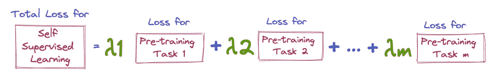

以伯特为例，损失将是 MLM(掩蔽语言建模)和 NSP(下一句预测)的加权和

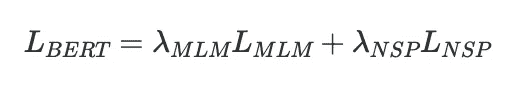

这些年来，出现了许多解决具体问题的训练前任务。我们将回顾 10 个有趣且受欢迎的函数及其相应的损失函数:

1.  因果语言造型( **CLM** )
2.  蒙面语言造型( **MLM** )
3.  替换令牌检测( **RTD** )
4.  混洗令牌检测( **STD** )
5.  随机代币替换( **RTS** )
6.  交换语言建模( **SLM)**
7.  翻译语言造型( **TLM** )
8.  替代语言建模( **ALM** )
9.  句子边界目标( **SBO** )
10.  下一句预测( **NSP** )

*(每个任务和内容的损失函数大量借用* [*AMMUS:自然语言处理中基于变压器的预训练模型综述*](https://arxiv.org/abs/2108.05542) *)*

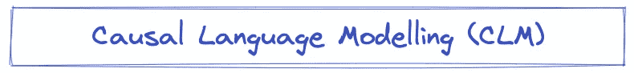

*   它只是一个单向的语言模型，在给定上下文的情况下预测下一个单词。
*   在 GPT-1 中被用作训练前的任务
*   CLM 的损失定义为:

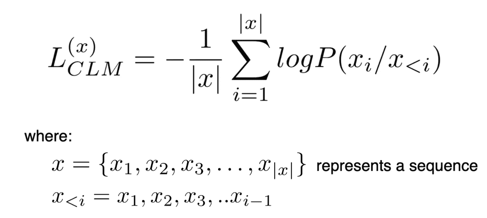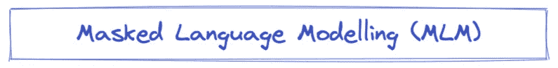

*   对因果语言模型(CLM)的改进，因为 CLM 在预测文本时只考虑单向语境，而 MLM 使用双向语境。
*   它最初是在 BERT 中作为预训练任务使用的

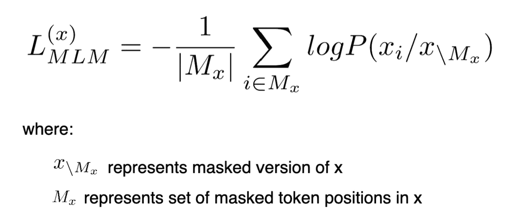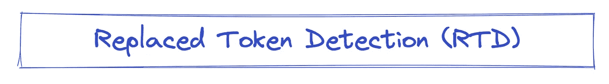

*   RTD 不是用[MASK]屏蔽令牌，而是用不同的令牌替换令牌(使用**生成器模型**)，并训练该模型来分类给定令牌是实际令牌还是替换令牌(使用**鉴别器模型**
*   改进了 MLM 的以下两个缺点:

**缺点 1:** 【MASK】token 在预训练时出现，但在微调时不出现——这造成了两种场景之间的不匹配。
RTD 克服了这个问题，因为它不使用任何遮罩

**缺点 2:** 在 MLM，训练信号仅由 15%的令牌给出，因为损耗是仅使用这些屏蔽令牌计算的，但是在 RTD，信号由所有令牌给出，因为它们中的每一个都被分类为“替换”或“原始”

*   RTD 在 ELECTRA 中被用作预训练任务。ELECTRA 架构如下所示:

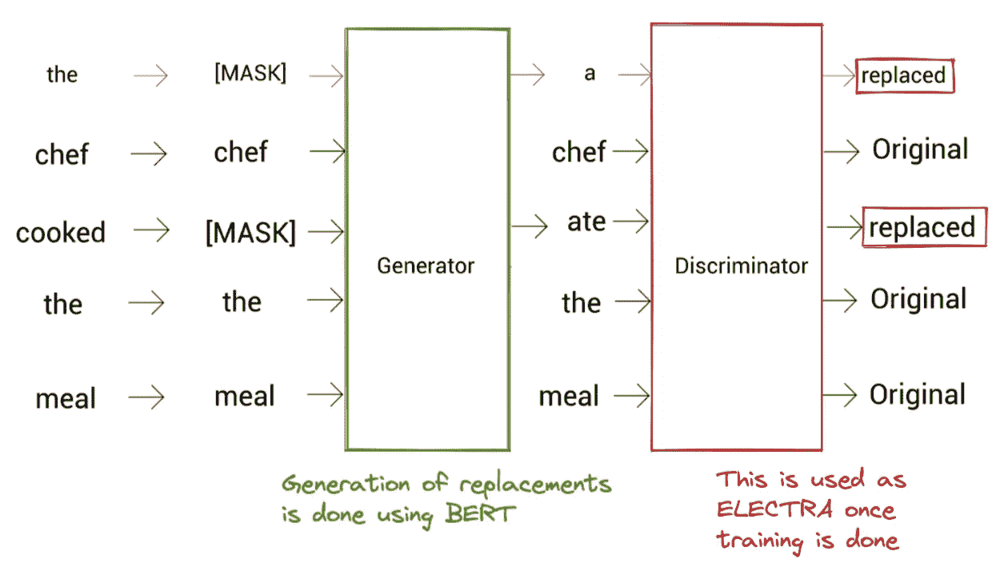

电子建筑

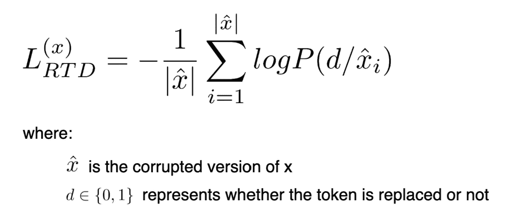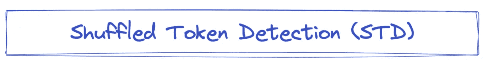

*   类似于 RTD，但是这里的令牌被分类为是否被洗牌，而不是被替换或不被替换(如下所示)

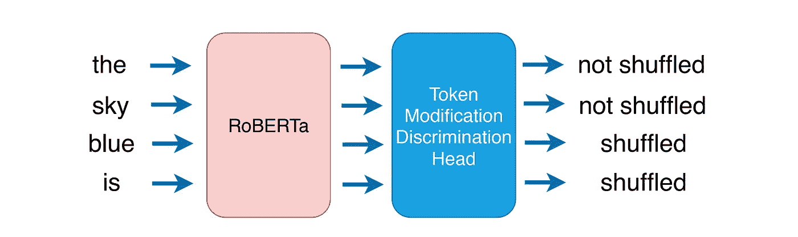

STD 插图(来自[论文](https://aclanthology.org/2021.naacl-srw.12.pdf)

*   与 MLM 相比，在 RTD 实现了类似的采样效率
*   损失的定义是:

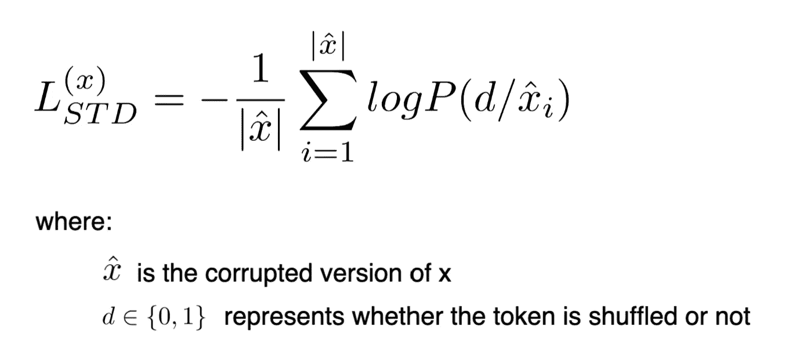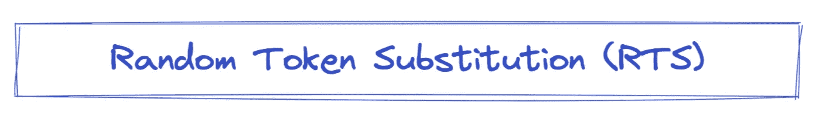

*   RTD 使用生成器来破坏句子，这在计算上是昂贵的。
    RTS 通过简单地使用词汇表中的标记替换 15%的标记来绕过这种复杂性，同时实现与 MLM 类似的准确性，如这里的[所示](https://arxiv.org/pdf/2104.09694.pdf)。

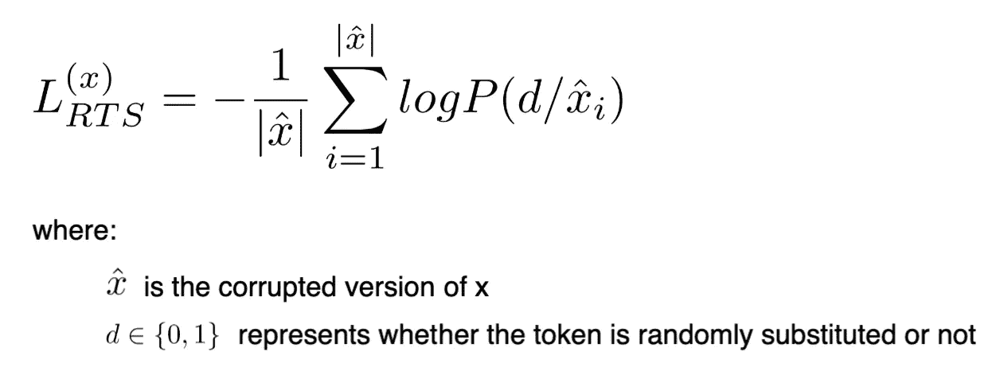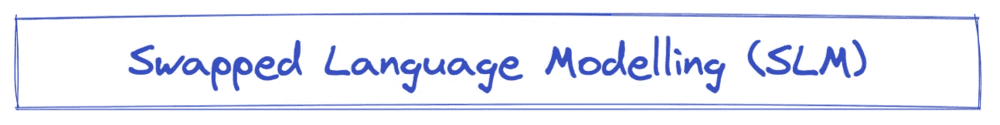

*   SLM 通过用随机记号替换 15%的记号来破坏序列。
*   在尝试预测损坏的令牌方面，它类似于 MLM，但不是使用[掩码]，而是使用随机令牌进行掩码
*   就使用随机令牌来破坏而言，它类似于 RTS，但与 RTS 不同，它不是非常有效，因为只有 15%的令牌用于提供训练信号。

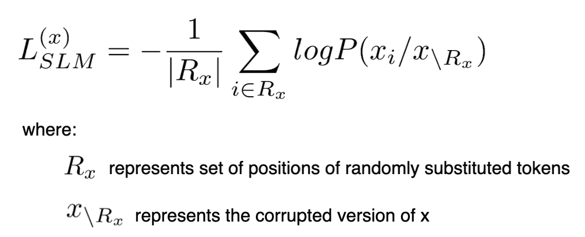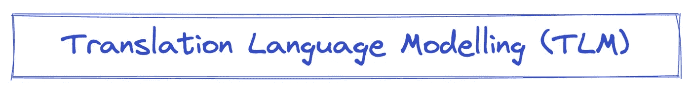

*   TLM 也被称为跨语言 MLM，其中输入是一对平行句子(来自两种不同语言的句子),标记被屏蔽，就像在 MLM 一样
*   它被用作 **XLM** 中的预训练任务，这是一个学习跨语言映射的跨语言模型。

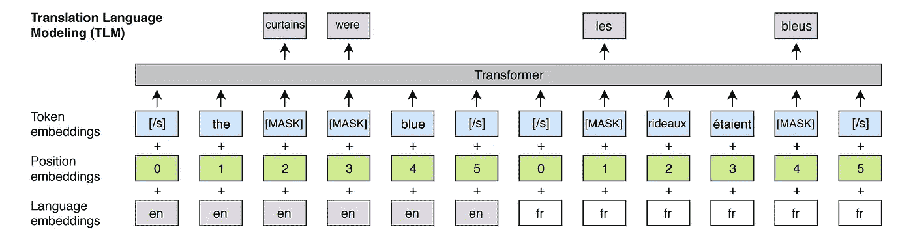

TLM 的插图(来自[论文](https://arxiv.org/pdf/1901.07291.pdf)

*   TLM 的损失类似于 MLM 的损失:

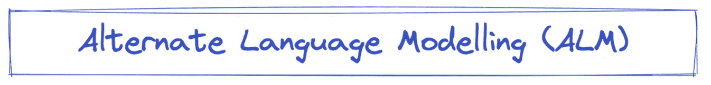

*   学习一个**跨语言语言模型**是一项任务，就像 TLM 一样，平行句是**语码转换的，**如下图:

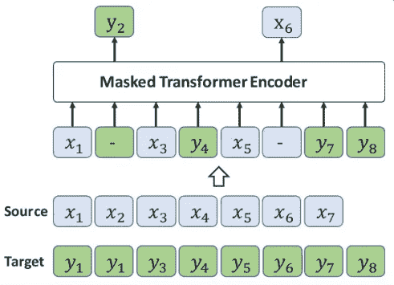

ALM 图解:第一步:来自 x 的令牌被来自 y 的令牌替换；第二步:获得的样本然后被遮蔽，类似于 MLM(图像来自[纸](https://ojs.aaai.org//index.php/AAAI/article/view/6480)

在语码转换时，x 的一些短语被 y 替换，这样得到的样本被用来训练模型。

*   掩蔽策略类似于 MLM。

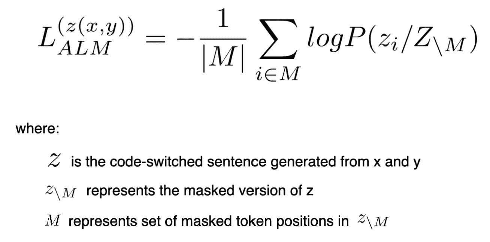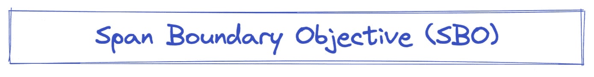

*   包括掩蔽句子中连续范围的记号，然后使用该模型基于边界记号的输出表示来预测被掩蔽的记号

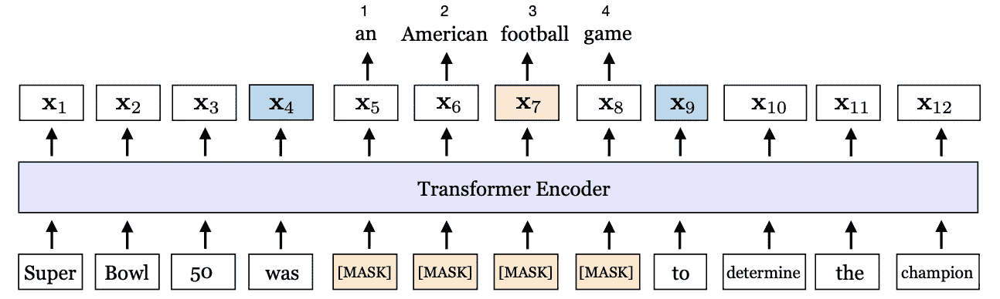

步骤 1:标记 x5 至 x8 被屏蔽；步骤 2:边界记号(x4 和 x9)的输出表示用于预测从 x5 到 x9 的记号(来自[纸](https://arxiv.org/pdf/1907.10529.pdf)的图像)

*   在**斯潘伯特**中被用作预训练任务
*   损失的定义是:

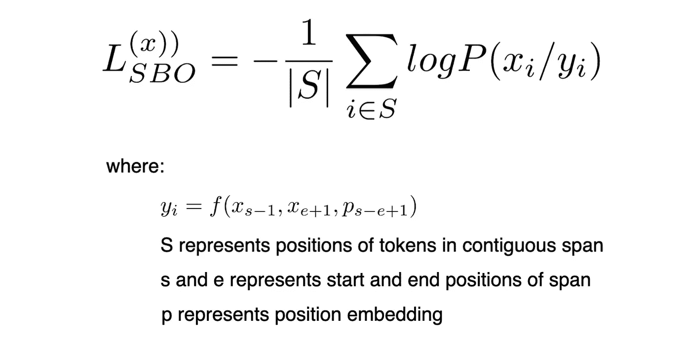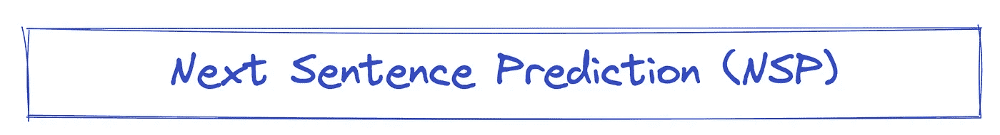

*   这是一个句子级别的任务，帮助模型学习句子之间的关系。
*   这是一个二元分类任务，包括使用[CLS]令牌的输出表示来识别两个句子是否连续。
*   使用 50%正样本和 50%负样本来完成训练，其中第二句与第一句不连续。

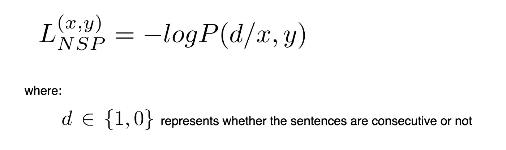

*还有很多其他有趣的任务在* [*AMMUS*](https://arxiv.org/abs/2108.05542) *中有总结！！向作者致敬，如果你觉得有趣，请读一读)*