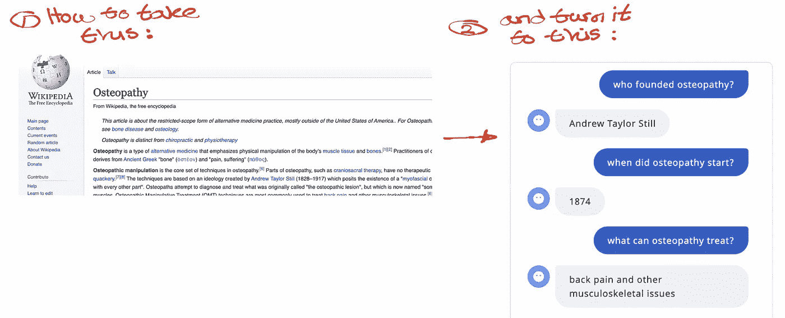
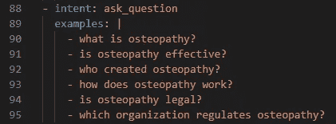
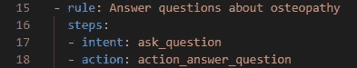
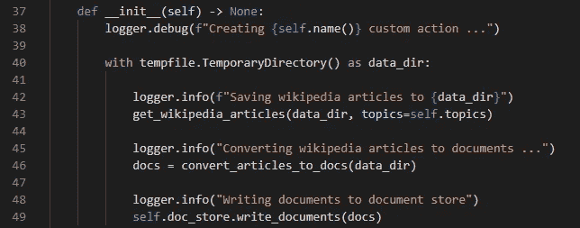
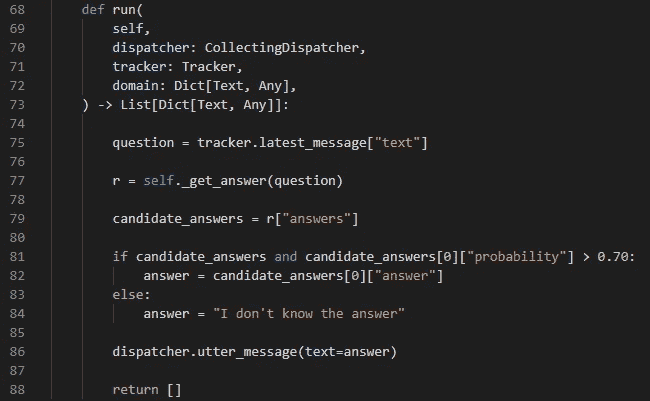
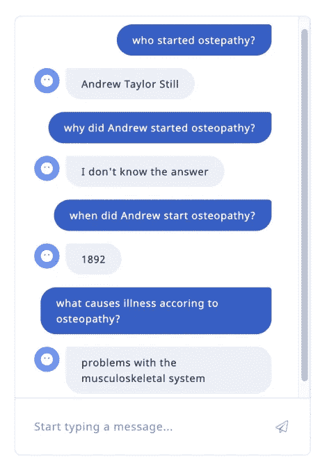

# 在 Rasa 中构建 FAQ 机器人的最快方法

> 原文：<https://pub.towardsai.net/the-fastest-way-to-build-an-faq-bot-in-rasa-90b705a21f5e?source=collection_archive---------1----------------------->

## [自然语言处理](https://towardsai.net/p/category/nlp)

## 将 FAQ 视为问答问题

# 介绍

在这篇文章中，我将分享一个想法，使用 [Rasa](https://rasa.com/) 快速构建一个机器人来回答类似 FAQ 的问题。

重现本文中描述的结果的代码是[，这里是](https://github.com/hsm207/rasa_haystack)。

# 问题陈述

想象一下，你的任务是构建一个机器人来处理某个技术主题的常见问题，例如[骨病](https://en.wikipedia.org/wiki/Osteopathy)。

标准的方法是为每种类型的问题编写一个[意图](https://rasa.com/docs/rasa/next/glossary#intent)和一个[响应](https://rasa.com/docs/rasa/next/glossary#response--template--utterance)。例如，我们可以创建一个名为`ask_osteopathy_definition`的意图，包含以下示例:

*   什么是整骨？
*   说说整骨术？
*   定义骨病

并定义一个名为`utter_osteopathy_definition`的响应来返回文本:

> 整骨疗法是一种替代医学，强调对身体肌肉组织和骨骼的物理操作

我们可以更进一步，使用[响应选择器](https://rasa.com/docs/rasa/chitchat-faqs)来实现这些问题。

然而，这两种方法都存在这两个问题:

*   **为意图生成示例**:一个人询问骨病定义的方式只有这么多。如果一个问题没有太多的表达方式，我们该怎么办？我们应该求助于生成合成示例吗？
*   **生成回答**:寻找一个技术问题的答案是非常耗时的。实际上，已经有一个包含答案的文档库。人类只需要搜索正确的文档并提取相关部分来构建答案。我们不能自动化这个过程吗？

# 解决办法

## 概观

我们可以通过将一个 FAQ 机器人视为一个[机器阅读理解](https://www.microsoft.com/en-us/ai/ai-lab-machine-reading)问题来解决上一节提到的两个问题。

该解决方案的关键组件是问答(QA)系统。该系统将接受自由文本输入，例如“什么是整骨术？”并在其内部知识库(文档集合)中搜索答案。它将返回它认为能回答给定输入的文本片段。

## 履行

本文将使用[草堆](https://haystack.deepset.ai/overview/intro)作为问答系统。

首先，我们需要定义一个意图，以便机器人知道它需要将这个意图传递给 QA 系统。让我们称这个意图为`ask_question`:

图 1:调用 QA 系统的意图

接下来，我们定义一个规则，告诉机器人在识别到一个`ask_question`时调用 QA 系统:

图 2:调用 QA 系统的规则

图 2 假设我们有一个名为`action_answer_question`的定制动作。这是一个通过系统的 REST 端点与 QA 系统交互的动作。

下面是`action_answer_question`初始化时发生的情况:

图 3:启动时构建知识库

图 3 显示，每次启动动作服务器时，bot 都会构建自己的知识库。知识库由一些从维基百科下载的文章组成。实际上，文档存储将是一个独立于 bot 管理的组件，因此这一步是不必要的。

当机器人需要调用这个自定义操作时，就会发生这种情况:

图 4:机器人如何从问答系统获得答案

机器人将使用 tracker 对象提取用户的问题(第 75 行)。然后，它将这个问题传递给 QA 系统(第 77 行)。如果来自 QA 系统的最高得分答案的概率大于 0.70，那么机器人将把这个答案返回给用户(第 82 行)。否则会说“我不知道答案(第 84 行)”。

## 结果

这是一个与机器人对话的例子:

图 5:与骨病常见问题机器人的对话示例

请注意:

*   该机器人对用户问题中的错别字具有很强的鲁棒性
*   当机器人“知道”答案时，给定用于构建其知识库的文章，它实际上是正确的

这确实令人印象深刻，因为我们只是使用了 QA 系统附带的默认设置，并没有根据我们的数据集对其模型进行微调，也没有对我们的数据集进行注释。

如果我们花一些时间定制 QA 系统的管道，并根据我们的数据集对其模型进行微调，我们很可能会获得更好的性能。

# 结论

这篇文章分享了一个想法，即通过利用机器阅读理解领域的最新进展，快速构建一个像样的 FAQ bot。我希望你发现这很有见地。如果你有任何问题，请在评论中告诉我。