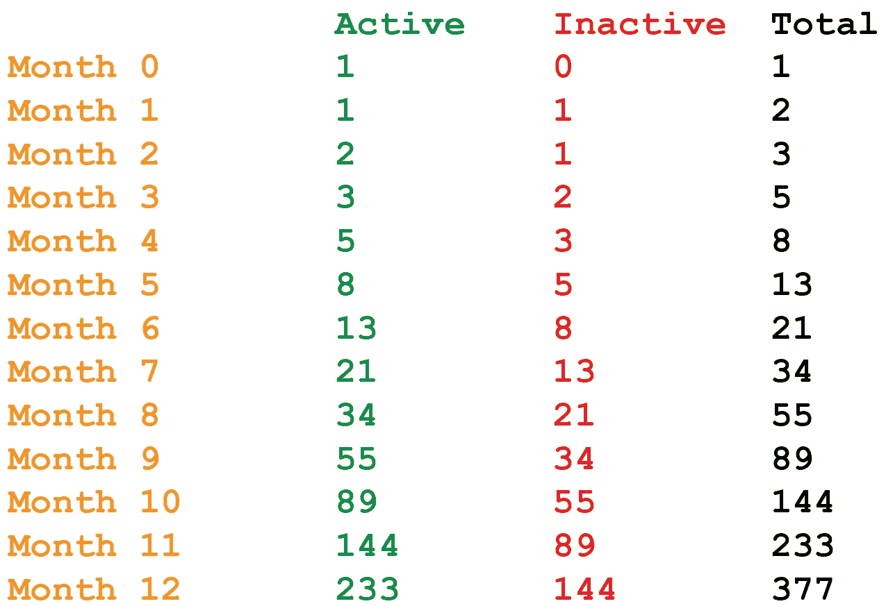
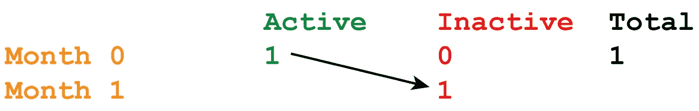
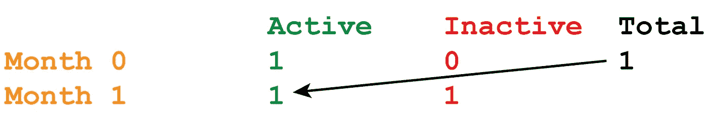
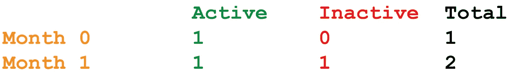
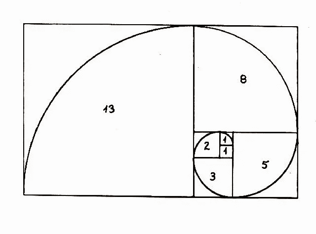
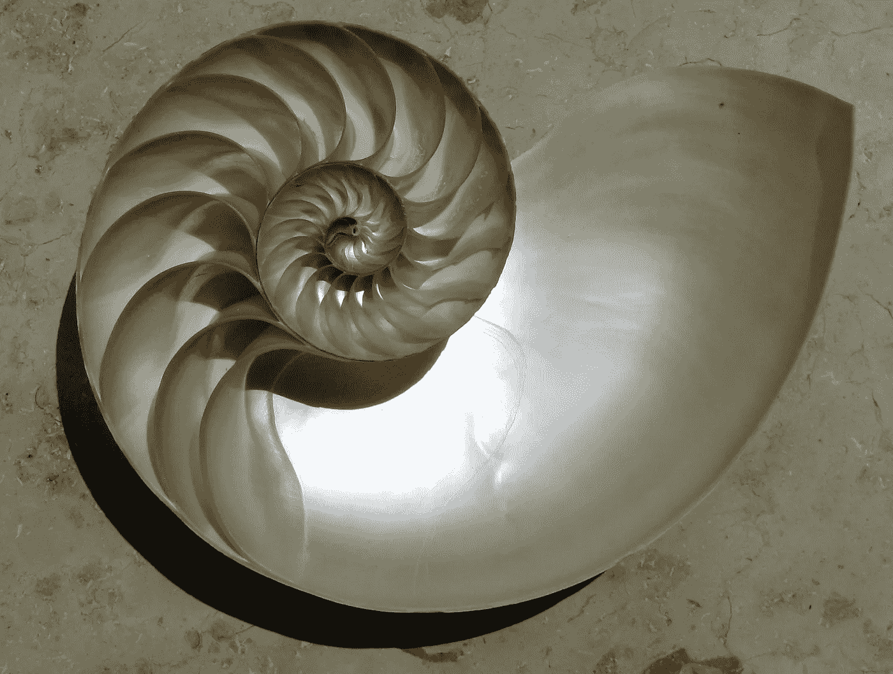
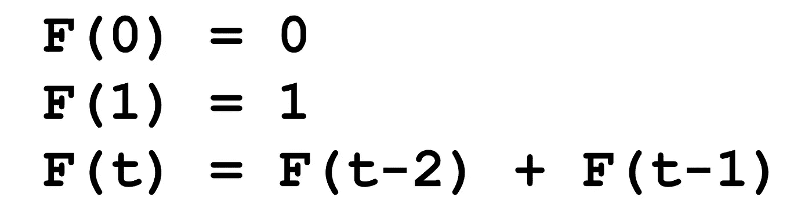
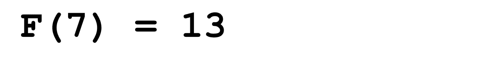
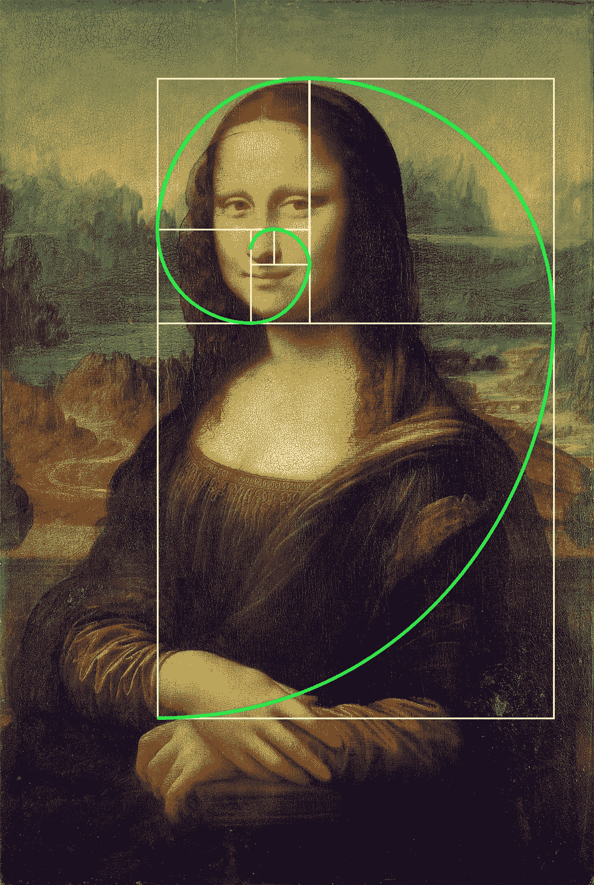

# 斐波那契数列:完美的算法

> 原文：<https://pub.towardsai.net/the-fibonacci-sequence-an-algorithm-for-perfection-1d79768da9f7?source=collection_archive---------2----------------------->

## 数学

## 斐波那契数列很容易解释

斐波那契是 13 世纪的意大利数学家，他创造了数学中最臭名昭著的算法之一。

在本文中，我将解释它的历史，它的数学重要性，最后，我将运行代码来复制它。

# 数数兔子

最初，斐波那契创造了这个数学模型来赢得腓特烈二世的比赛，腓特烈二世是当时真正的天才。数学问题是这样的:

在一个封闭的空间里有一对兔子。假设每个月都有一对兔子会在一个月后繁殖出另一对，那么一年后我们能数出多少对兔子呢？”


[凯达·盖奇](https://unsplash.com/@kedar9?utm_source=medium&utm_medium=referral)在 [Unsplash](https://unsplash.com?utm_source=medium&utm_medium=referral) 上的照片

斐波那契用这种方法解决了这个问题，然后发表在他的书《自由阿巴契，1202》中。



一年中每个月活跃、不活跃、总兔子对的完整列表

## 第一步

正如你所看到的，这个过程很简单:为了发现第二个月兔子夫妇的数量，我们首先把第一个月的活跃夫妇的数量复制到第二个月的不活跃点:这意味着第 0 (1)个月的每对夫妇都产生了另一对夫妇，他们在第 1 (1)个月保持不活跃。



## 第二步

为了发现在第 0 个月有多少活跃的夫妇，我们只需要将已经活跃的夫妇(1)与将在接下来的几个月活跃的夫妇(在第 0 个月不活跃的夫妇)相加。



# 结果

最后，我们很容易就知道了下个月兔子夫妇的数量。



我们可以像斐波那契那样一个月一个月地重复这个过程，直到第 12 个月。

# 序列的概要

整个序列用简单的数字表示如下:

**0，1，1，2，3，5，8，13，21，34，55，89，144，233，377…**

# 递归问题

这个序列有什么讲究？首先是算法，不是函数。这意味着我们不能在斐波纳契数列的任意给定数上跳跃。

如果我只给你一张纸和一支笔，让你计算出数列的第 1000 个数字，你不可能直接跳到这一步，你需要经历上面的过程，直到你计算出第 1000 个数字:

**26，863，810，024，485，359，386，146，727，202，142，923，967**

* * *这不是一个序列，是一个实数

因此，递归在计算方面存在许多问题。递归的另一个例子是质数:没有质数公式，因为质数序列是递归的。您不能生成第 n 个质数，并且您需要检查它除了 1 和它本身之外是否有任何除法器。数字越大，计算量越大。

# 现实世界中的斐波那契数列

斐波那契数列在现实世界中有着令人难以置信的应用，尤其是在模式预测方面。

我们可以使用序列中的每个数字来构建一个正方形序列:



检索自: [www.blogpositivo.it](https://www.blogpositivo.it/crescita-spirituale/geometria-sacra/la-successione-di-fibonacci-nel-broccolo-romano-da-leggere/)

0, 1, 1, 2, 3, 5, 8, 13…

正如您在图像中心看到的，第一个正方形的边长为 1。第二个正方形的边长仍为 1。如果我们把它们加在一起，我们得到一个边长为 2 的正方形，它可以覆盖两个叠放在一起的正方形的边的总和。有了矩形，我们可以创建一个边长为 3 的正方形，以此类推。

如果我们连接我们建造的每个正方形的同一个顶点，我们就有了一个螺旋。



检索自:newbiescience.wordpress.com

# 数学术语中的斐波那契

无论描述多么吸引人，我们都必须用数学语言来描述这个序列:



使用我们刚刚创建的算法，我们可以给出正确的指令，告诉我们如何检索我们想要的任意数目的斐波那契数列。



# 黄金比例

黄金比例代表完美的比例。自希腊人将它引入艺术世界以来，它就一直存在。



图片来自 www.pinterst.com

当希腊人用另一个公式找到它时(斐波那契将在 800 年后诞生)，你可以用斐波那契数列算出它:


艺术中的每一件主要杰作都遵循着艺术家和数学家认为和谐的这一比例。

# 密码

最后但同样重要的是，这是斐波那契数列在代码中的样子:

```
def Fibonacci(n):
  if n <= 1:
    return n
  return(Fibonacci(n-1) + Fibonacci(n-2))
```

如果我们运行代码，输入 7 作为斐波那契数列的第 n 个数字:

```
Fibonacci(7)
13
```