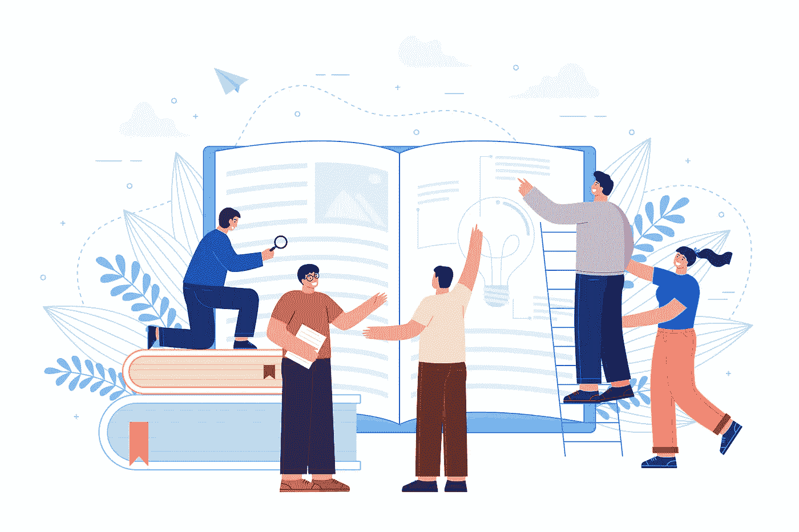
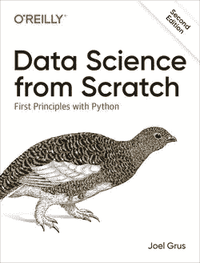

# 成为一名有抱负的数据科学家所需的第一本书

> 原文：<https://pub.towardsai.net/the-first-book-you-need-to-succeed-as-an-aspiring-data-scientist-32af5e24ec6e?source=collection_archive---------3----------------------->

## [数据科学](https://towardsai.net/p/category/data-science)

## 剧透:没有先决条件，但乔尔会带你从零到英雄。

Pikisuperstar 在 Freepik 上拍摄的照片

> “在初学者的头脑中有许多可能性，但在专家的头脑中可能性很少”― **铃木。**

通常情况下，作为一个初学者可能是一个人的优势。我喜欢初学者——毕竟我也是其中之一。

他们有远大的梦想。他们想成为一名数据科学家。他们知道过去很多人都成功了，没有什么能阻止他们。他们是渴望知识和成长的“空白石板”。他们知道这并不容易，并且愿意付出努力。

如果你有类似“*能行”*的心态，成功了一半。你只需要一点指导，其他的都在网上。当然，外面有太多的噪音，所以如果你问我在哪里寻找，我会说从[开始这些数据科学课程](https://towardsdatascience.com/the-4-must-learn-data-science-courses-for-absolute-beginners-9268fd11054c)和**用书籍补充它们。**

数据科学书籍，尤其是来自知名出版商的书籍，在一个地方汇集了大量有用的信息。大多数初学者专注于课程，忘记了书本。请不要犯这样的错误。

我很感激自己在早年找到了这本书——它塑造了我的知识，培养了我的自信。在本文中，我将分析每个有抱负的数据科学家应该阅读的第一本书。

# 乔尔·格鲁什的《从零开始的数据科学》

来源:奥雷利[(图书链接)](https://amzn.to/3KSeEW1)

既然你正在读这篇文章，我知道你已经对数据科学有了一些了解。你可能从 YouTube、LinkedIn 帖子，甚至是像我这样的博客帖子中听说过它。

但是，如果我假设你什么都不知道，乔尔·格鲁什的《从头开始的数据科学》会牵着你的手，带你从零到英雄。最棒的是，你不需要任何先决条件就能入门这本书。

你可以从[亚马逊](https://amzn.to/3KSeEW1)获得这本书，并使用这个 [GitHub 库](https://github.com/joelgrus/data-science-from-scratch)来获得书中使用的所有代码。

不，这不是一个赞助的帖子——这只是我早期从这本书中受益匪浅。如果你还不够信服，以下是你作为一名有抱负的数据科学家绝对需要它的原因。

# 你将扮演最现实的数据科学家的角色。

你被聘为数据科学家(这肯定会发生的，我的朋友)。你被期望在 DataSciencester 领导数据科学工作，DataSciencester 是数据科学家的社交网络(这也是迟早的事。)

DataSciencester 过去没有在构建数据科学实践方面投入太多，所以这将是您的工作。有时，如果数据科学转型是最近才开始的，并且仍在进行中，那么您在新组织中得到的帮助会很少。但是不要担心——乔尔和他的书是你的向导。

在整本书中，你将通过解决你在 DataSciencester 遇到的实际问题来学习数据科学的概念。您将使用平台用户提供的数据，基于用户交互的数据，或者基于您将要设计的实验的数据。

我个人喜欢这种非传统的方法。现在我知道了我们在一个真实的组织中解决什么问题，我可以保证这个场景是真实的。时机一到，你就可以在任何现实世界的组织中运用这些技能。相信我。

# 我还没找到遗漏的重要话题。

我一直提倡语言不可知论，这意味着[数据科学超越了我们使用的](https://towardsdatascience.com/programming-for-data-science-how-to-learn-just-enough-in-weeks-7e62f3aa9b8a)语言。

但是 Joel 坚持己见，声称 Python 是最好的入门语言。所以如果你对 R 更舒服，这本书不适合你。除了这个警告，目录让我大吃一惊。我找不到列表中遗漏的任何重要主题。

它从“什么是数据科学”开始，然后是基本的 python、线性代数、统计学、数据可视化、概率、数据库、机器学习、聚类、神经网络、网络、推荐系统、NLP，最后是大数据。

对于初学者来说，他确实已经涵盖了足够的主题范围，而没有用不必要的教科书理论和复杂的代码块来淹没您。用乔尔[自己的话说:](https://joelgrus.com/2015/04/26/data-science-from-scratch-first-principles-with-python/)

> “它有数学，但仅仅是完全必要的。它有刮擦，清洁和蒙格。它有机器学习功能。它有数据库和 MapReduce。当然，它不会深入到任何一个方面，但我认为它建立了一个广泛而坚实的基础。”

# 作为初学者，你希望所有的东西都在一个地方。

我已经指导了几名学生和有抱负的数据爱好者。他们都面临的日益严重的问题是“信息过载”有大量的资源，太多了，压倒了他们，使他们完全偏离了旅程。

解决这个问题的办法是有一个更简单的途径，坚持使用更少但更全面的资源。这就是这本书最大的好处——**它在一个地方拥有初学者需要的一切。**

所以基本上，你拿起这本书，学习概念，把它们应用到项目中。你不需要为打扰某人而感到难过，也不需要为越来越多的在线培训课程付费；就把这本书作为你早期的指南吧。

现在，随着时间的推移，你会对这本书的内容感到舒适，并很容易理解它们。

这是意料之中的——也是一个微妙的迹象，表明你已经进步到了中等水平。当这种情况发生时，拍拍自己的背，祝贺自己，这一直是我们的目标。

更多令人兴奋的事情将在那时等着你，但是为了到达那里，我们今天就开始**吗？**

*作为披露的提示，本文可能会有一些附属链接来分享我用过的最好的资源，而不会给你带来额外的费用。感谢您的支持！*

*要获得更多关于进入数据科学、真实体验和学习的有用见解，请考虑* [***加入我的电子邮件好友私人列表*** *。*](https://friends.arunnthevapalan.com/)