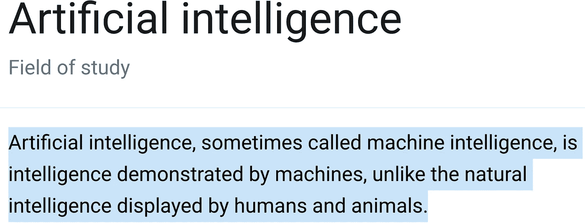
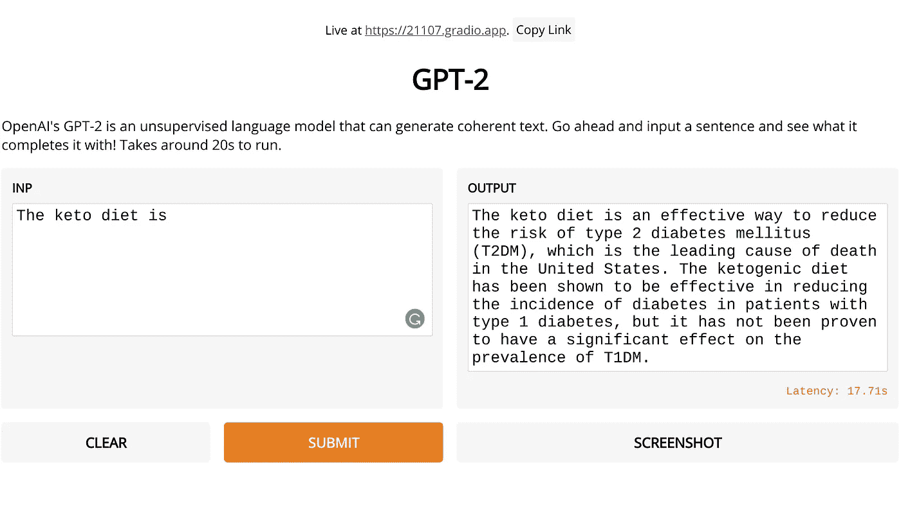
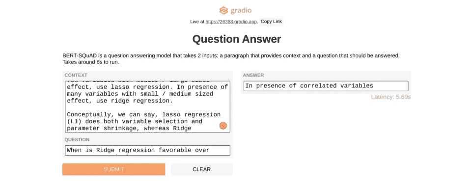

# 人工智能的傻瓜指南

> 原文：<https://pub.towardsai.net/the-fool-proof-guide-to-ai-2a6b65d2ac76?source=collection_archive---------4----------------------->

## [人工智能](https://towardsai.net/p/category/artificial-intelligence)，[观点](https://towardsai.net/p/category/opinion)

## 48 秒后，你可能会成为人工智能 MVP。


照片由[维多利亚诺·伊斯基耶多](https://unsplash.com/@victoriano?utm_source=medium&utm_medium=referral)在 [Unsplash](https://unsplash.com?utm_source=medium&utm_medium=referral) 拍摄

如果人工智能是新的电力，我们应该掌握它。

但是，谷歌“什么是人工智能”，你会得到不切实际的解释或令人困惑的行话。



谷歌侧边栏搜索“[什么是人工智能](https://www.google.com/search?q=%22what+is+ai%22&rlz=1CAGZLV_enJP863&oq=%22what+is+ai%22&aqs=chrome..69i57.1852j0j7&sourceid=chrome&ie=UTF-8)”由作者捕获。

让我们保持简单。以下是在 7 分钟内，针对 7 种不同的用例，制作 7 个人工智能创业 MVP 的*精确步骤。系好安全带。*

# 1.图像分类

**想法**:向商店出售面罩检测系统，用于他们的闭路电视。

**数据:**戴口罩的人和不戴口罩的人的图像。

**流程:**建立模型，托管，销售。

让我们用[可教机器](https://teachablemachine.withgoogle.com/)来制作我们的模型。拍一些有无蒙版的照片，点击“火车模型”，测试，最后导出。现在，我们有了一个可以预售的 MVP:一个可以共享的 URL leads 可以试用。

下面是这个过程的 48 秒 GIF。


按作者。

对于最终产品，我们希望从许多角度拍摄许多人的图像，以及我们自己的平台。对于我们的 M 副总裁来说，极简主义是我们的目标。在花费一分钱或一分钟之前，预售将验证(或否定)我们的想法。

# 2.声音识别

想法:大型连锁餐厅因碎盘子和玻璃器皿而失去利润，但这些事件没有被记录下来。我们出售碎盘检测系统(使用闭路电视音频),帮助店主分析破损情况，最大限度地减少商店损失。

**数据:**正常的餐厅声音和盘子破碎的声音。

**流程:**建立模型，主持，销售。(注意这个同上)。

还是用[可教机](https://teachablemachine.withgoogle.com/)吧。我录下了 40 秒的背景噪音和 8 位玻璃破碎的音频(来自 YouTube 的一个汇编)。我点击“火车”，然后“出口。”总的来说，这花了一分多钟。

下面，你可以听到模型正确地分类背景声音，当我播放玻璃被打破的新音频时，它正确地识别它，然后返回到背景噪音分类。

按作者。

虽然还远未最终确定，但尝试预售将有助于在没有风险的情况下验证我们的想法——这是 MVP 的全部意义。

# 3.预测分析

**想法:**有些酒很恐怖，会降低你的销量；有些很精彩，会带来好评如潮。我们可以卖一个人工智能模型给卖酒的人(像[加里·维纳查克](https://medium.com/u/c4ec9163657c?source=post_page-----2a6b65d2ac76--------------------------------))，让他们在进货之前知道酒的真实质量。

> “要么给我再来点酒，要么别烦我。”―鲁米

**数据:** [红酒数据集](https://www.kaggle.com/uciml/red-wine-quality-cortez-et-al-2009)。

**流程:**放入数据，运行模型，销售。

让我们访问 [Apteo](http://apteo.co) ，点击 *new workspace* ，上传 CSV，转到 *predictive insights* ，点击 *quality* 列作为我们的数字 KPI，预测新酒的质量。我们新进的葡萄酒得到了 5.78/10——真扫兴！最好不要上架。

按作者。

除了单一的预测，我们可以从一个应用程序中获得一个 API 来进行预测，或者通过批处理一次预测数百种葡萄酒的质量。

# 4.艺术一代

**创意**:出售独一无二的艺术品。

**资料:**以照片为灵感。️

**流程:**运作模型，创作艺术，销售。

这个例子看起来有点复杂，但是非常简单。首先，访问这个 [Google Colab 链接](https://colab.research.google.com/github/tensorflow/docs/blob/master/site/en/tutorials/generative/deepdream.ipynb#scrollTo=dCMqzy7BNbG9)。用你自己的图片替换下面的 URL，或者从 Unsplash 借用一个:

```
url = 'https://storage.googleapis.com/download.tensorflow.org/example_images/YellowLabradorLooking_new.jpg'
```

然后，将鼠标悬停在“运行时”上，点击“全部运行”，或者使用 ctrl+F9。滚动到底部，这就是你的人工智能生成的艺术。获得 MVP 的时间大约是 30 秒。


按作者。 [Billy Huynh](https://unsplash.com/@billy_huy?utm_source=medium&utm_medium=referral) 在 [Unsplash](https://unsplash.com?utm_source=medium&utm_medium=referral) 上的左图来源照片。

有人会为这样的艺术买单吗？

也许是，也许不是。也许他们会花钱买一个更简单的界面来生成自己的人工智能艺术。也许 Snapchat 或 Instagram 这样的公司会收购一家提供这种功能(或更好版本)的初创公司，将其作为过滤器添加到他们的应用程序中。谁知道呢。作为企业家，你的工作就是找出答案。

# 5.文本生成

**创意**:数十亿美元花在内容上——博客、白皮书、广告文案等等。我们出售文本生成器以降低成本。

**数据:**文字提示。

**流程:**运营模型，生成内容，销售。

让我们打开下面的 Colab 链接，按 ctrl+F9 运行所有代码。我们将得到一个可共享的链接，在那里我们可以输入一个提示来生成文本。

[](https://colab.research.google.com/drive/1o_-QIR8yVphfnbNZGYemyEr111CHHxSv?usp=sharing) [## 谷歌联合实验室

### 文本生成

colab.research.google.com](https://colab.research.google.com/drive/1o_-QIR8yVphfnbNZGYemyEr111CHHxSv?usp=sharing) 

例如，我写了“酮饮食是”,它生成了这段文字:

> “酮饮食是降低二型糖尿病病(T2DM)风险的有效方法，该病是美国的主要死亡原因。生酮饮食已被证明能有效降低 1 型糖尿病患者的糖尿病发病率，但尚未被证明对 T1DM 的患病率有显著影响。”



正在使用的 GPT-2 [Gradio](http://gradio.app/) 界面截图，作者。

相当令人印象深刻。请记住，GPT-2 是更好的 GPT-3 的原始前身，后者尚未向公众开放(截至本文撰写之时)。GPT-3 就像邓布利多，而 GPT-2 就是还在学走路的哈利。

想象一下可能性！

# 6.音乐一代

**理念**:出售独一无二的音乐。

**资料:**以音乐为灵感。️

**流程:**运营模型，创作音乐，销售。

让我们访问这个 [Google Colab 链接](https://colab.research.google.com/drive/19TQqekOlnOSW36VCL8CPVEQKBBukmaEQ#scrollTo=i0JdZncylpx-)。老实说，这一次你真的要读一遍并跟着读。

默认代码的灵感来自肖邦，但我决定用贝多芬，所以我从 [BitMIDI](https://bitmidi.com/) 收集了一堆 MIDI 文件。因为我使用了不同的灵感来源，所以我必须更改代码中相关的文件名。例如，我的贝多芬 MIDI 文件在一个名为`Archive (1).zip`的文件夹中，所以我在代码中改变了它。

```
!unzip "Archive (1).zip";
```

我的 MIDI 文件也直接在压缩文件夹中——没有嵌套——所以我稍后才使用这一行代码(注意在**之前什么都没有)。mid** ，与默认代码相反):

```
for i,file in enumerate(glob.glob("***.mid**")):
```

在代码的后面，有一个到 GitHub repo 的链接，它带有经过训练的模型权重。按照说明，下载提到的`h5`文件，并上传到 Colab。下载后，我只是直接上传了这个代码的文件:

```
weights = files.upload()
```

一定要上传那个`h5`文件，它会让你立刻创作出音乐，而不是你自己训练整个模型，那要花大约 13 个小时。

最后，按原样运行剩余的代码。如果你卡住了:谷歌是你的朋友。最后，下载您生成的 MIDI 文件:

```
files.download('test_output.mid')
```

我把这个 MIDI 文件转换成 MP3，然后贴在了网上——就是这个。

真是催人泪下。

# 7.问题回答

**想法:** [教师短缺是真实的，大量的，而且还在增长](https://www.epi.org/publication/the-teacher-shortage-is-real-large-and-growing-and-worse-than-we-thought-the-first-report-in-the-perfect-storm-in-the-teacher-labor-market-series/)。我们为学生创造工具来获得他们对指定阅读的问题的答案，即使他们不能马上找到导师或老师。

**资料:**问题与语境。

**流程:**运行模型，回答问题，后期给学生做个 app。

打开下面的链接，按 ctrl+F9 运行所有代码，在底部你会看到一个以“gradio.app”结尾的可共享链接，在这里你可以输入提示，提出问题，获得答案。

[](https://colab.research.google.com/drive/1RuiMJz_7jDXpi59jDgW02NsBnlz1aY1S?usp=sharing) [## 谷歌联合实验室

### GRADIO 问答模型

colab.research.google.com](https://colab.research.google.com/drive/1RuiMJz_7jDXpi59jDgW02NsBnlz1aY1S?usp=sharing) 

这里有一个例子，我问什么时候使用“岭回归”，这是一个相当典型的人工智能面试问题。



作者正在使用的 BERT-SQuAD [Gradio](http://gradio.app/) 界面截图。

# 结论

[856 页的教材](https://www.amazon.com/Hands-Machine-Learning-Scikit-Learn-TensorFlow/dp/1492032646/ref=sr_1_3?dchild=1&keywords=learn+ai&qid=1596235766&sr=8-3)、 [18 个月的 AI 培训项目](https://research.google/careers/ai-residency/)，以及一条永不停息的 AI 行话传送带，让使用 AI 显得异常困难。因此，许多企业家不会研究人工智能，除非他们有数百万美元可以投资人工智能团队。

幸运的是，这个复杂的图像仅仅是一个图像。现实是，你现在就可以在一个可能让你吃惊的时间框架内构建人工智能。