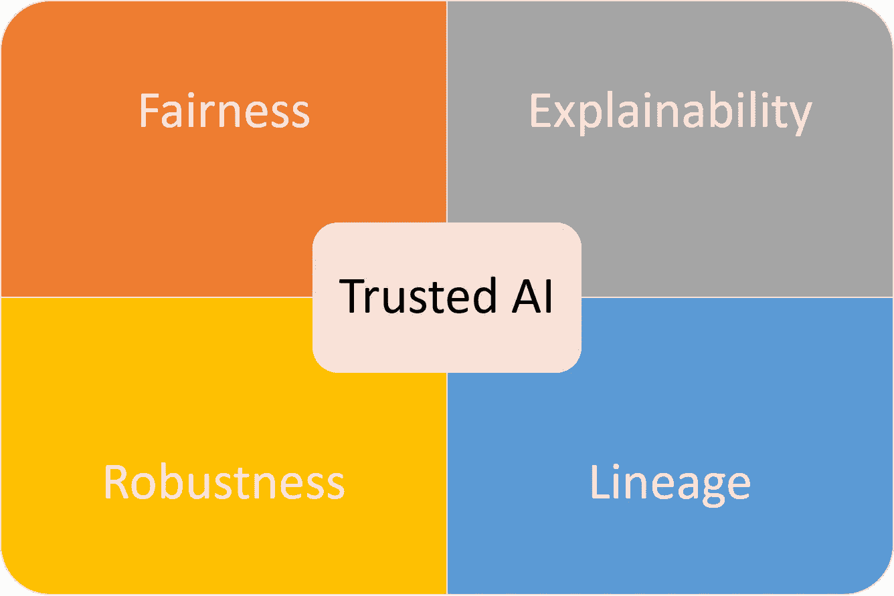

# 可信人工智能的四大支柱

> 原文：<https://pub.towardsai.net/the-four-pillars-of-trusted-ai-6ab0fc27bca?source=collection_archive---------1----------------------->

## [人工智能](https://towardsai.net/p/category/artificial-intelligence)

## IBM 的一项研究确立了构建可信人工智能系统的四个基本要素。

来源:[https://www . mobihealthnews . com/news/trust worthy-ai-has-ability-transform-health care](https://www.mobihealthnews.com/news/trustworthy-ai-has-ability-transform-healthcare)

> 我最近创办了一份专注于人工智能的教育时事通讯，已经有超过 10 万名订户。《序列》是一份无废话(意思是没有炒作，没有新闻等)的 ML 导向时事通讯，需要 5 分钟阅读。目标是让你与机器学习项目、研究论文和概念保持同步。请通过订阅以下内容来尝试一下:

 [## 序列|克塞尼亚·塞梅诺娃|子堆栈

### 订阅人工智能世界中最相关的项目和研究论文。受到 102，000 多人的信任…

thesequence.substack.com](https://thesequence.substack.com/) 

量化信任和公平是确保深度学习系统主流采用的最重要挑战之一。但是，在深度学习系统的背景下，信任真正意味着什么？这一领域最有趣的想法之一来自 IBM 的研究人员，他们在几年前的一篇论文[中提出了一种在人工智能系统中建立信任的新方法](https://arxiv.org/abs/1808.07261)。

信任是人类社会经济动力的基石。在软件开发中，在过去的几十年中，我们稳定地构建了在特定应用程序上断言信任的机制。当我们登上自动驾驶的飞机或完全由机器人驾驶的汽车时，我们在本质上表达了对特定软件应用程序创造者的信任。在软件中，信任机制基本上基于大多数软件应用程序的确定性，在这些软件应用程序中，它们的行为由代码工作流唯一确定，这使得它本质上是可预测的。人工智能(AI)系统的非确定性打破了传统软件应用的模式，并引入了新的维度来实现对 AI 代理的信任。

信任是从最小化风险的过程中产生的一种动力。在软件开发中，信任是通过可测试性、适用性、文档和许多其他有助于建立软件声誉的元素来建立的。虽然所有这些机制都与人工智能系统相关，但众所周知，它们很难实现。在传统的软件应用程序中，它们的行为是由代码中表达的明确规则决定的；在人工智能代理的情况下，他们的行为是基于随着时间演变的知识。前一种方法是确定的和可预测的，后一种方法是不确定的和难以理解的。

如果我们接受人工智能将成为我们未来的一个相关部分，那么在人工智能系统中建立信任的基础是很重要的。今天，我们经常依赖人工智能模型，而对它们的能力、知识或训练过程没有清晰的了解。人工智能系统中的信任概念仍然是高度主观的，并没有被纳入流行的机器学习框架或平台的一部分。什么是 AI 信任，如何衡量？

# 可信人工智能的支柱

人际交往中的信任不仅基于我们对特定行为的解释，还考虑了几个世纪以来积累的社会知识。我们知道，一种行为是歧视性的，不仅是通过实时判断，还通过将社会接受的歧视是对人类的贬损这一概念考虑在内。我们如何将这些想法推广到人工智能(AI)的世界？在他们的论文中，IBM 团队提出了可信人工智能的四个基本支柱:

**公平:**人工智能系统应该使用没有偏见的训练数据和模型，以避免对某些群体的不公平待遇**。**

健壮性:人工智能系统应该是安全可靠的，不容易被篡改或泄露它们被训练的数据。

**可解释性:** AI 系统应该提供用户和开发者能够理解的决策或建议。

**沿袭:**人工智能系统应该包括它们的开发、部署和维护的细节，这样它们就可以在整个生命周期中被审计。

## 公平

人工智能公平性通常与人工智能代理中偏差的最小化相关联。偏差可以被描述为训练数据分布和期望的公平分布之间的不匹配。训练数据中不必要的偏差会导致不公平的结果。建立用于识别、管理和最小化训练数据集中的偏差的测试应该是在人工智能系统中建立公平性的关键要素。显然，公平在具有有形社会影响的人工智能应用程序(如信贷或法律应用程序)中更相关。

## 可解释性

理解人工智能模型如何做出具体决定是可信人工智能的另一个关键原则。对人工智能模型的知识做出有意义的解释减少了不确定性，并有助于量化它们的准确性。虽然可解释性可能被视为提高人工智能系统信任度的一个显而易见的因素，但它的实现绝非易事。在人工智能模型的可解释性和准确性之间有一个自然的权衡。高度可解释的人工智能模型往往非常简单，因此并不十分精确。从这个角度来看，在可解释性和准确性之间建立正确的平衡对于提高人工智能模型的可信度至关重要。

## 稳健性

人工智能鲁棒性的概念由两个基本因素决定:安全性和可靠性。

**安全**

一个人工智能系统可能是公平的，可以解释的，但使用起来仍然不安全。人工智能安全通常与人工智能模型构建知识的能力相关联，这些知识结合了与既定安全行为相对应的社会规范、政策或法规。增加人工智能模型的安全性是可信人工智能系统的另一个关键因素。

**安全**

人工智能模型非常容易受到各种攻击，包括许多基于对抗性人工智能方法的攻击。人工智能模型的准确性与其对输入数据集微小扰动的脆弱性直接相关。这种关系经常被恶意行为者利用，他们试图改变特定的数据集，以改变/影响人工智能模型的行为。针对对抗性攻击对人工智能模型进行测试和基准测试是建立人工智能系统信任的关键。IBM 一直在这个领域做一些有趣的工作。

# 血统

人工智能模型在不断进化，这使得追溯它们的历史变得很有挑战性。随着时间的推移，建立和跟踪训练数据集、超参数配置和其他元数据工件的来源对于建立 AI 模型的谱系非常重要。理解人工智能模型的谱系有助于我们从历史的角度建立信任，这与仅通过公平、可解释性和稳健性来实现不同。

# 人工智能系统的概况介绍

人工智能系统中的披露和透明度主题是一个非常新兴的研究领域，但却是人工智能主流采用的关键。就像我们使用硬件设备的信息表或食品中的营养标签一样，我们应该考虑为 AI 模型建立一个事实表。在他们的论文中，IBM 提出了供应商的一致性声明(SDoC，简称 factsheet)，这有助于提供关于可信人工智能的四个关键支柱的信息。IBM 的 SDoC 方法应该有助于回答关于人工智能模型的基本问题，例如:

*用来训练服务的数据集有数据表或数据报表吗？*

是否对数据集和模型进行了偏差检查？如果“是”,请描述检查的偏倚政策、偏倚检查方法和结果。

*是否对数据集进行了偏差缓解？如果“是”,请描述缓解方法。*

*算法输出是可解释的吗？如果是，解释可解释性是如何实现的(例如，可直接解释的算法、局部可解释性、通过例子解释)。*

*描述测试方法。*

*是否检查了服务抵御敌对攻击的健壮性？如果“是”,请描述检查的稳健性政策、检查方法和结果。*

*是否保留/存储/保存来自服务操作的使用数据？*

为人工智能模型建立事实表的想法很简单，因为它与建立可信的人工智能系统相关。IBM 的 SDoC 远非完美，但这是朝着正确方向迈出的可喜一步。