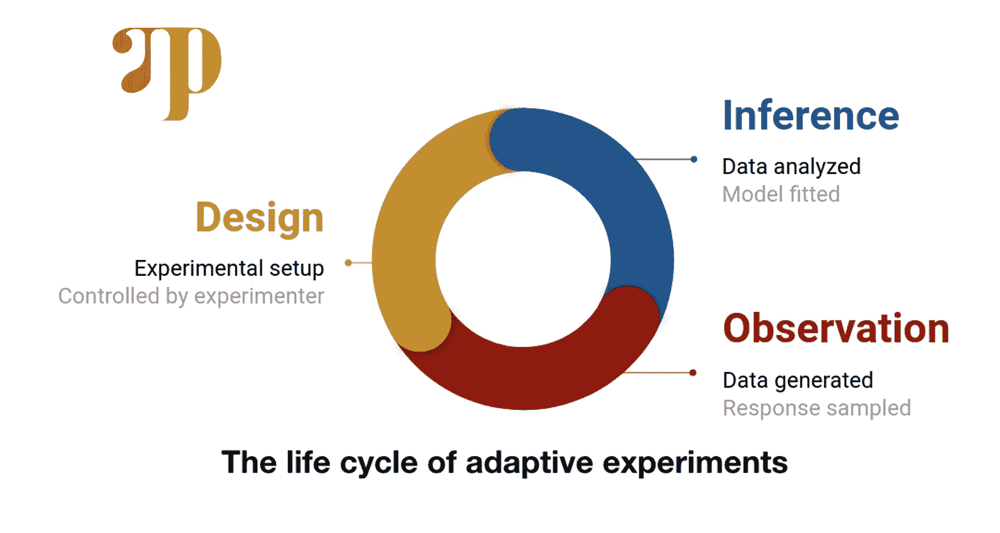

# 优步用于设计最优统计实验的框架

> 原文：<https://pub.towardsai.net/the-framework-uber-uses-for-designing-optimal-statistical-experiments-a6a2585c7d66?source=collection_archive---------4----------------------->

## [机器学习](https://towardsai.net/p/category/machine-learning)

## OED 支持使用 Pyro 的概率编程模型进行评分和优化实验。



图片来源:优步

> 我最近创办了一份专注于人工智能的教育时事通讯，已经有超过 10 万名订户。《序列》是一份无废话(意思是没有炒作，没有新闻等)的 ML 导向时事通讯，需要 5 分钟阅读。目标是让你与机器学习项目、研究论文和概念保持同步。请通过订阅以下内容来尝试一下:

[](https://thesequence.substack.com/) [## 序列

### 订阅人工智能世界中最相关的项目和研究论文。受到 110，000+的信任…

thesequence.substack.com](https://thesequence.substack.com/) 

快速实验是现代软件开发的关键要素。机器学习越来越受欢迎，这使得稳健的实验设计成为软件开发方法学的前沿。从数据降噪到超参数优化，实验是机器学习程序生命周期的关键要素。然而，为给定的问题设计最佳的实验仍然是一个相关的挑战。最近，优步开源了建立在其 Pyro 概率编程语言之上的[最优实验设计(OED)](http://docs.pyro.ai/en/stable/contrib.oed.html) 框架。

在机器学习领域，设计最佳实验并不是什么新鲜事，但在过去几年里，这个领域的相关性无疑有所增加。实验设计的困难在于它涵盖了无缝多样的任务，例如设计一个在线调查或寻找学习周期中的最佳点。在一致的结构下建模这些不同的问题需要灵活的方法。贝叶斯最优实验设计(BOED)提供了基于概率的数学抽象，能够在实验过程中解释数据和观察结果。在一个高层次上，BOED 为一个给定的实验寻找已建立的贝叶斯模型，然后寻找基于其执行的最大化预期信息增益(EIG)。

优步的新《牛津英语词典》框架受到了 BOED 研究的一些最新进展的启发。

# 这项研究

在过去的几年里，围绕 BOED 的研究非常活跃。优步本身已经沉浸在一系列的研究努力，以推进 BOED 方法。具体来说，有两篇研究论文是新牛津英语词典框架的核心灵感。

在[变分贝叶斯最优实验设计](https://papers.nips.cc/paper/9553-variational-bayesian-optimal-experimental-design)中，研究人员提出了四种变分方法来估计实验中的 EIG。每种方法都基于不同的建模假设，这些假设涵盖了大多数真实世界的实验。本文探讨了每个估计量的优点和缺点，以及它对不同类型的实验的实际适用性。

在[设计贝叶斯最优实验的统一随机梯度方法](https://arxiv.org/abs/1911.00294)中，研究人员提出了 BOED 的随机梯度上升方法。所提出的方法试图解决对设计空间中所有可能的实验进行评分并选择最佳实验的挑战。使用梯度上升允许选择最佳实验，而不必访问整个设计空间。

# 建立在 Pyro 之上

为了实现新的 BOED 技术，优步需要一个概率编程栈。幸运的是，他们已经构建并开源了市场上最好的软件之一。 [Pyro](http://pyro.ai/) 是优步 AI 实验室发布的深度概率编程语言(PPL)。Pyro 建立在 PyTorch 之上，基于四个基本原则。[摘自原 Pyro 博文:](https://eng.uber.com/pyro/)

*   ***普适*** *: Pyro 是一个普适的 PPL——它可以表示任何可计算的概率分布。怎么会？通过从具有迭代和递归的通用语言(任意 Python 代码)开始，然后添加随机采样、观察和推断。*
*   ***可扩展*** *: Pyro 以比手写代码更少的开销扩展到大型数据集。怎么会？通过建立现代的黑盒优化技术，使用小批量的数据来近似推断。*
*   ***极小*** *:烈焰敏捷且易维护。怎么会？Pyro 是用一个强大的、可组合的抽象小核心实现的。只要有可能，繁重的工作就委托给 PyTorch 和其他库。*
*   ***灵活*** *: Pyro 旨在你想要的时候自动化，需要的时候控制。怎么会？Pyro 使用高级抽象来表达生成和推理模型，同时允许专家轻松定制推理。*

这些原则经常将 Pyro 的实现拉向相反的方向。例如，通用化要求在 Pyro 程序中允许任意的控制结构，但是这种通用性使得它很难扩展。然而，总的来说，Pyro 在这些功能之间取得了辉煌的平衡，是现实世界应用中最好的 ppl 之一。

# 烟火中的 OED

OED 利用 Pyro 的编程模型进行实验设计和优化。本质上，Pyro OED 将任何实验分为三个关键阶段:

1) **设计:**对实验的可控方面进行建模。

2) **观察:**运行实验，收集相关数据点。

3) **推理:**分析收集的数据，更新底层实验。

为了说明 Pyro OED 如何实现这些概念，让我们以[为例，这是一个著名的心理学实验](http://www2.psych.utoronto.ca/users/peterson/psy430s2001/Miller%20GA%20Magical%20Seven%20Psych%20Review%201955.pdf)，它根据参与者能够记住的更长的随机数字串来评估他的记忆能力。在这种情况下，实验的三个阶段如下:

1) **设计:**选择我们希望参与者记住的列表长度。

2) **观察:**向被试呈现随机数列表，记录他们能记住或不能记住的情况。

3) **推断:**用逻辑回归模型估计一个有一定记忆能力的人记住一列给定数字的概率。


资料来源:https://eng.uber.com/oed-pyro-release/

下面的代码演示了 Pyro OED 中那个实验的设计。


来源:[https://eng.uber.com/oed-pyro-release/](https://eng.uber.com/oed-pyro-release/)

实验从给所有可能的设计打分并选出最佳设计开始。这是使用前一节中解释的 EIG 估计器来完成的。之后，代码使用 *human_response* 函数记录用户响应，并使用 *run_inference* 方法更新概率。

Pyro OED 的关键要素是使用 EIG 估计量来选择最优设计。让我们看看 OED 文档中的以下代码:[http://docs.pyro.ai/en/stable/contrib.oed.html](http://docs.pyro.ai/en/stable/contrib.oed.html)

```
**#Step 1
def** model(design): *# This line allows batching of designs, treating all batch dimensions as independent*
    **with** pyro.plate_stack("plate_stack", design.shape): *# We use a Normal prior for theta*
        theta = pyro.sample("theta", dist.Normal(torch.tensor(0.0), torch.tensor(1.0))) *# We use a simple logistic regression model for the likelihood*
        logit_p = theta - design
        y = pyro.sample("y", dist.Bernoulli(logits=logit_p)) **return** y
#Step 2eig = nmc_eig(model, design, observation_labels=["y"], target_labels=["theta"], N=2500, M=50)#Step 3
designs = torch.stack([design1, design2], dim=0)
```

在模型设计建立之后，我们可以选择一个特定的 EIG 估计量(步骤 2)或者简单地在设计网格中进行估计(步骤 3)。

Pyro OED 的开源版本将允许数据科学家使用一致的编程模型快速建模和优化实验。通过建立在 Pyro 的基础上，OED 实验可以利用整个概率框架，也可以轻松集成到 PyTorch 或 TensorFlow 等深度学习堆栈中。