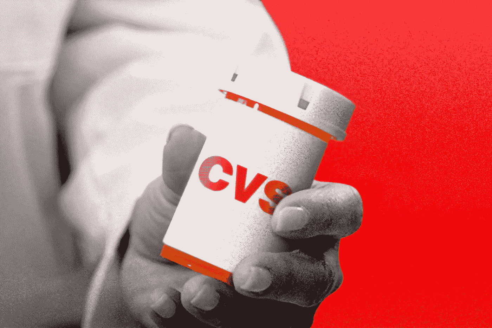
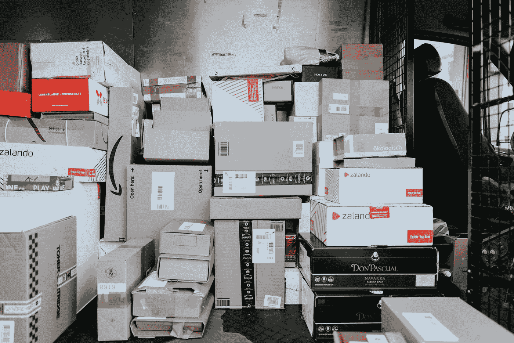

# 财富 500 强数据科学博客的完整列表

> 原文：<https://pub.towardsai.net/the-full-list-of-fortune-500-data-science-blogs-8b65241747f5?source=collection_archive---------0----------------------->

## [数据科学](https://towardsai.net/p/category/data-science)

## 我搜索了每个 F500 网站的数据和人工智能博客内容。这是我的发现。

由[卢克·坦尼斯](https://unsplash.com/@saluken?utm_source=medium&utm_medium=referral)在 [Unsplash](https://unsplash.com?utm_source=medium&utm_medium=referral) 拍摄的照片

你可能已经关注了一些伟大的数据科学博客，如[走向数据科学](https://towardsdatascience.com/)和[黑客正午](https://hackernoon.com/tagged/data-science)。

为了学习可行的行业见解，你可能想把像 Apteo 这样的人工智能创业博客添加到你的列表中，还有那些大公司的博客，从 FAANGs 到财富 500 强的其他公司。

此列表适用于以下人员:

*   想知道市场领导者如何使用数据和人工智能吗
*   想知道如何在他们的组织中使用数据和人工智能吗
*   想得到一个财富 500 强的客户
*   想在财富 500 强从事数据科学职业
*   …以及所有好奇的人！

*注:许多 F500s 没有数据或人工智能相关的博客内容，因此被排除在外。一些公司甚至出现了网站瘫痪……*😲

# 一. FAANGs🏢

*   [脸书人工智能](https://ai.facebook.com/):脸书人工智能博客定期发布激动人心的最新研究动态，通常还会有演示，这样你就可以自己尝试代码了。例如，他们最近发布了一个超精确的聊天机器人[，我试用了](https://hackernoon.com/i-tried-facebooks-new-ai-chatbot-its-so-good-its-scary-jn3332ez)，以及一个将 2D 图像转换成 3D 模型的算法[。](https://hackernoon.com/how-to-use-ai-to-make-a-3d-model-of-yourself-in-seconds-1nr3ygl)
*   亚马逊人工智能:亚马逊的人工智能博客更容易阅读，它让你深入了解诸如[Alexa 如何使用 ML 学习语言](https://blog.aboutamazon.com/amazon-ai/how-alexa-learned-french)等主题。
*   [苹果机器学习日志](https://machinelearning.apple.com/):这份日志没有定期更新，但它是对苹果机器学习工作的一个很好的内部观察，比如当你在 iPhone 上输入文本时使用的 [NLP 技术](https://machinelearning.apple.com/2019/07/24/language-identification-from-very-short-strings.html)。
*   [网飞 ML 研究](https://research.netflix.com/articles?q=Machine%20Learning):网飞在人工智能领域以其个性化系统而闻名，这篇博客让你深入了解它是如何工作的。
*   谷歌人工智能:谷歌的人工智能博客挤满了深入的人工智能研究。这是寻找新锐论文的最佳地点之一。

# 二。航空航天和国防🚀**💥**

*   [波音分析博客](https://www.boeing.com/company/key-orgs/analytx/index.page):滚动到底部，你会发现波音如何使用[数据驱动的解决方案来优化运营](http://www.boeing.ca/media/news-releases/2016/august/boeing-vancouver-labs-focus-on-rapid-development.page)，做出决策，等等。
*   [雷神网络博客](https://www.raytheon.com/cyber/news):虽然专注于网络安全，但雷神的博客包括关于[数据安全和加密](https://www.raytheon.com/cyber/news/feature/when-hackers-hold-data-hostage)的内容——这是现代数据科学家的重要话题。
*   [通用动力](https://www.gdit.com/perspectives/latest/):GD 博客包括关于[使用人工智能发现新冠肺炎风险因素](https://www.gdit.com/perspectives/latest/artificial-intelligence-finds-answers-to-covid-19-risk-factors/)、[为 NOAA](https://www.gdit.com/perspectives/latest/making-predictions-so-that-noaa-can/) 做预测、[联邦采用人工智能](https://www.gdit.com/perspectives/latest/how-ready-are-federal-agencies-for-ai/)的专题。
*   [现在的诺斯罗普·格鲁曼公司。艾博客](https://now.northropgrumman.com/tag/artificial-intelligence/):“现在”博客的内容包括基于人工智能的药物再利用、人工智能诊断技术、天气预报、智能仓库、奇点等。
*   [罗克韦尔柯林斯大数据博客](https://insights.rockwellcollins.com/category/big-data-and-secure-reliable-resilient-networks/):柯林斯航空航天公司包含了一些关于大数据的功能&人工智能对行业的影响，以及我们可以期待的创新。

# 三。商业服务💼

*   [ManpowerGroup 创新工作的未来](https://www.manpowergroup.com/innovating-the-future-of-work):这个博客包括数据驱动的工作匹配、人工智能驱动的招聘等内容。
*   [Visa 创新](https://usa.visa.com/visa-everywhere/blog.html?category=Innovation) : Visa 的创新博客涵盖了[隐私保护机器学习和人工智能驱动的欺诈防范](https://usa.visa.com/visa-everywhere/blog/bdp/2019/12/24/investing-in-the-1577207091483.html)等主题。
*   [Aramark Insights](https://www.aramark.com/about-us/blog?category=insights) : Aramark 的 Insights 博客介绍了使用[智能数据](https://www.aramark.com/about-us/blog/enabling-technology-in-our-kitchens)来限制食物浪费和腐败、优化库存、做出更好的采购决策等内容。
*   [ADP SPARK 博客](https://www.adp.com/spark.aspx) : ADP 的 SPARK 博客涵盖了[数据安全](https://www.adp.com/spark/articles/2020/05/holding-the-line-hrs-rising-role-in-data-security-for-small-businesses.aspx)和[行业分析](https://www.adp.com/spark/articles/2020/04/the-role-of-industry-analysts-in-hcm-purchase-decisions.aspx)等话题。
*   [第一个数据洞察博客](https://www.firstdata.com/en_us/insights.html):这个博客涵盖了[互联商务](https://www.firstdata.com/en_us/insights/digital-transformation-in-the-petroleum-industry.html)等话题。
*   [PayPal Stories](https://www.paypal.com/stories) : PayPal 的 Stories 博客包括类似 [ML-powered 欺诈防范](https://www.paypal.com/stories/us/driving-value-with-machine-learning-powered-fraud-prevention)的内容。

由 [CardMapr](https://unsplash.com/@cardmapr?utm_source=medium&utm_medium=referral) 在 [Unsplash](https://unsplash.com?utm_source=medium&utm_medium=referral) 上拍摄的照片

*   [master card beyond the transaction 博客](https://newsroom.mastercard.com/asia-pacific/blog/):该博客包括“[人工智能如何改变支付体验](https://newsroom.mastercard.com/asia-pacific/2019/01/31/how-ai-is-transforming-the-payments-experience/)等内容
*   富达研究院(Fidelity Research Institute):本博客包括深入的主题，如[人工智能如何被用于增强投资决策](https://institutional.fidelity.com/app/item/RD_9889536/ai-to-enhance-investment-decision-making.html)。
*   [United Rentals 项目正常运行时间](https://www.unitedrentals.com/project-uptime/data#/):这个博客的特色主题有[人工智能用于施工调度](https://www.unitedrentals.com/project-uptime/data/artificial-intelligence-reinventing-construction-scheduling)和“[建筑信息建模](https://www.unitedrentals.com/project-uptime/data/4-ways-bim-helps-contractors-react-fast-severe-weather)”
*   S & P 全球市场情报博客:该博客提供了深入的主题指南，如[为您的 CRM 释放人工智能](https://www.spglobal.com/marketintelligence/en/events/webinars/prepare-for-ai-enriching-your-crm-with-quality-data)和[揭开人工智能的神秘面纱](https://www.spglobal.com/marketintelligence/en/news-insights/research/demystifying-artificial-intelligence-ai-a-framework-to-get-it-right)。
*   [西联博客](https://www.westernunion.com/blog/):该博客包括[人工智能聊天机器人](https://www.westernunion.com/blog/western-union-chatbot/)和[利用人工智能推荐产品和服务](https://www.westernunion.com/blog/western-union-expanding-our-digital-footprint/)等话题。
*   [Kelly Services 博客](https://www.kellyservices.co.uk/blog):这个博客包括了像[结合人工智能和管理](https://www.kellyservices.us/link/b572e3f6f99f41d7a731894e1b0dbba3.aspx)这样的主题。
*   [Robert Half 国际博客](https://www.roberthalf.com/blog/technology-blog):该博客的特色内容包括“[为金融功能](https://www.roberthalf.com/blog/the-future-of-work/identifying-ai-use-cases-for-the-finance-function)识别人工智能用例。”
*   [ABM Industries](https://www.abm.com/industries/technology-manufacturing/technology-data-centers/):ABM Industries 新闻编辑室提供关于[数据中心维护](https://www.abm.com/wp-content/uploads/2019/03/ABM-05082-0718_Data_Center_Energy-Out_of_Control_LO.pdf)和相关主题的内容。

# 四:🧪化学品公司

*   [艺康博客](https://www.ecolab.com/media-center/perspectives-blog-ecolab#q=data&sort=%40webpublishedyear%20descending):艺康博客包含关于[使用数据保护我们的食品供应](https://www.ecolab.com/articles/2019/04/how-to-keep-our-food-supply-safe-in-a-hotter-drier-and-more-crowded-world)和[数据中心](https://www.ecolab.com/articles/2019/08/3-crucial-lessons-for-data-centers-in-a-water-scarce-world)的见解。
*   普莱克斯博客:该博客以小众主题的信息为特色，如[利用数据提高金属制造生产率](https://www.praxairusa.com/about-us/blogs/productivity-matters/productivity-matters/2020/07/01/from-production-line-to-bottom-line)。

# ⚡能源公司

*   [埃克森美孚能源因子](https://energyfactor.exxonmobil.com/category/science-technology/):能源因子博客涵盖的话题从[寻找人工智能](https://energyfactor.exxonmobil.com/behind-the-energy/xiaojun-huang/)到[建立数据科学团队](https://energyfactor.exxonmobil.com/science-technology/data-science-team/)。
*   [雪佛龙](https://www.chevron.com/technology):雪佛龙的博客涵盖了从[数据科学家的一天](https://www.chevron.com/stories/i-am-a-data-scientist)到[利用设备监控数据](https://www.chevron.com/technology/managing-our-assets#whatwearedoing)确保炼油厂正常运转的话题。
*   [康菲石油公司精神现在博客](http://www.conocophillips.com/spiritnow/):该博客的主题从[数据驱动的愿望](http://www.conocophillips.com/spiritnow/story/data-driven-aspirations/)到[利用分析改进审计](http://www.conocophillips.com/sustainability/sustainability-news/story/data-insight-and-action-using-analytics-to-improve-hse-audits/)。
*   [哈利伯顿](https://www.halliburton.com/en-US/news/other-news.html?node-id=hgeyxtfs):哈利伯顿的博客包括一些小众话题，如[深水和油井数据](https://www.halliburton.com/en-US/news/announcements/halliburton-launches-new-high-speed-telemetry-system.html)和[声学分析识别泄漏](https://www.halliburton.com/en-US/news/announcements/halliburton-introduces-next-generation-acoustic-analysis-service.html)。

由 [Zbynek Burival](https://unsplash.com/@zburival?utm_source=medium&utm_medium=referral) 在 [Unsplash](https://unsplash.com?utm_source=medium&utm_medium=referral) 拍摄的照片

*   [AES](http://blog.aes.com/Home/default.aspx) :这个博客涵盖了像[使用人工智能](http://blog.aes.com/blog-details/2017/An-instantly-scalable-clean-tech-as-powerful-as-any-before-it/default.aspx)使“网格更高效、更有弹性、更干净”这样的主题
*   [NRG 洞察](https://www.nrg.com/insights/all-insights.html?p=5) : NRG 洞察涵盖[保护和加密数据中心](https://www.nrg.com/insights/innovation/the-reliable-power-solution-behind-data-centers.html)中的数据等主题。
*   《爱迪生激励》(Energized by Edison):《爱迪生激励》(Energized)的特色故事包括[预测野火](https://energized.edison.com/stories/sce-harnesses-technology-to-hone-wildfire-forecasts)和[分析电路数据以决定将电力输送到哪里](https://energized.edison.com/stories/sce-uses-innovation-to-improve-the-power-grid)。
*   自治领能源:自治领能源新闻包括像[使用数据优化电网](https://news.dominionenergy.com/2019-03-06-DVI-Voltage-Optimization-Technology-Helps-Choptank-Electric-Cooperative-Reduce-Energy-Demand-by-5-in-2018)这样的故事。
*   [贝克休斯](https://www.bakerhughes.com/company/newsroom):该博客包含了对“[使用先进的数据分析，该技术有助于识别和减少排放](https://www.bakerhughes.com/company/news/bhge-launches-lumen-ground-dronebased-advanced-methane-detection-reduction-system)等主题的见解
*   [PPL](https://www.pplweb.com/blog/):PPL 博客讨论的话题包括使用一种“[算法来检测带电的断电线路。](https://www.pplweb.com/blog/ppl-electric-utilities-uses-groundbreaking-innovation-to-enhance-safety/)

# 六:工程和建筑🚧

*   [福陆](https://newsroom.fluor.com/news-releases):福陆的特色是使用 [IBM Watson 进行大型项目预测分析](https://newsroom.fluor.com/news-releases/news-details/2018/Fluor-Uses-IBM-Watson-to-Deliver-Predictive-Analytics-Capability-for-Megaprojects/default.aspx)，使用[阿齐玛·DLI 进行分析软件和仪器](https://newsroom.fluor.com/news-releases/news-details/2011/Fluor-Teams-with-Azima-DLI-for-Client-Predictive-Maintenance-Needs/default.aspx)。
*   [Aecom](https://aecom.com/blog) :本博客以[通用数据环境](https://publications.aecom.com/coronavirus-resilience/report/promoting_collaboration_and_excellence_through_streamlined_information_management/?_ga=2.210285973.1817243110.1594125510-1261398861.1594125510)、[数据中心行业趋势](https://aecom.com/blog/new-frontiers-in-the-data-center-industry/)等为特色。

# 七:财务💵

*   [JP 摩根洞察](https://am.jpmorgan.com/us/en/asset-management/institutional/insights/):这个 JPM 博客以[深度人工智能研究出版物](https://www.jpmorgan.com/global/technology/artificial-intelligence/ai-research-publications)为特色。
*   [富国银行的故事](https://stories.wf.com/category/innovation/):富国银行故事博客的特色内容有[人工智能时代的银行业](https://stories.wf.com/banking-in-the-age-of-data-and-ai)、[人工智能为客户服务](https://stories.wf.com/seeing-financial-future-ai)等等。
*   [美国银行](https://newsroom.bankofamerica.com/search?query=data):美国银行博客包括[仪表板](https://newsroom.bankofamerica.com/press-releases/small-business-banking/bank-america-business-advantage-360-gives-small-businesses)、[使用数据分析提高外汇支付](https://newsroom.bankofamerica.com/press-releases/corporate-and-investment-banking-sales-and-trading-treasury-services/bank-america-44)等内容。
*   [房地美视角](http://www.freddiemac.com/perspectives):该博客的特色内容包括“[人工智能将如何改变行业](http://www.freddiemac.com/perspectives/loretta_ibanez/20180615_artificial_intelligence.page)”
*   [保诚](https://news.prudential.com/):保诚的博客上有一些故事，比如[利用人工智能](https://news.prudential.com/prudential-expands-financial-wellness-capabilities-to-address-americans-most-pressing-financial-needs.htm)允许“员工整合他们现有的保诚退休账户和非保诚金融账户，以帮助完善他们的财务健康路线图。”
*   [纽约人寿保险博客](https://www.newyorklife.com/newsroom/innovation):该博客的特色内容包括[如何培养高绩效的数据科学团队](https://www.newyorklife.com/newsroom/glenn-hofmann-data-science-careers-leadership)等主题。
*   [全国性博客](https://blog.nationwide.com/):该博客以类似[的故事为特色，利用数据分析鼓励安全驾驶](https://blog.nationwide.com/news/smartride-data/)。
*   [摩根斯坦利想法](https://www.morganstanley.com/ideas/):这个博客涵盖了[投资人工智能](https://www.morganstanley.com/ideas/artificial-intelligence-and-automation/)等话题。
*   [MassMutual](https://blog.massmutual.com/) :该博客的特色内容包括[互动数据地图](https://blog.massmutual.com/post/data-science-map?_ga=2.157289210.1768925879.1594190010-1434694078.1594190010)和[利用数据科学解决棘手的保险问题](https://blog.massmutual.com/post/data-science-and-living-mutual)。
*   [高盛人工智能洞察](https://www.goldmansachs.com/insights/topics/artificial-intelligence.html):阅读关于[人工智能投资前景](https://www.goldmansachs.com/insights/pages/ai-investment-landscape.html)、[人工智能革命](https://www.goldmansachs.com/insights/talks-at-gs/eric-schmidt.html)，或者[利用人工智能解决健康问题](https://www.goldmansachs.com/insights/talks-at-gs/deborah-disanzo-and-christina-minnis.html)。
*   [美国运通趋势&洞察](https://www.americanexpress.com/en-us/business/trends-and-insights/):了解[人工智能如何改变商业](https://www.americanexpress.com/en-us/business/trends-and-insights/articles/business-innovation--how-artificial-intelligence-is-changing-business/?linknav=US-oneAmex-axpSearchResults-1&searchresult=artificial%20intelligence)、[人工智能如何改变客户服务](https://www.americanexpress.com/en-us/business/trends-and-insights/articles/artificial-intelligence-is-changing-the-way-we-think-about-customer-service?linknav=US-oneAmex-axpSearchResults-4&searchresult=artificial%20intelligence)，或者[人工智能是否能取代企业家](https://www.americanexpress.com/en-us/business/trends-and-insights/articles/say-hello-artificial-entrepreneur/?linknav=US-oneAmex-axpSearchResults-7&searchresult=artificial%20intelligence)。
*   [西北相互数据科学研究所](https://innovation.northwesternmutual.com/blog/by-topic/northwestern-mutual-data-science-institute/):阅读[数据的未来](https://innovation.northwesternmutual.com/blog/2020-06-05/the-future-of-data-marquette-in-milwaukee-podcast-features-nmdsi-codirectors/)或[数据科学职业](https://innovation.northwesternmutual.com/blog/2020-06-24/student-stories-different-paths-can-lead-to-data-science-careers/)。
*   [PNC Insights](https://www.pnc.com/insights/corporate-institutional.html?lnksrc=ideas-lp) :阅读[人工智能和机器人技术的融合](https://www.pnc.com/insights/wealth-management/markets-economy/convergence-of-artificial-intelligence-and-robotics.html?lnksrc=insights-searchresults)、[大数据如何革新营销](https://www.pnc.com/insights/corporate-institutional/gain-market-insight/big-data-in-the-new-era-of-marketing.html?lnksrc=insights-searchresults)或[人工智能提升运营效率](https://www.pnc.com/insights/corporate-institutional/gain-market-insight/enhancing-operational-efficiency.html?lnksrc=insights-searchresults)。
*   [负责人](https://blog.principal.com/):了解[数据&房地产分析](https://blog.principal.com/2017/02/23/intelligence-harnessing-data-analytics-and-new-technology-in-real-estate/)、[智能增强](https://blog.principal.com/2017/04/13/views-from-the-cio-in-a-field-of-dreams-will-ia-revolutionize-the-asset-management-industry/)等等。
*   [贝莱德博客](https://www.blackrockblog.com/):阅读关于[替代数据](https://www.blackrockblog.com/2020/06/24/how-alternative-data-can-lend-clarity-amid-uncertainty/)、[大数据](https://www.blackrockblog.com/2019/07/17/big-data-and-the-fed/)等更多内容。
*   [FirstAm](https://blog.firstam.com/innovation) :了解[利用房产数据打击欺诈](https://blog.firstam.com/innovation/how-technology-and-real-estate-data-can-help-the-fight-against-fraud)、[决策科学](https://blog.firstam.com/_hcms/analytics/search/conversion?redirect=aHR0cHM6Ly9ibG9nLmZpcnN0YW0uY29tL2lubm92YXRpb24vYXBwbHlpbmctZGVjaXNpb24tc2NpZW5jZS10by10aXRsZS1pbnN1cmFuY2U%3D&ct=SEARCH&pid=17501&cid=11898627149&t=YXJ0aWZpY2lhbCBpbnRlbGxpZ2VuY2U%3D&d=blog.firstam.com&c=2&c=6&rp=2&ab=false&corr=&rs=UNKNOWN&hs-expires=1625731597&hs-version=1&hs-signature=APUk-v56TyafJKs3qNqkmK1YPU3V9WCYDQ)等等。

# 八:食品、饮料和药品🍔🥤💊

*   [百事可乐](https://www.pepsico.com/news/stories):了解百事可乐的[无人驾驶快餐配送机器人](https://www.pepsico.com/news/story/pepsico's-self-driving-snack-delivery-robot)、[数据驱动电子商务](https://www.pepsico.com/news/story/startup-veteran-elevating-pepsico's-digital-expertise)等等。
*   [可口可乐](https://www.coca-colacompany.com/news):了解[大数据如何加速可口可乐的创新战略](https://www.coca-colacompany.com/news/tech-and-big-data-accelerate-innovation-strategy)。
*   [好时](https://www.thehersheycompany.com/en_us/blog/):关注好时的博客，了解人工智能与社交媒体相结合的，[将数据投入工作](https://www.thehersheycompany.com/en_us/blog/unlocking-growth-by-putting-data-to-work.html)，等等。

# 九:⚕️医疗保健

*   [简历](https://cvshealth.com/news-and-insights):关注本博客，了解[新冠肺炎数据](https://cvshealth.com/news-and-insights/articles/covid-19-data-reveals-huge-health-disparities)和[用数据驱动商业价值](https://cvshealth.com/news-and-insights/articles/using-data-to-drive-value-to-our-members)。

[晨酿](https://unsplash.com/@morningbrew?utm_source=medium&utm_medium=referral)在 [Unsplash](https://unsplash.com?utm_source=medium&utm_medium=referral) 上拍摄的照片

*   [快速脚本](https://www.express-scripts.com/corporate/articles/):关注本博客，了解类似[使用数字分析推动患者安全和节约的故事](https://www.express-scripts.com/corporate/articles/express-scripts-mymatrixx-launches-mydatasense-analytics-tool)。
*   [Anthem](https://www.anthem.com/blog/) :了解[使用大数据揭示罕见疾病的见解](https://www.anthem.com/blog/your-health-care/new-medical-technologies-and-devices-to-treat-what-ails-you/)等等。
*   [约翰逊&约翰逊](https://jnjinnovation.com/blog):阅读[人工智能让医疗保健更人性化](https://jnjinnovation.com/node/blog-post/how-artificial-intelligence-will-make-healthcare-more-human-conversation-cris-de)和[将数据转化为关于微生物组的见解](https://jnjinnovation.com/node/blog-post/data-insights-addressing-challenges-microbiome)。
*   [Aetna](https://www.aetna.com/employers-organizations/resources/personalized-medicine.html) :了解数据&分析如何使医疗保健更加人性化等等。
*   [Humana](https://research.humana.com/) :关注 Humana，了解有关健康质量测量和深入健康统计分析等主题的数据驱动研究。
*   [辉瑞](https://www.pfizer.com/news/):关注辉瑞 [AI 开发新药](https://www.pfizer.com/news/featured_stories/featured_stories_detail/a_new_frontier_for_ai_helping_scientists_develop_potential_new_medicines)等话题。
*   [HCA Healthcare](https://hcatodayblog.com/) :了解[使用数据改善患者结果](https://hcatodayblog.com/2018/11/04/dr-perlin-discusses-hca-scale-data-improve-patient-outcomes-fah-podcast/)、[大数据通知和改善治疗](https://hcatodayblog.com/2015/08/12/a-conversation-at-informs-big-data-big-questions-quicker-solutions/)等。
*   [默克人工智能研究](https://medium.com/@ai_research):默克有自己的人工智能媒体博客。目前，它只有一篇文章，标题是“[在人工智能领域实现跨越式发展”。](https://medium.com/@ai_research/leapfrogging-ahead-in-ai-5c0487778892)

 [## 在人工智能领域实现跨越式发展

### 虽然深度学习已经将人工智能推到了每个人的脑海中，但很明显，这种方法已经严重地…

medium.com](https://medium.com/@ai_research/leapfrogging-ahead-in-ai-5c0487778892) 

*   [艾伯维的故事](https://stories.abbvie.com/stories):了解[艾伯维如何使用 RPA 和机器人来提高效率](https://stories.abbvie.com/stories/how-bert-bot-helps-patients.htm)、[人工智能如何帮助发现新药](https://stories.abbvie.com/stories/chembeads-improving-artificial-intelligence-through-human-ingenuity.htm)等等。
*   [波士顿科学](https://news.bostonscientific.com/):了解像[人工智能如何改变医疗保健](https://news.bostonscientific.com/warren-wang-how-is-ai-transforming-healthcare)这样的话题。
*   除了 faangs，IQVIA 还有 f500s 中最好的数据科学和人工智能博客，有数百篇文章、数据表、信息图、视频、白皮书等等。了解诸如[利用人工智能推动早期诊断](https://www.iqvia.com/library/white-papers/applying-artificial-intelligence-and-machine-learning-to-drive-earlier-diagnosis)、[利用人工智能推动商业成功](https://www.iqvia.com/library/white-papers/using-ai-and-machine-learning-to-drive-commercial-success-in-the-eu)和[机器如何在医疗保健中工作](https://www.iqvia.com/library/publications/how-machines-work-in-healthcare)等主题。

# x:酒店、餐厅和休闲🏨🍟

*   [麦当劳](https://news.mcdonalds.com/stories/company-news):阅读麦当劳如何"[投资使用人工智能的工具，以识别和根除选择过程中的偏见](https://news.mcdonalds.com/press/press-releases/gender-balance-and-diversity-womens-day-2019)，"[麦当劳收购一家基于人工智能的对话技术公司](https://news.mcdonalds.com/news-releases/news-release-details/mcdonalds-acquire-apprente-early-stage-leader-voice-technology)等等。
*   [星巴克的故事](https://stories.starbucks.com/):阅读星巴克如何与阿里巴巴[合作进入人工智能领域](https://stories.starbucks.com/press/2019/starbucks-and-alibaba-launch-voice-ordering-and-delivery/):“我们很高兴通过天猫精灵提供我们尖端的人工智能技术，为中国熟悉数字的星巴克客户服务。”
*   [万豪国际](https://news.marriott.com/):了解[万豪如何使用人工智能聊天机器人来简化客人的旅行](https://news.marriott.com/news/2017/09/28/marriott-internationals-ai-powered-chatbots-on-facebook-messenger-and-slack-and-alofts-chatbotlr-simplify-travel-for-guests-throughout-their-journey)。

# 🧽Xi 家庭用品公司

*   [高露洁棕榄](https://investor.colgatepalmolive.com/press-releases):了解高露洁[人工智能牙刷](https://investor.colgatepalmolive.com/news-releases/news-release-details/colgate-advances-future-oral-care-introduces-its-first-app)及更多…

照片由[萨米亚·利亚马尼](https://unsplash.com/@mialiamani?utm_source=medium&utm_medium=referral)在 [Unsplash](https://unsplash.com?utm_source=medium&utm_medium=referral) 上拍摄

*   [Clorox](https://www.thecloroxcompany.com/news/blog/) :了解 Clorox [如何使用大数据来测试新的货架布局](https://www.thecloroxcompany.com/blog/being-digital-at-clorox/)，推动电子商务结果，等等。

# 十二:工业🚜

*   [通用电气](https://www.ge.com/digital/blog):了解[通用电气如何将机器智能带入工业](https://www.ge.com/digital/blog/five-steps-bringing-machine-intelligence-industry)、[人工智能](https://www.ge.com/news/reports/judgment-call-ge-experimenting-humble-ai)、以及更多。
*   [霍尼韦尔航空航天](https://aerospace.honeywell.com/en/learn/about-us/blogs):了解[霍尼韦尔的预测洞察解决方案](https://aerospace.honeywell.com/en/learn/about-us/blogs/2019/08/3-reasons-to-choose-honeywell-for-predictive-insights-solutions)、[人工智能驱动的飞机维护](https://aerospace.honeywell.com/en/learn/about-us/blogs/2018/10/the-future-of-aircraft-maintenance-has-arrived)，以及[寻求更好的人工智能成果](https://aerospace.honeywell.com/en/learn/about-us/blogs/2019/03/in-search-of-artificial-intelligence-and-better-outcomes)。
*   [卡特彼勒](https://www.cat.com/en_US/by-industry/construction/on-the-level-construction-blog.html):了解[卡特彼勒如何使用预防性保养](https://www.cat.com/en_US/by-industry/construction/on-the-level-construction-blog/increase-productivity-with-machine-telematics.html)及更多。
*   3M :阅读 3M 如何通过人工智能减轻临床医生的管理负担，人工智能如何在医疗保健中恢复人情味，等等。
*   [迪尔](https://johndeerejournal.com/category/technology/):查看《约翰迪尔杂志》，了解“[协作机器人](https://johndeerejournal.com/2019/11/robots-tackle-dull-dangerous-and-dirty-jobs/)、[远程图像](https://johndeerejournal.com/2017/07/imagery-comes-of-age/)、[精准农业](https://johndeerejournal.com/2015/08/the-payoff-from-precision-agriculture/)、[自动转向拖拉机](https://johndeerejournal.com/2016/11/silicon-prairie/)等等。
*   [Parker](http://blog.parker.com/) :了解[数据中心](http://blog.parker.com/dripless-connectors-critical-in-data-centers-cooling-efficiency)、[性能数据](http://blog.parker.com/wireless-transmission-of-performance-data-extends-equipment-life)、[数据管理](http://blog.parker.com/data-management-linear-motors-robotics-slas-2016-themes)、[信息无处不在](http://blog.parker.com/how-the-information-anywhere-revolution-helps-boost-production)，等等。
*   [AGCO](https://blog.agcocorp.com/) :关注本博客，了解[数据驱动的精准农业](https://blog.agcocorp.com/precision-farming/)、[农业车队连接](https://blog.agcocorp.com/2019/05/building-strong-smart-farming-foundation-agcos-full-fleet-connectivity-approach/)等等。
*   [罗克韦尔自动化](https://www.rockwellautomation.com/en_NA/news/blog/overview.page?ea_solution=actionable_analytics):了解提高效率的[预测分析](https://www.rockwellautomation.com/en_NA/news/blog/detail.page?pagetitle=Predictive-Analytics-Improves-Efficiency-%7C-Blog&content_type=blog&docid=d18d604d85432db02ef5b92ac7ebfd8c)、[没有数据科学家的预测洞察力](https://www.rockwellautomation.com/en_NA/news/blog/detail.page?pagetitle=Under-a-Watchful-AI%3A-Discover-Production-Problems-Early-with-Embedded-Analytics-%7C-Blog&content_type=blog&docid=a1e1a85e88e0966b66c9b79fadb8d0d7)、[数据过载](https://www.rockwellautomation.com/en_NA/news/blog/detail.page?pagetitle=Suffering-from-Data-Overload%3F-There%E2%80%99s-a-Cure&content_type=blog&docid=f2485e75d0278741e06c22f09454f2e1)等等。

# 十三:⛏️材料公司

*   [密封空气](https://sealedair.com/blog/technology):了解[自动化技术](https://sealedair.com/blog/how-new-automation-technologies-will-transform-poultry-processing)、[清洗机大数据](https://sealedair.com/blog/cleaning-fleet-and-big-data-big-help-or-big-headache)、[预测分析](https://sealedair.com/blog/importance-predictive-analytics)等等。

# 十四:机动车辆和零件🚗

*   [福特](https://medium.com/@ford):福特有自己的 Medium 博客，在这里可以了解到[自动驾驶汽车](https://medium.com/self-driven/oh-the-places-well-go-why-education-is-pivotal-for-launching-a-self-driving-service-95b711e9cfed?source=---------2------------------)、[自动驾驶数据集](https://medium.com/self-driven/lets-get-technical-ford-offers-self-driving-dataset-to-spark-research-and-development-81d0f035e3b0?source=---------6------------------)、[自动驾驶汽车算法](https://medium.com/self-driven/how-algorithm-and-simulation-work-is-helping-fords-autonomous-vehicle-operations-5259fafd552?source=---------8------------------)等等。

 [## 哦，我们要去的地方:为什么教育对推出自驾车服务至关重要

### Brittany Pauley，福特自动驾驶汽车有限责任公司华盛顿特区市场经理

medium.com](https://medium.com/self-driven/oh-the-places-well-go-why-education-is-pivotal-for-launching-a-self-driving-service-95b711e9cfed) 

*   [固特异](https://corporate.goodyear.com/en-US/responsibility/blog.html):固特异的博客上有关于[预测性维护、拼车数据等的见解](https://corporate.goodyear.com/en-US/responsibility/blog/advanced-mobility-beyond-tires-journey.html)。

# 十五:零售🏪

*   [沃尔玛实验室](https://medium.com/walmartlabs) ⭐⭐⭐⭐⭐:沃尔玛有自己的中型博客，内容涉及[地理空间数据分析](https://medium.com/walmartlabs/geospatial-data-analysis-using-sql-3bf3b5f38d51?source=collection_home---4------3-----------------------)、[一阶和二阶指标](https://medium.com/walmartlabs/first-and-second-order-metrics-at-walmart-ad1e3a17185c?source=collection_home---4------5-----------------------)、[大型 ML 系统](https://medium.com/walmartlabs/taking-big-ml-systems-to-productions-part-2-1653d7e8fa1f?source=collection_home---4------9-----------------------)等。

 [## 使用 SQL 进行地理空间数据分析

### 了解地理位置现在变得比以前更加重要。从地理空间获得洞察力…

medium.com](https://medium.com/walmartlabs/geospatial-data-analysis-using-sql-3bf3b5f38d51) 

*   [Target Pulse](https://pulse.target.com/):Target Pulse 博客以采访他们的数据科学团队为特色。
*   [Dollar General](https://newscenter.dollargeneral.com/our-story/blog-posts) :了解 Dollar General 如何使用 [AI 进行供应链管理](https://newscenter.dollargeneral.com/our-story/blog-posts/dollar-general-drives-success-through-an-exceptional-supply-chain-network.htm)等等。
*   :了解一下[美国柯尔百货公司是如何和 AI](https://corporate.kohls.com/news/archive-/2018/april/the-four-technologies-to-know--kohl-s-is-working-smarter-with-ar) 一起工作的。

# 十六:技术📱 ⭐⭐⭐⭐⭐

注意:FAANGs 列在本文的顶部。

*   [微软的“人工智能博客”](https://blogs.microsoft.com/ai/):了解[人工智能超级计算机](https://blogs.microsoft.com/ai/openai-azure-supercomputer/)、[建立对人工智能系统的信任](https://blogs.microsoft.com/ai/azure-responsible-machine-learning/)、[作家的人工智能工具](https://blogs.microsoft.com/ai/microsoft-365-ai-tools/)、[阻止数据泄露的 ML](https://blogs.microsoft.com/ai/insider-risk-management-microsoft-365/)，等等，等等。
*   [IBM Watson 博客](https://www.ibm.com/blogs/watson/):了解保险领域的[AI](https://www.ibm.com/blogs/watson/2020/05/women-leaders-in-ai-it-leader-seema-gaur-on-putting-ai-to-work-in-insurance/)、 [Watson AIOps](https://www.ibm.com/blogs/watson/2020/06/addressing-complex-kubernetes-issues-with-watson-aiops-and-sysdig/) 、[新冠肺炎事件地图的](https://www.ibm.com/blogs/watson/2020/06/ibm-watson-natural-language-processing-technology-powers-weather-channel-covid-19-incident-map/)NLP，等等。
*   [戴尔技术](https://blog.dellemc.com/en-us/tag/artificial-intelligence/):了解 [GPU 加速](https://blog.dellemc.com/en-us/gpu-acceleration-shifts-into-high-gear/)、[与 NVIDIA 的 NLP 合作](https://blog.dellemc.com/en-us/how-dell-technologies-and-nvidia-support-natural-language-processing-technologies/)、[人工智能的 IT 架构](https://blog.dellemc.com/en-us/it-architecture-building-blocks-for-artificial-intelligence-prototypes/)等等。
*   [英特尔 AI](https://www.intel.com/content/www/us/en/artificial-intelligence/blog.html) :了解[AI、ML 和 DL](https://www.intel.com/content/www/us/en/artificial-intelligence/posts/difference-between-ai-machine-learning-deep-learning.html) 之间的区别，以及其他主题，如[文本到语音](https://www.intel.com/content/www/us/en/artificial-intelligence/posts/intel-xeon-text-to-speech.html)，和 [DL 训练和推理](https://www.intel.com/content/www/us/en/artificial-intelligence/posts/deep-learning-training-and-inference.html)。
*   [惠普企业数据&人工智能](https://community.hpe.com/t5/data-ai/ct-p/it-data-analytics-topics):了解数据科学发现过程中的[工业化效率](https://community.hpe.com/t5/hpe-ezmeral-uncut/industrialized-efficiency-in-the-data-science-discovery-process/ba-p/7093474)、[人工智能驱动的语音分析](https://community.hpe.com/t5/tech-insights/transform-customer-experiences-with-voice-analytics-and-ai/ba-p/7092237)等。
*   [思科系统人工智能](https://blogs.cisco.com/tag/artificial-intelligence):了解[人工智能伦理](https://blogs.cisco.com/csr/creating-an-ethical-framework-for-ai-to-protect-the-customer-experience)、[最大化人工智能基础设施](https://blogs.cisco.com/datacenter/nvidia-a100-gpu-maximizes-ai-infrastructure-for-cisco-customers)、[人工智能联网](https://blogs.cisco.com/networking/ai-for-networking-separating-the-hype-from-reality)等等。
*   [Oracle AI &数据科学博客](https://blogs.oracle.com/datascience/):了解[数据科学试验](https://blogs.oracle.com/datascience/data-science-trial)、[使用 ML 的预测性维护](https://blogs.oracle.com/datascience/predictive-maintenance-machine-learning-oracle-database-20c)、 [AutoML](https://blogs.oracle.com/datascience/how-does-automl-impact-machine-learning) 等等。
*   [高通 AI 研究](https://www.qualcomm.com/invention/artificial-intelligence/ai-research):了解处于边缘的[AI](https://www.qualcomm.com/news/onq/2020/07/07/bringing-ai-edge-smart-cameras-internet-things)、[让 AI 无处不在](https://www.qualcomm.com/news/onq/2020/06/12/we-are-making-ai-ubiquitous)、[新 AI 研究论文](https://www.qualcomm.com/news/onq/2020/06/10/whats-next-machine-learning-new-qualcomm-ai-research-papers-accepted-major)等等。
*   [捷普电路](https://www.jabil.com/blog/):关注捷普的博客，了解[零售分析](https://www.jabil.com/blog/retail-analytics-in-stores.html)、[人工智能对制造业的影响](https://www.jabil.com/blog/artificial-intelligence-in-manufacturing.html)等等。
*   [赛默飞世尔科技【互联实验室】](https://www.thermofisher.com/blog/connectedlab/):本博客充斥着激动人心的数据&人工智能新闻，如[人工智能的实验室应用](https://www.thermofisher.com/blog/connectedlab/machine-learning-a-primer-to-laboratory-applications/)、[人工智能在药物发现中的应用](https://www.thermofisher.com/blog/connectedlab/the-power-of-ai-in-drug-discovery-and-development/)、[人工智能提高作物产量](https://www.thermofisher.com/blog/connectedlab/using-ai-to-boost-crop-yields/)等等。
*   [施乐洞察](https://www.xerox.com/en-us/insights):我和你一样惊讶地发现，施乐在《人工智能的创新、[今天的人工智能](https://www.xerox.com/en-us/insights/artificial-intelligence-today)以及更多方面展示了内容。
*   [CDW 解决方案](https://blog.cdw.com/):了解[数据驱动的智慧城市](https://blog.cdw.com/software/how-smart-cities-can-deploy-video-technology-to-enable-recovery)、[如何让人工智能为您的组织服务](https://blog.cdw.com/software/how-to-make-artificial-intelligence-work-for-you)等等。
*   [Cognizant Technology Solutions 人工智能博客](https://www.cognizant.com/ai/blog):了解诸如[数据操作以削减分析成本](https://www.cognizant.com/ai/blog/dataops-cut-analytics-costs-speed-business-results)、[进化人工智能](https://www.cognizant.com/ai/blog/beware-fraudsters-evolutionary-ai-is-going-to-catch-you)、[人工智能成功的关键](https://www.cognizant.com/ai/blog/eye-on-design-10-keys-to-implementing-ai-successfully)等主题。
*   [德州仪器](https://e2e.ti.com/blogs_/b/) : TI 要负责的远不止你在数学课上用的计算器。正如他们的博客所探讨的那样，TI 正在汽车领域使用[人工智能](https://e2e.ti.com/blogs_/b/behind_the_wheel/archive/2018/02/08/ai-in-automotive-practical-deep-learning)，在边缘领域使用[ML](https://e2e.ti.com/blogs_/b/industrial_strength/archive/2018/11/27/ti-brings-deep-learning-inference-to-the-edge)等等。

照片由[雷·雷耶斯](https://unsplash.com/@rareyesphoto?utm_source=medium&utm_medium=referral)在 [Unsplash](https://unsplash.com?utm_source=medium&utm_medium=referral) 上拍摄

*   [西部数据 AI & ML 博客](https://blog.westerndigital.com/technology-trends/ai-and-ml/):了解数据中心中的 [AI、](https://blog.westerndigital.com/5-key-ai-data-center-trends/)[数据质量](https://blog.westerndigital.com/3-things-we-learned-the-hard-way-about-data-quality/)、[优化您的大数据平台成本](https://blog.westerndigital.com/6-ways-optimize-cost-big-data-platform/)等等。
*   [美光科技](https://www.micron.com/about/blog):了解[为你的人工智能基础设施](https://www.micron.com/about/blog/2019/july/supercharge-your-ai-infrastructure-with-micron-storage-and-memory)、[人工智能和 ML 需求](https://www.micron.com/about/blog/2019/february/ai-and-machine-learning-demand-high-performance-storage)等等。
*   [应用材料](http://blog.appliedmaterials.com/blog-filter/ai):阅读关于[将人工智能带到边缘](http://blog.appliedmaterials.com/bringing-ai-to-the-edge)、[人工智能和大数据如何颠覆半导体行业](http://blog.appliedmaterials.com/ai-big-data-disrupting-semiconductor-industry)等更多内容。
*   [易贝科技博客](https://tech.ebayinc.com/):了解[易贝如何由人工智能驱动](https://tech.ebayinc.com/engineering/ebays-platform-is-powered-by-ai-and-fueled-by-customer-input/)、[易贝向现代人工智能平台的转变](https://tech.ebayinc.com/engineering/ebays-transformation-to-a-modern-ai-platform/)等等。
*   [Salesforce.com 人工智能博客](https://www.salesforce.com/blog/category/artificial-intelligence.html):关注 Salesforce.com 人工智能博客，了解[人工智能的未来将如何影响商业](https://www.salesforce.com/blog/2019/04/future-of-ai-artificial-intelligence-business-impact.html)、[如何使用聊天机器人处理激增的客户案例](https://www.salesforce.com/blog/2020/05/use-chatbots-to-deal-surges-in-case-volume.html)、[人工智能建立同理心](https://www.salesforce.com/blog/2020/05/email-marketing-comms-ai.html)等等。
*   [Leidos Holdings AI in Action](https://www.leidos.com/insights/artificial-intelligence):了解[AI 如何预测人类行为](https://www.leidos.com/insights/how-can-ai-help-anticipate-human-behavior)、 [AI 的包含问题](https://www.leidos.com/insights/confronting-ais-inclusion-problem)等等。
*   [英伟达人工智能新闻](https://news.developer.nvidia.com/category/artificial-intelligence/):了解用于医学成像的[人工智能](https://news.developer.nvidia.com/monai-v0-2-brings-domain-specialized-best-practices-to-medical-imaging-ai-researchers/)、[交互式人工智能机器人](https://news.developer.nvidia.com/jetson-project-of-the-month-qrio-an-interactive-ai-bot/)等等。
*   [摩托罗拉解决方案人工智能博客](https://blog.motorolasolutions.com/en_us/topic/artificial-intelligence/):了解[道德地实施人工智能驱动的视频分析](https://blog.motorolasolutions.com/en_us/our-commitment-to-the-responsible-ethical-implementation-and-use-of-ai-powered-video-analytics/)、[改进数据收集方法](https://blog.motorolasolutions.com/en_us/not-all-data-is-created-equal/)等等。
*   [Lam Research](https://blog.lamresearch.com/) :了解“[数据时代](https://blog.lamresearch.com/accelerating-innovation-driving-the-data-era/)”、[人工智能驱动医学](https://blog.lamresearch.com/technology-in-medicine-is-just-what-the-doctor-ordered/)、[人工智能时代](https://blog.lamresearch.com/thinking-about-artificial-intelligence/)等等。
*   [Adobe Systems](https://theblog.adobe.com/tag/ai/) :了解[人工智能服务推动数字业务](https://theblog.adobe.com/adobe-experience-cloud-launches-ai-services-to-power-digital-business/)、[人工智能时代的版权](https://theblog.adobe.com/copyrights-in-the-era-of-ai/)等等。
*   [赛门铁克](https://symantec-enterprise-blogs.security.com/blogs/feature-stories/):了解 [Deepfakes](https://symantec-enterprise-blogs.security.com/blogs/feature-stories/heres-how-deepfakes-can-harm-your-enterprise-and-what-do-about-them) 、FinTech 中的[AI for network security 等等。](https://symantec-enterprise-blogs.security.com/blogs/feature-stories/how-ai-and-machine-learning-drive-cyber-security-fintech)

# 十七:☎️电信

*   [在& T 人工智能和数据科学博客](https://about.att.com/innovation/ai_and_data_science):了解[网络人工智能](https://about.att.com/innovationblog/2019/06/att_and_open_source.html)、[量子网络推动下一波数据需求](https://about.att.com/innovationblog/2019/06/quantum_networking.html)、[人工智能指导原则](https://about.att.com/innovationblog/2019/05/our_guiding_principles.html)等等。
*   [威瑞森见解和资源](https://enterprise.verizon.com/resources/?cs_query=ai):了解[人工智能和网络的未来](https://enterprise.verizon.com/resources/infographics/2020/ai-and-the-future-of-networking.pdf)、[人工智能构建全渠道客户体验](https://enterprise.verizon.com/resources/articles/4-ways-ai-can-help-build-an-omnichannel-customer-experience)等等。
*   [康卡斯特](https://corporate.comcast.com/):了解康卡斯特的人工智能功能等话题。
*   [CenturyLink](https://blog.centurylink.com/tag/artificial-intelligence/) :关注本博客的热点内容，如“[人工智能算法的无畏](https://blog.centurylink.com/the-audacity-of-artificial-intelligence-algorithms/)”和[金融服务如何利用人工智能服务于客户需求](https://blog.centurylink.com/how-financial-services-use-ai-to-serve-customer-needs/)。
*   [前沿通讯](https://business.frontier.com/blog/):了解[人工智能将如何重塑企业](https://business.frontier.com/blog/how-artificial-intelligence-will-reshape-enterprise/)、[人工智能如何帮助小企业](https://business.frontier.com/blog/how-ai-can-help-your-small-business/)等等。

# 十八:运输🚚

*   [UPS 经度](https://longitudes.ups.com/):了解[人工智能的成熟](https://longitudes.ups.com/ai-comes-of-age/)、[在暴风雨中使用人工智能送货](https://longitudes.ups.com/how-ups-uses-ai-to-deliver-holiday-gifts-in-the-worst-storms/)等等。

照片由[🇨🇭·克劳迪奥·施瓦茨| @purzlbaum](https://unsplash.com/@purzlbaum?utm_source=medium&utm_medium=referral) 在 [Unsplash](https://unsplash.com?utm_source=medium&utm_medium=referral) 上拍摄

*   [达美航空](https://news.delta.com/):了解达美航空[如何使用机器学习来最大限度地减少客户不便](https://news.delta.com/nothing-artificial-about-intelligence-deltas-industry-first-machine-learning-platform-minimizes)等等。

# 十九:批发商📦

*   [AmerisourceBergen](https://www.amerisourcebergen.com/insights) :了解[利用人工智能加速治疗](https://www.amerisourcebergen.com/insights/manufacturers/2020-webinar---part-2-leveraging-ai-within-ebv)、[人工智能在电子福利验证](https://www.amerisourcebergen.com/insights/manufacturers/white-paper---beyond-the-promise-of-artificial-intelligence-in-electronic-benefit-verification)中的应用，等等。
*   [Cardinal Health](https://www.cardinalhealth.com/en/services/specialty-physician-practice/resources/industry-insights.html) :了解[利用人工智能减少计划外的紧急护理](https://www.cardinalhealth.com/en/services/specialty-physician-practice/resources/industry-insights/clinical/leveraging-the-power-of-ai.html)、[人工智能和癌症护理的游戏化](https://www.cardinalhealth.com/en/essential-insights/ai-and-gamification-in-cancer-care.html)，等等。
*   [Arrow Electronics](https://www.arrow.com/arrow-services/resource-library/blog) :了解[将 OT-IT 与人工智能](https://www.arrow.com/arrow-services/resource-library/blog/bridging-ot-it-with-ai)、[协调智能基础设施](https://www.arrow.com/arrow-services/resource-library/blog/orchestrating-smart-infrastructure)等等。
*   [美国食品](https://www.usfoods.com/our-services.html):学习[如何将人工智能运用到你的餐厅运营](https://www.usfoods.com/our-services/business-trends/how-to-work-ai-into-your-restaurant-operations.html)等等。
*   [W.W. Grainger](https://www.grainger.com/know-how) :了解[预测性维护](https://www.grainger.com/know-how/industry/manufacturing/kh-predictive-maintenance-ai-preventativemaintenance-strategy)、[食品和饮料公司如何利用人工智能降低能源成本](https://www.grainger.com/know-how/industry/food-and-beverage/kh-food-and-beverage-companies-are-using-ai-to-reduce-energy-costs)等等。

# 结论

显然，数据是一种非常有用的资源，各个垂直领域的世界领先公司都在以某种方式使用它。

只需几次点击，您就可以使用 Apteo 的无代码分析工具从您的数据中获得洞察力。免费获得[入门](https://app.apteo.co/signup)或了解更多用例，如[流失分析](https://www.apteo.co/use-cases/churn)、[电子商务销售优化](https://www.apteo.co/use-cases/ecommerce)和[人员分析](https://www.apteo.co/use-cases/hr)。