# 代数的基本定理

> 原文：<https://pub.towardsai.net/the-fundamental-theorem-of-algebra-f2ddf3ffa9f6?source=collection_archive---------1----------------------->

## [数学](https://towardsai.net/p/category/mathematics)

## 用复数证明所有多项式函数都有根

图由[agsandrew](https://www.shutterstock.com/g/agsandrew)/shutterstock . com 提供

根据代数的[基本定理，每一个](https://mathworld.wolfram.com/FundamentalTheoremofAlgebra.html)[多项式](https://mathworld.wolfram.com/Polynomial.html)在其[域](https://en.wikipedia.org/wiki/Domain_of_a_function)中的某点都有一个[根](https://www.britannica.com/science/root-mathematics)(等于零)。虽然这个定理在 18 世纪早期就已经被提出来了(由三位数学家，[彼得·罗斯](https://de.wikipedia.org/wiki/Peter_Roth_%28Mathematiker%29)、[阿尔伯特·吉拉德](https://en.wikipedia.org/wiki/Albert_Girard)和[勒内·笛卡尔](https://en.wikipedia.org/wiki/Ren%C3%A9_Descartes))，但是第一个(不严谨的)证明还是在 1746 年由法国学者[让·勒朗德·达朗贝尔](https://en.wikipedia.org/wiki/Jean_le_Rond_d%27Alembert)在他的书[里发表了该定理的第一个严格证明的作者是历史上最杰出的数学家之一卡尔·弗里德里希·高斯。](https://webusers.imj-prg.fr/~david.aubin/cours/Textes/Dalembert-HAB-1746-TFA.pdf)

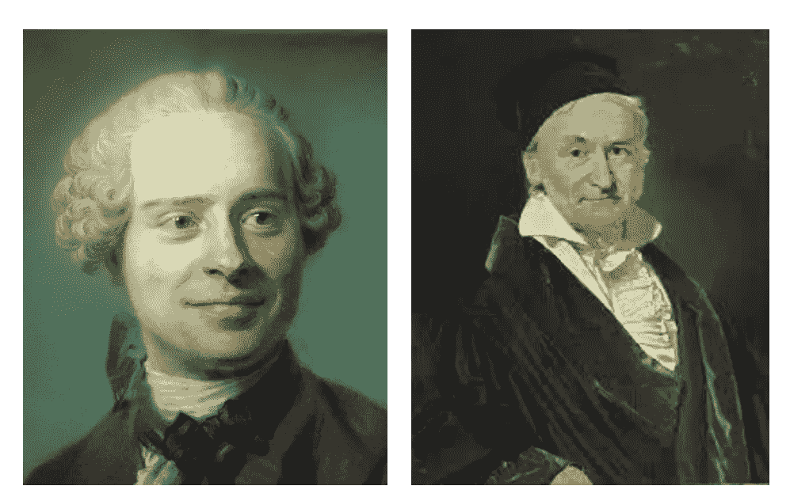

图 1:法国博学家让·勒朗德·达朗贝尔([来源](https://en.wikipedia.org/wiki/Jean_le_Rond_d%27Alembert))和德国著名数学家卡尔·弗里德里希·高斯([来源](https://en.wikipedia.org/wiki/Carl_Friedrich_Gauss))。

让我们先讨论一下证明中将要用到的一些相关概念。

## 复数

复数 *z* 是具有以下形式的数字:

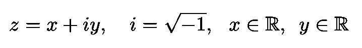

等式 1:复数的定义。

其中 *x* 和 *y* 都是实数(称为 *z* 的实数 Re( *z* 和虚数 Im( *z* )部分)，而 *i* 是虚数单位，这是对[二次方程](https://en.wikipedia.org/wiki/Quadratic_equation)的求解

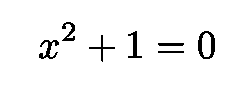

方程 2:虚数单位 I 是这个二次方程的解。

著名的 16 世纪意大利数学家[吉罗拉莫·卡尔达诺](https://en.wikipedia.org/wiki/Gerolamo_Cardano)(他还是一名医生、生物学家、物理学家、化学家、哲学家等等)在他对三次方程的根的研究中引入了复数。

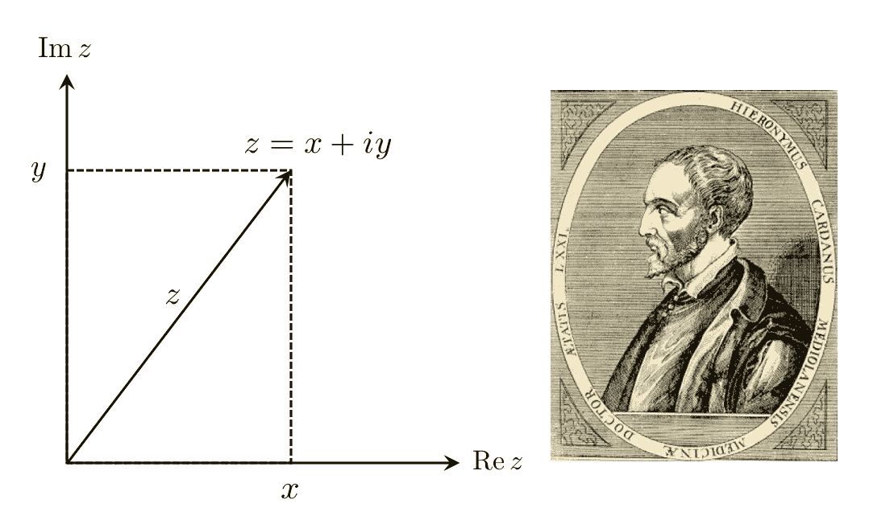

图 2:左图显示了一个复数的例子。右图显示的是吉罗拉莫·卡尔达诺，他被认为是他们的引荐人。

[复平面](https://en.wikipedia.org/wiki/Complex_plane)(或 Argand-Gauss 平面)允许我们以几何方式表示复数(见图 2)。横轴包含实数(用 Re ( *z* )表示)，纵轴包含虚数，(用 Im ( *z* )表示)。下图为复杂平面中的想象单元 *i* 。这个圆叫做[单位圆](https://en.wikipedia.org/wiki/Unit_circle)。

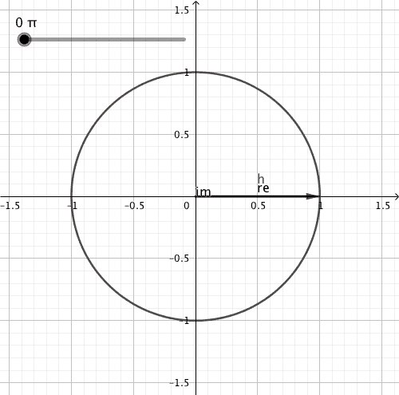

*图 3:复杂*平面内的单位圆([来源](https://en.wikipedia.org/wiki/Unit_circle))。

换句话说，使用复平面，我们可以从几何角度解释复数。例如，在加法下，它们表现为向量:

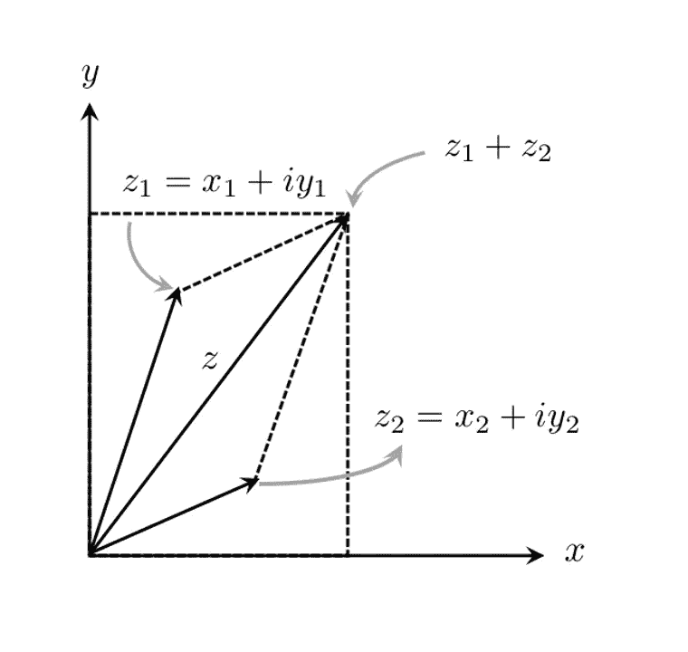

图。4:在加法下，复数表现为向量。

为了更好的表达复数的乘法运算，用极坐标( *r* ， *θ* )代替笛卡儿坐标( *x* ， *y* )来写更方便。下面的等式使这种说法更加清楚:

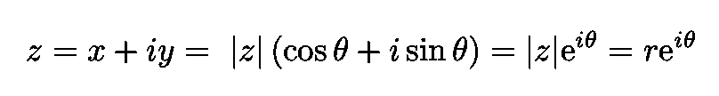

*等式 3:用极坐标(r，θ)表示的复数 z* 。

我们使用的地方:

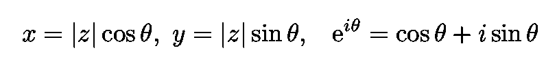

等式 4:等式中使用的定义。3.第三个是著名的 [*欧拉公式*](https://en.wikipedia.org/wiki/Euler%27s_formula) *其中有，作为特例。著名的* [欧拉恒等式](https://en.wikipedia.org/wiki/Euler%27s_identity)由此可见“显示了数学中最基本的数之间的深刻联系。”([来源](https://en.wikipedia.org/wiki/Euler%27s_identity))。

使用 Eq。3、我们可以把复数的乘法写成:

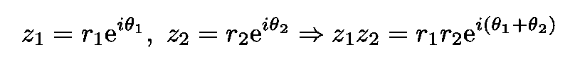

*方程 5:两个复数在极坐标(r，θ)下表示时的乘法运算*。

我们看到:

*   乘积 *z* ₁ *z* ₂的大小或绝对值等于其因子 *z* ₁和 *z* ₂的绝对值的乘积(分别为 *r* ₁和 *r* ₂)。
*   乘积 *z* ₁ *z* ₂的角度 *θ* 等于它们的角度之和 *θ* ₁和 *θ* ₂

象征性地，我们有:

*等式 6:上面用符号表示的两个观察值。*

## 多项式和根

根据维基百科，“……多项式 *f* 是由变量和系数组成的表达式，只涉及变量的加、减、乘和非负整数指数的运算。”如果 *f* ( *x* ) = 0，则数字 *x* 是多项式的[根。](https://mathworld.wolfram.com/PolynomialRoots.html)

图 5 示出了实数多项式方程的一个例子。

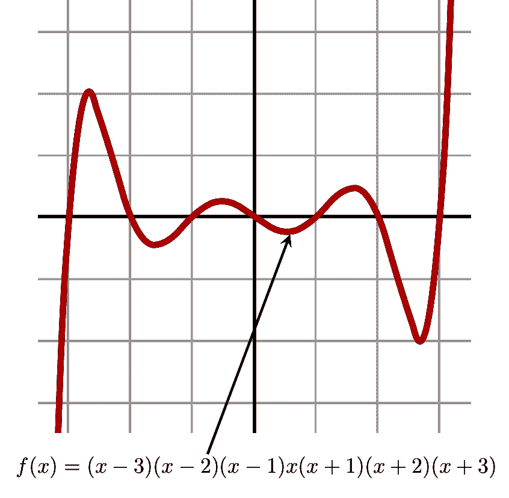

图 5:一个多项式的例子。

要绘制具有复变元的多项式的行为，我们会遇到一个问题:复数是 2D，因此定义在复数上的复值函数的图将是 4D。一个可能的解决方案(还有其他的)是用颜色来表示维度。这里的想法如下。参见图 6a。选择原点为黑色，然后我们绕着它逆时针旋转，穿过色轮的颜色(红色、黄色、绿色、青色、蓝色、品红色，然后回到红色)。当 *z* 接近原点时，指定的颜色 *z* 接近黑色。相比之下，as | *z* | → ∞时，其颜色接近白色。请注意，每个 *z* 都有不同的颜色，因此它的颜色唯一地指定了它。我们按照这个方案来画一个函数 *f* 的图: **C** → **C** 在图 6b 中:我们用与 *f* ( *z* 的值相关联的颜色来给每个点*z*∈】C 着色。因此，我们可以得到 *f* ( *z* )，对于任何 *z* ，通过确定点 *z* 的颜色，然后与图 6a 进行比较，以查看该颜色代表哪个复数。这个技术叫做[域着色](https://en.wikipedia.org/wiki/Domain_coloring)。

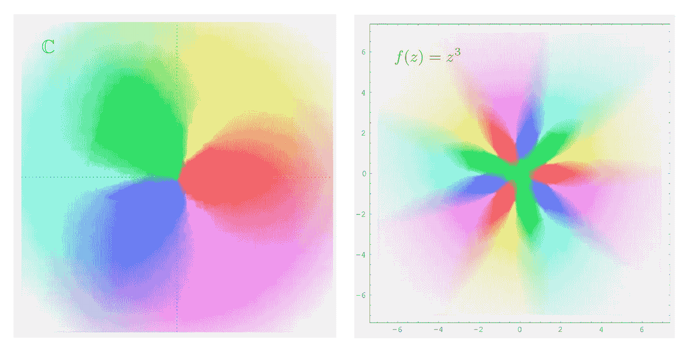

图 6a:复杂的平原(左)。图 6b(右):f(z)=z 的域着色([来源](https://sites.math.washington.edu/~morrow/336_20/fta.pdf))。

# 代数基本定理(FTA)

代数的[基本定理陈述了每一个多项式 *p* ( *z* )都有一个复根(换句话说，对于某个 *z* ，它服从等式 *p* ( *z* ) =0)。下面描述的证明是由数学家林赛·n·查尔兹提出的。它是基于瑞士业余数学家让-罗伯特·阿尔冈在他 1814 年出版的著作《新理论的反思》中给出的答案。](https://mathworld.wolfram.com/FundamentalTheoremofAlgebra.html)

图 7:业余数学家 Jean-Robert Argand ( [来源](https://prabook.com/web/jean-robert.argand/2202845))。

## 证据

更正式地说，目标是表明对于任何具有复系数的非常数多项式*p*(*z*)

*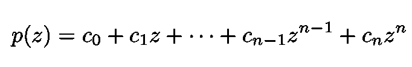*

*方程 7:一个复系数的非常数多项式*p*(*z*)*。**

**有一个复数 *c* ∈ **C** (其中 **C** 是复数的集合)使得 *p* ( *c* ) = 0，或者:**

**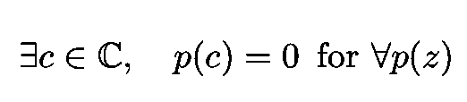**

**等式 8:对于任意多项式 p(z ),总有一个复数 c 使得 p(c)=0。**

**为了证明 FTA，我们需要下面的辅助结果:如果 *K* → **R** 是连续的，其中 *K* 是实坐标空间 **R** 的闭有界(紧)子集，那么 *f* (x，y)有一个最小和最大值(熟悉微积分的人会认为这是[极值定理](https://en.wikipedia.org/wiki/Extreme_value_theorem)的 2D 版本——更多细节可以在[中找到)](https://books.google.com.br/books?id=g0KHD7EIl4cC&printsec=frontcover&source=gbs_ge_summary_r&cad=0#v=onepage&q&f=false)**

**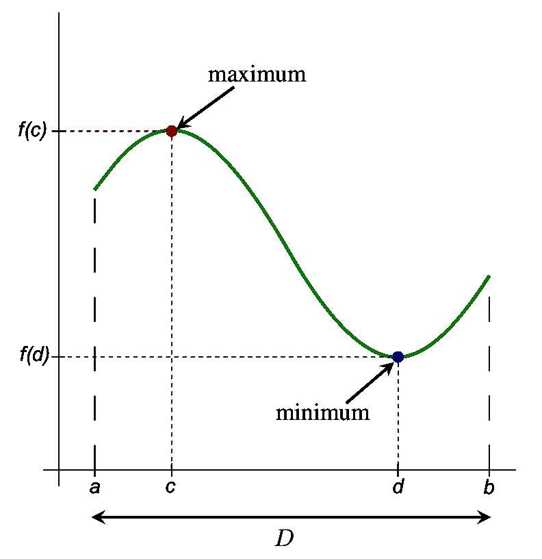**

**图 8:极值定理的 1D 版本。给出了定义在闭区间 D = [a，b]上的连续函数 f(x)的绝对最大值和最小值([来源](https://en.wikipedia.org/wiki/Extreme_value_theorem))。**

**事实上，FTA 依赖于两个更简单的引理，为了避免混乱，这两个引理将被省略(见 [Fine 和 Rosenberger](https://books.google.com.br/books?id=g0KHD7EIl4cC&printsec=frontcover&source=gbs_ge_summary_r&cad=0#v=onepage&q&f=false) )。**

**现在考虑一个由[紧凑集](https://en.wikipedia.org/wiki/Compact_space) *K* 定义的(见下图)**

**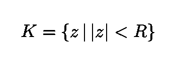**

**等式 9:具有最小值 c 的紧集 K。**

**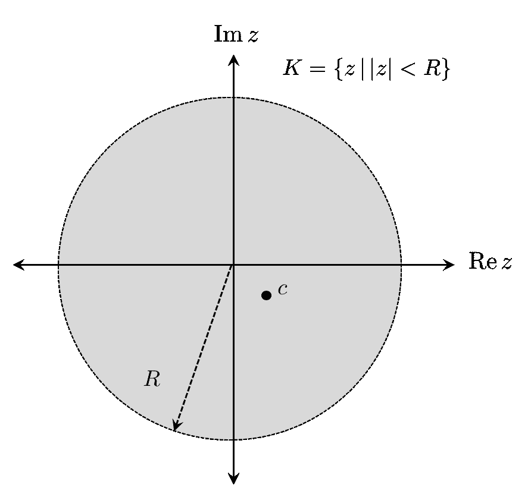**

**图 9:等式中定义的集合 K。9.**

**其中符号|…|代表复数的绝对值**

**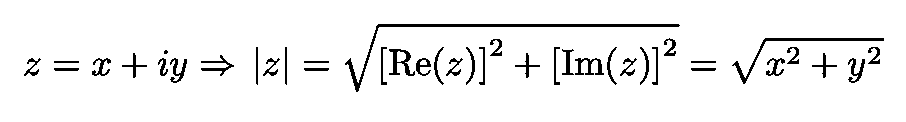**

**等式 10:复数 z 的绝对值的定义。**

**由于 *K* 是[紧凑型](https://en.wikipedia.org/wiki/Compact_space)，该功能**

**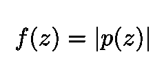**

**等式 11:由于 *K* 是紧凑的，该函数在 *K.* 内有最小值**

**具有最小值 c ∈ *K* (使用我们上面的辅助结果)。现在，如果 *R* 足够大(见下图)，我们有:**

**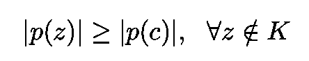**

**等式 12:如果 *R* 足够大，对于不在 k 中的任何 z，|p(z)|大于或等于|p(c)|**

**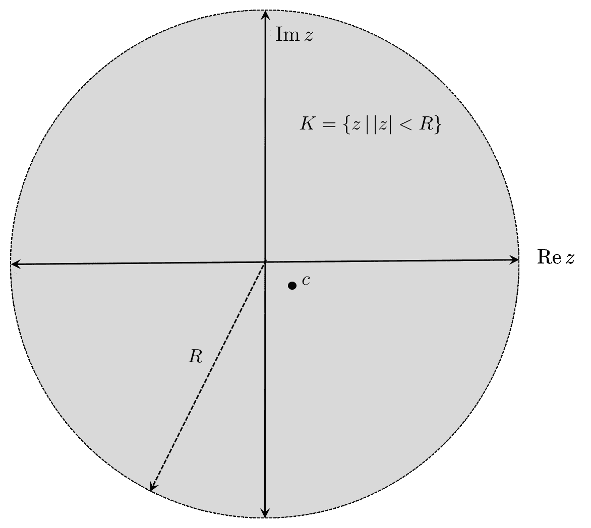**

**图 10:如果 *R* 足够大 Eq。13 是服从的。**

**现在，上述不等式等价于:**

****

**等式 13:如果 c 是 K 和等式的最小值。13 得到满足，我们得到这个不等式对所有复平面有效**。****

**注意，这个不等式在所有复平面 **C** 中都有效，而不仅仅是在某些圆盘内部。**

**策略的下一步是假设 *p* ( *c* ) ≠ 0，定义函数**

**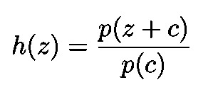**

**等式 14:h(z)的定义。**

**并证明存在一个复形 *u* 使得|*h*(*u*)|<1 对于某些 *u，*或等价地:**

****

**等式 15:这个条件与等式相矛盾。12 和 Eq。13.**

**与情商相矛盾。12 和 Eq。13.函数 *h* 具有以下形式:**

**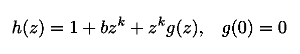**

**等式 16:来自等式的 h(z)的形式。其中 g(z)是一个多项式。**

**其中 *g* ( *z* )是连续多项式。然后我们**定义** *d* 使得**

**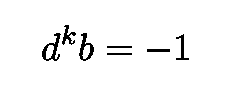**

**等式 17:参数 d 的选择。**

**然后我们把一些 *t* ∈ (0，1)写成 *h* ( *td* )。我们获得:**

**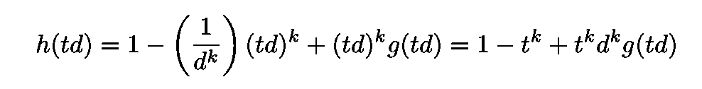**

**等式 18:对于 *t* ∈ (0，1】，自变量为 z=td 的函数 h(z)。**

**[三角形不等式](https://en.wikipedia.org/wiki/Triangle_inequality)告诉我们:**

**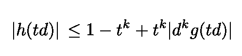**

**方程式 19:三角形不等式在方程式中的应用。18.**

**对于足够小的 *t* 和自多项式 *g* 是连续我们得出:**

**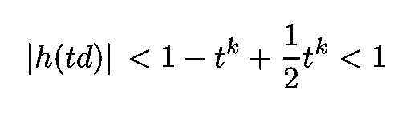**

**方程式 20:方程式 20 的结果。对于足够小的 t 为 19。**

**这个结果与我们的假设相矛盾。12 和 13。证明到此结束。**

**感谢您的阅读，再见！一如既往，我们随时欢迎建设性的批评和反馈！**

**我的 Github 和个人网站 [www.marcotavora.me](http://www.marcotavora.me/) 有一些关于数学和其他主题的有趣材料，如物理、机器学习、深度学习和金融！**