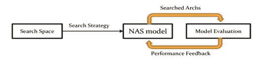
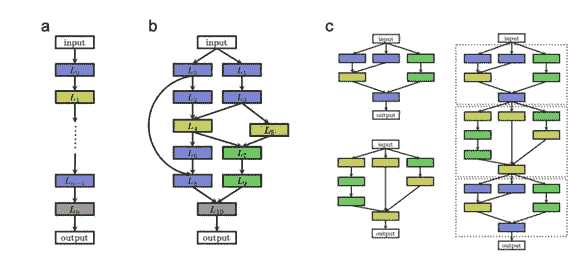
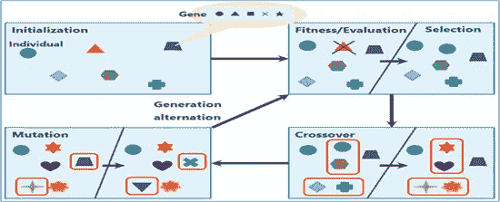
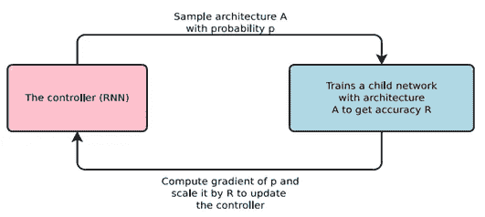

# 神经结构搜索(NAS)的基础

> 原文：<https://pub.towardsai.net/the-fundamentals-of-neural-architecture-search-nas-9bb25c0b75e2?source=collection_archive---------1----------------------->

## [机器学习](https://towardsai.net/p/category/machine-learning)

神经结构搜索(NAS)已经成为机器学习科学领域的一个热门课题。Google 的 AutoML 等商业服务和 Auto-Keras 等开源库[1]使 NAS 可以访问更广泛的机器学习环境。在这篇博文中，我们探讨了 NAS 的思想和方法，以帮助读者更好地理解这个领域，并找到实时应用的可能性。

## **什么是神经架构搜索(NAS)？**

现代深度神经网络有时包含几层众多的类型[2]。跳过连接[2]和子模块[3]也被用于促进模型收敛。可能的模型架构的空间没有限制。大多数深度神经网络结构目前都是基于人类经验创建的，需要漫长而繁琐的试错过程。NAS 试图在没有人工干预的情况下，检测特定深度学习问题的有效架构。

一般来说，NAS 可以分为三个维度——搜索空间、 *a* 搜索策略、*和* *a* 性能评估策略*【4】。*

**

*图 1:神经结构搜索的基础*

## ***搜索空间:***

*搜索空间决定了要评估哪些神经架构。更好的搜索空间可以降低搜索合适的神经架构的复杂性。通常，不仅需要受限的搜索空间，还需要灵活的搜索空间。约束消除了非直觉的神经架构，以创建一个有限的搜索空间。搜索空间包含源于 NAS 方法的每一种体系结构设计(通常是无限的)。它可能涉及所有相互堆叠的层配置集合(图 2a)，或者包括跳跃连接的更复杂的架构(图 2b)。为了降低搜索空间维度，还可能涉及子模块设计。后面的子模块被堆叠在一起以生成模型架构(图 2c)。*

**

*图 2:不同建筑空间的示意图。图片摘自[4]*

## ***性能评估策略:***

*它将提供一个反映搜索空间中所有架构效率的数字。当参考数据集在预定义数量的时期内被训练并随后被测试时，这通常是模型架构的准确性。性能评估技术还可以经常考虑一些因素，例如训练或推断的计算难度。在任何情况下，评估架构的性能在计算上都是很昂贵的。*

## ***搜索策略:***

*NAS 实际上依赖于搜索策略。它应该确定有前途的架构来评估性能，并避免测试糟糕的架构。在下面的文章中，我们讨论了许多搜索策略，包括随机和网格搜索、基于梯度的策略、进化算法和强化学习策略。*

*系统搜索之后是网格搜索。相比之下，随机搜索从搜索空间中随机选取架构，然后通过性能评估策略测试相应架构的准确性。这两种方法对于最小搜索区域都是可行的，尤其是当手头的问题涉及到少量超参数的调整时(随机搜索通常优于网格搜索)。*

*作为一个优化问题，NAS 可以通过基于梯度的搜索很容易地公式化[5]。通常，NAS 优化的目标是最大限度地提高验证准确性。由于 NAS 使用离散搜索空间，因此实现梯度很有挑战性。因此，它需要将一个离散的建筑空间转化为一个连续的空间，并从其连续的表现中衍生出建筑。NAS 可以基于变换的连续空间从优化目标获得梯度。NAS 上梯度搜索的理论基础是不寻常的。也很难证明全局最优收敛。然而，这种方法在实际应用中表现出很好的搜索效果。*

*进化算法受生物进化的启发。模型架构适用于能够产生后代(其他架构)或死亡并被排除在群体之外的个体。一种进化的 NAS 算法(NASNet 架构[6])通过以下过程衍生而来(图 3)。*

*I .随机架构创建 N 个模型的初始群体。根据绩效评估策略评估每个人的产出(即架构)。*

*二。表现最好的个体被选为父母。可以为具有诱导“突变”的新一代架构复制各自的亲本，或者它们可以来自亲本组合。表现评估策略评估后代的表现。类似于添加或移除层、添加或移除连接、改变层大小或另一超参数的操作可以包括在可能的突变列表中。*

*三。选择 n 个架构来移除，这可能是群体中最差的个体或较老的个体。后代替代被移除的架构并重新开始循环。*

**

*图 NAS 的进化算法示意图*

*进化算法揭示了有能力的结果，并产生了最先进的模型[7]。*

*基于强化学习的 NAS 方法[8]近年来越来越受欢迎。网络控制器，通常是递归神经网络(RNN ),可以用于从具有特定概率分布的搜索域中进行采样。使用性能评估策略来形成和评估样本架构。由此产生的性能被用作更新控制器网络属性的奖励(图 4)。在超时或收敛发生之前，重复这个循环。*

**

*图 NAS 的强化学习方法的基本设计。图片摘自[8]*

*强化学习能够基于流行的基准数据集构建超越手工模型的网络架构，类似于进化算法。*

***结论:***

*NAS 已经成功地建立了更深层次的神经网络体系结构，其精确度超过了手动构建的体系结构。NAS 生成的最先进的体系结构是使用进化算法和强化学习开发的，特别是在图像分类任务领域。它很昂贵，因为在 NAS 产生成功的结果之前，需要训练和测试数百或数千个特定的深度神经网络。NAS 方法对于大多数实际的应用程序来说过于昂贵。因此，需要进一步研究以使 NAS 更通用。*

*跟随作者[这里](https://www.linkedin.com/in/arjun-ghosh-2005321a5)。*

## ***参考文献:***

*[1] H. Jin，Q. Song 和 X. Hu，Auto-Keras:基于网络态射的高效神经结构搜索，arXiv，2018 .*

*[2]何国光，张，任，孙，深度残差学习在图像识别中的应用，arXiv，2015 .*

*[3] C. Szegedy 等人，深入研究卷积，arXiv，2014 年。*

*[4] T. Elsken，J.H. Metzen 和 F. Hutter，神经架构搜索:一项调查，机器学习研究杂志，2019 年。*

*[5] H. Liu，K. Simonyan 和 Y. Yang，DARTS:可区分的架构搜索，arXiv，2019。*

*[6] B. Zoph，V. Vasudevan，J. Shlens 和 Q.V. Le，可扩展图像识别的学习可转移架构，计算机视觉和模式识别会议论文集，2018 年。*

*[7] E. Real 等，图像分类器的大规模进化，第 34 届机器学习国际会议论文集，2017。*

*[8] B. Zoph 和 Q.V. Le，具有强化学习的神经架构搜索，arXiv 2016。*