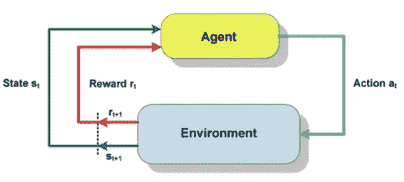
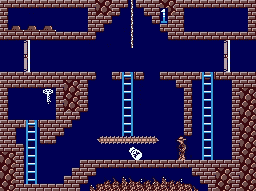

# 强化学习的基础

> 原文：<https://pub.towardsai.net/the-fundamentals-of-reinforcement-learning-127ec11b4b2f?source=collection_archive---------1----------------------->

## [机器学习](https://towardsai.net/p/category/machine-learning)

> 操作性条件反射是一种通过对行为的奖励和惩罚而产生的学习方法。通过操作性条件反射，个体在特定行为和结果之间建立了联系(Skinner，1938)。

如果人是按照上帝的形象造的，那么机器人当然也是按照人的形象造的。我们对我们如何思考、如何学习，甚至我们大脑中神经元网络如何相互交流的见解导致了人工智能、机器学习和深度学习的发展，这些都是数据科学的基石。

今天，[机器人能做的](https://www.businessinsider.com/10-robots-everyday-life-easier-suitcase-roomba-laundry-chef-2017-12)比以往任何时候都多。现在有一种手提箱机器人会跟踪你手机的地理位置， [Travelmate](https://travelmaterobotics.com/) 。莫利机器人公司创造了一个机器人厨师。烧烤机器人[和香肠机器人](https://grillbots.com/)[是为你的烧烤聚会设计的。](https://www.foodandwine.com/fwx/tech/german-bratwurst-bot-may-be-future-your-sausage-eating) [Kobi](https://thekobi.com/) 可以照顾你的院子， [WinBot](https://www.ecovacs.com/us/winbot-window-cleaning-robot) 会帮你洗窗户。

所有这些机器人都被编程来完成相当简单的重复性任务，这是它们能力的极限。他们在新环境中适应和提高表现的能力受到严重限制。他们学不会。问题是，预测机器人的每一个潜在需求，并对它们的每一个可能的动作进行编程是不可行的。给机器人编程学习效率更高，但为了学习，必须给它编程感知。机器人无法看到或听到，重建这些感官可能很困难。机器将世界视为一系列 0 和 1，如果有任何新的东西进入它们的视野，或者太多的东西同时发生变化，计算这些变化的能力就会受到影响。跟上输入所需的时间呈指数增长。

机器人的发展潜力不是硬件问题，而是软件问题。波士顿动力公司在赋予机器人运动技能方面取得了巨大进步。

[达芬奇系统](https://www.davincisurgery.com/)已经开发出用于医疗程序的机器人。他们在一颗葡萄上做了手术。

机器学习(ML)正在为机器人变得多功能和更有用打开大门。ML 没有创造能够执行逻辑和复杂计算的机器，而是专注于开发计算机在没有恒定明确方向的情况下学习和执行的能力。ML 允许计算机自主地从数据中学习，并独立地改变它们自己的算法。

我在大学期间学的是心理学，所以当谈到强化学习时，我必须参考 BF Skinner。BF 斯金纳在他的学习理论中定义了操作性条件作用的概念。基本上，如果你想增加特定行为的可能性，就必须有一个一致且及时的奖励系统。积极的强化会增加有针对性的行动，这就是我们如何塑造行为。

强化学习已经被用于教授计算机语音识别和手写识别。计算机首先被输入带有正负标签的数据。这是字母 A 吗？实现了奖惩系统，因此程序可以从错误中学习。一旦计算机能够区分“A”和“非 A ”,训练阶段就完成了，并用新数据对计算机进行测试。通过深度学习，强化学习已经让计算机[掌握了](https://blog.insightdatascience.com/reinforcement-learning-from-scratch-819b65f074d8)雅达利游戏、 [Dota2](http://blog.dota2.com/?l=english) 和中国棋盘游戏围棋。你可以在 Youtube 和网飞的纪录片 [AlphaGo](https://www.youtube.com/watch?v=jGyCsVhtW0M) 中看到人类一再输给机器学习。由于强化学习，在网飞或亚马逊上创建个性化的推荐列表成为可能。

虽然强化学习允许人工智能的巨大发展，但它也不是没有缺点。

# 样本效率

蒙特祖马的复仇

样本效率描述了人类学习和计算机学习之间的巨大差异。一个人可以看一个简单的视频游戏挑战，并找出你应该避免什么对象和游戏的目标是什么。机器人需要更长的时间才能理解。一个现代的强化学习算法需要大约[400 万帧](https://www.youtube.com/watch?v=Ol0-c9OE3VQ)才能成功且持续地解决像蒙特祖马的复仇这样的关卡。如果引擎以每秒 30 帧的速度运行，人类时间中的 400 万帧相当于 37 小时的不间断游戏。这大约比人类慢 2000 倍。

前科被删除

有前科

[柏克莱大学的研究人员认为](https://openreview.net/pdf?id=Hk91SGWR-)人类拥有优势是因为先前的物体知识。我们知道梯子、门和钥匙的形状，我们知道我们应该避免火和愤怒的头骨，因为那意味着危险。伯克利的研究人员创造了同一个视频游戏的不同版本。一个版本具有对象先验，而另一个版本单独移除了这些先验。在一个目标先验完整的常规设计的视频游戏中，人类能够在 1.8 分钟内完成一个关卡，在达到目标之前平均有 3.3 人死亡。移除所有对象先验的关卡实际上相当具有挑战性，但这就是我们如何想象扮演计算机。你可以亲自尝试一下[这里](https://rach0012.github.io/humanRL_website/)。事实上，当所有的先验都被移除时，人类的水平学习曲线急剧增加，但是计算机不需要任何额外的时间来持续解决水平。通过消除所有这些物体的先验，人类在这场游戏中的表现增加到 20 分钟，平均死亡人数增加到 40 人。

# 信用分配问题

机器学习和强化学习并不是什么新想法。明斯基在他 1961 年的创新论文中谈到了这些话题。在这篇论文中，明斯基讨论了许多超越他的时代的概念，包括学分分配问题。学分分配包括哪种行为应该得到奖励，哪种行为应该受到惩罚。

时间信用分配是强化学习的一个大问题，如果得到解决，可能会减少计算机“学习”视频游戏所需的时间。如果电脑打乒乓球打得很好，来回打一会儿球。计算机自始至终都在做出聪明而快速的动作，但最终，它们差一点就没击中球，结果输了。尽管在这一轮中表现强劲，但被编程进行强化学习的计算机在未来不太可能使用这些移动序列，因为它会将它与失败联系在一起。计算机无法确定损失之前的哪几次移动实际上导致了负面结果，所以它的良好性能被抛弃了。这个问题[在强化学习社区](https://www.quora.com/What-are-some-approaches-to-dealing-with-the-credit-assignment-problem-in-reinforcement-Learning)受到了最多的关注。

结构性信用分配包括概括哪一系列的行动会导致相同的结果。转移信用分配概括了哪一系列的动作可以成功地应用于不同的任务。大图模式识别对这项技能至关重要。量化和解决强化学习中的这些差异将极大地减少计算机和人类之间学习时间的差异。

# 多臂土匪

多臂土匪问题是强化学习中的经典问题。有一组固定的有限的资源，这些资源必须在一组竞争的选择之间分配，以便最大化报酬或最大化收益。每个选项的属性在试验开始时是隐藏的。关于每个选择的信息会随着时间的推移或通过向该选择分配资源而显示出来。这是一个探索与开发的两难境地。解决这个问题的唯一真正方法是通过试错探索。

这个问题通常被概念化为 10 个不同的老虎机。吃角子老虎机要么付款，要么不付款，但有些机器比其他机器更经常付款。目标是找到胜率最高的机器。

[这个问题的一个解决方案](https://towardsdatascience.com/solving-the-multi-armed-bandit-problem-b72de40db97c)涉及分配 10%的资源用于勘探，其余的资源专用于开发被认为具有最高回报率的机器。

# 应用程序

强化学习的应用并不缺乏。它可以在视频游戏中表现出色，也可以用于[能耗优化](https://www.sciencedirect.com/science/article/pii/S0306261918304422)。有一个网站展示了使用强化学习的不同 AI 算法。点击这里查看[！](https://gym.openai.com/envs/CartPole-v1/)谷歌的 DeepMind 让一台电脑自学了如何走路。

如果一个机器人能教自己[如何翻煎饼](https://www.popsci.com/technology/article/2010-07/after-50-attempts-hard-working-flapjack-bot-learns-flip-pancakes-video)，我完全同意。

机器学习是数据科学和机器人技术的交汇点，它们都有共生关系。教计算机如何像我们一样学习是下一个需要跨越的大障碍。