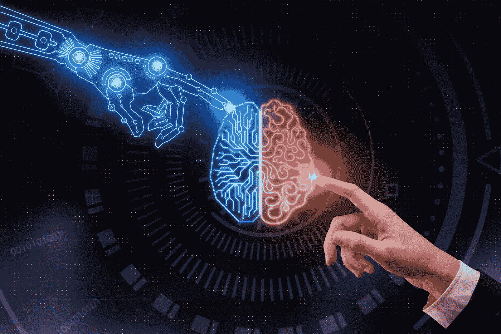
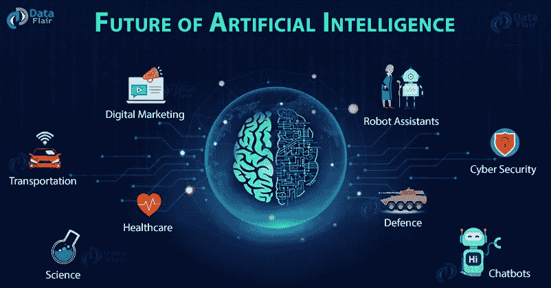

# 未来:人工智能

> 原文：<https://pub.towardsai.net/the-future-artificial-intelligence-cb26715e4c9a?source=collection_archive---------1----------------------->

## [未来](https://towardsai.net/p/category/future)

## 从汽车到医疗保健的新兴技术

由[马库斯·温克勒](https://unsplash.com/@markuswinkler?utm_source=medium&utm_medium=referral)在 [Unsplash](https://unsplash.com?utm_source=medium&utm_medium=referral) 上拍摄

## 介绍

人工智能是业内讨论的热门话题之一，多年来它改变了技术的面貌。从汽车到医疗保健，人工智能在我们的日常生活中发挥了巨大的作用。我们都知道人工智能的发明让我们的生活变得更好，但我们不知道如何去做。

如今，人们一直在为这一领域做出贡献，以至于将他们的职业道路转移到人工智能或与人工智能相关的行业已经成为一种持续的趋势。

所以出现了很多问题，比如，什么是人工智能？还是为什么 AI？

在我们跳入未来 AI 的好处和影响之前，让我们先来看看什么是 AI？

照片由[附身摄影](https://unsplash.com/@possessedphotography?utm_source=medium&utm_medium=referral)在 [Unsplash](https://unsplash.com?utm_source=medium&utm_medium=referral) 上拍摄

## **人工智能:**

人工智能是每个行业和部门的未来。它在大数据、机器人和物联网等许多新兴技术中发挥了重要作用。

人工智能(AI)是指对机器进行训练和编程，使它们能够像人类一样思考和模仿自己的行为。它是机器学习和深度学习的结合。

人工智能的第一个概念是在 1948 年由著名数学家艾伦·图灵提出的，他是人工智能的创始人之一。他改变了未来，在未来，许多领域已经取得了突破；像医药、汽车、营销、机器人等等更多与人工智能相关的东西。

人工智能是两个子领域的结合:机器学习和深度学习

1.  **机器学习:**

机器学习是人工智能的一个子领域，它使用几种算法来训练计算机像人类一样学习和行为。目标是最终让这些机器在没有明确编程的情况下自己思考和决策。它主要致力于开发访问数据和自主学习的程序。

**2。深度学习:**

深度学习(DL)是 ML 的一个子领域，它模仿人脑处理数据和创建模式以做出决策的工作。DL 用于解决复杂的问题，这些问题需要对大量相关变量之间的关系有复杂而深刻的理解。

## **ML&DL 用在哪里？**

图片[来源](https://www.digitaldealer.com/dealer-ops-leadership/ai-hi-intelligence/)

有很多机器学习和深度学习的真实例子。一个这样的例子是图像分类。由于许多开源库的可用性，现在图像分类已经变得非常容易。一个这样的库是 Keras，这是一个开源 API，它使神经网络的训练变得简单、快速和灵活。该模型需要一些后端计算，使用 Keras 无法执行这些计算。这就是 TensorFlow 发挥作用完成大型数值计算的地方。因此，Keras 已经成为 TensorFlow 核心库的一部分。

使用人工神经网络可以更精确地进行图像分类。人工神经网络属于深度学习，其中使用卷积神经网络(CNN)进行图像分类更加准确。CNN 在这个领域取得了突破。它通过检测可能的类的不同抽象层次来学习。这意味着神经网络由许多隐藏层组成。第一层可能只包含图像的抽象，如边的数量和一般模式。随着我们进一步深入这些隐藏层，这些特征变得越来越具体，它们可以识别颜色、纹理和粗糙的图案。

这些模型涉及医疗保健、机器人、交通控制、安全等领域。还有数百个其他项目，如语音识别、自动驾驶汽车、在线欺诈检测等。对这一领域做出了贡献。

## **当前人工智能应用:**

1.  **娱乐:**

像网飞、亚马逊等娱乐应用。，基于 AI 的作品。在 ML 算法的帮助下，应用程序根据我们的反馈为我们提供节目/电影的建议。该算法被设计成能够学习电影、节目和流派的类型。在此基础上，它推荐了一些用户可能感兴趣的节目和电影。在 ML 算法的帮助下，它根据我们的兴趣提供建议。

1.  **教育**:

在教育行业，人工智能中的技术被用于:

**a .教具**:帮助老师阅卷，减少工作量。

**b .个性化学习**:根据每个学生的优缺点，为其提供定制化的学习体验。

**2。医疗保健:**

医疗保健中的人工智能在诊断慢性疾病方面发挥了巨大作用，使用计算机断层扫描和磁共振成像(MRI)来执行复杂的外科手术和治疗等。，使用医学数据。

例如:脊柱矫正和心脏手术。

## 艾&新冠肺炎:

正如我们所知，自 2020 年以来，世界各地的人们一直是一种致命疫情的奴隶——SARS-Cov-2，也被称为新冠肺炎。这是一种变异病毒，这使得发现疫苗更加困难。AI 扮演了许多突出的角色，让我们明白了技术的重要性。

在许多医院，消毒机器人被引入前台来检测病人的流感/发烧，如果病人的体温稍高，就会发出警报。这些机器人还为来医院的人提供口罩和消毒手。该项目的目标是减少通过人类接触传播的病毒。

人工智能还被用来:

1.  为这种致命疾病提供早期诊断。
2.  从地理位置、可用资源等方面预测和跟踪 covid 案例的增加或减少数量。
3.  追踪人的接触者，以确定受疾病影响的人数，以便对他们进行隔离，监测这些患者的状况，并提供相应的治疗。
4.  这种致命变异病毒疫苗的发现。
5.  控制社交媒体中错误信息的传播，以减少人们的恐慌。

## **AI 未来如何受益:**

图片[来源](https://data-flair.training/blogs/future-of-ai/)

人工智能正在成为所有领域的必需品，而不仅仅是在科技领域。超过一半的商业部门已经应用人工智能驱动的技术来实现更高的生产力。

根据研究报告，在未来，人工智能可能会在以下领域产生巨大影响:

**1。** **汽车:**

一段时间以来，人工智能一直专注于完善自动驾驶汽车。通过实现这项技术，汽车上的传感器将检测到任何障碍，使乘客的旅程安全，因此事故数量将大大减少。

**2。医疗:**

在医疗保健领域，人工智能可以提供快速准确的诊断，并提出治疗计划。它还可以加快药物发现的进程。研究称，有一天人工智能的目标是将机器人护士带到医院来协助护士，监控病人，并在医院有更多病人时减轻负担。

**3。网络安全:**

这是一个日益严重的问题，因为疫情已经成为许多人在家工作的奢侈品。正因如此，数据安全没有保障，系统很容易通过用户的网络被黑客入侵。

这些只是未来可能出现的一些例子。即使有所有这些好处，科学家们认为人工智能也可能对我们构成威胁，这让我们产生了一个问题:

## **AI 的进化会对人类构成威胁吗？**

除了许多科幻电影显示机器人的超越毁灭了世界，许多人工智能的领军人物经常描述这种噩梦般的场景实际上可能是正确的。相信这种说法的一些主要人物包括已故科学家斯蒂芬·霍金、商业巨头埃隆·马斯克等。即使这类事件有可能发生，其结果也仅仅反映了我们如何利用这项技术。

技术已经非常复杂，并将继续复杂。但是每天都有很多 AI 领域的发展来过更好的生活。人工智能有好的一面也有不好的一面。它要么导致人类历史上最大的错误之一，导致全球灭绝，要么成为人类最伟大的技术发明之一，为我们所有的问题提供解决方案。

我们希望有一天穷人变富，富人变富，每个人都能实现自己的梦想，这只是时间问题。

## **结论**

技术已经非常复杂，并将继续复杂。但是每天都有很多 AI 领域的发展来过更好的生活。人工智能有好的一面也有不好的一面。它要么导致人类历史上最大的错误之一，导致全球灭绝，要么成为人类最伟大的技术发明之一，为我们所有的问题提供解决方案。

人们希望有一天穷人富起来，富人富起来，每个人都能实现自己的梦想，这只是时间问题。

我希望你喜欢这篇文章。通过我的 [LinkedIn](https://www.linkedin.com/in/data-scientist-95040a1ab/) 和 [twitter](https://twitter.com/amitprius) 联系我。

# 推荐文章

[1。NLP —零到英雄与 Python](https://medium.com/towards-artificial-intelligence/nlp-zero-to-hero-with-python-2df6fcebff6e?sk=2231d868766e96b13d1e9d7db6064df1)
2。 [Python 数据结构数据类型和对象](https://medium.com/towards-artificial-intelligence/python-data-structures-data-types-and-objects-244d0a86c3cf?sk=42f4b462499f3fc3a160b21e2c94dba6)3 .[Python 中的异常处理概念](/exception-handling-concepts-in-python-4d5116decac3?source=friends_link&sk=a0ed49d9fdeaa67925eac34ecb55ea30)
4。[为什么 LSTM 在深度学习方面比 RNN 更有用？](/deep-learning-88e218b74a14?source=friends_link&sk=540bf9088d31859d50dbddab7524ba35)
5。[神经网络:递归神经网络的兴起](/neural-networks-the-rise-of-recurrent-neural-networks-df740252da88?source=friends_link&sk=6844935e3de14e478ce00f0b22e419eb)
6。[用 Python](https://medium.com/towards-artificial-intelligence/fully-explained-linear-regression-with-python-fe2b313f32f3?source=friends_link&sk=53c91a2a51347ec2d93f8222c0e06402)
7 全面讲解了线性回归。[用 Python](https://medium.com/towards-artificial-intelligence/fully-explained-logistic-regression-with-python-f4a16413ddcd?source=friends_link&sk=528181f15a44e48ea38fdd9579241a78)
充分解释了 Logistic 回归 8。[concat()、merge()和 join()与 Python](/differences-between-concat-merge-and-join-with-python-1a6541abc08d?source=friends_link&sk=3b37b694fb90db16275059ea752fc16a)
的区别 9。[与 Python 的数据角力—第一部分](/data-wrangling-with-python-part-1-969e3cc81d69?source=friends_link&sk=9c3649cf20f31a5c9ead51c50c89ba0b)
10。[机器学习中的混淆矩阵](https://medium.com/analytics-vidhya/confusion-matrix-in-machine-learning-91b6e2b3f9af?source=friends_link&sk=11c6531da0bab7b504d518d02746d4cc)