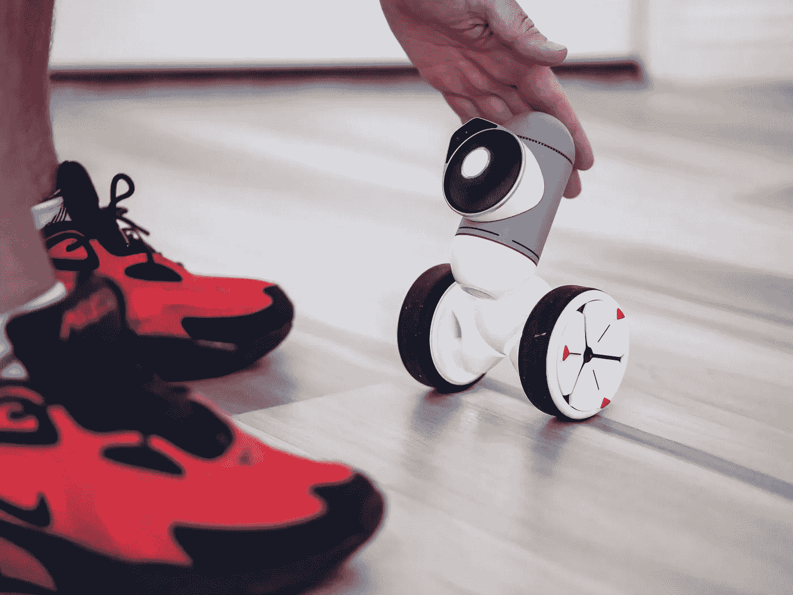
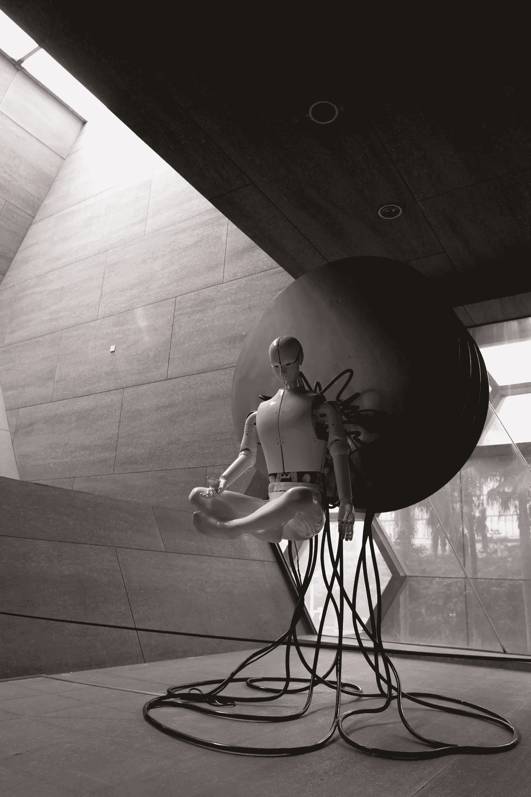

# 人工智能的未来是量子计算:10 个最重要的用例

> 原文：<https://pub.towardsai.net/the-future-of-ai-is-quantum-computing-10-of-the-most-important-use-cases-3a4b50c58f3e?source=collection_archive---------2----------------------->

## 人工智能和量子计算交叉的全面而简略的解释(用例和挑战)

来自 Pexels 的 Erik Mclean

量子计算仍处于早期阶段[13]，可能在几个方面影响人工智能。首先，量子计算机可以比经典计算机更快地执行某些操作[14]，从而可能更快地做出决策(例如，通知超高速参数用例)。此外，由于量子计算机可以存储和处理比经典计算机更多的数据，这种更深入的影响可以让人工智能系统获得更多信息，从而使它们能够更有效地从洞察力中学习。

# **量子计算**

量子计算是指使用量子比特而不是经典比特来处理计算[8]，与使用传统计算机相比，能够实现更快、更强大的输出计算潜力。本质上，量子计算是一种利用被称为‘量子比特’(qubit)的微小粒子进行计算的方式[3]；机会是比传统的计算方法更快地解决问题，因为现在有能力同时探索许多不同的解决方案。

从更专业的角度来说，量子计算机使用量子力学现象，如叠加和纠缠[1]，对数据进行操作。量子计算机对量子比特进行操作，量子比特是量子信息的单位。

来自 Pexels 的[塔拉·温斯泰德](https://www.pexels.com/@tara-winstead/)

# **量子计算如何积极影响人工智能**

1.量子计算机可以比传统计算机更快地处理大量数据，有效地帮助那些人工智能系统更快地学习，并实现更高的准确性。量子纠缠的使用可以实现更高效、更强大的算法，利用不同变量之间的相关性。

2.量子计算机可以处理传统计算机难以处理的复杂优化问题，使 AI 算法更加高效。因此，量子计算可以提供一种方式来创造不受经典物理定律限制的人工智能，使其可能比今天存在的任何人工智能都更强大和智能。

3.量子计算可以帮助探索某个问题的可能解决方案(称为搜索空间[2])，这对于规划和调度中的许多人工智能应用来说是必不可少的。此外，量子计算[3][4]的无噪声性允许创建更精确的模型，因为噪声经常会导致预测误差。

4.量子计算机可以执行传统计算机可能无法解决的某些类型的计算(如涉及量子效应的计算[5])，从而产生了新的人工智能算法。

来自 unsplash 的 PIOTR BENE

5.量子计算机可以帮助验证人工智能算法的结果，确保它们正确无误。使用量子退火[6]可以解决用经典方法难以或不可能解决的问题。

6.量子计算机可以为训练人工智能系统创建强大的模拟环境，使它们能够更快地学习，并为现实世界的场景做好更好的准备。例如，量子计算机比经典神经网络更不容易遭受灾难性遗忘[7][8]。这意味着他们可以在不忘记如何完成旧任务的情况下学习新任务，这使他们在终身学习中表现得更好。

7.量子计算机可以帮助保护人工智能系统在黑客和其他形式的网络犯罪背景下使用的敏感数据。此外，对于反攻部署来说，并行处理已经成熟。因为量子计算机可以同时处于多种状态，而不像经典计算机那样处于单一状态，所以可能会发现更有效的算法(跨越量子计算所包含的并行处理计算能力)。

8.量子计算机可以用来开发新的人工智能架构，比现有的架构更加高效和可扩展。

9.量子计算机可以用来创造强大的人工智能助手，大大提高我们的生产力和效率。

10.通过提供前所未有的处理能力和速度，量子计算机将在人工智能的进步中发挥关键作用，帮助它达到新的智能和能力水平。

来自 Pexels 的[埃里克·麦克林](https://www.pexels.com/@introspectivedsgn/)

# **量子计算和人工智能的 10 个用例**

1.机器学习:为机器学习开发新的算法，使人工智能模型的训练更加有效和高效。叠加和纠缠将贯穿人工智能用例的集成。

2.数据分析:帮助更快、更有效地分析大型数据集，从而获得更好的洞察力和决策。

3.优化:解决复杂的优化问题可以提高运营和流程的效率。这个空间又深又宽，跨越了寻找全局最小值或最大值[9]。

4.采样:从概率分布中生成样本，这对强化学习等许多 AI 应用都有帮助。

5.推理:在概率图形模型中执行推理，导致更准确的预测。

6.模式识别:识别可以提高分类和预测准确性的数据模式。

7.降维:降低数据的维度，使其更容易处理和理解。

来自 Pexels 的[金德媒体](https://www.pexels.com/@kindelmedia/)

8.特征工程:从数据中创建新的特征，这可以提高机器学习模型的性能。

9.神经网络:更快更有效地训练神经网络，从而获得更好的结果。

10.强化学习:加速强化学习代理的训练过程[10]，从而产生更好的性能。

## 可以通过量子计算加强的人工智能改进的简要总结:

—更快地处理大量数据。

—处理比经典计算机更复杂的算法。

—比传统计算机更高效地发现数据中的模式。

—解决经典计算机无法解决的问题。

—比传统计算机更快地学习新任务。

—更高效地处理大规模优化问题。

—基于数据做出更好的预测。

—比传统计算机更有效地识别因果关系。

由[许](https://unsplash.com/@mrsunburnt)从 Unsplash

# **量子计算的挑战**

量子退相干[11]是量子计算中的一个挑战，因为它会导致信息丢失。当一个量子比特和其他量子比特被放入一个环境中，它们可以相互作用并纠缠在一起；这种纠缠会导致退相干，即量子比特失去量子态，成为经典比特。有很多方法可以减少退相干的影响，但它仍然是量子计算中的一个主要挑战。

## 另外:

—扩展:随着量子比特被添加到量子计算机中，所需操作的数量和整个设备的复杂性呈指数级增长，这给可扩展性带来了重大挑战。

—连接性:为了执行量子计算，量子位之间相互作用，需要量子位之间的高度连接，这仍然是实现[15]的持续优化挑战。

—控制:量子计算机对周围环境很敏感[12]，需要精确的控制才能正常工作。环境的任何微小变化都可能导致量子计算失败。

—成本:量子计算机的建造和维护成本很高。此外，所需的技术仍处于初级阶段，这使得成本更高。

# 谨慎的未来是必不可少的:量子计算机存储和处理大量数据的能力可以使它们成为“通用学习者”[16]:人工智能系统可以学习关于它们的环境和其中的人的任何事情和一切。

如果您有任何编辑/修改建议或关于进一步扩展此主题的建议，请考虑与我分享您的想法。

# 另外，请考虑订阅我的每周简讯:

 [## 周日报告#1

### 设计思维与 AI 的共生关系设计思维能向 AI 揭示什么，AI 又能如何拥抱…

pventures.substack.com](https://pventures.substack.com/) 

# 我写了以下与这篇文章相关的内容:他们可能与你有相似的兴趣:

 [## NLP 的未来是量子物理学

### 但是，它已经在这里了。

pub.towardsai.net](/the-future-of-nlp-is-quantum-physics-37e3673e82bc) 

*参考文献:*

*1。强迫者。(2002 年 2 月 1 日)。叠加、纠缠和量子计算。EPrints Soton。*[*https://eprints.soton.ac.uk/257639/*](https://eprints.soton.ac.uk/257639/)

*2。Rieffel，例如，&# 38；w . polak(1998 年 9 月 8 日)。面向非物理学家的量子计算导论。ArXiv.Org。*[*https://arxiv.org/abs/quant-ph/9809016*](https://arxiv.org/abs/quant-ph/9809016)

*3。DiVincenzo，培根，肯普，伯克德，&# 38；威利。(未注明)。交换相互作用下的普适量子计算。自然，408(6810)，339–342。*[*https://doi.org/10.1038/35042541*](https://doi.org/10.1038/35042541)

*4。永田，&# 38；中村。(2017).嘈杂环境中的量子密码术、量子通信和量子计算机。国际理论物理杂志，56(7)，2086–2100。*[*https://doi.org/10.1007/s10773-017-3352-4*](https://doi.org/10.1007/s10773-017-3352-4)

*5。乔萨。(1999 年 1 月 1 日)。算法中的量子效应。施普林格柏林海德堡。*[*https://link.springer.com/chapter/10.1007/3-540-49208-9_7*](https://link.springer.com/chapter/10.1007/3-540-49208-9_7)

*6。劳曼，默斯纳，斯卡迪奇奥，&# 38；桑迪。(2015).量子退火:通往量子计算的最快路线？欧洲物理杂志专题，224(1)，75-88。*

**7。ShieldSquare 验证码。(未注明)。2022 年 7 月 18 日检索，来自*[*https://IOP science . IOP . org/article/10.1088/0256-307 x/39/5/050303/meta*](https://iopscience.iop.org/article/10.1088/0256-307X/39/5/050303/meta)*

**8。量子人工神经网络结构和组件。(未注明)。信息科学，128(3-4)，231-255。*[*https://doi . org/10.1016/s 0020-0255(00)00055-4*](https://doi.org/10.1016/S0020-0255(00)00055-4)*

**9。量子近似优化算法的参数固定策略。(未注明)。IEEE Xplore。检索 2022 年 7 月 18 日，来自**

***10。弗罗伦萨，c .，赫尔德，d .，耿，x .，&# 38；Abbeel，P. (2018 年 7 月 3 日)。强化学习代理的自动目标生成。PMLR。*[*https://proceedings.mlr.press/v80/florensa18a.html*](https://proceedings.mlr.press/v80/florensa18a.html)**

***11。激光雷达，D. A .，庄，I. L .，&# 38；Whaley，K. B. (1998 年)。量子计算中的无消相干子空间。物理评论快报，81(12)。*[【https://doi.org/10.1103/PhysRevLett.81.2594】T21](https://doi.org/10.1103/PhysRevLett.81.2594)**

**12。阿比拉什。(未注明)。量子计算机实现的困难。[*https://arxiv.org/pdf/cs/0602096.pdf*](https://arxiv.org/pdf/cs/0602096.pdf)**

***13。Vikas Hassija，Vinay Chamola，Vikas Saxena，Vaibhav Chanana，Prakhar Parashari，Shahid Mumtaz，Mohsen Guizani。量子计算的现状。*[*https://iet research . online library . Wiley . com/doi/full/10.1049/iet-qtc . 2020.0027*](https://ietresearch.onlinelibrary.wiley.com/doi/full/10.1049/iet-qtc.2020.0027)*。***

***14。威廉斯，未注明日期。量子计算探索。检索 2022 年 7 月 18 日，转自*[*https://link.springer.com/book/10.1007/978-1-84628-887-6*](https://link.springer.com/book/10.1007/978-1-84628-887-6)**

***15。拉德，杰列兹科，拉弗雷姆，中村，门罗，&奥布莱恩。(未注明)。量子计算机。自然，464(7285)，45–53 页。*[*https://doi.org/10.1038/nature08812*](https://doi.org/10.1038/nature08812)**

**16。施密德胡伯，J. (2003 年 2 月 10 日)。新的人工智能:通用&声音&与物理相关。ArXiv.Org。[*https://arxiv.org/abs/cs/0302012*](https://arxiv.org/abs/cs/0302012)**