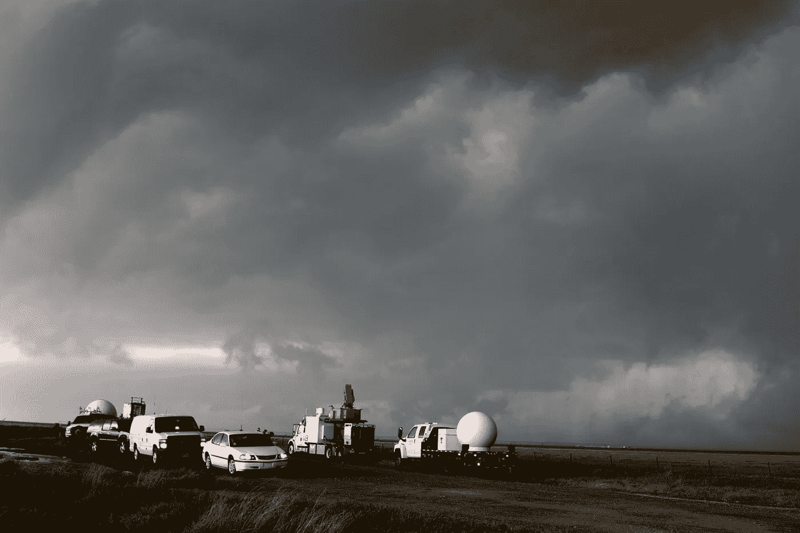
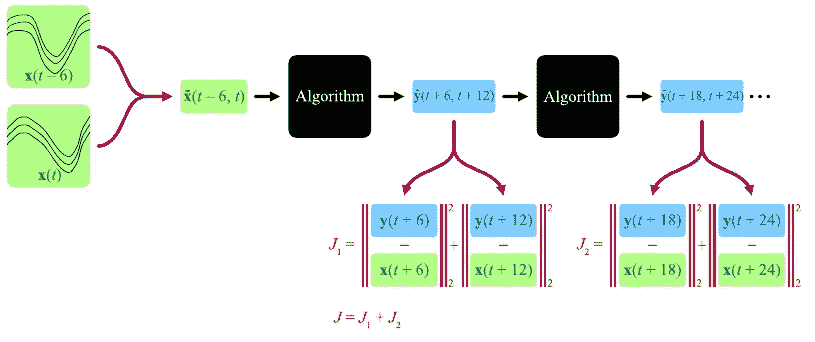

# 人工智能在天气预报中的未来

> 原文：<https://pub.towardsai.net/the-future-of-artificial-intelligence-in-weather-forecasting-76adb3042099?source=collection_archive---------4----------------------->

## [人工智能](https://towardsai.net/p/category/artificial-intelligence)

今天的天气预报是由一些世界上最复杂的计算机生成的。你可能知道，天气预报是非常不可预测的。这是因为气候是一个非常复杂和多变的现象，需要大量的金钱、数据和时间来评估。关于天气预报，未来可能会走一条非常不同的道路:那就是人工智能。

## **预测目前是如何工作的，为什么会有问题**

照片由 [NOAA](https://unsplash.com/@noaa?utm_source=unsplash&utm_medium=referral&utm_content=creditCopyText) 在 [Unsplash](https://unsplash.com/s/photos/weather-forecasting?utm_source=unsplash&utm_medium=referral&utm_content=creditCopyText) 拍摄

几十年来，天气预报一直以同样的方式进行:超级计算机处理大量的大气和海洋数据。预报公司汇总气象站的数据，并将其与各种不同来源的数据整合，如海洋浮标和独立的天气跟踪器。然后使用模拟天气中流体动力学物理的模型来分析这些数据，这需要大量的处理能力、数小时来完成，以及大量的金钱来收集和处理。在今天，对预测速度和准确性的共同要求甚至考验了最复杂的天气算法。

天文台、陆地和水域的天气监测器提供了世界各地大量的气候和天气数据。它太大太复杂，人类甚至标准的计算机网络都无法分析和扫描相似性。这是一个问题，因为如果无法完全分析这一系列数据，就会浪费时间和存储空间。由于人工智能中的模式识别技能是为这样的工作量身定制的，因此研究人员正在使用机器学习、神经网络和深度学习来做这件事。大量的数据可能会被输入到算法中，然后这些算法可以学习如何以及何时检测到可能产生闪电或龙卷风的风暴。它检测可能导致灾难性飓风或严重冬季风暴的趋势。

## **人工智能项目预测天气预报**

华盛顿大学和微软研究院之间的合作研究展示了人工智能如何能够研究以前的气候模式，以更快地预测未来的事件，几乎与当前的技术一样准确。新创建的全球天气模型基于过去 40 年的天气信息，而不是复杂的物理计算。虽然这种设计不如当今最好的传统预测模型有效，但它需要的计算机能力比预测整个地球上相同数量的地点少 7000 倍。这种减少的计算机劳动导致更快的天气预报。这些更快的预报将使气象公司能够运行许多初始条件略有不同的模型。这种天气预报方法被称为“集合预报”，它允许预报员涵盖气象事件的可能结果范围，例如风暴可能影响的地方。“在对以前的天气信息进行训练后，人工智能系统能够在物理模型无法实现的参数之间建立联系，”Weyn 解释道。“我们可以利用更少的变量，从而创建一个速度更快的模型。”研究人员在整个地球上覆盖了一个立方体的六个面(与本文稍后描述的模型方法相同)，以将有效的人工智能方法与天气预测结合起来。最后，就像建筑印刷设计一样，他们把立方体的六个面磨平。由于极地在气候中的特殊意义，研究人员对极地表面进行了独特的处理，以提高预测的准确性。

与旧的天气预报方法(需要 3 个小时并花费€3000 万美元的计算机硬件来完成)相比，Deep Weather 的天气预报新方法已经被证明既快又便宜。深度天气，使用一台价值 1 万€的电脑，可以在 100 毫秒内做出同样的预测，这将是一个显著的提高。机器学习算法被用来进行人工智能预测。通过采用线性回归技术在更短的时间内分析更复杂的数据，气象学家现在可以做出更准确的预测，从而挽救生命。机器学习可以帮助的其他预测包括温度、水深和湿度。

数值天气预报就是这样一个突出的模型。为了提供短期天气预测，该模型检查并试图处理从气象卫星、信号中继器和无线电探空仪传输的巨大数据集。人工神经网络、组神经网络、反向传播网络、径向基网络、一般回归神经网络、遗传算法、多层感知器和模糊聚类是用于天气预报的一些人工智能方法。研究人员可以使用谷歌的人工智能预测技术提前 6 小时创建可靠的降雨预测，该技术基于 UNET 卷积神经网络(CNN)。CNN 是数学过程的一系列阶段。它接受卫星图像作为输入，并将其转换为输出图片。这种 U-Net 架构由两个卷积神经网络组成，其中第二个网络在编码-解码过程中反向工作。

## **如何使用卷积神经网络进行预测**

深度学习天气预测(DLWP)是使用 UNET CNN 的天气模型之一。它将初始大气状态作为输入，并预测未来给定时间的大气状态。该模型采用在训练阶段提供给网络的天气模式的历史数据。天气预报分三步实现。

照片由 J. A. Weyn、D. R. Durran 和 R. Caruana 拍摄，“在立方体球体上使用深度卷积神经网络改进数据驱动的全球天气预测”

第一步，研究人员使用“立方体球体方法”绘制预测图，其中地球被限制在一个立方体的六个面上，如上所示。这个立方体然后被展平，这使得研究人员可以一次专注于立方体的一个面。

照片由 J. A. Weyn、D. R. Durran 和 R. Caruana 拍摄，“在立方体球体上使用深度卷积神经网络改进数据驱动的全球天气预测”

第二步，研究人员专注于神经网络的架构，如上图所示。所有橙色箭头表示二维卷积，它使用过滤器从输入数据中提取特征。绿色和紫色箭头表示池图层，其中第一个网络中的图像被向下采样，从而减少了网络中的参数，而第二个网络中的图像被向上采样，因此图像恢复到其原始大小。蓝色到黄色的线表示跳过连接，其中模型中的某些层被跳过，一些层的输出作为输入提供给其他层。

照片由 J. A. Weyn、D. R. Durran 和 R. Caruana 拍摄，“在立方体球体上使用深度卷积神经网络改进数据驱动的全球天气预测”

最后，使用序列预测技术，这些预测在中长期内是稳定的。上述序列预测技术将产生 6 小时预测和 12 小时预测，因为当前时间和当前时间减去 6 小时的输入被输入到架构中。他们用同样的技术每两步预测一次，18 小时预测一次，24 小时预测一次。该模型通过计算每个时间的实际数据与其预测的同一时间的预测数据之间的差异的均方误差来对自身进行改进。然后，该模型使用该均方误差来配置架构中的故障。

# 结论

总之，本文旨在介绍人工智能模型如何生成天气预报，以及它们如何在资金、速度和数据存储方面与现有的天气预报系统竞争。

如果你有兴趣了解更多关于文章中讨论的具体研究和主题，请查阅下面的参考资料。

# 参考

1.  H.Hickey，[人工智能模型显示有希望生成更快、更准确的天气预报](https://www.washington.edu/news/2020/12/15/a-i-model-shows-promise-to-generate-faster-more-accurate-weather-forecasts/) (2020)，UW 新闻
2.  南高丁，[为什么人工智能是天气预测中越来越重要的工具](https://www.hpe.com/us/en/insights/articles/why-ai-is-an-increasingly-important-tool-in-weather-prediction-2007.html) (2020)，惠普企业
3.  [使用实时人工智能天气预测平衡能源网格](https://peltarion.com/customer-stories/deep-learning-weather-forecast) (2021)，Peltarion
4.  Preetipadma，[AI 是如何赋能天气预报技术的？](https://www.analyticsinsight.net/ai-empowering-weather-forecasting-technology/) (2020)，分析洞察
5.  长度 Bouchard，[人工智能预测更快更准确的天气预报](/ai-is-predicting-faster-and-more-accurate-weather-forecasts-5d99a1d9c4f) (2020)，走向人工智能