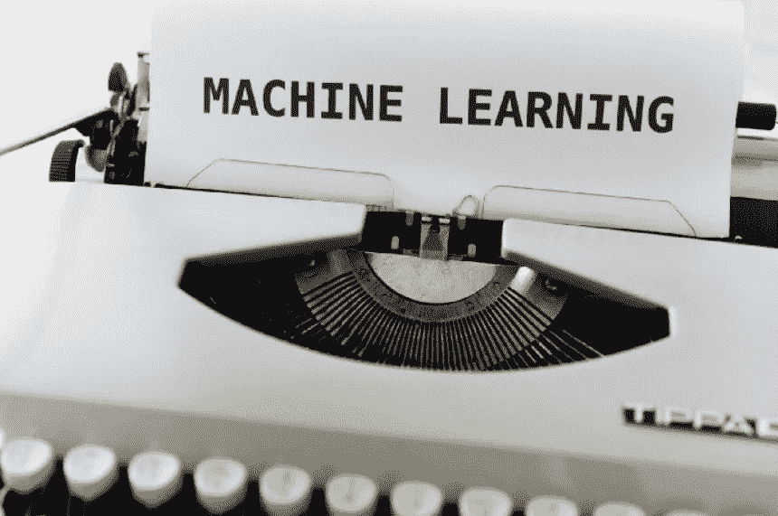
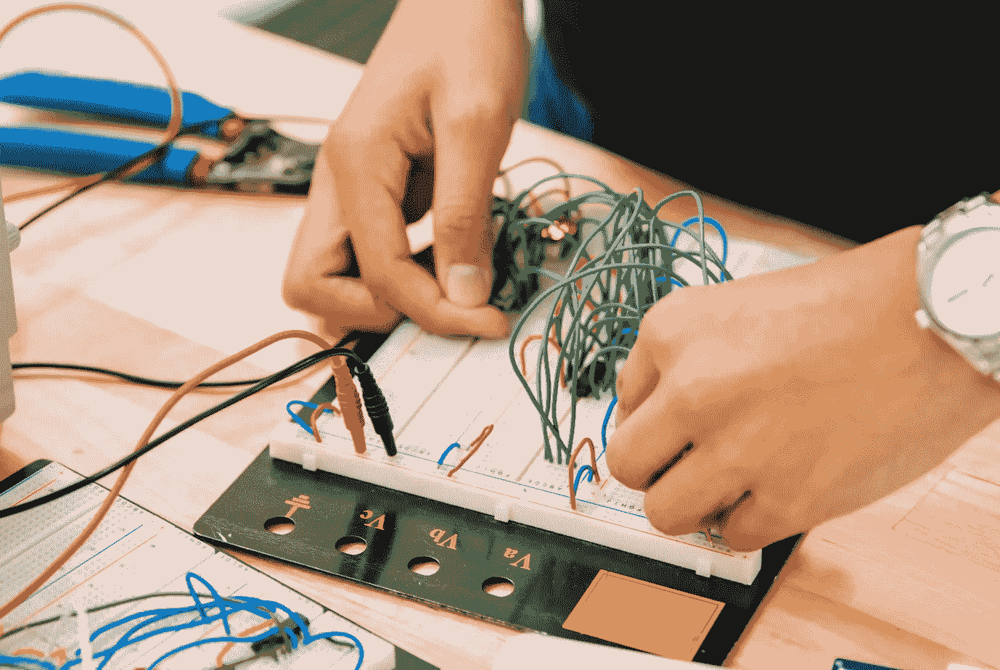

# NLP 的未来是量子物理学

> 原文：<https://pub.towardsai.net/the-future-of-nlp-is-quantum-physics-37e3673e82bc?source=collection_archive---------0----------------------->

## 但是，它已经在这里了。

当今对自然语言处理及其与量子力学的交叉的兴趣已经揭示了在不远的将来会出现的新奇事物，当然不是遥远的将来。

来自 Unsplash 的 yue yung Lau

在那些不仅追求研究，而且追求使用量子或类似量子的能力以经验方式展示真实世界实现的人中，包括一些正在崛起的先行者(目前在自然语言、自然语言处理(NLP)和量子力学的交叉领域):

> *—****Meyers and Lewis****调查“词汇歧义”的成分分布模型研究[8]；
> —* ***Coecke 等人*** *研究近期量子自然语言处理(QNLP)研究自然语言“将语言意义和语言结构如语法结合成一个整体”[9]；
> —* ***江等*** *对信息检索(IR)进行研究，提出量子干涉启发的神经匹配模型(QINM)，“能够应用干涉效应来指导构建检索过程中匹配单元之间交互产生的附加证据”[10]；而
> —* ***张等人*** *的研究* *则更深入地关注了张量网络(TN)对于自然语言是如何被激活的(虽然它在处理自然图像方面已经显示出成功的应用)[11]。*

大多数人激烈地争辩说，在考虑过渡到量子物理学之前，你们所有人都必须或需要学习经典物理学；然而，它一次又一次地出现，如果你已经从经典物理学开始，并试图深入研究量子物理学，你必须忘记你已经学过的东西。我是后一种观点的追随者，就个人而言，我更看重数学的深度，只要是关于一个人如何进入量子物理学的背景，而不是对经典物理学的权威理解。

让我们回溯到一个非常高的水平来列举历史上影响量子物理空间的重要接触点。这不是另一个量子物理学定义:

> 对存在于堆积粒子、波或状态中的亚微观实体的描述。

在探索量子物理和自然语言处理(NLP)的交叉领域内，最近的研究已经开始解开这个艰巨的任务，例如如何通过使用量子计算机的计算工作的 NLP 模型的集成来分析自然语言。所有这些中还有另一个扭曲，通过检查量子启发或类量子算法在非量子(或“经典”[1])计算机上应用自然语言处理实现的收敛性，允许并实现了这一艰难努力的软着陆。

现代量子物理学的最初努力发生在二十世纪初，当时通过失败的实验和缺乏对原子和辐射行为的具体解释，它变得非常明显。加速到 20 世纪 80 年代，作为量子力学一部分的“不可克隆定理”阐述了如何不可能将一个任意状态复制到另一个状态上(不存在酉变换[2])。

马库斯·温克勒在 [Unsplash](https://unsplash.com?utm_source=medium&utm_medium=referral) 上的照片

对于机器学习和自然语言处理的应用，量子计算机能在多大程度上超越经典计算机，这是持续而严格的检查。作为这项工作的一部分，涉及硬件和软件的类型和复杂性正在接受仔细的检查。就将量子计算的硬件应用和进行分析的软件应用联系起来而言，这本身仍然是一个充满挑战和斗争的领域[3]。在一个实例中，已经发现并验证了[4]Sycamore 处理器花费大约 200 秒来对量子电路的一个实例进行一百万次采样，相比之下，对于“最先进的经典超级计算机”来说，这样的同等任务的基准需要大约 10，000 年。这一基准的验证导致了对前方未来量子先锋预测的稳定性的认可。

自然语言从认知和口语信息中提取，无论其通过何种格式进行交流(例如，通过使用开放式自由文本回答的调查，或反映您对所接受服务的评论的音频提交)。在口头信息的背景下，有一个决策过程，这个决策过程以各种不同的形式传达了洞察力。虽然我无意将“认知和决策”联系起来[5]，但量子理论现在正被用于科学原因，基于类量子认知模型的应用(或广义量子模型以告知基于量子结构的认知模型)[5]，来解释如何理解认知。

人们已经认识到，至少有两种方式，通过这两种方式，量子理论可以为科学研究和检验的模式提供认知方面的信息。首先，在“判断和决定的情境性”领域[5]，与量子理论下的“干涉”有直接联系，可以描述如下:

> **“作出第一个判断或决策所产生的语境与随后的判断或决策发生干扰，产生顺序效应，使判断和决策不可交换” *[5]。***

由[杰斯温·托马斯](https://unsplash.com/@jeswinthomas)在 Unsplash

第二，在量子纠缠领域，在自然语言与量子物理的联系下，可以开发类似量子的“认知现象”模型，使得“纠缠系统不能被有效地分解和建模为单独的子系统”[5]。在类量子建模的领域中，概述下一步的顺序路径(关于它如何与认知事件具体关联)可以这样呈现:

# 正如 Busemeyer 和 Bruza 所概括的那样，开发类似量子的模型来关联认知事件，因为它们也不是分解的。

正如我在上面提到的处理量子计算领域的挑战之一，它不仅触及到相关软件的核心，也触及到硬件挑战的核心。尽管类似量子的计算模型的空间正在发展，并有早期迹象表明可以通过合理的途径获得经验结果，但仍然明确的是，缺乏解决问题的量子算法使得不需要量子硬件来实现效率。

如果没有量子硬件可以利用，我们就无法让自然语言实现可测量的前所未有的效率，无法在量子计算参数中充分利用它们。

举个例子，“自组织”[6]关于他们复制应该被自然感知或看到的活动的行为方式。关于蚁群优化的领域("(ACO)" [7])，自组织实现方法从随机的以群体为中心的优化开始，实现经验上合理的和系统聚焦的(基于软件和硬件量子的)结果，期望利用它们的力量。

途经[https://blog.google/technology/ai/lamda/](https://blog.google/technology/ai/lamda/)

在对话式人工智能中，有许多获得成功的途径。LaMDA 采取的方向是严格强调(1)管道建模达到“合理”程度的能力[12]；(2)管道模型“具体”的能力[12]；以及(3)揭示它可以在“趣味性”中展示品质[12]。关于 LaMDA 的研究可以在这里找到:

 [## LaMDA:对话应用程序的语言模型

### 我们提出 LaMDA:对话应用程序的语言模型。LaMDA 是一个基于变压器的神经语言家族…

arxiv.org](https://arxiv.org/abs/2201.08239) 

137B 模型参数通知了基于变压器的神经语言模型，同时特别强调了关于如何与终端用户互动的对话[13]。此外，LaMDA 是根据谷歌概述的具体目标来衡量的；它们包括(根据[14]截至 2022 年 6 月 15 日):

> *——对社会有益；*
> 
> *——避免制造或强化不公平的偏见；*
> 
> *—制造并测试安全性；*
> 
> *—对人负责；*
> 
> *—融入隐私设计原则；*
> 
> *—坚持科学卓越的高标准；和*
> 
> *—可用于符合这些原则的用途。*

在量子物理学中，关于它如何与人类语言相关联，仍然有很多需要通过实验来实现的东西。与此同时，自然语言处理流水线建模中的新功能以及大规模深度学习中的应用，如机器学习计算图的通用和可扩展并行化(GSPMD)[15]，揭示了我们现在能够实现并跨最终用户用例部署的内容。

如果您有任何编辑/修改建议或关于进一步扩展此主题的建议，请考虑与我分享您的想法。

# **另外，请考虑订阅我的每周简讯:**

 [## 周日报告#1

### 设计思维与 AI 的共生关系设计思维能向 AI 揭示什么，AI 又能如何拥抱…

pventures.substack.com](https://pventures.substack.com/) 

参考资料:

[1]:吴，s，李，j，张，p，&张，y(未定)。自然语言处理遇到量子物理:调查和分类。ACL 选集。2022 年 6 月 14 日检索，来自【https://aclanthology.org/2021.emnlp-main.254/】
【2】:*量子计算与量子信息— cas* 。(未注明)。检索于 2022 年 6 月 14 日，来自[http://mmrc . amss . cas . cn/TLB/201702/w 020170224608149940643 . pdf](http://mmrc.amss.cas.cn/tlb/201702/W020170224608149940643.pdf)
【3】:比亚蒙特，j .，魏特克，p .，潘科蒂，N. *等*量子机器学习。*性质* **549，**195–202(2017)。[https://doi.org/10.1038/nature23474](https://doi.org/10.1038/nature23474)
【4】:阿鲁特、f .、阿里亚、k .、巴布什、r .、培根、d .、巴丁、J. C .、巴伦兹、r .、比斯瓦斯、r .、博伊索、s .、f .、布厄尔、D. A .、伯克特、b .、陈、y .、陈、z .、基亚罗、b .、柯林斯、r .、考特尼、w .、邓斯沃思、a .、法希、e .佛克森、b .、福勒、a .……马丁尼、J. M. (2019)。使用可编程超导处理器的量子优势。*性质*， *574* (7779)，505–510。[https://doi.org/10.1038/s41586-019-1666-5](https://doi.org/10.1038/s41586-019-1666-5)。
【5】:Busemeyer，J. R .，& Bruza，P. D. (2014)。*认知和决策的量子模型*。剑桥大学出版社。
[6]: Soleimanpour，m .、Nezamabadi-pour，h .、& Farsangi，M.M. (2014 年)。数值函数优化的量子引力搜索算法。Inf。Sci。，267 ，83–100。
【7】:z .保江，l .时永，蚁群优化算法及其在神经模糊控制器设计中的应用，系统工程与电子学报 18(2007)603–610。
【8】:弗朗索瓦·梅耶和玛莎·刘易斯。2020.用密度矩阵模拟词汇歧义。 *arXiv 预印本 arXiv:2010.05670* 。
[9]:鲍勃·科克、乔瓦尼·德费利斯、康斯坦丁诺·梅-伊坎尼齐迪斯和亚历克西斯·图米。2020.近期量子自然语言处理基础。 *arXiv 预印本 arXiv:2012.03755* 。
【10】:江永玉、、、宋大伟。2020.一种量子干涉启发的自组织检索神经匹配模型。在*第 43 届国际 ACM SIGIR 会议关于信息检索研发的会议记录*中，第 19–28 页。
【11】:张鹏、、印度马、饶思伟、田广健、。2021.Text{tn}:张量网络上语言的概率编码。
【12】:*LaMDA:我们突破性的对话技术*。(2021 年 5 月 18 日)。谷歌。[https://blog.google/technology/ai/lamda/](https://blog.google/technology/ai/lamda/)。
【13】:*LaMDA:迈向安全、接地气、高质量的万物对话模型*。(2022 年 1 月 21 日)。谷歌人工智能博客。[https://AI . Google blog . com/2022/01/lamda-forward-safe-ground-and-high . html](https://ai.googleblog.com/2022/01/lamda-towards-safe-grounded-and-high.html)
【14】:*我们的原则——Google AI*。(未注明)。谷歌人工智能。[https://ai.google/principles/](https://ai.google/principles/)
【15】:*通用且可扩展的神经网络并行化*。(2021 年 12 月 8 日)。谷歌人工智能博客。[https://ai . Google blog . com/2021/12/general-and-scalable-parallelism ization . html](https://ai.googleblog.com/2021/12/general-and-scalable-parallelization.html)