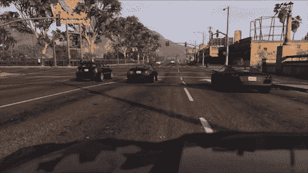
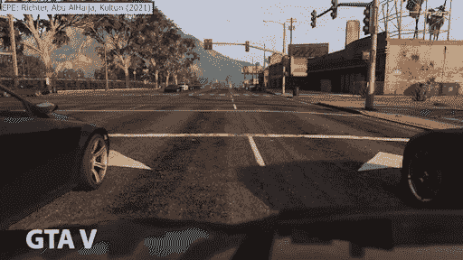
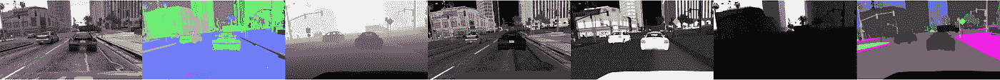
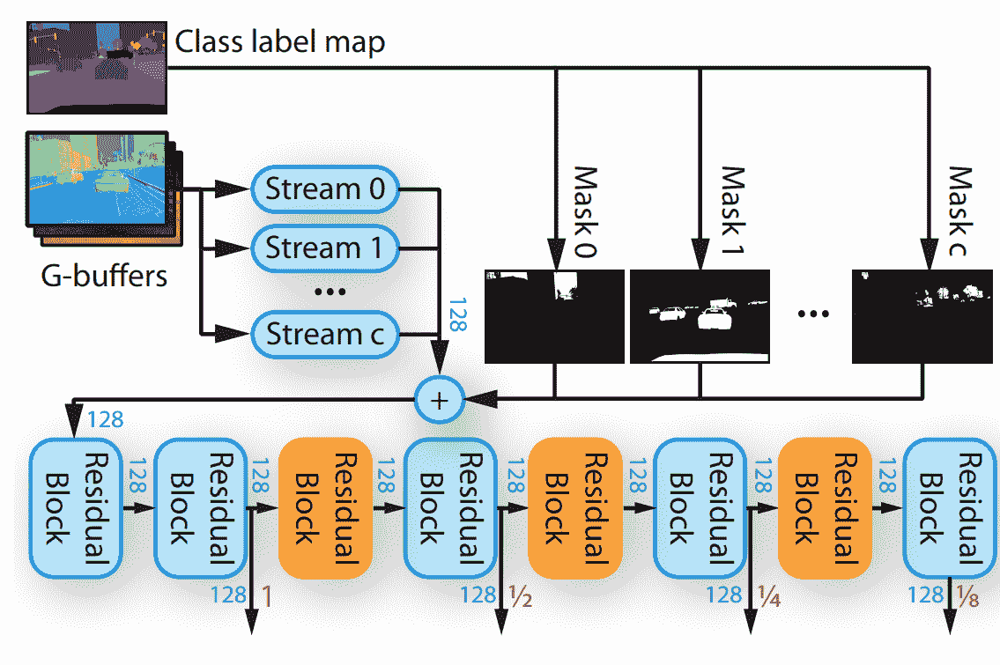
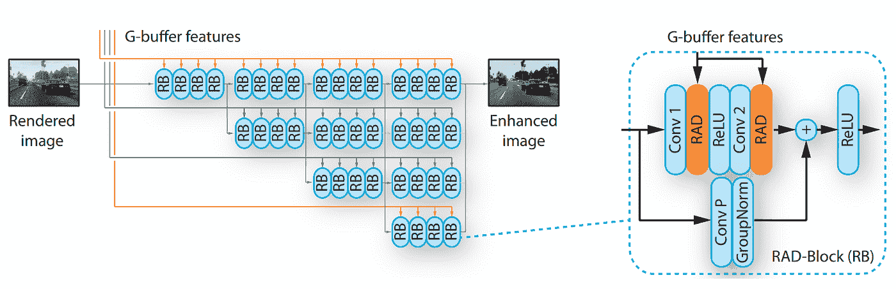
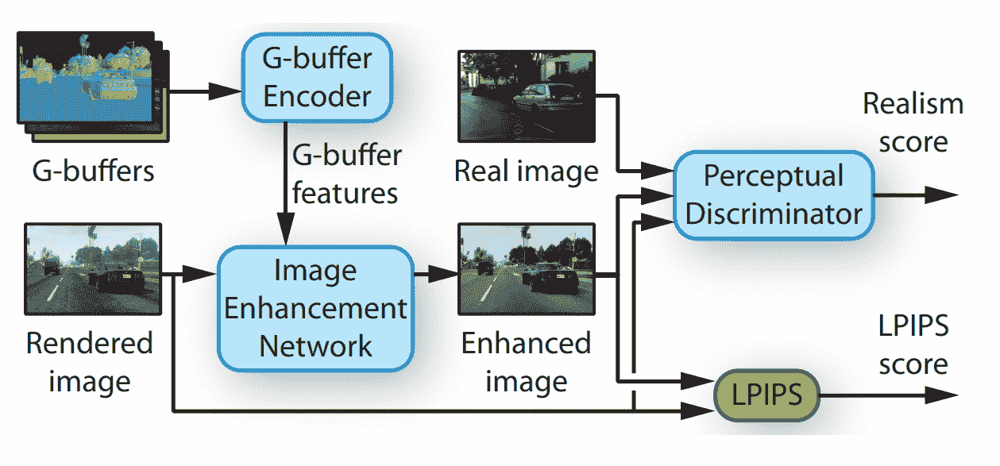
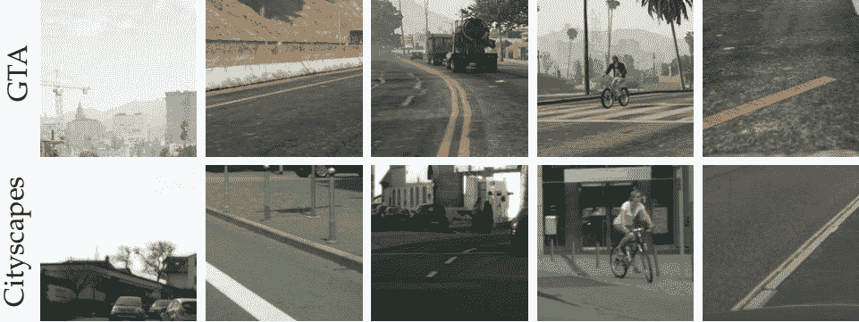
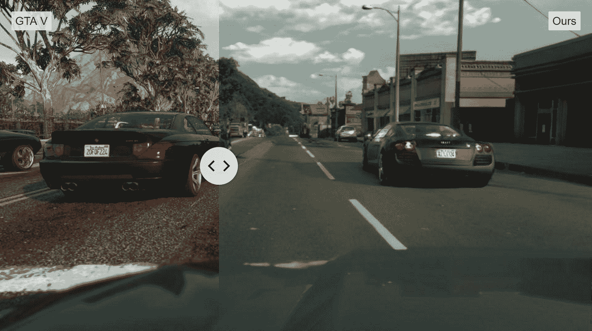

# 电子游戏设计的未来？

> 原文：<https://pub.towardsai.net/the-future-of-video-game-design-234cbeba7ab?source=collection_archive---------3----------------------->

## [未来](https://towardsai.net/p/category/future)，[科技](https://towardsai.net/p/category/technology)

## 这种人工智能可以应用到视频游戏中，并使每一帧看起来更加自然。

> 最初发表于 [louisbouchard.ai](https://www.louisbouchard.ai/the-future-of-video-game) ，前两天在[我的博客](https://www.louisbouchard.ai/the-future-of-video-game)上看到的！

GTA5 玩法。[里克特，阿布·阿尔海贾，科尔敦(2021)](https://intel-isl.github.io/PhotorealismEnhancement/)

你在这里看到的是一款非常流行的视频游戏《GTA 5》的玩法。看起来超级逼真，但还是很明显这是一款电子游戏。现在，看看这个..

GTA5 游戏性增强。[里克特，阿布·阿尔海贾，科尔敦(2021)](https://intel-isl.github.io/PhotorealismEnhancement/)

不，这不是真实的生活。这仍然是相同的 GTA5 游戏经历了一个新的模型，使用人工智能来增强其图形，使其看起来更像真实世界！来自英特尔实验室的研究人员刚刚发表了一篇名为“增强真实感增强”的论文。如果你认为这可能是“另一个甘”，把视频游戏的照片作为输入，并按照自然世界的风格改变它，让我改变你的想法。他们花了两年时间研究这个模型，让它变得非常健壮。它可以现场应用到视频游戏中，并使每一帧看起来更加自然。想象一下这样的可能性，你可以在游戏画面中投入更少的精力，让它变得超级稳定和完整，然后使用这种模式改进风格。我认为这对于电子游戏来说是一个巨大的突破，而这只是第一篇专门针对电子游戏的论文！我想问你一个你已经可以回答或者等到视频结束再回答的问题:**你觉得这是电子游戏的未来吗？**

如果你想要更多的时间来回答，那是完美的，让我们进入这个技术。一般来说，这项任务被称为图像到图像的翻译(见下文)。你将一幅图像转换成另一幅图像，通常使用 GANs，正如我在以前的文章中多次提到的。

经典的图像到图像的翻译例子。

如果您想要了解典型 GAN 架构的工作原理，我邀请您在继续之前观看下面的视频，因为我不会在这里详细介绍它的工作原理。

正如我前面说过的，这个模型不同于基本的图像到图像的翻译，因为它使用了应用于视频游戏的事实。这在这里非常重要，因为视频游戏比简单的图片拥有更多的信息，所以为什么要通过只使用快照作为输入来实现逼真的转换，从而使任务变得更加复杂呢？

取而代之的是，他们使用了游戏中每张图片的更多信息，比如表面法线、深度信息、材质、透明度、光照，甚至还有一张分割图，告诉你物体的位置和内容。我相信您已经看到了所有这些额外的信息是如何帮助完成这项任务的。所有这些图像都被发送到称为 G-buffer 编码器的第一个网络(见下文)。

整体 EPE 模型。[里克特，阿布·阿尔海贾，科尔敦(2021)](https://intel-isl.github.io/PhotorealismEnhancement/)

让我们放大这个“G 缓冲编码器”:

G 缓冲网络。[里克特，阿布·阿尔海贾，科尔敦(2021)](https://intel-isl.github.io/PhotorealismEnhancement/)

这个 G-buffer 编码器接收所有这些信息，将其独立地发送到一个经典的卷积网络中，以从这些不同版本的初始图像中提取和浓缩所有有价值的信息。这是使用多个残差块完成的，正如您在这里看到的，这基本上只是一个卷积神经网络架构，更准确地说，是一个 ResNet 架构。如您所见，信息是在多个步骤中提取的。这样做是为了在过程的不同阶段获取信息。早期信息在这项任务中至关重要，因为它提供了更多关于空间位置的信息，而细节信息较少。相比之下，更深层次的信息对于理解整体形象及其风格至关重要。因此，当正确使用时，早期和深度信息的组合是非常强大的！

然后，这里的所有这些信息，称为 G-buffer 特征(见上面的完整模型 2 图像)，与来自游戏的原始图像一起被发送到另一个网络，称为渲染图像。另一个模型称为“图像增强网络”，如上面的完整架构所示，让我们也放大一下这个模型。

图像增强网络。[里克特，阿布·阿尔海贾，科尔敦(2021)](https://intel-isl.github.io/PhotorealismEnhancement/)

正如我们之前看到的，您可以看到不同的颜色代表从不同比例提取的 G 缓冲区信息，灰色箭头显示实际图像的过程。在这里，您可以再次看到，这是 G 缓冲编码器重复多次的相同残差块的增强版本，但在添加到流程之前进行了一点调整，以更好地适应 G 缓冲信息。这是使用他们在这里称为 RAD 的东西来完成的，RAD 也是残差块、卷积和归一化。

整体 EPE 模型。[里克特，阿布·阿尔海贾，科尔敦(2021)](https://intel-isl.github.io/PhotorealismEnhancement/)

正如我提到的，这种架构比普通 GAN 等简单的编码器-解码器架构要复杂一些。同样，训练过程也更加精细。在这里，您可以看到两个指标，真实度得分和 LPIPS 得分。

GTA5 与使用的真实数据集:城市景观。[里克特，阿布·阿尔海贾，科尔敦(2021)](https://intel-isl.github.io/PhotorealismEnhancement/)

现实主义评分基本是训练过程中的 GAN 段。它将相似的真实世界图像与游戏图像进行比较，并将真实图像与增强的游戏图像进行比较。帮助模型学习如何产生一个现实的和增强版本的游戏图像发送。

GTA5 游戏性增强。[里克特，阿布·阿尔海贾，科尔敦(2021)](https://intel-isl.github.io/PhotorealismEnhancement/)

而这个 LPIPS 分量是已知的损失，用于尽可能多地保留渲染图像的结构。这是通过基于渲染图像与增强图像的相关像素之间的差异给出分数来实现的。当网络生成空间上不同于原始图像的新图像时，惩罚网络。因此，这两个指标在该算法的训练过程中一起工作，以改善整体结果。

当然，和往常一样，你需要一个足够大的真实世界和游戏的数据集，因为它不会产生模型从未见过的东西。

而现在，**你认为这种模式是电子游戏的未来吗？**看到这个视频后，你的看法改变了吗？

感谢您的阅读！

## 观看视频中的更多示例:

如果你喜欢我的工作，并想与人工智能保持同步，你绝对应该关注我的其他社交媒体账户( [LinkedIn](https://www.linkedin.com/in/whats-ai/) ， [Twitter](https://twitter.com/Whats_AI) )，并订阅我的每周人工智能 [**简讯**](http://eepurl.com/huGLT5) ！

## 支持我:

*   支持我的最好方式是在 [**媒体**](https://medium.com/@whats-ai) 上关注我，或者如果你喜欢视频格式，在[**YouTube**](https://www.youtube.com/channel/UCUzGQrN-lyyc0BWTYoJM_Sg)**上订阅我的频道。**
*   **支持我在 [**上的工作**](https://www.patreon.com/whatsai)**
*   **加入我们的 [**Discord 社区:** **一起学习 AI**](https://discord.gg/learnaitogether)和*分享你的项目、论文、最佳课程、寻找 Kaggle 队友等等！***

## **参考**

**里克特，阿布·阿尔海贾，科尔敦，(2021)，“增强照片真实感增强”，[https://intel-isl.github.io/PhotorealismEnhancement/](https://intel-isl.github.io/PhotorealismEnhancement/)**