# 梯度下降算法及其变体

> 原文：<https://pub.towardsai.net/the-gradient-descent-algorithm-and-its-variants-e0915796dbf2?source=collection_archive---------4----------------------->


图片由[莎拉](https://pixabay.com/users/sarajuggernaut-28237/?utm_source=link-attribution&utm_medium=referral&utm_campaign=image&utm_content=167089)提供，来自[皮克斯拜](https://pixabay.com//?utm_source=link-attribution&utm_medium=referral&utm_campaign=image&utm_content=167089)

## 梯度下降算法及 python 代码示例

**作者:** [普拉蒂克·舒克拉](https://www.linkedin.com/in/pratik-shukla28/)

> "教育头脑而不教育心灵根本不是教育."― [亚里士多德](https://www.google.com/url?sa=t&rct=j&q=&esrc=s&source=web&cd=&cad=rja&uact=8&ved=2ahUKEwiapLSCnOr6AhV0MlkFHZw-A4UQFnoECBoQAQ&url=https%3A%2F%2Fen.wikipedia.org%2Fwiki%2FAristotle&usg=AOvVaw0fdZoZDczxO8LfFPUTWRt4)

## 梯度下降系列博客:

1.  [梯度下降算法](/the-gradient-descent-algorithm-defddd1d312e)
2.  [梯度下降算法背后的数学直觉](/mathematical-intuition-behind-the-gradient-descent-algorithm-143a051c3fa9)
3.  [梯度下降算法&它的变种](/the-gradient-descent-algorithm-and-its-variants-e0915796dbf2)(你来了！)

## 目录:

1.  [简介](#4c70)
2.  [批量梯度下降(BGD)](#f380)
3.  [随机梯度下降](#bfb4)
4.  [小批量梯度下降(MBGD)](#817a)
5.  [图形比较](#7efb)
6.  [结束注释](#803f)
7.  [资源](#168d)
8.  [参考文献](#f9f3)

## 简介:

请击鼓:欢迎来到梯度下降系列的大结局！在这篇博客中，我们将深入探讨梯度下降算法。我们将讨论所有有趣的梯度下降算法，以及它们的 Python 代码示例。我们还将基于每个算法中执行的计算数量来检查算法之间的差异。我们今天会想尽一切办法，所以我们要求你在阅读文档时运行[***Google Colab***](#168d)文件；这样做会让你对主题有更准确的理解，从而看到它的实际应用。让我们开始吧！

# 批量梯度下降:

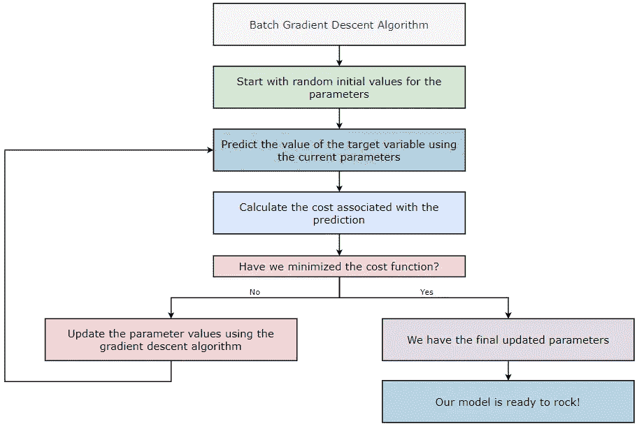

批量梯度下降(BGD)算法的工作原理

批量梯度下降(BGD)算法在每次迭代中考虑所有的训练样本。如果数据集包含大量的训练样本和大量的要素，那么实施批量梯度下降(BGD)算法在计算上就会变得非常昂贵，所以要注意预算！让我们举个例子来更好地理解它。

> **批量梯度下降(BGD):**
> 
> 每次迭代的训练样本数= 100 万= 1⁰⁶
> 迭代次数= 1000 = 1⁰
> 要训练的参数数= 10000 = 1⁰⁴
> 总计算量= 1⁰⁶ * 1⁰ * 1⁰⁴ = 1⁰

现在，让我们看看批量梯度下降(BGD)算法是如何实现的。

## 1.第一步:

首先，我们从 GitHub 库下载数据文件。

从 GitHub 获取数据文件

## 2.第二步:

接下来，我们导入一些必需的库来读取、操作和可视化数据。

导入所需的库

## 3.第三步:

接下来，我们读取数据文件，然后打印它的前五行。

读取和打印数据

## 4.第四步:

接下来，我们将数据集分为要素和目标变量。

获取特征和目标变量

> 尺寸:X = (200，3)和 Y = (200，)

## 5.第五步:

为了在进一步的步骤中执行矩阵计算，我们需要对目标变量进行整形。

重塑 Y 轴上的数据

> 尺寸:X = (200，3)和 Y = (200，1)

## 6.第六步:

接下来，我们正在规范化数据集。

标准化数据

> 尺寸:X = (200，3)和 Y = (200，1)

## 7.第七步:

接下来，我们将获得`bias`和`weights`矩阵的初始值。在执行正向传播时，我们将在第一次迭代中使用这些值。

获取随机值来初始化我们的参数

> 维度:偏差= (1，1)和权重= (1，3)

## 8.第 8 步:

接下来，我们执行正向传播步骤。该步骤基于以下公式。

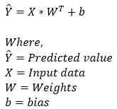

预测目标变量的值

> 维度:预测值= (1，1)+(200，3)*(3，1) = (1，1)+(200，1) = (200，1)

## 9.第九步:

接下来，我们将计算与我们的预测相关的成本。该步骤基于以下公式。

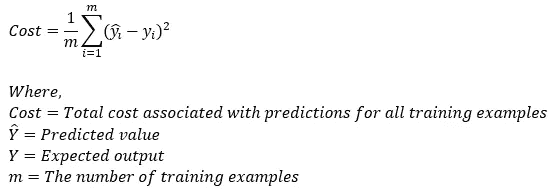

获取与预测相关的成本

> 维度:成本=标量值

## 10.第十步:

接下来，我们使用梯度下降算法更新权重和偏差的参数值。该步骤基于以下公式。请注意，我们没有对权重值求和的原因是我们的权重矩阵不是一个`1*1`矩阵。

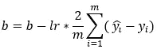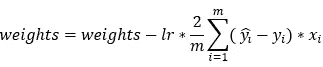

使用梯度下降算法更新参数

> 维度:db = sum(200，1) = (1，1)
> 
> 尺寸:dw = (1，200) * (200，3) = (1，3)
> 
> 维度:偏差= (1，1)和权重= (1，3)

## 11.第 11 步:

接下来，我们将使用我们刚刚定义的所有函数来运行梯度下降算法。我们还创建了一个名为`cost_list`的空列表来存储所有迭代的成本值。该列表将用于在后续步骤中绘制图表。

批量梯度下降算法

## 12.第 12 步:

接下来，我们实际上是在调用函数来获得最终结果。请注意，我们运行的是`200 iterations`的全部代码。同样，这里我们指定了`learning rate of 0.01`。

运行批量梯度下降算法 200 次迭代

## 13.第十三步:

接下来，我们绘制`iterations vs. cost`的图形。


## 14.第 14 步:

接下来，我们在所有迭代完成后打印`final weights`值。

在 200 次迭代后打印权重的最终值

## 15.步骤 15:

接下来，我们在所有迭代完成后打印`final bias`值。

在 200 次迭代后打印偏差的最终值

## 16.第 16 步:

接下来，我们绘制两个具有不同学习率的图形，以查看学习率在优化中的作用。在下图中，我们可以看到学习速率较高的图`(0.01)`比学习速率较低的图`(0.001)`收敛得更快。正如我们在梯度下降系列的第 1 部分中了解到的，这是因为具有较低学习速率的图形需要较小的步长。

绘制不同学习速率下的批量梯度下降算法图

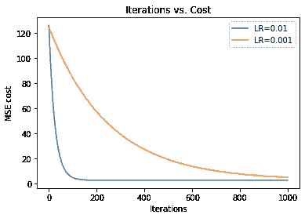

## 17.第 17 步:

让我们把它们放在一起。

## 计算次数:

现在，让我们统计一下批量梯度下降算法中执行的计算次数。

> **偏差:**(训练示例)x(迭代次数)x(参数)= 200 * 200 * 1 = 40000
> 
> **权重:**(训练示例)x(迭代次数)x(参数)= 200 * 200 *3 = 120000

# 随机梯度下降

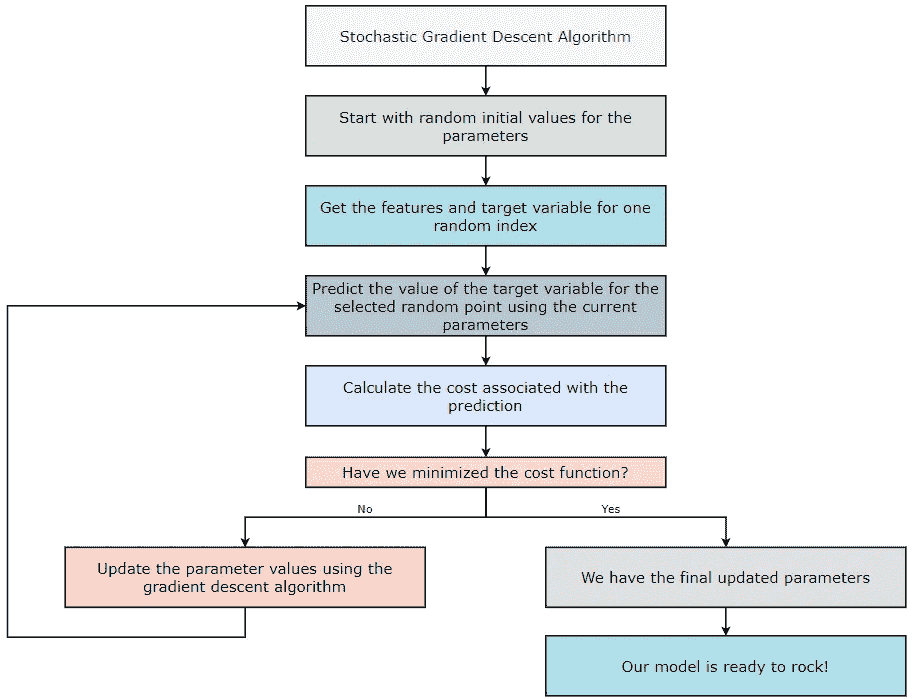

随机梯度下降算法的工作原理

在批量梯度下降算法中，我们考虑算法所有迭代的所有训练样本。但是，如果我们的数据集有大量的训练示例和/或特征，那么计算参数值的计算成本就会很高。我们知道，如果我们为机器学习算法提供更多的训练示例，它将产生更高的准确性。但是，随着数据集大小的增加，与之相关的计算也会增加。让我们举个例子来更好地理解这一点。

> **批量梯度下降(BGD)**
> 
> 每次迭代的训练样本数= 100 万= 1⁰⁶
> 迭代次数= 1000 = 1⁰
> 要训练的参数数= 10000 = 1⁰⁴
> 总计算量= 1⁰⁶*1⁰ *1⁰⁴=1⁰

现在，如果我们看上面的数字，它并没有给我们很好的感觉！所以我们可以说，使用批量梯度下降算法似乎效率不高。因此，为了解决这个问题，我们使用随机梯度下降(SGD)算法。“随机”这个词的意思是随机的。因此，我们不是对数据集的所有训练示例执行计算，而是选取一个随机示例并对其执行计算。听起来很有趣，不是吗？在随机梯度下降(SGD)算法中，我们每次迭代只考虑一个训练样本。让我们看看随机梯度下降基于它的计算有多有效。

> **随机梯度下降(SGD):**
> 
> 每次迭代的训练样本数= 1
> 迭代次数= 1000 = 1⁰
> 要训练的参数数= 10000 = 1⁰⁴
> 总计算量= 1 * 1⁰ *1⁰⁴=1⁰⁷
> 
> **与批量梯度下降的比较:**
> 
> BGD = 1⁰
> 中的总计算量 SGD = 1⁰⁷
> 中的总计算量**评估:**在这个例子中 SGD 比 BGD 快⁰⁶倍。

**注意:**请注意，我们的成本函数不一定会下降，因为我们只是在每次迭代中随机选取一个训练样本，所以不要担心。然而，随着我们执行越来越多的迭代，成本函数将逐渐减小。

现在，让我们看看随机梯度下降(SGD)算法是如何实现的。

## 1.第一步:

首先，我们从 GitHub 库下载数据文件。

从 GitHub 获取数据文件

## 2.第二步:

接下来，我们导入一些必需的库来读取、操作和可视化数据。

导入所需的库

## 3.第三步:

接下来，我们读取数据文件，然后打印它的前五行。

读取和打印数据

## 4.第四步:

接下来，我们将数据集分为要素和目标变量。

获取特征和目标变量

> 尺寸:X = (200，3)和 Y = (200，)

## 5.第五步:

为了在进一步的步骤中执行矩阵计算，我们需要对目标变量进行整形。

重塑 Y 轴上的数据

> 尺寸:X = (200，3)和 Y = (200，1)

## 6.第六步:

接下来，我们正在规范化数据集。

标准化数据

> 尺寸:X = (200，3)和 Y = (200，1)

## 7.第七步:

接下来，我们将获得`bias`和`weights`矩阵的初始值。在执行正向传播时，我们将在第一次迭代中使用这些值。

获取随机值来初始化我们的参数

> 维度:偏差= (1，1)和权重= (1，3)

## 8.第 8 步:

接下来，我们执行正向传播步骤。该步骤基于以下公式。


预测目标变量的值

> 维度:预测值= (1，1)+(200，3)*(3，1) = (1，1)+(200，1) = (200，1)

## 9.第九步:

接下来，我们将计算与预测相关的成本。该步骤使用的公式如下。因为只有一个误差值，所以我们不需要将成本函数除以数据集的大小，也不需要将所有成本值相加。

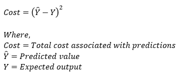

获取与预测相关的成本

> 维度:成本=标量值

## 10.第十步:

接下来，我们使用梯度下降算法更新权重和偏差的参数值。该步骤基于以下公式。请注意，我们不对权重值求和的原因是我们的权重矩阵不是一个`1*1`矩阵。此外，在这种情况下，由于我们只有一个训练示例，我们不需要对所有示例执行求和。更新后的公式如下。

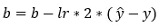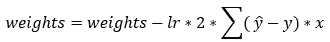

使用梯度下降算法更新参数

> 维度:db = (1，1)
> 
> 尺寸:dw = (1，200) * (200，3) = (1，3)
> 
> 维度:偏差= (1，1)和权重= (1，3)

## 11.第 11 步:

随机梯度下降算法

## 12.第 12 步:

接下来，我们实际上是在调用函数来获得最终结果。请注意，我们运行的是`200 iterations`的全部代码。同样，这里我们已经指定了`learning rate of 0.01`。

运行随机梯度下降算法 200 次迭代

## 13.第十三步:

接下来，我们在所有迭代完成后打印`final weights`值。

在 200 次迭代后打印权重的最终值

## 14.第 14 步:

接下来，我们在所有迭代完成后打印`final bias`值。

在 200 次迭代后打印偏差的最终值

## 15.步骤 15:

接下来，我们绘制`iterations vs. cost`的图形。


## 16.第 16 步:

接下来，我们绘制两个具有不同学习率的图形，以查看学习率在优化中的作用。在下图中，我们可以看到学习速率较高的图`(0.01)`比学习速率较低的图`(0.001)`收敛得更快。同样，我们知道这一点是因为具有较低学习率的图形需要较小的步长。

绘制不同学习速率下的批量梯度下降算法图

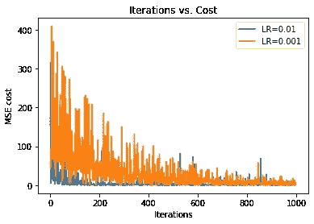

## 17.第 17 步:

把这些放在一起。

## 计算:

现在，让我们计算在实现批量梯度下降算法中执行的计算次数。

> **偏差:**(训练样本)x(迭代次数)x(参数)= 1* 200 * 1 = 200
> 
> **权重:**(训练示例)x(迭代次数)x(参数)= 1* 200 *3 = 600

# 小批量梯度下降算法；

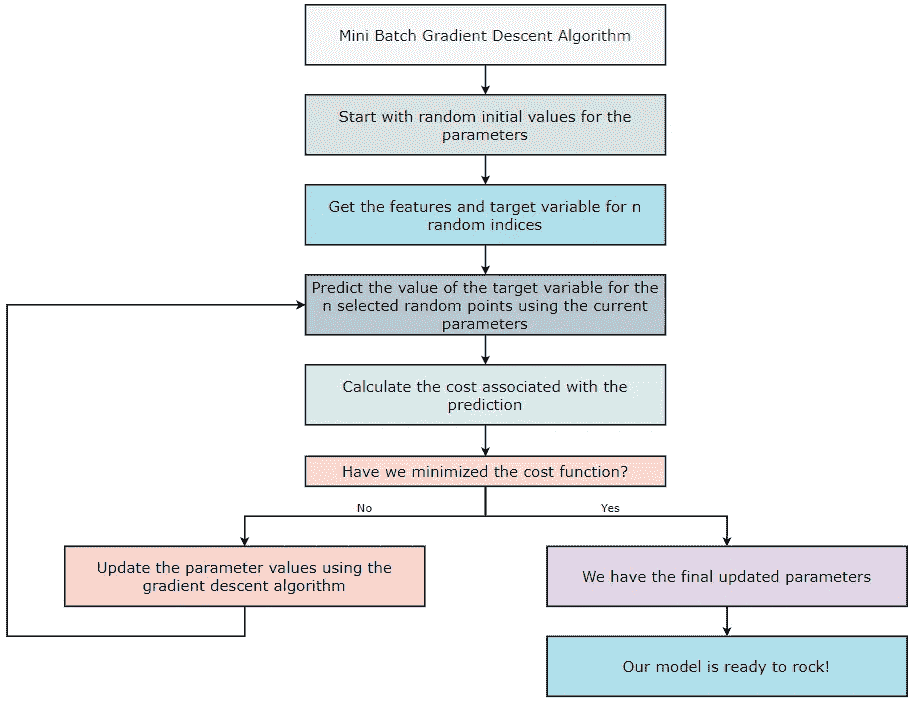

小批量梯度下降算法的工作原理

在批量梯度下降(BGD)算法中，我们考虑算法所有迭代的所有训练样本。然而，在随机梯度下降(SGD)算法中，我们只考虑一个随机训练例子。现在，在小批量梯度下降(MBGD)算法中，我们在每次迭代中考虑训练样本的随机子集。由于这不像 SGD 那样随机，我们更接近全局最小值。然而，MBGD 容易陷入局部极小值。让我们举个例子来更好地理解这一点。

> **批量梯度下降(BGD):**
> 
> 每次迭代的训练样本数= 100 万= 1⁰⁶
> 迭代次数= 1000 = 1⁰
> 要训练的参数数= 10000 = 1⁰⁴
> 总计算量= 1⁰⁶*1⁰ *1⁰⁴=1⁰
> 
> **随机梯度下降(SGD):**
> 
> 每次迭代的训练样本数= 1
> 迭代次数= 1000 = 1⁰
> 要训练的参数数= 10000 = 1⁰⁴
> 总计算量= 1*1⁰ *1⁰⁴ = 1⁰⁷
> 
> **小批量梯度下降(MBGD):**
> 
> 每次迭代的训练样本数= 100 =1⁰
> →这里，我们考虑 1⁰⁶.以外的 1⁰训练样本
> 迭代次数= 1000 = 1⁰
> 待训练参数数= 10000 = 1⁰⁴
> 总计算量= 1⁰ *1⁰ *1⁰⁴=1⁰⁹
> 
> **与批量梯度下降(BGD)的比较:**
> 
> BGD = 1⁰的总计算量
> mbgd =1⁰⁹的总计算量
> 
> **评估:**在本例中，MBGD 比 BGD 快 1⁰⁴倍。
> 
> **与随机梯度下降(SGD)的比较:**
> 
> SGD = 1⁰⁷的总计算量
> mbgd =1⁰⁹的总计算量
> 
> **评估:**在本例中，SGD 比 MBGD 快 1⁰倍。
> 
> **BGD、新加坡元和 MBGD 的比较**:
> 
> BGD= 1⁰的总计算量
> SGD =1⁰⁷的总计算量
> mbgd =1⁰⁹的总计算量
> 
> **评价:**新币> MBGD > BGD

**注意:**请注意，我们的成本函数不一定下降，因为我们在每次迭代中随机抽取训练样本。然而，随着我们执行越来越多的迭代，成本函数将逐渐减小。

现在，让我们看看如何在实践中实现小批量梯度下降(MBGD)算法。

## 1.第一步:

首先，我们从 GitHub 库下载数据文件。

从 GitHub 获取数据文件

## 2.第二步:

接下来，我们导入一些必需的库来读取、操作和可视化数据。

导入所需的库

## 3.第三步:

接下来，我们读取数据文件，然后打印它的前五行。

读取和打印数据

## 4.第四步:

接下来，我们将数据集分为要素和目标变量。

获取特征和目标变量

> 尺寸:X = (200，3)和 Y = (200，)

## 5.第五步:

为了在进一步的步骤中执行矩阵计算，我们需要对目标变量进行整形。

重塑 Y 轴上的数据

> 尺寸:X = (200，3)和 Y = (200，1)

## 6.第六步:

接下来，我们将对数据集进行规范化。

标准化数据

> 尺寸:X = (200，3)和 Y = (200，1)

## 7.第七步:

接下来，我们将获得`bias`和`weights`矩阵的初始值。在执行正向传播时，我们将在第一次迭代中使用这些值。

获取随机值来初始化我们的参数

> 维度:偏差= (1，1)和权重= (1，3)

## 8.第 8 步:

接下来，我们执行正向传播步骤。该步骤基于以下公式。


预测目标变量的值

> 维度:预测值= (1，1)+(200，3)*(3，1) = (1，1)+(200，1) = (200，1)

## 9.第九步:

接下来，我们将计算与我们的预测相关的成本。该步骤基于以下公式。


获取与预测相关的成本

> 维度:成本=标量值

## 10.第十步:

接下来，我们使用梯度下降算法更新权重和偏差的参数值。该步骤基于以下公式。请注意，我们不对权重值求和的原因是我们的权重矩阵不是一个`1*1`矩阵。


使用梯度下降算法更新参数

> 维度:db = sum(200，1) = (1，1)
> 
> 尺寸:dw = (1，200) * (200，3) = (1，3)
> 
> 维度:偏差= (1，1)和权重= (1，3)

## 11.第 11 步:

接下来，我们将使用我们刚刚定义的所有函数来运行梯度下降算法。此外，我们正在创建一个名为`cost_list`的空列表来存储所有迭代的成本值。在接下来的步骤中，我们将使用该列表绘制图表。

最小批量梯度下降算法

## 12.第 12 步:

接下来，我们实际上是在调用函数来获得最终结果。请注意，我们运行的是`200 iterations`的全部代码。同样，这里我们指定了`learning rate of 0.01`。

运行小批量梯度下降算法 200 次迭代

## 13.第十三步:

接下来，我们在所有迭代完成后打印`final weights`值。

在 200 次迭代后打印权重的最终值

## 14.第 14 步:

接下来，我们在所有迭代完成后打印`final bias`值。

在 200 次迭代后打印偏差的最终值

## 15.步骤 15:

接下来，我们绘制`iterations vs. cost`的图形。

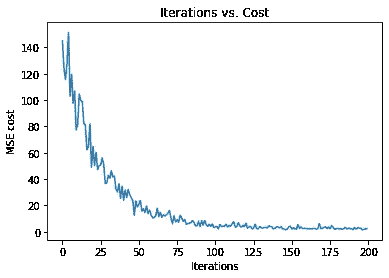

## 16.第 16 步:

接下来，我们绘制两个具有不同学习率的图形，以查看学习率在优化中的作用。在下图中我们可以看到，学习速率较高的图形`(0.01)`比学习速率较低的图形`(0.001)`收敛得更快。背后的原因是学习率越低的图，走的步数越小。

绘制不同学习速率下的批量梯度下降算法图

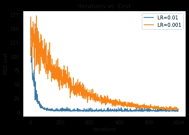

## 17.第 17 步:

把这些放在一起。

## 计算:

现在，让我们计算在实现批量梯度下降算法中执行的计算次数。

> **偏差:**(训练样本)x(迭代次数)x(参数)= 20 * 200 * 1 = 4000
> 
> **权重:**(训练示例)x(迭代次数)x(参数)= 20 * 200 *3 = 12000

## 图表比较:

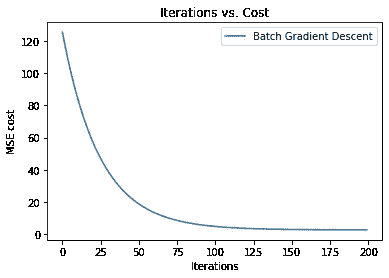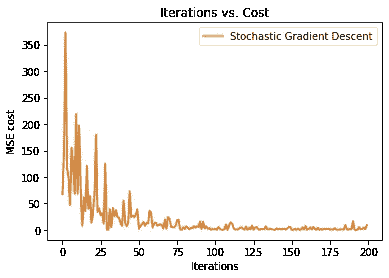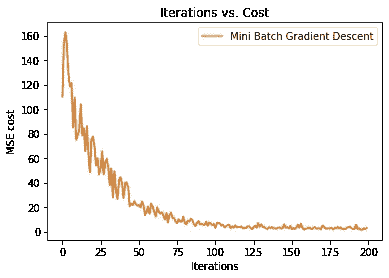

批量、随机和小批量梯度下降算法的比较

## 结束注释:

就这样，我们到达了梯度下降系列的终点！在这一部分中，我们深入研究了代码，看看三种主要类型的梯度下降算法是如何相互执行的，总结如下:

> **1。批次梯度下降**精确度→高
> 时间→更多
> 
> **2。随机梯度下降**
> 精度→低
> 时间→少
> 
> **3。小批量梯度下降**
> 精度→适中
> 时间→适中

我们希望你喜欢这个系列，并学到一些新的东西，无论你的起点或机器学习背景如何。随着你继续你的人工智能之旅，了解这种基本算法及其变体将很有价值，并更多地了解这种令人难以置信的技术的技术和宏大方面。留意其他提供更多机器学习课程的博客，并保持好奇！

[](https://www.buymeacoffee.com/pratu)

给普拉蒂克买杯咖啡！

## 资源:

1.  [](#f380)****——***[***Google Colab***](https://colab.research.google.com/drive/1E2Zhw9nujo6ARC3w1CB5cahzwwk4Ew5k?usp=sharing)*[***GitHub***](https://gist.github.com/Pratik-Shukla-22/8111be5605f8251d026800f15c6a229e#file-batch_gradient_descent-py)**
2.  **[***【随机梯度下降】***](#bfb4)***——***[***Google Colab***](https://colab.research.google.com/drive/16Bo-05gFHFqGzQAXTK2wJ57mro5bn00A?usp=sharing)***，***[***GitHub***](https://gist.github.com/Pratik-Shukla-22/da462cb50e5abe42cc6710ded0b69726#file-stochastic_gradient_descent-py)**
3.  **[***迷你批量渐变下降***](#817a)***——***[***Google Colab***](https://colab.research.google.com/drive/17PXc2XdMDRdMpzIXUlaTNKGOOS1u7PoZ?usp=sharing)*[***GitHub***](https://gist.github.com/Pratik-Shukla-22/d728e03457f8b817d594b6bda19c27fc#file-mini_batch_gradient_descent-py)***

## **引用:**

**对于学术背景下的归属，请引用该工作为:**

```
**Shukla, et al., “The Gradient Descent Algorithm & its Variants”, Towards AI, 2022**
```

## **BibTex 引文:**

```
**@article{pratik_2022, 
 title={The Gradient Descent Algorithm & its Variants}, 
 url={[https://towardsai.net/p/l/the-gradient-descent-algorithm-and-its-variants](https://towardsai.net/p/l/the-gradient-descent-algorithm-and-its-variants)}, 
 journal={Towards AI}, 
 publisher={Towards AI Co.}, 
 author={Pratik, Shukla},
 editor={Lauren, Keegan},  
 year={2022}, 
 month={Oct}
}**
```

**参考资料:**

1.  **[梯度下降—维基百科](https://en.wikipedia.org/wiki/Gradient_descent)**