# 梯度下降算法

> 原文：<https://pub.towardsai.net/the-gradient-descent-algorithm-defddd1d312e?source=collection_archive---------0----------------------->


图片由 [Anja](https://pixabay.com/users/cocoparisienne-127419/?utm_source=link-attribution&utm_medium=referral&utm_campaign=image&utm_content=2100050) 来自 [Pixabay](https://pixabay.com//?utm_source=link-attribution&utm_medium=referral&utm_campaign=image&utm_content=2100050)

## 梯度下降算法的内容、原因和方法

**作者:** [普拉蒂克·舒克拉](https://www.linkedin.com/in/pratik-shukla28/)

> “无聊的解药是好奇心。好奇心是无法治愈的。”— [多萝西·帕克](https://en.wikipedia.org/wiki/Dorothy_Parker)

## 梯度下降系列博客:

1.  [梯度下降算法](/the-gradient-descent-algorithm-defddd1d312e)(你来了！)
2.  [梯度下降算法背后的数学直觉](/mathematical-intuition-behind-the-gradient-descent-algorithm-143a051c3fa9)
3.  [梯度下降算法&及其变种](/the-gradient-descent-algorithm-and-its-variants-e0915796dbf2)

## 目录:

1.  [梯度下降系列的动机](#67a3)
2.  [什么是梯度下降算法？](#3464)
3.  [梯度下降算法背后的直觉](#d9ed)
4.  [为什么我们需要梯度下降算法？](#15cf)
5.  [梯度下降算法是如何工作的？](#d4b3)
6.  [梯度下降算法的公式](#d596)
7.  为什么我们要使用渐变？
8.  [方向衍生工具简介](#bf11)
9.  最陡的上坡方向是什么？
10.  [证明最陡上坡方向的例子](#dea5)
11.  [梯度下降算法中(—)符号的解释](#a8f7)
12.  [为什么学习率？](#bd08)
13.  [微分的一些基本规则](#28f3)
14.  [单变量梯度下降算法](#0a99)
15.  [两变量梯度下降算法](#640b)
16.  [结论](#4e1d)
17.  [参考资料和资源](#8853)

## 梯度下降系列的动机:

我们很高兴介绍我们的第一个关于机器学习算法的博客系列！我们希望让我们的读者了解机器学习算法背后的基本原理。如今，众多 Python 包中的一个可以用来实现大多数机器学习算法。我们可以使用这些 Python 包在几分钟内快速实现任何机器学习方法。我们觉得很有趣，你觉得呢？然而，当许多学生和专业人士需要对算法进行更改时，他们会很纠结。为了了解机器学习算法如何在其核心发挥作用，我们开发了这一系列博客。我们打算在未来提供一个关于更多机器学习算法的简短系列，我们希望你会发现这一个令人兴奋和有价值的！

优化是机器学习的核心——它是让算法的结果以我们希望的方式“好”的很大一部分。许多机器学习算法使用梯度下降算法来寻找其参数的最优值。因此，理解梯度下降算法对于理解 AI 如何产生好的结果是必不可少的。

在本系列的第一部分中，我们将提供梯度下降算法是什么、为什么和如何的背景知识。在第二部分，我们将为您提供一个强大的数学直觉，关于梯度下降算法如何找到其参数的最佳值。在本系列的最后一部分，我们将比较梯度下降算法的变体和它们在 Python 中精心编写的代码示例。本系列面向初学者和专家——一起来，都来！

## 什么是梯度下降算法？

维基百科对短语梯度下降的正式定义如下:

> 数学上，梯度下降是**一种寻找可微函数局部极小值的一阶迭代优化算法**。

梯度下降是一种机器学习算法，它迭代地寻找其参数的最佳值。该算法在更新参数值时考虑函数的梯度、用户定义的学习率和初始参数值。

## 梯度下降算法背后的直觉:

让我们用一个比喻来形象化梯度下降在行动中是什么样子。假设我们正在爬山，不幸的是，当我们正在爬山的时候，天开始下雨了。我们的目标是尽快下山寻找避难所。那么，我们的策略是什么呢？记住，因为下雨，我们看不到很远。在我们周围的所有方向，我们只能感知附近的运动。

我想到的是。我们将扫描我们周围的区域，寻找一个能让我们尽快降落的地方。一旦我们发现 ***方向的*** ，我们就会朝那个方向迈出 ***小步*** 。我们将继续这样做，直到到达山脚。所以，本质上，这就是梯度下降法定位全局最小值(我们正在分析的整个数据集的最低点)的方式。下面是我们如何将这个例子与梯度下降算法联系起来。

> 当前位置→ → →初始参数
> 婴儿步→ → →学习速率
> 方向→ → →偏导数(梯度)

## 为什么我们需要梯度下降算法？

在许多机器学习模型中，我们的最终目标是找到最佳参数值，以降低与预测相关的成本。为此，我们首先从这些参数的随机值开始，并试图找到最佳值。为了找到最优值，我们使用梯度下降算法。

## 梯度下降算法是如何工作的？

1.  从参数的随机初始值开始。
2.  使用当前参数预测目标变量的值。
3.  计算与预测相关的成本。
4.  我们把成本降到最低了吗？如果是，则转到步骤 6。如果没有，则转到步骤 5。
5.  使用梯度下降算法更新参数值，并返回步骤 2。
6.  我们有了最终的更新参数。
7.  我们的模型可以(下山)了！

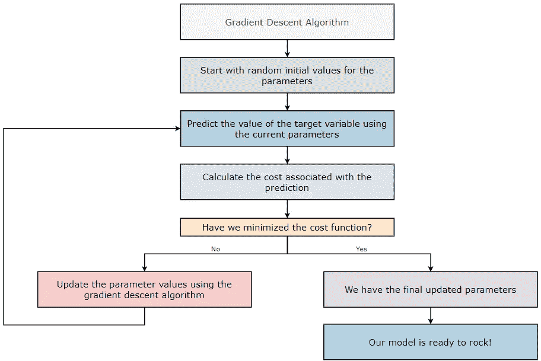

图 1:梯度下降算法如何工作

## 梯度下降算法的公式:

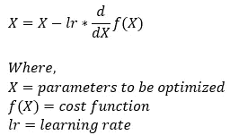

图 2:梯度下降算法的公式

现在，让我们来理解上面公式中提到的每个术语背后的含义。我们先从理解方向导数开始。

> **注:**我们的最终目标是尽快找到最优参数。所以，我们需要一些东西来帮助我们尽快朝着正确的方向前进。

## 为什么我们要使用渐变？

> **渐变:**渐变只不过是一个向量，其条目是函数的偏导数。

假设我们有一个一元函数***【f(x)******x***。在这种情况下，我们将只有一个偏导数。下图所示的偏导数给出了函数在 ***x*** 方向(沿 ***x 轴*** )变化(增加或减少)的速度值。我们可以把偏导数写成梯度形式如下。

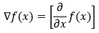

图 3:一个元素的渐变

假设我们有一个函数 ***f(x，y)*** 两个变量， ***x*** 和 ***y*** 。在这种情况下，我们将有两个偏导数。下图所示的偏导数给出了函数在 ***x*** 方向和 ***y*** 方向(沿 ***x 轴*** 和 ***y 轴*** )变化(增加或减少)的速度值。我们可以把偏导数写成梯度形式如下。

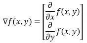

图 4:两个元素的渐变

概括一下这个，我们可以有一个函数有 ***n 个*** 变量，它的梯度会有 ***n 个*** 元素。

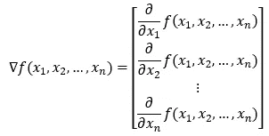

图 5:n 个元素的渐变

但现在的问题是，如果我们想在一些方向上求导，而不仅仅是沿着轴，会怎么样？我们知道，从一个给定的点出发，我们可以向无数个方向行进。现在，为了找到任意方向的梯度，我们将使用方向导数的概念。

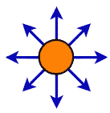

图 6:我们可以从一个点向无数个方向迈出一步。

## 方向导数简介；

> **单位向量**:单位向量是一个大小为 1 的向量。

我们如何找到向量的长度或大小？

考虑向量 u 的下列情况。

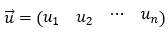

图 7:向量 u

然后，向量的长度被计算为其所有分量平方之和的平方根。


图 8:向量 u 的长度

一个函数 ***f(x，y)*** 在 ***向量 u*** (一个单位向量)方向上的导数由该函数的 ***与 ***单位向量 u*** 的梯度的***点积给出。数学上，我们可以用下面的形式来表示。******

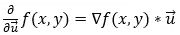

图 9:方向导数

上式给出了 ***f(x，y)*** 在任意方向的偏导数。现在，让我们看看它是如何工作的，如果我们想找到沿 x 轴的偏导数。第一，如果要求 x 方向的偏导数，那么 ***单位向量 u*** 就会是 ***(1，0)*** 。现在，我们来计算沿 ***x 轴*** 的偏导数。

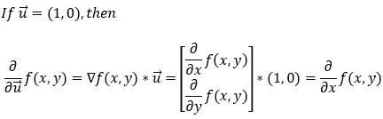

图 10:沿 x 轴的偏导数

接下来，让我们看看，如果我们想找到沿 y 轴的偏导数，它是如何工作的。首先，如果要求 y 方向的偏导数，那么 ***单位向量 u*** 就会是 ***(0，1)*** 。现在，让我们计算沿 ***y 轴*** 的偏导数。

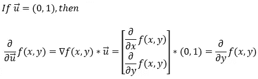

图 11:沿 y 轴的偏导数

> **注意:**单位向量的长度(大小)必须为 1。

现在我们知道了如何找到所有方向的偏导数，我们需要找到偏导数给我们带来最大变化的方向，因为，在我们的情况下，我们希望尽快找到最佳值。

## 最陡的上坡方向是什么？

现在，我们知道方向导数如下所示。

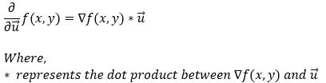

图 12:方向导数

接下来，我们可以用两个向量之间角度的余弦值来代替它们之间的点积。

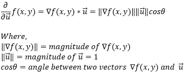

图 13:方向导数

注意，因为 u 是一个单位向量，它的大小总是 1。

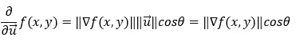

图 14:方向导数

现在，在上面的等式中，我们无法控制梯度的大小。我们只能控制角度 ***θ*** 。所以，为了最大化函数的偏导数，我们需要最大化 ***cosθ*** 。现在我们都知道 ***cosθ*** 最大化(1)当***θ= 0***(***cos 0 = 1***)。这意味着当梯度和单位向量之间的角度为 0 时，导数的值最大。换句话说，我们可以说，当单位向量(方向向量)指向梯度的方向时，偏导数的值最大。

所以，总之，我们可以说，找到梯度方向的偏导数，给了我们最快速的上升。现在，让我们借助一个例子来理解这一点。

## 证明最陡上升方向的示例:

求函数 ***f(x，y) = x + y*** 在 ***(3，2)*** 点的梯度。

## 1.第一步:

我们有一个函数 ***f(x，y)*** 两个变量 ***x 和*** 。

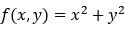

图 15:函数 f(x，y)

## 2.第二步:

接下来，我们将找到函数的梯度。因为函数中有两个变量，所以梯度向量中有两个元素。

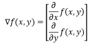

图 16:f(x，y)的梯度

## 3.第三步:

接下来我们在计算函数 ***f(x，y) = x + y*** 的梯度。

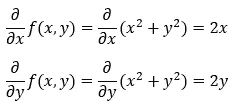

图 17:f(x，y)的偏导数

## 4.第四步:

函数的梯度可以写成如下形式。

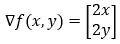

图 18:f(x，y)的梯度

## 5.第五步:

接下来，我们计算函数在 ***(3，2)*** 点的梯度。

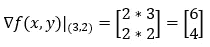

图 19:点(3，2)处 f(x，y)的梯度

## 6.第六步:

接下来我们在求函数 ***f(x，y)*** 沿 x 轴 ***(1，0)*** 的偏导数。

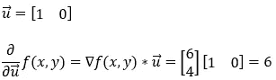

图 20:沿 x 轴在点(3，2)处 f(x，y)的梯度

## 7.第七步:

接下来我们在求函数 f(x，y)沿 y 轴的偏导数 ***(0，1)*** 。

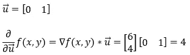

图-21:f(x，y)在点(3，2)处沿 y 轴的梯度

## 8.第 8 步:

接下来我们求出函数 ***f(x，y)*** 在 ***(1，1)*** 方向的偏导数。注意，这里我们必须考虑单位向量的大小。

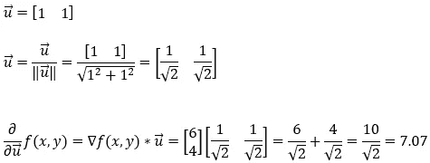

图-22:f(x，y)在点(3，2)处沿(1，1)方向的梯度

## 9.第九步:

接下来我们求出函数***【x，y】***在梯度***【3，2】***方向的偏导数。请注意，这是梯度向量的方向。同样，这里我们必须考虑单位向量的大小。

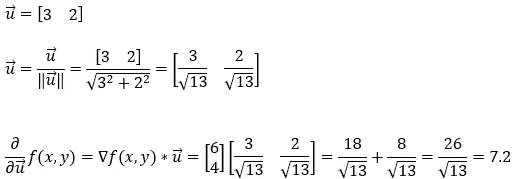

图-23:f(x，y)在点(3，2)处沿(3，2)方向的梯度

## 10.第十步:

所以，根据 [Step — 6](#815e) 、 [Step — 7](#da77) 、 [Step — 8](#00a1) 、 [Step — 9](#3b96) 的计算，我们可以很有信心地说**、*最陡上坡*、**的方向就是坡度的方向。

在梯度下降算法中，我们的目标是尽可能快地找到最优参数。这就是我们在梯度下降算法中使用偏导数的原因。

但是等等…有一个陷阱！

在梯度下降算法中，我们希望找到最小点。然而，使用梯度将引导我们到最高点，因为它给我们最陡的上升。那么，我们该怎么办？

## 梯度下降算法中(—)符号的解释:

现在，我们知道坡度给了我们最陡的上升。所以，如果我们沿着最陡的上升方向前进，我们将永远不会到达最低点。我们的最终目标是快速找到一个到达最小点的方法。所以，要往 ***最陡下降*** 的方向走，我们就要往 ***最陡上升的*** 的相反方向走。这就是我们使用 ***( — )*** 符号的原因。

## 为什么是学习率？

请注意，我们无法控制梯度的大小。偶尔我们可能会得到一个非常高的梯度值。因此，如果我们不设法减缓变化的速度，我们最终会取得很大的进步。重要的是要记住，高学习率可能只给我们提供次优的参数值。相反，较低的学习速率可能需要更多的训练时期来获得最佳值。

梯度下降方法有一个超参数，它调节我们的模型学习新信息的速度。这个超参数被称为学习率。我们模型的学习率决定了参数值改变的速度。我们必须将学习速度设定在最佳值。如果学习率太高，我们的模型可能会大步前进，错过最小值。因此，较高的学习速率可能导致模型不收敛。另一方面，如果学习量太小，模型收敛的时间就会太长。

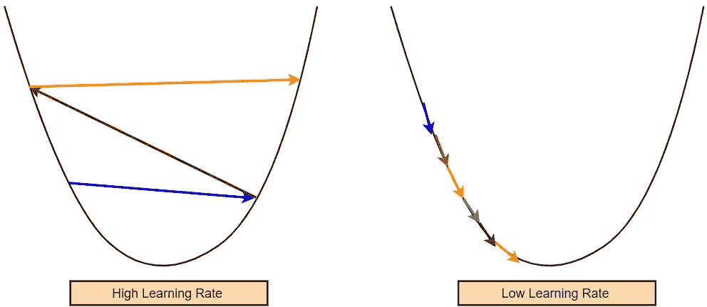

图 24:学习率

## 区分的一些基本规则:

1.标量乘法规则:

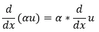

图 25:标量乘法规则

2.求和规则:

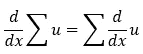

图 26:求和规则

3.权力法则:

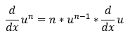

图 27:权力法则

4.连锁法则:

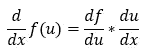

图 28:链式法则

现在，让我们举几个例子来理解梯度下降算法是如何工作的。

## 一个变量的梯度下降:

让我们从一个非常简单的成本函数开始。假设我们有一个成本函数*(****J(θ)=θ)***只涉及一个参数*(****【θ】***，我们的目标是找到参数的最优值( ***θ*** )，使其最小化成本函数 *(* ***J(θ) = θ***

从我们的代价函数*(****J(θ)=θ****)，*我们可以很清楚的说在 ***θ=0 时会最小。然而，当我们处理更复杂的函数时，得出这样的结论并不容易。为此，我们将使用梯度下降算法。让我们看看如何应用梯度下降算法找到参数的最优值( ***θ*** )。***

## 1.第一步:

我们的带有一个参数的成本函数(***【θ】***)由下式给出:

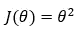

图 29:一个变量的成本函数

## 2.第二步:

我们的最终目标是通过寻找参数 ***θ的最优值来最小化成本函数。***

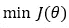

图 30:最小化成本函数

## 3.第三步:

梯度下降算法的公式如下。

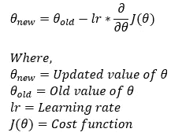

图 31:梯度下降算法

## 4.第四步:

为了简化计算，我们考虑学习率为 0.1。

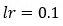

图 32:学习率

## 5.第五步:

接下来，我们找到成本函数的偏导数。

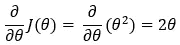

图 33:成本函数的偏导数

## 6.第六步:

接下来，我们使用 [Step — 5](#02a5) 的偏导数，并将其代入 [Step — 3](#6fb1) 中给出的公式。

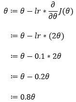

图-34:使用梯度下降算法更新参数

## 7.第七步:

现在，让我们借助一个例子来理解梯度下降算法是如何工作的。这里，我们从 ***θ=5，*** 的值开始，我们将找到 ***θ*** 的最佳值，使得它最小化成本函数。接下来，我们也将从 ***θ=-5*** 的值开始，检查它是否能找到成本函数的最优值。请注意，这里我们使用上面导出的梯度下降规则来更新参数 ***θ的值。***

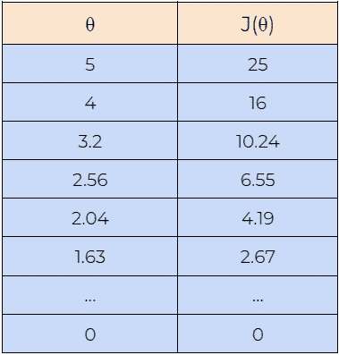

图 35:不同数据点的成本值

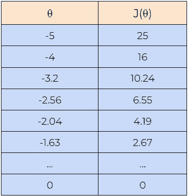

图 36:不同数据点的成本值

## 8.第 8 步:

接下来，我们绘制上表所示的数据图表。从图中可以看出，梯度下降算法能够找到 ***θ*** 的最优值，并使代价函数 ***J(θ)最小化。***

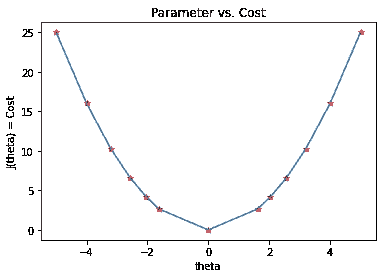

图— 37:参数与成本函数的关系图

## 两个变量的梯度下降:

现在，让我们转到有两个变量的成本函数，看看情况如何。

## 1.第一步:

我们的带有两个参数 ***(θ1 和θ2)*** 的成本函数由下式给出:

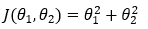

图 38:带有两个参数的成本函数

## 2.第二步:

我们的最终目标是通过寻找参数 ***θ1 和θ2 的最优值来最小化代价函数。***

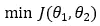

图 39:最小化成本函数

## 3.第三步:

梯度下降算法的公式如下。


图 40:梯度下降算法

## 4.第四步:

我们将使用在[步骤 3](#5324) 中给出的公式来找到我们的参数 ***θ1 和θ2 的最佳值。***

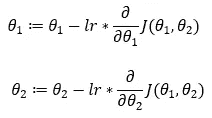

图-41:使用梯度下降算法更新参数

## 4.第四步:

接下来，我们找到成本函数相对于参数 ***θ1 和θ2 的偏导数。***

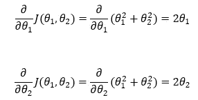

图 42:成本函数的偏导数

## 5.第五步:

接下来，我们使用在[步骤— 4](#57da) 中导出的偏导数来替换[步骤— 3](#5324) 。

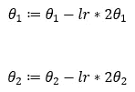

图-43:使用梯度下降算法更新参数

## 6.第六步:

为了简化计算，我们将使用 0.1 的学习率。


图 44:学习率

## 7.第七步:

现在，让我们借助一个例子来理解梯度下降算法是如何工作的。这里，我们从 ***θ1=1 和θ2=1，*** 的值开始，我们将找到 ***θ1 和θ2*** 的最优值，使得它最小化成本函数。接下来，我们还将从 ***θ1=-1 和θ2=-1*** 的值开始，检查梯度下降算法是否能找到代价函数的最优值。

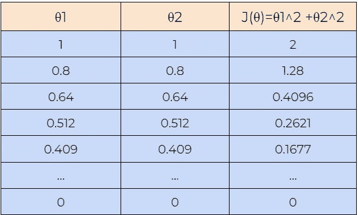

图 45:不同数据点的成本值

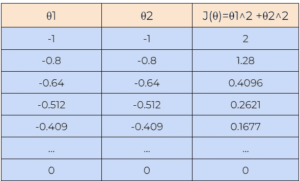

图 46:不同数据点的成本值

## 8.第 8 步:

接下来，我们绘制上表所示的数据图表。从图中可以看出，梯度下降算法能够找到 ***θ1 和θ2*** 的最优值，并使代价函数 ***J(θ)最小化。***

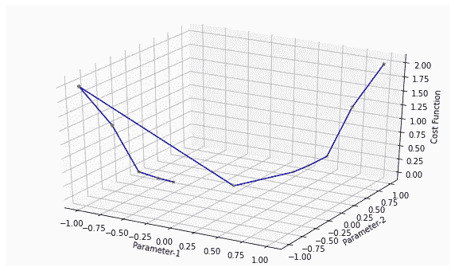

图— 47:参数与成本函数的关系图

## 结论:

你有它！我们已经复习了梯度下降算法的基础知识及其在机器学习中的重要作用。随意检查第一遍可能不清楚的计算或概念。现在你已经成功地学习了如何下山，在梯度下降系列的下一期文章中学习梯度下降帮助解决问题的其他方法。

[](https://www.buymeacoffee.com/pratu)

给普拉蒂克买杯咖啡！

## 引用:

对于学术背景下的归属，请引用该工作为:

```
Shukla, et al., “The Gradient Descent Algorithm”, Towards AI, 2022
```

## BibTex 引文:

```
@article{pratik_2022, 
 title={The Gradient Descent Algorithm}, 
 url={[https://towardsai.net/p/l/the-gradient-descent-algorithm](https://towardsai.net/p/l/the-gradient-descent-algorithm)}, 
 journal={Towards AI}, 
 publisher={Towards AI Co.}, 
 author={Pratik, Shukla},
 editor={Lauren, Keegan},  
 year={2022}, 
 month={Oct}
}
```

## 参考资料和资源:

1.  [梯度下降——维基百科](https://en.wikipedia.org/wiki/Gradient_descent)