# Duck DB 数据分析指南

> 原文：<https://pub.towardsai.net/the-guide-to-data-analysis-with-duck-db-93a79950a08f?source=collection_archive---------0----------------------->

## Duck DB 将帮助您在数据分析职业生涯中更上一层楼。该指南将帮助您理解 Python API 和使用 SQL 脚本读取 CSV 文件的各种方法


作者图片

数据分析师的生活围绕着通过 SQL serve 加载数据，使用各种 Python 包分析数据，并最终创建技术报告。有时这些 SQL 查询可能需要更长的时间来处理，因为您的数据是以 TB 为单位的。在这个快节奏的世界中，这种策略失败得很惨，大多数分析正在脱离传统的数据分析方式。 [DuckDB](https://duckdb.org/) 解决了上面提到的所有问题，它与 Python & R 集成。该数据库的工作方式类似于 SQLite，专注于提供更快的分析查询。

在本指南中，我们将深入学习运行 DuckDB SQL 查询的各种方式，并了解 Deepnote 集成。

# DuckDB

DuckDB 是一个面向关系表的数据库管理系统，支持 SQL 查询来生成分析结果。它还附带了各种对数据分析有用的功能。

## 快速分析查询

DuckDB 旨在运行更快的分析查询工作负载。它运行在一个列向量化的查询执行引擎上，该引擎可以一次性运行大量的流程。这使得运行[在线分析处理(OLAP)](https://en.wikipedia.org/wiki/Online_analytical_processing) 比 PostgreSQL 等传统系统更快，后者按顺序处理每一行。

## 简单操作

DuckDB 采用简单性和嵌入式操作。

*   没有外部依赖性的无服务器数据库
*   处理查询时不导入或复制数据
*   嵌入到宿主进程中
*   高速数据传输

## 功能丰富

DuckDB 允许用户流畅地运行复杂的 SQL 查询。它还支持二级索引，以在单文件数据库中提供快速查询。DuckDB 为 Python 和 R 提供了完全的集成，因此查询可以在同一个文件中执行。

## 免费和开源

DuckDB 可以免费使用，完整的代码可以在 GitHub 上获得。它带有麻省理工学院的许可证，这意味着你可以将它用于商业目的。

# 正在创建数据库

DuckDB 为您提供了连接数据库或使用类似命令`duckdb.connect(<db name>,read_only=False)`创建新数据库的 box 体验。正如您在下图中看到的，SampleDB 文件已经在您的目录中创建。

```
import duckdb
conn = duckdb.connect(“SampleDB”,read_only=False)
```


作者图片

运筹学

DuckDB 还允许您使用`duckdb.connect()`创建内存中的临时数据库。`conn.execute()`运行数据库中的所有查询请求。在本例中，我们将创建一个名为 *test_table* 的临时表，其中包含整数形式的 **i** 和字符串形式的 **j** 。如果你熟悉 SQL，理解查询请求不会有问题，但是如果你是 SQL 新手，我建议你看看这个神奇的备忘单。

```
conn = duckdb.connect()# run arbitrary SQL commands
conn.execute(“CREATE TABLE test_table (i INTEGER, j STRING)”)
```

## 插入值

您可以使用 SQL 命令插入单个或多个值。在这一部分，我们使用 execute 向 *test_table* 添加两个值。

```
conn.execute(“INSERT INTO test_table VALUES (1, ‘one’),(9,’nine’)”)
```

为了检查我们是否已经成功添加了值，我们将运行 SQL 来读取 **i.** 的所有值。为了在[熊猫](https://pandas.pydata.org/)数据框架中显示查询结果，我们将添加`.fetchdf()`，如下所示。**干得好，**我们已经成功地添加了我们的菲力两个值。

```
conn.execute(“SELECT i from test_table “).fetchdf()
```

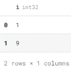

我们还可以使用占位符作为参数，然后向 *test_table* 添加一个数组。如果您熟悉 Python 框架，您会发现这种方法很容易执行。我们也可以使用`.executemany()`一次执行多个值。正如您在下面看到的，我们已经成功地将值添加到了 *test_table* 中。

```
conn.execute(“INSERT INTO test_table VALUES (?, ?)”, [2, ‘two’])conn.executemany(“INSERT INTO test_table VALUES (?, ?)”, [[3, ‘three’], [4, ‘four’]])conn.execute(“SELECT * from test_table “).fetchdf()
```

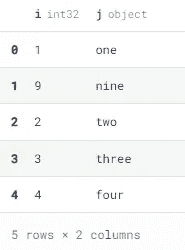

使用`.fetchnumpy()`以一个 [NumPy](https://numpy.org/) 数组的形式显示你的结果。事情将变得非常有趣，因为我们将学习各种方法来执行复杂的 SQL 查询以进行数据分析

```
**conn.execute(“SELECT * FROM test_table”).fetchnumpy()**{'i': array([1, 9, 2, 3, 4, 1, 9, 2, 3, 4, 1, 9, 2, 3, 4, 1, 9, 2, 3, 4, 1, 9,
        2, 3, 4, 1, 9, 2, 3, 4], dtype=int32),
 'j': array(['one', 'nine', 'two', 'three', 'four', 'one', 'nine', 'two',
        'three', 'four', 'one', 'nine', 'two', 'three', 'four', 'one',
        'nine', 'two', 'three', 'four', 'one', 'nine', 'two', 'three',
        'four', 'one', 'nine', 'two', 'three', 'four'], dtype=object)}
```

# 熊猫数据框架和 SQL

在这一节中，我们将使用 pandas dataframe 并学习读取`.csv`文件的各种方法。首先，我们将使用字典创建一个简单的熊猫数据帧，然后我们将它添加到一个名为 *test_df 的新表中。*

使用 SQL 脚本查找所有的值 **j** ，其中 **i** 大于 1。查询结果显示三个样本符合我们的条件。

```
import pandas as pdtest_df = pd.DataFrame.from_dict({“i”:[1, 2, 3, 4], “j”:[“one”, “two”, “three”, “four”]})conn.register(“test_df”, test_df)conn.execute(“SELECT j FROM test_df WHERE i > 1”).fetchdf()
```

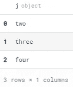

下一步，我们将把`.csv`导入到 pandas dataframe 中，然后把它添加到新表 *bank_df* 中。本例中使用的数据集来自 [GPL2](http://www.gnu.org/licenses/old-licenses/gpl-2.0.en.html) 许可下的 [Kaggle](https://www.kaggle.com/kingabzpro/bank-debt-data) 。结果显示年龄大于 27 岁时的实际回收量。随着每一步的进行，我们复杂的查询变得越来越容易执行。

```
df = pd.read_csv(“bank_data.csv”)conn.register(“bank_df”, df)conn.execute(“SELECT actual_recovery_amount FROM bank_df WHERE age > 27”).fetchdf()
```

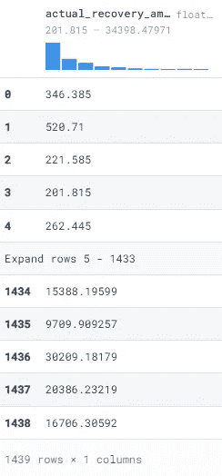

# 关系

关系 API 使用编程查询来评估关系命令链。简而言之，您可以对关系运行 python 函数并显示结果。结果包含经验树、列中的结果和预览中的结果。如果你现在感到困惑，那也没关系，因为我们将深入研究关系以及如何使用它们来获得分析结果。

## 装载关系

使用`conn.from_df(test_df)`从现有的 Pandas 数据帧 *test_df* 创建关系。通过打印`rel`，我们可以可视化整个数据帧。

```
**rel = conn.from_df(test_df)****rel**---------------------
-- Expression Tree --
---------------------
pandas_scan(140194817412592)

---------------------
-- Result Columns  --
---------------------
- i (BIGINT)
- j (VARCHAR)

---------------------
-- Result Preview  --
---------------------
i	j	
BIGINT	VARCHAR	
[ Rows: 4]
1	one	
2	two	
3	three	
4	four
```

您也可以使用`duckdb.df()`获得类似的结果。

```
rel = duckdb.df(test_df)
```

使用`conn.table`从现有表格创建一个关系。在我们的例子中，我们使用的是*测试 _ 表*。

```
**rel = conn.table(“test_table”)****rel**---------------------
-- Expression Tree --
---------------------
Scan Table [test_table]

---------------------
-- Result Columns  --
---------------------
- i (INTEGER)
- j (VARCHAR)

---------------------
-- Result Preview  --
---------------------
i	j	
INTEGER	VARCHAR	
[ Rows: 5]
1	one	
9	nine	
2	two	
3	three	
4	four
```

使用`.from_csv_auto`直接从`.csv`文件创建关系。

```
**rel = duckdb.from_csv_auto(“bank_data.csv”)****rel**---------------------
-- Expression Tree --
---------------------
read_csv_auto(bank_data.csv)

---------------------
-- Result Columns  --
---------------------
- id (INTEGER)
- expected_recovery_amount (INTEGER)
- actual_recovery_amount (DOUBLE)
- recovery_strategy (VARCHAR)
- age (INTEGER)
- sex (VARCHAR)

---------------------
-- Result Preview  --
---------------------
id	expected_recovery_amount	actual_recovery_amount	recovery_strategy	age	sex	
INTEGER	INTEGER	DOUBLE	VARCHAR	INTEGER	VARCHAR	
[ Rows: 10]
2030	194	263.540000	Level 0 Recovery	19	Male	
1150	486	416.090000	Level 0 Recovery	25	Female	
380	527	429.350000	Level 0 Recovery	27	Male	
1838	536	296.990000	Level 0 Recovery	25	Male	
1995	541	346.385000	Level 0 Recovery	34	Male	
731	548	520.710000	Level 0 Recovery	35	Male	
221	549	221.585000	Level 0 Recovery	33	Male	
1932	560	373.720000	Level 0 Recovery	19	Female	
1828	562	201.865000	Level 0 Recovery	22	Female	
2001	565	504.885000	Level 0 Recovery	27	Male
```

## 关系信息

使用`rel.alias`检查赋予关系的名称。在我们的例子中，它是 *bank_data.csv.*

```
**rel.alias**'bank_data.csv'
```

我们可以通过使用`.set_alias`来改变当前的别名。这可能对加入类似的关系有用。

```
**rel2 = rel.set_alias(‘bank_data’)****rel2.alias**'bank_data'
```

我们在*子查询 _ 关系中的关系类型。*

```
**rel.type**'SUBQUERY_RELATION'
```

要检查关系的列名，只需使用`.columns`。

```
**rel.columns**['id',
 'expected_recovery_amount',
 'actual_recovery_amount',
 'recovery_strategy',
 'age',
 'sex']
```

使用`.types` 检查色谱柱类型。

```
**rel.types**['INTEGER', 'INTEGER', 'DOUBLE', 'VARCHAR', 'INTEGER', 'VARCHAR']
```

## 应用类似 python 的函数(单一函数)

现在有趣的部分来了。您可以使用该关系添加任何函数，它将显示增强的结果。在我们的例子中，我们使用了`rel.filter`，它显示年龄大于 18 岁的结果。它还显示了关于表达式树的附加信息，如果要运行一个很长的复杂查询，这将非常有用。

```
**rel.filter(‘age > 18’)**---------------------
-- Expression Tree --
---------------------
Filter [age>18]
  read_csv_auto(bank_data.csv)

---------------------
-- Result Columns  --
---------------------
- id (INTEGER)
- expected_recovery_amount (INTEGER)
- actual_recovery_amount (DOUBLE)
- recovery_strategy (VARCHAR)
- age (INTEGER)
- sex (VARCHAR)

---------------------
-- Result Preview  --
---------------------
id	expected_recovery_amount	actual_recovery_amount	recovery_strategy	age	sex	
INTEGER	INTEGER	DOUBLE	VARCHAR	INTEGER	VARCHAR	
[ Rows: 10]
2030	194	263.540000	Level 0 Recovery	19	Male	
1150	486	416.090000	Level 0 Recovery	25	Female	
380	527	429.350000	Level 0 Recovery	27	Male	
1838	536	296.990000	Level 0 Recovery	25	Male	
1995	541	346.385000	Level 0 Recovery	34	Male	
731	548	520.710000	Level 0 Recovery	35	Male	
221	549	221.585000	Level 0 Recovery	33	Male	
1932	560	373.720000	Level 0 Recovery	19	Female	
1828	562	201.865000	Level 0 Recovery	22	Female	
2001	565	504.885000	Level 0 Recovery	27	Male
```

使用`.project` 将显示提到的列，在我们的例子中显示的是 **id** 和**年龄。**

```
# project the relation, get some columns**rel.project(‘id, age’)**---------------------
-- Expression Tree --
---------------------
Projection [id, age]
  read_csv_auto(bank_data.csv)

---------------------
-- Result Columns  --
---------------------
- id (INTEGER)
- age (INTEGER)

---------------------
-- Result Preview  --
---------------------
id	age	
INTEGER	INTEGER	
[ Rows: 10]
2030	19	
1150	25	
380	27	
1838	25	
1995	34	
731	35	
221	33	
1932	19	
1828	22	
2001	27
```

您可以通过添加数字或使用任何算术函数来转换列值。在我们的例子中，它用+1 显示年龄。

```
**rel.project(‘age + 1’)**---------------------
-- Expression Tree --
---------------------
Projection [age + 1]
  read_csv_auto(bank_data.csv)

---------------------
-- Result Columns  --
---------------------
- age + 1 (INTEGER)

---------------------
-- Result Preview  --
---------------------
age + 1	
INTEGER	
[ Rows: 10]
20	
26	
28	
26	
35	
36	
34	
20	
23	
28
```

顺序类似于 SQL 脚本`ORDER`。

```
rel.order(‘sex’)
```

`.limit`显示表格中的顶级样本。在我们的例子中，它将只显示前 2 个值。

```
rel.limit(2)
```

## 将所有函数堆叠在一个链中

就像在 R 中一样，您可以堆叠所有的函数来获得 SQL 输出。在我们的例子中，它显示了年龄*大于 27 岁的人的前两个 *actual_recovery_amount* ，按*性别*排序。我们现在意识到表达式树的全部优势。*

```
**rel.filter(‘age > 27’).project(‘actual_recovery_amount’).order(‘sex’).limit(2)** ---------------------
-- Expression Tree --
---------------------
Limit 2
  Order [sex DESC]
    Projection [actual_recovery_amount]
      Filter [age>27]
        read_csv_auto(bank_data.csv)

---------------------
-- Result Columns  --
---------------------
- actual_recovery_amount (DOUBLE)

---------------------
-- Result Preview  --
---------------------
actual_recovery_amount	
DOUBLE	
[ Rows: 2]
278.720000	
245.000000
```

## 聚合函数

聚合函数可以执行多个组任务。在这种情况下，它是所有实际回收金额的总和。

```
**rel.aggregate(“sum(actual_recovery_amount)”)**---------------------
-- Result Preview  --
---------------------
sum(actual_recovery_amount)	
DOUBLE	
[ Rows: 1]
7529821.469511
```

以下函数将显示每个年龄组的 *actual_recovery_amount* 的总和。我们有年龄栏和总和栏。这太酷了，因为我们把两个功能简化成了一个。

```
**rel.aggregate(“age, sum(actual_recovery_amount)”)**---------------------
-- Result Preview  --
---------------------
age	sum(actual_recovery_amount)	
INTEGER	DOUBLE	
[ Rows: 10]
19	52787.712089	
25	72769.342330	
27	67569.292950	
34	109902.427032	
35	115424.466724	
33	138755.807230	
22	46662.153746	
31	92225.534688	
18	39969.573274	
32	110627.466806
```

如果您只想显示 actual _recovery 金额的总和，则添加 group by 列作为第二个输入。在我们的例子中，它只显示了每个年龄的实际恢复量的总和。

```
**rel.aggregate(“sum(actual_recovery_amount)”, “age”)**---------------------
-- Result Preview  --
---------------------
sum(actual_recovery_amount)	
DOUBLE	
[ Rows: 10]
52787.712089	
72769.342330	
67569.292950	
109902.427032	
115424.466724	
138755.807230	
46662.153746	
92225.534688	
39969.573274	
110627.466806
```

使用`distinct()`显示唯一值

```
**rel.distinct()**---------------------
-- Result Preview  --
---------------------
id	expected_recovery_amount	actual_recovery_amount	recovery_strategy	age	sex	
INTEGER	INTEGER	DOUBLE	VARCHAR	INTEGER	VARCHAR	
[ Rows: 10]
2030	194	263.540000	Level 0 Recovery	19	Male	
1150	486	416.090000	Level 0 Recovery	25	Female	
380	527	429.350000	Level 0 Recovery	27	Male	
1838	536	296.990000	Level 0 Recovery	25	Male	
1995	541	346.385000	Level 0 Recovery	34	Male	
731	548	520.710000	Level 0 Recovery	35	Male	
221	549	221.585000	Level 0 Recovery	33	Male	
1932	560	373.720000	Level 0 Recovery	19	Female	
1828	562	201.865000	Level 0 Recovery	22	Female	
2001	565	504.885000	Level 0 Recovery	27	Male
```

## 多关系运算符

我们可以通过使用`.union`在两个关系之间创建`UNION`，这结合了两个关系的结果。

```
**rel.union(rel)** ---------------------
-- Expression Tree --
---------------------
Union
  read_csv_auto(bank_data.csv)  read_csv_auto(bank_data.csv)
```

在 id 为的列上连接两个关系。我们已经创建了 *rel2* ，并基于 *id 将其加入到 *rel* 中。*

```
**rel2 = duckdb.df(df)****rel.join(rel2, ‘id’)**---------------------
-- Expression Tree --
---------------------
Join
  read_csv_auto(bank_data.csv)  pandas_scan(139890483423984)
```

为了连接类似的关系，我们将使用`alias()`来改变别名，然后连接它们，如下所示。

```
rel.set_alias(‘a’).join(rel.set_alias(‘b’), ‘a.id=b.id’) — — — — — — — — — — — — Expression Tree — — — — — — — — — — — — Join read_csv_auto(bank_data.csv) read_csv_auto(bank_data.csv)
```

# 数据帧上的 DuckDB 函数。

我们可以跳过创建关系，直接使用`duckdb.<fucntion>(<dataframe>,<script>)`进行过滤和排序。示例显示了如何直接使用 Pandas dataframe 创建结果。

```
print(duckdb.filter(df, ‘age > 1’))print(duckdb.project(df, ‘age +1’))print(duckdb.order(df, ‘sex’))print(duckdb.limit(df, 2))
```

类似地，我们可以创建一个函数链并显示结果，如下所示。

```
**duckdb.filter(df, ‘age > 1’).project(‘age + 1’).order(‘sex’).limit(2)**---------------------
-- Expression Tree --
---------------------
Limit 2
  Order [sex DESC]
    Projection [age + 1]
      Filter [age>1]
        pandas_scan(139890483423984)

---------------------
-- Result Columns  --
---------------------
- age + 1 (BIGINT)

---------------------
-- Result Preview  --
---------------------
age + 1	
BIGINT	
[ Rows: 2]
26	
20
```

# 关系查询结果

要显示关系的结果，请使用:

*   **fetchone()** :仅显示第一行，您可以重复此命令，直到您循环所有行。
*   **fetchall()** :显示结果中的所有值。
*   **fetchdf()** :以熊猫数据帧的形式显示结果。
*   **fethnumpy()** :以 numpy 数组的形式显示结果。

```
**res = rel.execute()****# res is a query result, you can call fetchdf() or fetchnumpy() or fetchone() on it****print(res.fetchone())** (2030, 194, 263.54, ‘Level 0 Recovery’, 19, ‘Male’)**print(res.fetchall())**[(1150, 486, 416.09, ‘Level 0 Recovery’, 25, ‘Female’), (380, 527, 429.35, ‘Level 0 Recovery’, 27, ‘Male’).....
```

*   我们也可以通过使用如下所示的`rel.df()`或`rel.to_df()`将结果转换成熊猫数据帧。

```
rel.to_df()
```

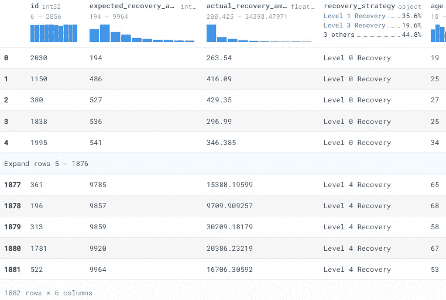

# 表格和 DuckDB

我们也可以通过使用`.create`创建关系表

```
rel.create(“test_table2”)
```

在下一部分中，我们将学习在关系中插入值的各种方法。

*   创建一个新表 *test_table3。*
*   *使用* `*values()*` *和* `insert_into(<tablename>)`插入数值
*   使用 test_table3 创建关系。
*   使用 simple 将值插入关系中。插入函数。

如我们所见，我们成功地为我们的关系增加了一个价值。

```
**# Inserting elements into table_3****conn.execute(“CREATE TABLE test_table3 (i INTEGER, j STRING)”)****print(conn.values([5, ‘five’]).insert_into(“test_table3”))****rel_3 = conn.table(“test_table3”)****rel_3.insert([6,’six’])****rel_3**---------------------
-- Expression Tree --
---------------------
Scan Table [test_table3]

---------------------
-- Result Columns  --
---------------------
- i (INTEGER)
- j (VARCHAR)

---------------------
-- Result Preview  --
---------------------
i	j	
INTEGER	VARCHAR	
[ Rows: 2]
5	five	
6	six
```

# DuckDB 查询函数

要直接运行 SQL 查询，您可以对您的关系使用`.query`。然后添加第一个输入作为查询的视图名，第二个输入作为使用视图名的 SQL 脚本，如下所示。

```
res = rel.query(‘my_name_for_rel’, ‘SELECT * FROM my_name_for_rel LIMIT 5’)
```

为了查看结果，让我们使用`fetchall()`来显示所有 5 个值。

```
**res.fetchall()**[(2030, 194, 263.54, 'Level 0 Recovery', 19, 'Male'),
 (1150, 486, 416.09, 'Level 0 Recovery', 25, 'Female'),
 (380, 527, 429.35, 'Level 0 Recovery', 27, 'Male'),
 (1838, 536, 296.99, 'Level 0 Recovery', 25, 'Male'),
 (1995, 541, 346.385, 'Level 0 Recovery', 34, 'Male')]
```

我们可以直接使用`.query()`并在 *test_df* 表上运行查询。结果显示了表中的所有四个值。查询功能可以对你的表、数据帧甚至`.csv`文件执行所有功能。

```
res = duckdb.query(‘SELECT * FROM test_df’)res.df()
```

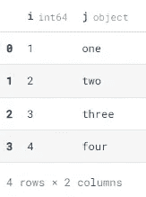

为了在`.csv`文件上运行查询，我们将在 SQL 脚本中使用`read_csv_auto()`。在我们的例子中，我们直接从 CSV 文件中读取全部数据，并在 Pandas dataframe 中显示出来。

```
res = duckdb.query(“SELECT * FROM read_csv_auto(‘bank_data.csv’)”)res.df()
```

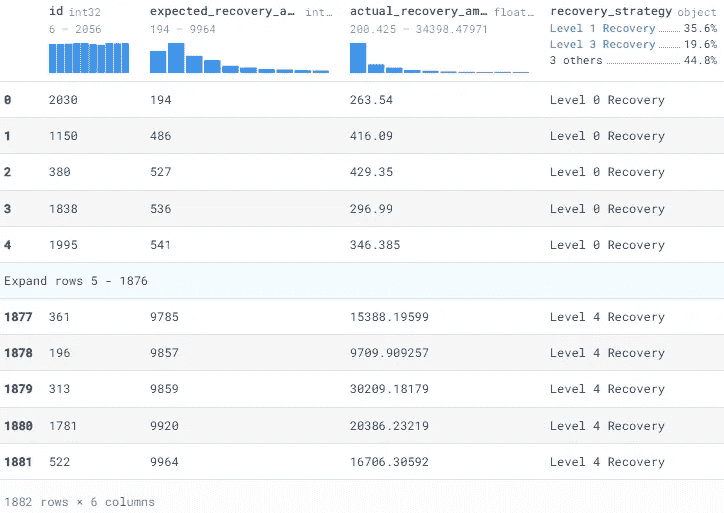

让我们运行一个复杂的脚本，以便充分发挥 DuckDB 的潜力。下面的结果表明，使用 4 级策略从雌性动物身上回收的量比预期的多。使用 SQL 查询进行数据分析既快速又有趣，而不是将您的数据加载到 pandas 并编写一堆代码来获得类似的结果。

```
res = duckdb.query(“SELECT sex, SUM(expected_recovery_amount) as Expected,\
 SUM(actual_recovery_amount) as Actual \
 FROM ‘bank_data.csv’\
 WHERE recovery_strategy LIKE ‘Level 4 Recovery’\
 GROUP BY sex\
 HAVING sex = ‘Female’”)
res.df()
```

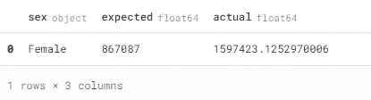

# Deepnote SQL 单元格

[Deepnote](https://deepnote.com/) 的 [Dataframe SQL cell](https://docs.deepnote.com/features/sql-cells/dataframe-sql) 是使用 DuckDB 实现的，所以如果你想要一个简单的方法来使用 DuckDB 的所有功能，我推荐你使用 Deepnote SQL cell。要运行您的 SQL 查询，首先从 block 选项添加一个 SQL 单元格。

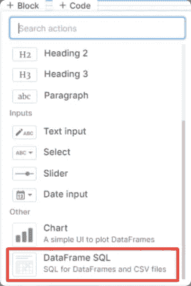

尝试编写一个简单的 SQL 脚本。我们可以看到，我们直接从 *bank_data.csv* 读取数据，结果以熊猫数据帧*的形式存储在 *df_1* 中。我很喜欢这个功能，它甚至比通过 Pandas 加载你的数据还要好。*

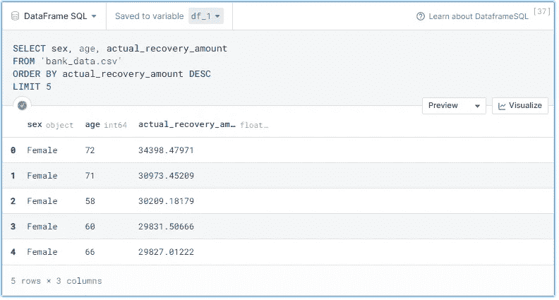

让我们在 CSV 文件上尝试一个更复杂的 SQL 查询。我们将显示三列*性别、预期*和*实际*。然后，我们将选择 *recovery_stretagy* 为“4 级恢复”的值，并按*性别*分组。最后，我们只展示*女性价值观*。

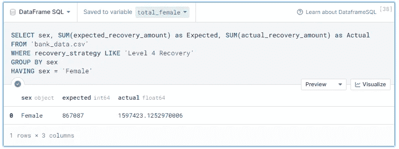

# 最后的想法

DuckDB 可以解决传统 SQL 数据库中存在的大多数问题。这是一个无服务器的数据库管理系统，具有更快的分析查询，并与 Python 和 r 完全集成。如果您打算部署数据科学或机器学习应用程序，我建议您将 DuckDB 添加到您的堆栈中。

在本指南中，我们学习了创建数据库、添加表和运行查询的各种方法。我们还学习了关系，我们可以用它们来创建复杂的函数。最后，我们使用了各种方式直接与 CSV 文件交互，并运行了多个复杂的脚本。这个指南包括各种各样的例子，所以如果你陷入了你的项目，你也可以回来学习一些技巧。

> 最后，我会一直建议你通过实践来学习基础知识，并寻找其他资源来提高你对各种数据库系统的知识。

# 学习资源

*   DuckDB:用于数据辩论的嵌入式数据库——开发社区👩‍💻👨‍💻
*   【SQL 教程(w3schools.com)【T2 
*   [DuckDB — SQL 简介](https://duckdb.org/docs/sql/introduction)
*   [SQL 单元格介绍(deepnote.com)](https://deepnote.com/@allan-campopiano/Intro-to-SQL-Cells-HxtuNpQrSrOwmEkwb8qB8w)
*   [数据框架 SQL — Deepnote 文档](https://docs.deepnote.com/features/sql-cells/dataframe-sql)

**转帖:**[原文](https://www.analyticsvidhya.com/blog/2021/12/the-guide-to-data-analysis-with-duckdb/)发布在 Analytics Vidhya 上。