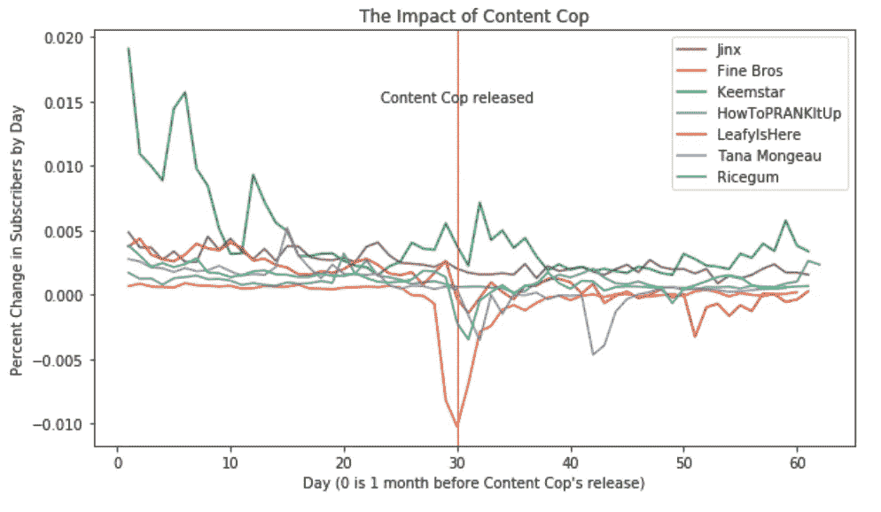
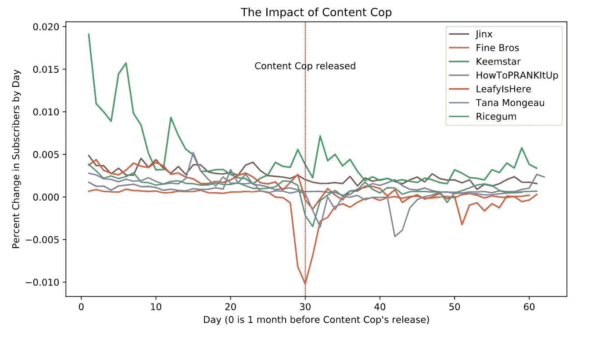
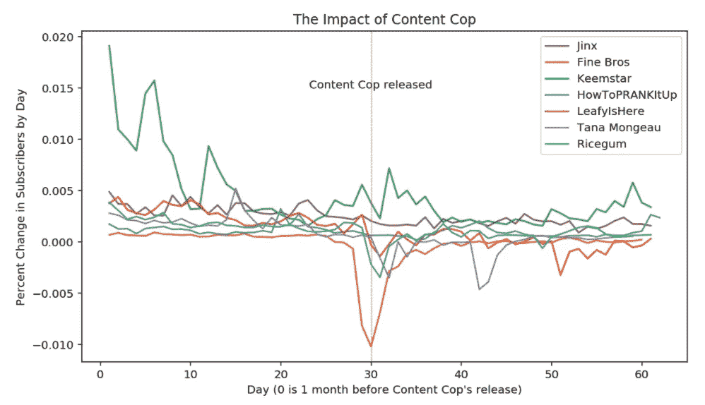

# 用一行代码制作清晰的 Matplotlib 图形的关键

> 原文：<https://pub.towardsai.net/the-key-to-sharp-matplotlib-graphs-with-one-line-of-code-f1da0a445349?source=collection_archive---------0----------------------->

## [数据可视化](https://towardsai.net/p/category/data-visualization)

## 这个鲜为人知的技巧应该成为行业标准

你有没有注意到 Jupyter 笔记本里的内嵌图看起来…很糟糕？

它们要么模糊要么太小 iPython 中重新缩放图像的默认行为是保持原始分辨率，这意味着放大的图像看起来*格外*模糊。

这是我最新项目中的一个例子，在这个项目中，我分析了流行的网络系列“内容警察”。注意文本和线条看起来有多模糊？我打赌你甚至看不出红色的垂直线是虚线。



图片由作者提供。

如果我告诉你这些问题可以用一行代码解决，会怎么样？

在绘制图表之前，只需在 Jupyter 笔记本单元格中键入以下内容。

```
%config InlineBackend.figure_format = 'svg'
```

你看看这些情节有多干脆！



图片由作者提供。

您也可以将`svg`更改为`retina`，以使用更高分辨率的 png。生成的图不会那么清晰，但下载量会小得多。看起来是这样的:



图片由作者提供。

不如 SVG 好，但仍然比默认的渲染图像好得多。演示文稿中不再有模糊的图表。