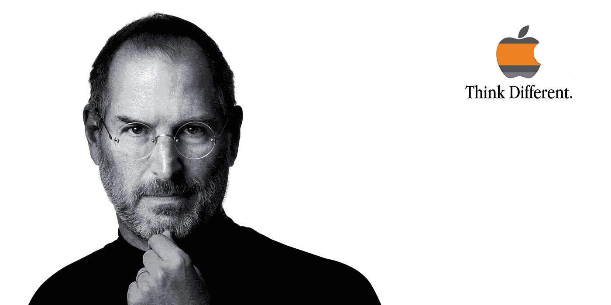
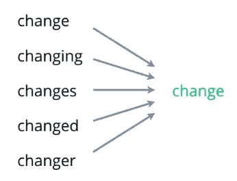

# 一个 CEO 的语言，史蒂夫·乔布斯毕业典礼演讲的 NLP 分析

> 原文：<https://pub.towardsai.net/the-language-of-a-ceo-nlp-analysis-of-steve-jobs-commencement-speech-b7eadf56d1c5?source=collection_archive---------2----------------------->

## [自然语言处理](https://towardsai.net/p/category/nlp)

## Github 上有完整的代码[。](https://github.com/arditoibryan/Projects/tree/master/20200730_NLP_word_frequency)

在这篇文章中，我将对史蒂夫·乔布斯的著名演讲进行文本分析，找出历史上使用频率最高的词。然而，这并不像听起来那么容易。我将解释如何使用 Spacy 的自然语言处理来处理单词。



苹果，不一样的思考

# NLP 的问题及其解决方法

使用 basic 编程，有太多的文本元素存储为字符串，这将使我们的结果无用:

*   标点
*   同根异字

例如，句子:

```
'I asked my mother if she could buy me cookies. She told me she already bought them.'
```

去掉标点符号后，如果我运行算法按频率提取单词，结果是这样的:

```
('asked', 1),
('mother', 1),
('buy', 1),
('cookies', 1),
('told', 1),
('bought', 1)
```

正如你所看到的，计算机在动词**购买**和**购买**之间做了很大的区分。实际上，因为它们来源于同一个动词，所以应该归入同一个范畴。我该如何解决这个问题？通过使用**术语化**。

## 词汇化

词汇化所做的就是遍历每个单词来找到它的词根。



“change”一词的词汇化

这是我经过引理化后得到的结果。大家可以看到，现在**买**这个词算了两次。

```
('buy', 2),
('ask', 1),
('mother', 1),
('cookie', 1),
('tell', 1)]
```

我已经准备好编写软件并分析我想要的文本:

# 安装库

```
!pip install spacy
```

spacy 库是执行 NLP 分析的最佳工具之一。在 spacy 中还可以找到其他非常有用的应用，比如实体识别。今天我就限定自己统计词频。

# 创建单词计数器

这是保存整个实验的函数。作为输入，它接收一个文本和我们想要提取的最常见的单词的数量。

```
def top_frequent(text, num_words):
  #frequency of most common words
  import spacy
  from collections import Counternlp = spacy.load("en")
  text = text#lemmatization
  doc = nlp(text)
  token_list = list()
  for token in doc:
    #print(token, token.lemma_)
    token_list.append(token.lemma_)
  token_listlemmatized = ''
  for _ in token_list:
    lemmatized = lemmatized + ' ' + _
  lemmatized#remove stopwords and punctuations
  doc = nlp(lemmatized)
  words = [token.text for token in doc if token.is_stop != True and token.is_punct != True]
  word_freq = Counter(words)
  common_words = word_freq.most_common(num_words)
  return common_words
```

# 史蒂夫·乔布斯毕业典礼演讲

我把毕业典礼演讲作为输入，是把它作为一个变量。请记住使用三个 **'** ，这样无论您在文本区域中添加其他逗号、空格或不同的标点符号，都不会被视为代码。

```
text = '''
I am honored to be with you today at your commencement from one of the finest universities in the world. I never graduated from college. Truth be told, this is the closest I’ve ever gotten to a college graduation. Today I want to tell you three stories from my life. That’s it. No big deal. Just three stories...
'''
```

我将简单地调用文本上的函数:

```
top_frequent(text, 10)
```

这些是演讲中最常用的词:

```
('life', 16),
('college', 12),
('year', 12),
('drop', 11),
('want', 9),
('look', 9),
('love', 9),
('Apple', 9)
```

你觉得它们鼓舞人心吗？