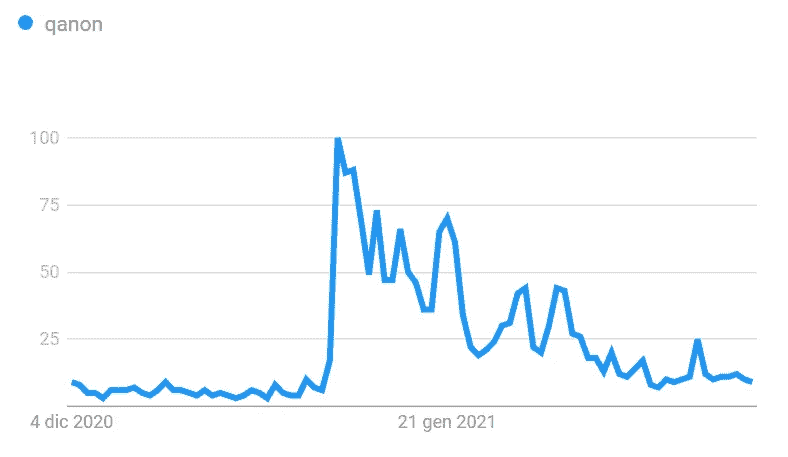
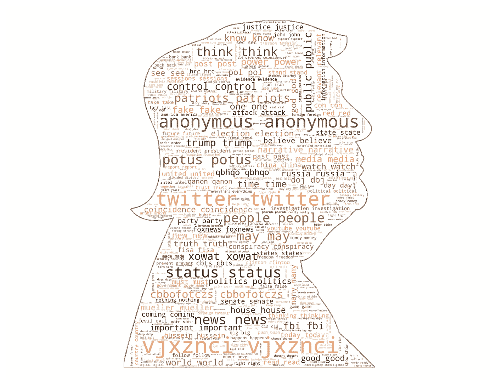
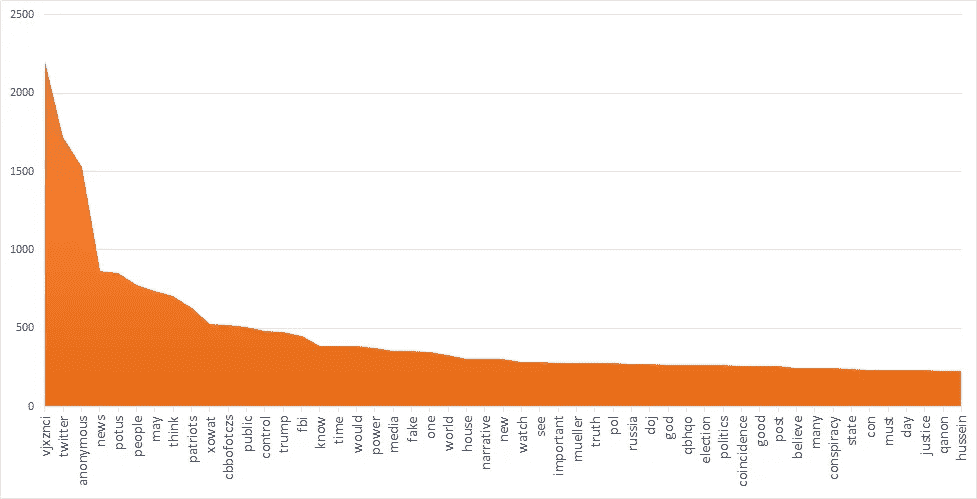
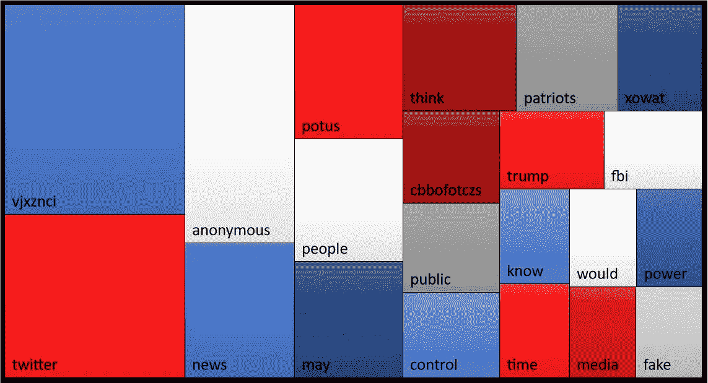
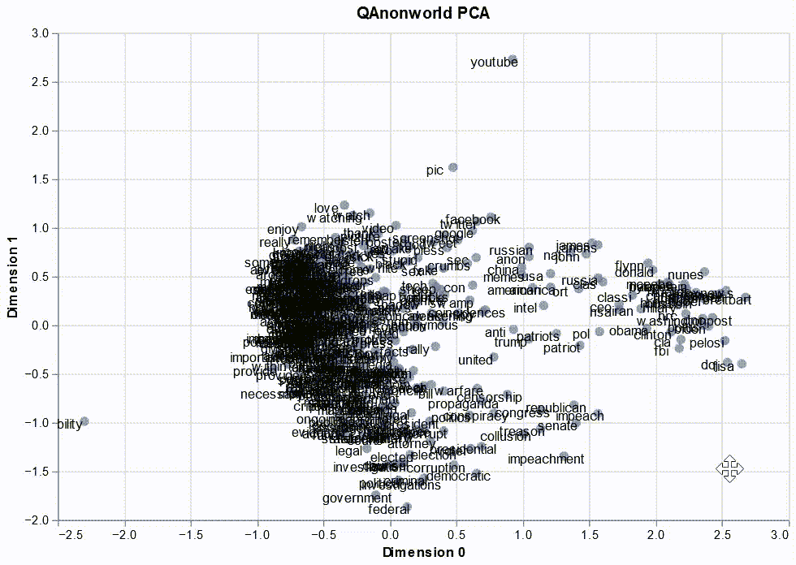
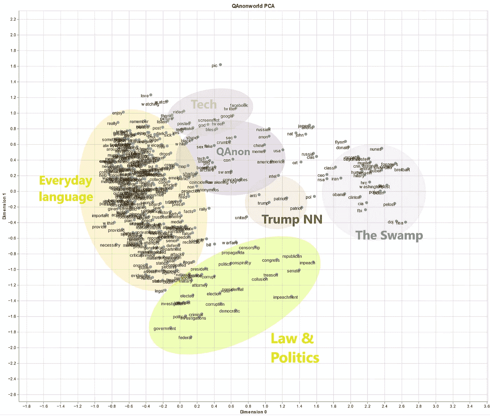

# 解密 QAnon

> 原文：<https://pub.towardsai.net/the-language-of-qanon-2e3411afa9be?source=collection_archive---------2----------------------->

## [自然语言处理](https://towardsai.net/p/category/nlp)，[意见](https://towardsai.net/p/category/opinion)

## 以 NLP 为导向看运动的核心文本。

2020 年 1 月，弗吉尼亚第二修正案集会上的 QAnon 旗。鸣谢:安东尼·克里德/Flickr (CC-BY 2.0)

特朗普和拜登政府之间的过渡最有趣的影响之一是公众对 [QAnon](https://edition.cnn.com/2020/12/15/us/qanon-trump-twitter-invs/index.html) 的兴趣下降——这是一种臭名昭著的网络阴谋论，与这位美国前总统及其选举欺诈的虚假指控密切相关。如下图所示，关于 QAnon 运动的讨论在 1 月初达到顶峰，与国会山风暴相对应，这是一个关键事件，QAnon 相关的在线内容起到了推波助澜的作用。

“qanon”一词的谷歌研究趋势，美国，2021 年 1 月 4 日–2021 年 3 月 4 日。

然而，在接下来的几周里，QAnon 在公共话语中戏剧性地失去了相关性；下降的主要原因是其内容从脸书、Twitter 和 Youtube 等主要社交媒体上被大量删除，这导致 QAnonists 迁移到 Parler 或 Gab 等右翼回音室。

尽管如此，QAnon 运动仍然在政治舞台上发挥着重要作用，仔细看看它的显著特征可能会很有意思。在这篇文章中，我将采用一些基本的数据科学技术，带你浏览 QAnon 的“圣书”，即塑造了该运动世界观的大量在线帖子。我们走吧！

## 你会说卡侬语吗？

我不打算在这里重述该运动的特点和目标(见[维基百科](https://en.wikipedia.org/wiki/QAnon))，但在我们挖掘其文本之前，你可能会喜欢他们所谓的作者，神秘的“Q”的一点背景。根据 QAnon lore 的说法，他/她是一名高调的美国情报官员，在政府内部充当某种间谍，并在 *8chan* 或 *8kun* 等留言板上分享关于特朗普对抗深层国家的英勇战争的情报。这些神秘的帖子然后由社区调查和研究，邀请社区“跟踪线索”,从字里行间解读秘密行动的编码证据。

关于 Q 的真实身份的猜测经常指向管理员罗恩和吉姆·沃特金斯，而瑞士一家公司的风格分析表明，这些帖子至少是由两个人在不同时期写的。然而，由于 Q 的“旅行码”——一种用于在 *8chan —* 上验证身份的在线签名——已经不止一次被泄露，很可能有几个人用这个名字发了帖子。但是基本的 NLP 技术能告诉我们这些帖子的内容是什么呢？

我的实验开始在网上搜索“Q drops ”,很快我就登陆了一个收集这些所谓的英特尔片段的镜像网站。投放相当不定期(最后一次可用的日期是 2020 年 12 月 8 日)，但一个横幅警告不要“将沉默误认为不作为”，因为有时 Q“战略上陷入黑暗”，而“重大军事行动正在幕后发生”。令人印象深刻。

“下落”样本(Q 的帖子#4915)。鸣谢:公共领域图像。

无论如何，我下载了一堆可用的 drops(追溯到 2017 年 10 月 29 日，并方便地打包在 1255 页长的 PDF 中)，并将其转换为 TXT 格式。然后，是时候进行一些 Python 编码了:如果你想继续的话，这里有我的 Colab 笔记本的链接。

首先，我做了一些文本预处理，删除了非字母字符(尽管我怀疑一些标志性的数字，如特朗普的“45”)，停用词(如“状态”，指 Twiter 帖子)和少于两个字符的单词——主要是前面步骤的副产品。在你问之前，我确实注意到了图标“Q”的出现:它们几乎有 12，000 个，因为这个字母用于签署大多数帖子。

清理完语料后，我建立了一个词频词典，从中选出了出现频率最高的 500 个关键词。为了提高数据集质量，我检查了这些关键字是否属于英语词汇，同时手动添加了未识别的单个名称和重要单词(例如“potus”)。

最终的字典有 486 个条目。但是如何以一种有意义的方式来观想它们呢？

## 探索 QAnon 的热门话题

在 Medium 上的前一篇文章中，我谈到了单词云，以及它们如何通过可视化来直观地理解大文本的意思。因此，一个解决方案是将数据输入到 WordCloud 算法中。结果如下:

鸣谢:wordcloud 对 GDJ/Pixabay 原创图片的阐述。我不是很确定为什么所有的单词都是双倍的，但我怀疑这与 WordCloud 算法如何填充掩码空间有关。

看到一些奇怪的字？别担心，我一会儿就解释。出于讨论的目的，这个包含前 50 个术语的直方图可能更方便:

学分:拥有 Excel 数据阐述。

这张图表告诉我们什么？嗯，词频实际上分布相当均匀，因为它在从 *Q* (未显示)的峰值和前三四个词的初始跳跃后缓慢下降。其中， *twitter* 和 *anonymous* 应该被视为停用词，因此应该被删除，因为它们总是出现在推文的出站链接中；我把它们留在这里和上面的文字云中，只是为了强调这个社交媒体在 QAnon 理论的传播中有多么突出。

更有趣的是神秘的 vjxznci——不，它不是埃隆·马斯克的新生儿。我马上就到。前 20 个术语的另一个放大:

学分:拥有 Excel 数据阐述。平铺宽度=语料库前 20 名中的单词重要性。

从这幅五彩缤纷的瓷砖拼图中，人们已经可以对卡农的意识形态有一个像样的把握，从他们的意识形态指称(*总统*、*特朗普*)、他的盟友(*人民*、*爱国者*)和他的敌人(*假* + *新闻*、*假* + *媒体*可能是反复出现的搭配)。同样重要的是，除了助词 *may* 和 *would* (表示一定程度的不确定性或猜测，因此有助于做出预测)之外，最常见的动词是 *think* 、 *know* 和*control*——这是 Q 如何不断提醒其追随者主流机构和媒体进行精神操纵的危险。

我们留下了一些令人费解的术语，如无处不在的 *vjxznci* 、 *cbbofotczs* 或 *xowat* ，它们反映了 QAnon 更“封闭”的一面。据我所知，这些是码字——与预处理算法剥离的数字相结合——Q 用于身份验证(所谓的“tripcodes”)，追随者被鼓励解释为以最微妙的方式解码的神秘线索(例如，借助 [gematry](https://en.wikipedia.org/wiki/Gematria) )。

## QAnonworld，可视化

也许我们在这里做了太多的细读，所以让我们跳回一个更定量的观点。最终，人们可以通过根据它们的意思对它们的单词进行聚类来试图理解 QAnon 帖子中的主要主题——这应该强调了哪些语义区域是流行的。看起来很简单，不是吗？

事实上，我花了很多时间试图找出最好的解决方案，但我对结果并不是 100%满意。无论如何，在地图上表示单词的标准 NLP 方法包括使用[单词嵌入](https://en.wikipedia.org/wiki/Word_embedding)，即表达给定文本中一个单词和其他单词之间关系的向量(一组数字)(如果你不知道我在说什么，你可以通过尝试[这个工具](https://lamyiowce.github.io/word2viz/)或阅读[这篇文章](https://medium.com/analytics-vidhya/introduction-to-word-embeddings-c2ba135dce2f)获得线索)。

将单词表示为嵌入会导致具有相似含义的单词具有相似的嵌入，因此在视觉表示上更接近:正如您可能猜到的，这将自动构建粗略的语义聚类，例如，因为表示单词“congress”的向量与表示“senate”的向量更相似(在图中更接近)，而不是表示“marshmallow”的向量。

老实说，并没有*那么简单，一个更好的解决方案应该是在*标绘之前计算一些向量之间的相似性度量，并对它们进行聚类*。此外，[教程](https://machinelearningmastery.com/develop-word-embeddings-python-gensim/)通常建议在特定语料库上训练单词嵌入，而我想走捷径，从一些预训练的模型中获得它们[2]。*

最终，我采用了我发现的最简单的解决方案，从用户插入的单词直接绘图。我使用了*库( [Warmerdam，Kober & Tatman 2020](https://www.aclweb.org/anthology/2020.nlposs-1.8/) )以及最大的 [spaCy 英语语言模型](https://spacy.io/models/en/)(包括超过 50 万个嵌入)。由于向量是多维的，不适合 XY 地图，人们不得不应用一些[降维方法](https://towardsdatascience.com/dimensionality-reduction-for-data-visualization-pca-vs-tsne-vs-umap-be4aa7b1cb29)，所以我用 PCA、UMAP 和标准的*什么来着*单词方式缩放(使用集合中的两个单词作为相似性的参数)进行了实验。*

*好了，今天的技术细节到此为止。这是我们的 QAnon discourse 的地图渲染:乍一看，它似乎很乱，所以你可能会发现笔记本中的交互式版本更有价值。*

**

*学分:拥有*空间/什么东西*数据加工(通过 PCA 减少维度)。*

*让我们拍一张快照，手动做一个更好的 NLP 工程师在 Pyhton 中会做的东西(抱歉画得不好)。你能看到一些有趣的语义群吗？*

**

*信用:自有空间/数据说明。*

*正如你所看到的，除了左边的一大块公共语言，我们还有一些非常明确的讨论主题。例如，蓝色泡泡聚集了 45 的大多数敌人。总统，从杰出的民主党人(*奥巴马*、*拜登*、*佩洛西*、*希拉里*和她备受争议的助手*胡玛*)到桀骜不驯的联邦机构(*联邦调查局*及其前局长*穆勒*、*国家安全局*、 *DOJ* )，从外国(*伊朗【T31)使用预训练模型进行单词嵌入的一些缺点也很明显，因为像*总统*、*福克斯新闻频道*和*布莱巴特*这样的亲特朗普术语也被吸收进来。**

*同样，底部的绿色区域反映了特朗普总统任期内一些亮点的内容，如他的第一次*弹劾*，穆勒的*调查*，以及他关于 2020 年*选举*的欺诈指控，同时也表达了更广泛的政治主题和 QAnon 运动的一些核心问题(*宣传*，*审查*)。相反，该运动的具体语言在图的上部(紫色)是可以识别的:尽管集合相当松散，但人们可以识别出与阴谋相关的关键词，如*碎屑*、*觉醒*、*巧合*、*匿名*甚至 [*迷因*](https://www.nytimes.com/2021/01/13/video/extremist-signs-symbols-capitol-riot.html) 。*

*非常恰当的是，特朗普站在图表的中心，他最近的邻居当然是爱国者。*

*这就是我们从计算角度对 QAnon 语言的温和介绍:尽管我使用的 NLP 技术非常基础，但它确实产生了一些有趣的结果，突出了 drops 语料库中一些重复出现的语言模式。如果你想进一步探究这一现象，我向你推荐 Aliapoulious 等人最近的研究([“根据 Q 的福音:从规范信息的角度理解 QAnon 阴谋”](https://arxiv.org/pdf/2101.08750.pdf))。直到下一个帖子！*

****感谢阅读，一如既往，非常欢迎反馈和评论！如果你喜欢这篇文章，你可能会对我以前在数据科学方面的贡献感兴趣:****

* [## 数据科学遭遇“谋杀”，她写道

### 对 NBC 经典侦探小说《她写的谋杀》(1984-96)的数据驱动分析，由安杰拉·兰斯伯里、威廉…

towardsdatascience.com](https://towardsdatascience.com/data-science-meets-murder-she-wrote-47a57af26c55)  [## 词汇云的美学

### 一种在文本中表示词频的优雅方式——以及如何不用写一行…

towardsdatascience.com](https://towardsdatascience.com/the-aesthetic-of-wordclouds-a616208420f1) 

*备注:*

[1]这是一种委婉的说法:我花了几天时间试图找到解决办法。除了*什么是*之外，我在 Medium 上找到了这些片段( [1](https://towardsdatascience.com/the-simple-approach-to-word-embedding-for-natural-language-processing-using-python-ae028c8dbfd2) 和 [2](https://towardsdatascience.com/google-news-and-leo-tolstoy-visualizing-word2vec-word-embeddings-with-t-sne-11558d8bd4d) )和[stack overflow 上的这个问题](https://stackoverflow.com/questions/41956362/clustering-list-of-words-in-python)非常有帮助，尽管我缺乏将它们放在一起并使其工作的技术技能(或者更好:我找到了一种在地图上绘制单词嵌入的定制方法，但没有标签)。另一个选择是使用 Tensorflow 的[嵌入投影仪](https://projector.tensorflow.org/)(通过加载矢量和元数据的 TSV 文件)或[视差](https://github.com/uber-research/parallax)，这我不熟悉。

[2]在实际的语料库上训练模型需要更精确的预处理，比如将语料库拆分成句子，我不确定这是否有意义:虽然它通常在强调特定语料库的单词连接方面很有用，但 drops 本身的性质(简短、零碎、模糊的消息)可能会使结果不那么有意义。*