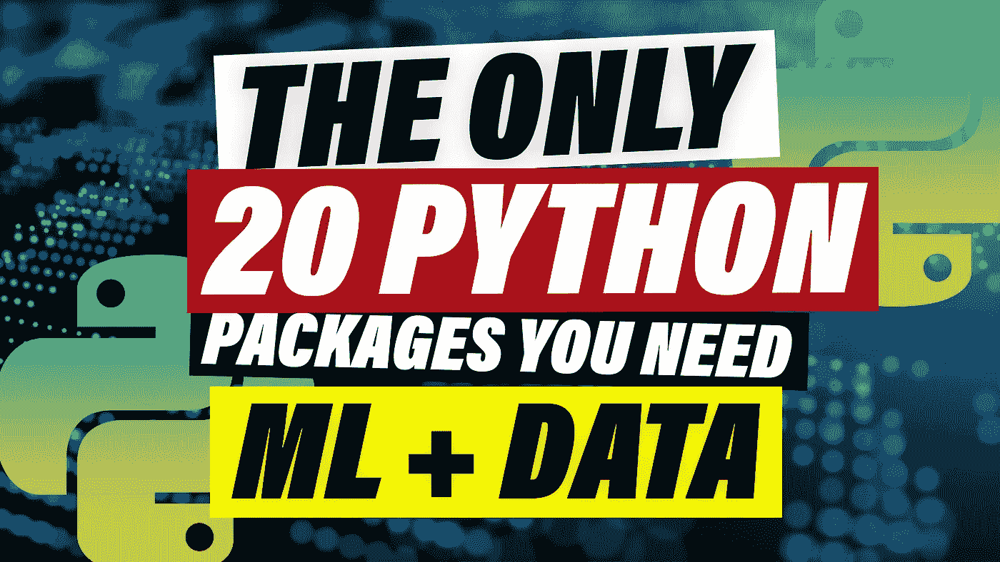
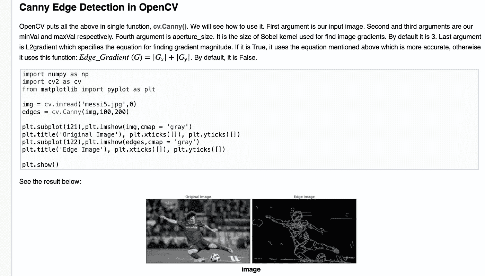
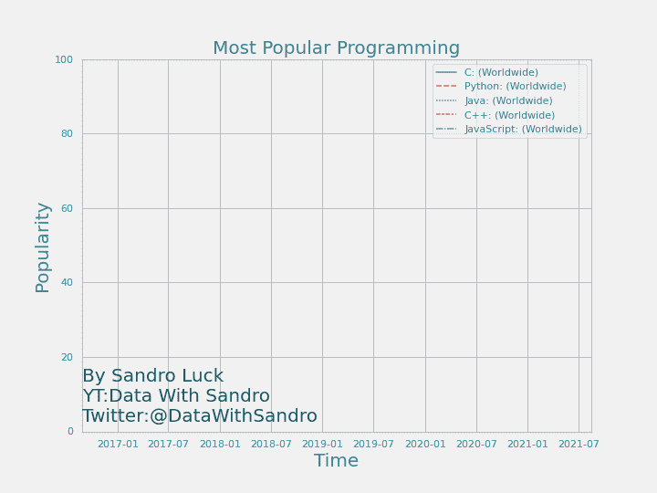
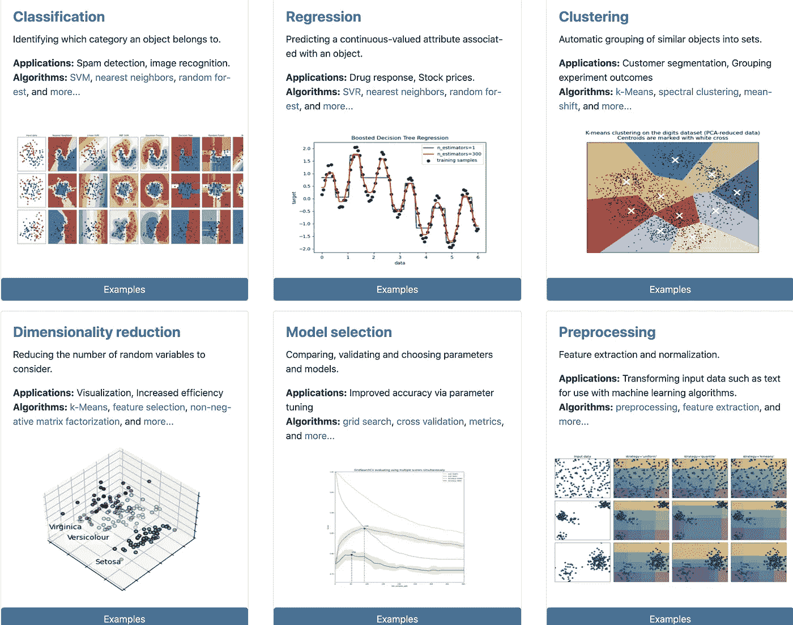
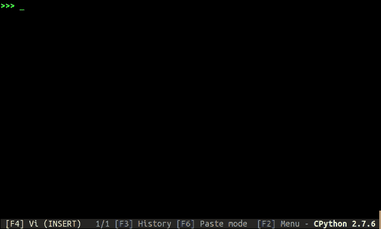
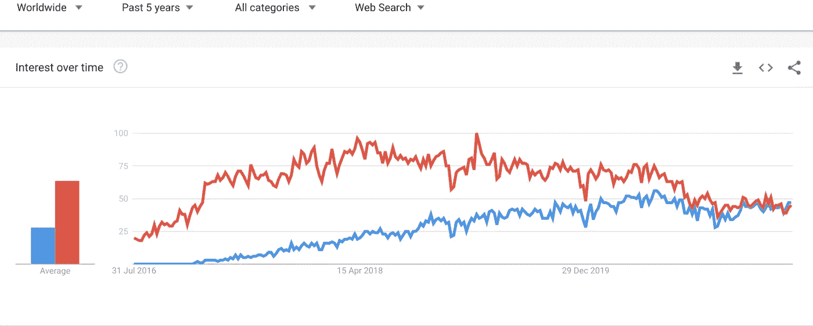
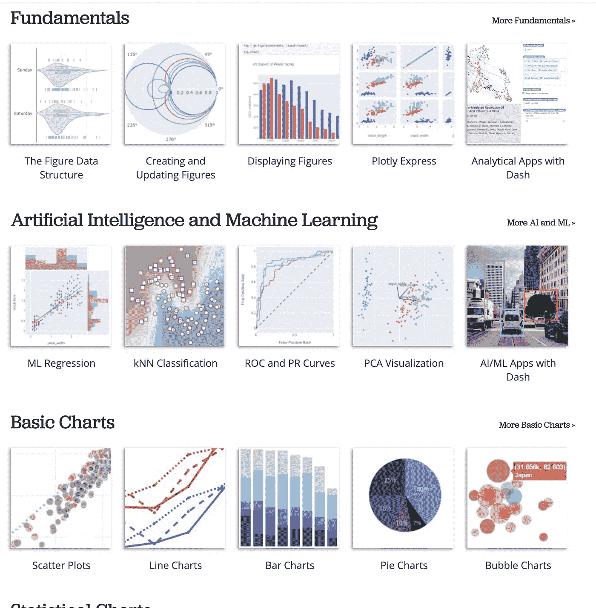
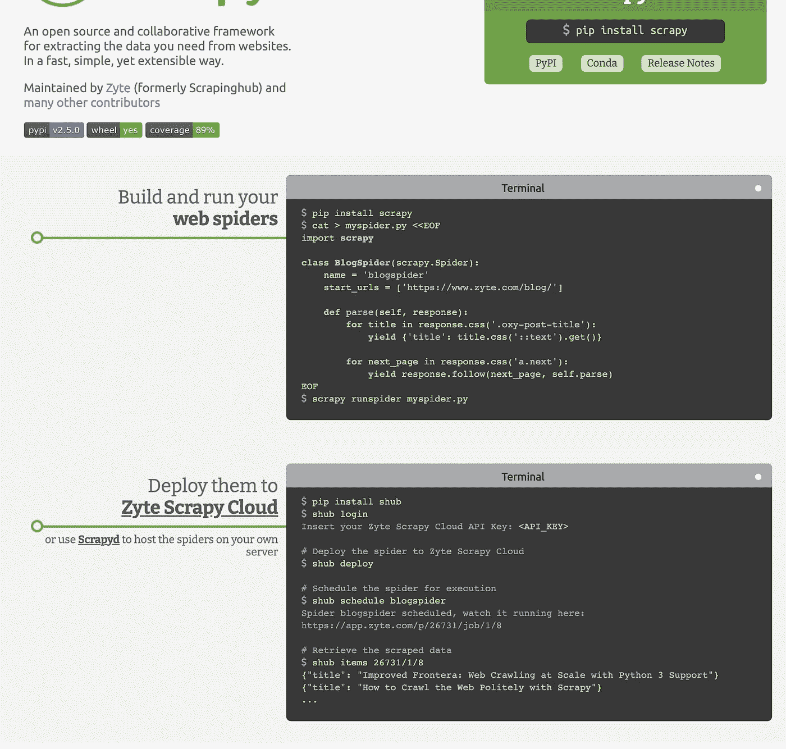
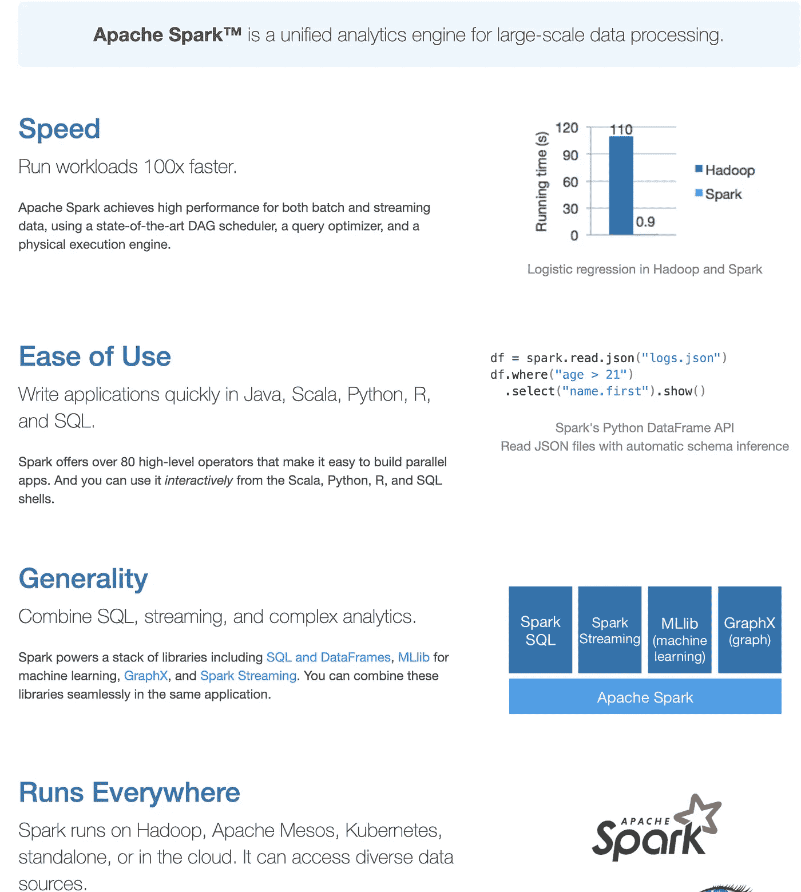

# 您需要的最后 20 个 Python 包

> 原文：<https://pub.towardsai.net/the-last-20-python-packages-you-will-ever-need-a4bc0a0d1214?source=collection_archive---------0----------------------->

## [编程](https://towardsai.net/p/category/programming)

## 机器学习和数据科学

图片由作者通过 [Envato-Elements](https://elements.envato.com/blue-futuristic-stream-data-communication-flying-i-JX8FY62) 持有的作者背景许可创建

今天，我们将看看你应该知道的 20 个 Python 包，用于你所有的数据科学、数据工程和机器学习项目。这些是我在作为机器学习工程师和 Python 程序员的职业生涯中发现最有用的包。虽然这样的列表可能永远不会完整，但它肯定会为每个用例提供一些工具。

> 万一我错过了你最喜欢的，一定要增加其他人的知识，让他们在下面的评论中知道。

# 1.打开简历

当谈到图像和视频时，开源计算机视觉库 Open-Cv 是您最好的朋友。它为常见的图像问题，如人脸检测和对象检测，提供了非常有效的解决方案。或者我们可以看到下面的边缘检测，检测图像内部各种线条的过程。如果你打算在数据科学中使用图像，这个库是必不可少的。Open CV 在 Github 上收集了大量的 56000 颗星星，让我处理图像数据的速度快了几倍，也更容易了。

截图来自 [OpenCV](https://docs.opencv.org/3.4/da/d22/tutorial_py_canny.html)

# 2.Matplotlib

数据可视化是您与非数据向导交流的主要方式。仔细想想，即使是应用程序也仅仅是一种可视化场景背后各种数据交互的方式。Matplolib 是 python 中图像可视化的基础，从可视化您的边缘检测算法到查看您数据中的分布，Matplolib 是您犯罪的伙伴。Github 上有 14000 颗星星，这无疑是一个很好的图书馆。在最近的一个视频中，我用 seaborn 和 matplotlib 制作了这个动画线图。

[GIF 显示编程语言随时间的流行程度](https://youtu.be/YBu8D-iQF44)

# 3.点

鉴于我们正在讨论 Python 包，我们不得不花点时间来谈谈它们的主 PIP。没有它，你不能安装任何其他的。它唯一的用途就是从 [Python 包索引](https://pypi.org/)或者 GitHub 等地方安装包。但是您也可以用它来安装您自己定制的软件包。7400 星只是没有体现出对 Python 社区有多重要。

# 4.Numpy

如果没有 Numpy，Python 就不会成为最流行的编程语言。它是所有数据科学和机器学习包的基础，是用 python 进行所有数学密集型计算的基本包。你在大学里学到的所有讨厌的线性代数和奇特的数学基本上都被 Numpy 以一种非常有效的方式处理了。它的语法风格可以在许多重要的数据库中看到。Github 上的 18100 颗星让你一窥 python 生态系统的基础有多重要。

# 5.熊猫

主要构建在 Numpy 之上，它是你可以用 python 做的所有数据科学的核心。“Import pandas as pd”是我早上打出来的第一行代码，比 excel 打了类固醇还多。它宣称的目标是成为任何语言中最强大的开源数据工具，我认为他们已经成功了一半以上。虽然它通常不是最快的工具，但有许多子工具可以加快它的速度，如 dask、swifter、koalas 和其他基于其语法和易用性的工具，使其对大数据项目也很有用。GitHub 上的 30900 颗星星，真正是任何有抱负的数据向导的起点。

# 6.Python-dateutil

如果你曾经在 Python 中处理过日期，你就会知道没有 dateutil 是一件痛苦的事情。它可以计算给定的当前日期，下个月，或日期之间的距离秒。最重要的是，它为您处理时区问题，如果您曾经尝试过在没有库的情况下做这件事，那将是一个巨大的痛苦。GitHub 上的 1600 stars 向您展示，很高兴没有多少人必须经历令人沮丧的时区工作过程。

# **7。Scikit-Learn**

如果机器学习是你的激情所在，Scikit-Learn 项目将会帮助你。这是开始的最佳地方，也是寻找任何你可能想要用于你的预测的算法的第一个地方。它还具有大量方便的评估方法和培训助手，如网格搜索。无论你想从你的数据中得到什么样的预测，sklearn(因为它通常有别名)都将帮助你更有效地做到这一点。GitHub 上的 47000 颗星告诉你为什么 python 是机器学习者的首选语言。

截图来自 [Scikit-learn](https://scikit-learn.org/stable/index.html)

# 8.Scipy

这有点令人困惑，但是有一个 [Scipy *库*](https://www.scipy.org/scipylib/index.html) 和一个 Scipy *栈*。我在本文中写的大多数库和包都是用于 Python 中科学计算的 Scipy *栈*的一部分。这包括 Numpy、Matplolib、IPython 和 Pandas。就像 Numpy 一样，您很可能不会使用 Scipy 本身，但是上面提到的 Scikit-Learn 库严重依赖于它。Scipy 提供了核心的数学方法来完成复杂的机器学习过程。同样有点奇怪的是，它在 Github 上只有大约 8500 颗星星。

# 9.TQDM

如果你想知道我最喜欢的 Python 包是什么，不用再找了，就是这个叫做 TQDM 的愚蠢的小应用程序。它真正做的是给你一个处理栏，你可以在任何 for 循环中使用它，它还会给你一个进度条，告诉你每次迭代平均需要多长时间，最重要的是，它会花费多长时间，这样你就可以准确地知道在你回去工作之前，你可以看多长时间的 youtube 视频。我最喜欢的套餐有 19，300 颗星，在过去的几年里，它比任何其他套餐都让我更加安心

来自 [TQDM-Github](https://github.com/tqdm/tqdm) 的 GIF

# 10.张量流

最受欢迎的深度学习框架，以及是什么让 python 成为今天的样子。Tensorflow 是一个完整的端到端开源机器学习平台，包括更多的包和工具，如 tensorboard、collab 和 What-If 工具。由于深度学习需求，许多世界领先的公司选择了 TensorFlow，它在 Github 上拥有惊人的 159，000 颗星，是有史以来最受欢迎的 python 包。它被可口可乐、Twitter、英特尔及其创造者谷歌等公司用于各种深度学习用例。

如果你对最有用的工具、开发环境和用于**机器学习**的 auto ml 工具感兴趣，一定要看看我的视频。

# 11.克拉斯

正如他们的口号所说，这是一个为人类打造的深度学习框架。它使得快速开发新的神经网络成为可能。我记得在 Keras 之前，即使是写一个简单的序列模型也是相当费力的。它基于 TensorFlow 之上，实际上是开发人员第一次尝试他们的模型的新架构时开始的方式。它大大降低了开始编写神经网络程序的门槛，现在大多数高中生都可以做到。Keras 是另一个非常受欢迎的 python 包，大约 52，000 stars。

# 12.PyTorch

Tensorflows 在深度学习领域的主要竞争对手。它已经成为开发神经网络的一个很好的选择，也是我个人的最爱。我认为它的社区在自然语言处理领域更强一些，而 TensorFlow 在图像和视频方面更强一些。与 Keras 一样，它也有自己的简化库 Pytorch lightning，我制作了一个[完整的教程来确保你再也不用为了擅长深度学习而工作了。](https://towardsdatascience.com/pytorch-lightning-machine-learning-zero-to-hero-in-75-lines-of-code-7892f3ba83c0)与 Tensorflow 相比，Github 上的 50，000 颗星星可能看起来很少，但随着时间的推移，它确实在快速追赶。

截图来自 Google Trends，Blu: PyTorch Red: Tensorflow

# 13.统计模型

与新奇的机器学习世界相反，Statsmodel 是你进入经典统计学世界的大门。它包含许多有用的统计评估和测试。相比之下，这些往往要稳定得多，而且肯定是任何数据科学家都应该不时使用的东西。6600 颗星可能更多地反馈了深度学习相对于经典统计学的酷性

# 14.Plotly

Matplolib 的另一个很大的选择是 Plotly，客观上更漂亮，并且更适合交互式数据可视化。与 matplolib 的主要区别在于，它是基于浏览器的，开始时稍微困难一些，但是一旦你理解了基础知识，它确实是一个了不起的工具。它与 Jupyter 的强大集成让我相信它会变得越来越标准，让人们远离 matplotlib 集成。Github 上 10000 颗星，慢慢赶上 matplolib。

截图来自 [Plotly 图库](https://plotly.com/python/)

# 15.NLTK

当你试图理解任何文本时，自然语言工具包的简称是你最好的朋友。它包含各种语法转换的广泛算法，如词干和令人难以置信的符号列表，您可能希望在处理模型中的文本之前删除这些符号，如点和停用词。它还会检测什么是最可能的句子，什么不是，以纠正数据集“作者”犯下的语法错误。总而言之，如果你正在处理文本，不妨试一试。同样是 10000 颗星，这对于像这样的利基包来说是疯狂的

# 16.Scrapy

如果你曾经尝试过在没有数据的情况下做数据科学，我想你会意识到这是毫无意义的。幸运的是，互联网包含了几乎所有的信息。但有时它并不是以一种很好的类似 CSV 的格式存储的，你必须首先去野外采集它。这正是 scrapy 可以帮助你的地方，只需几行代码就可以轻松抓取全球网站。下一次，当你想到没有人为你预先收集数据集时。一定要去看看这个 41000 星的项目。

截图来自 [Scrapy](https://scrapy.org/)

# 17.美味的汤

一个非常相似的用例，通常这些该死的 web 开发人员将他们的数据存储在一个叫做 HTML 的低级数据结构中。为了利用这种嵌套的疯狂，创造了美丽的汤。它帮助您提取 HTML 的各个方面，如标题和标签，并让您像普通字典一样迭代它们。它在几个小项目中帮助了我，在这些项目中，我对不提供开放 API 的网站上的用户评论感兴趣。

# 18.XGBOOST

一旦我们的数据集大小超过某个万亿字节的阈值，就很难使用通常提供的机器学习算法的普通实现。XGBoost 可以将您从等待计算结束的数周中解救出来。这是一个高度可扩展的分布式梯度增强库，将确保您的计算尽可能高效地运行。几乎在所有常见的数据科学语言和堆栈中都可用。

# 19.PySpark

数据工程是每个数据科学工作流的一部分，如果你曾经试图处理数十亿个数据点，你知道你的传统 for 循环只能让你到此为止。PySpark 是非常流行的 Apache Spark 数据处理引擎的 python 实现。它就像熊猫，但从一开始就考虑到了分布式计算。如果你曾经感觉你不能足够快地处理你的数据以保持跟踪，这肯定正是你所需要的。他们还开始关注针对大数据用例的大规模并行机器学习。Github 上的 30，000 颗星星使它成为最受欢迎的数据处理工具之一。

截图来自[星火](https://spark.apache.org/)

# 20.Urllib3

Urllib3 是一个强大的、*用户友好的*Python HTTP 客户端。如果你想用 Python 做任何与互联网有关的事情，这个或者基于它的东西是必须的。包括 API 爬虫和到各种外部数据源的连接。GitHub 上 2800 颗星不说谎。

# 结论

在我作为机器学习工程师和 Python 程序员的职业生涯中，这是我用过的 20 个最重要的包。我确信他们会在你需要的时候帮助你查找可能的解决方案。请务必在下面评论你最喜欢的套餐，这样其他人也可以从你的知识中受益。

如果你喜欢这篇文章，我会很高兴在 Twitter 或 LinkedIn 上联系你。

一定要看看我的 [YouTube](https://www.youtube.com/channel/UCHD5o0P16usdF00-ZQVcFog?view_as=subscriber) 频道，我每周都会在那里发布新视频。