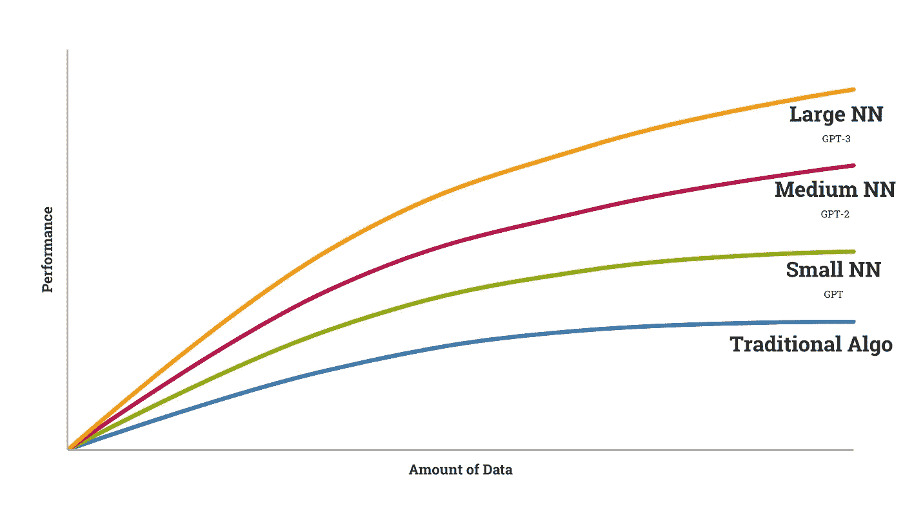
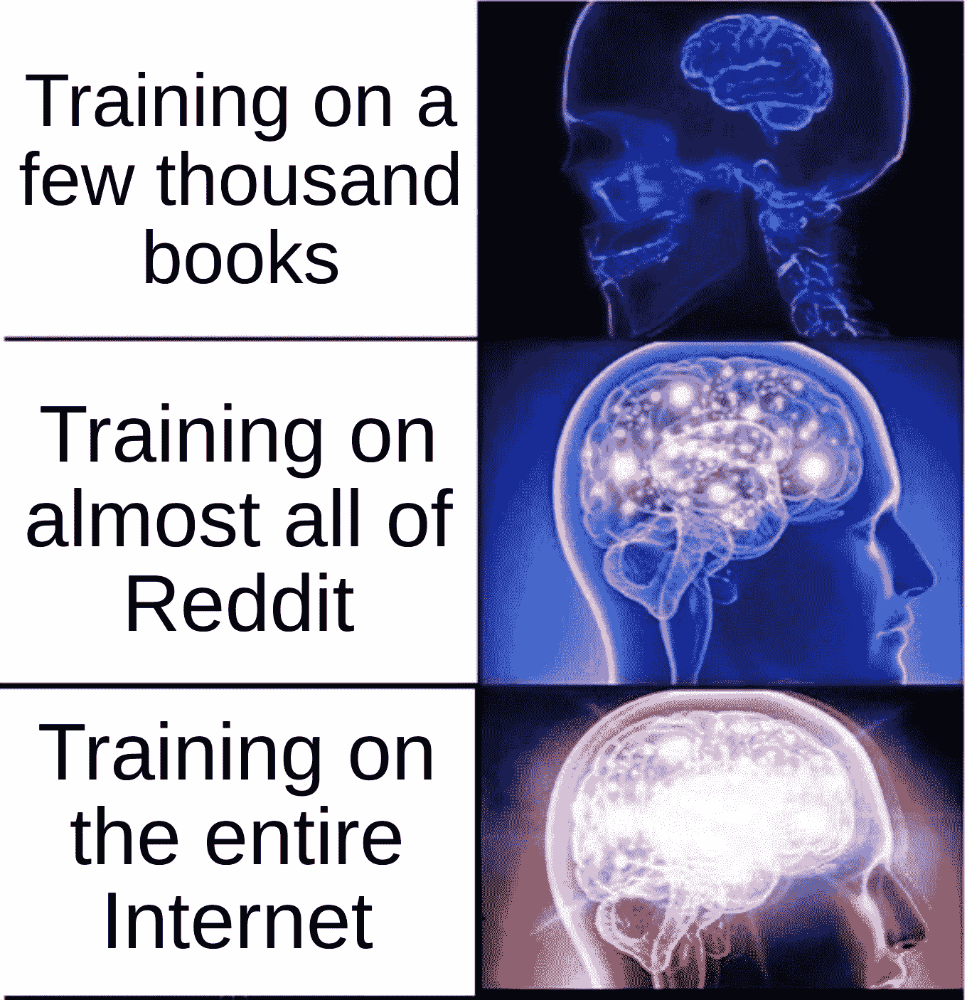
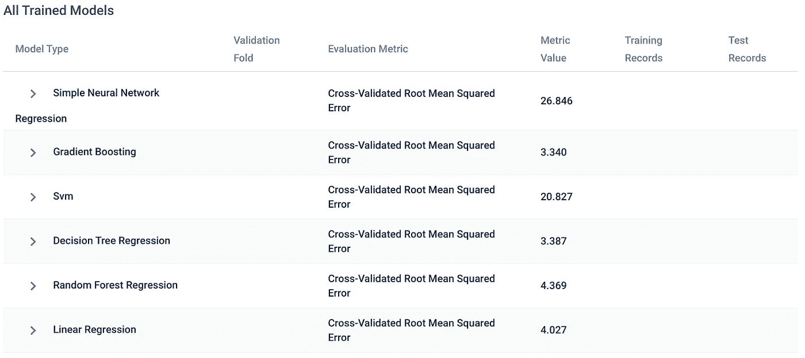
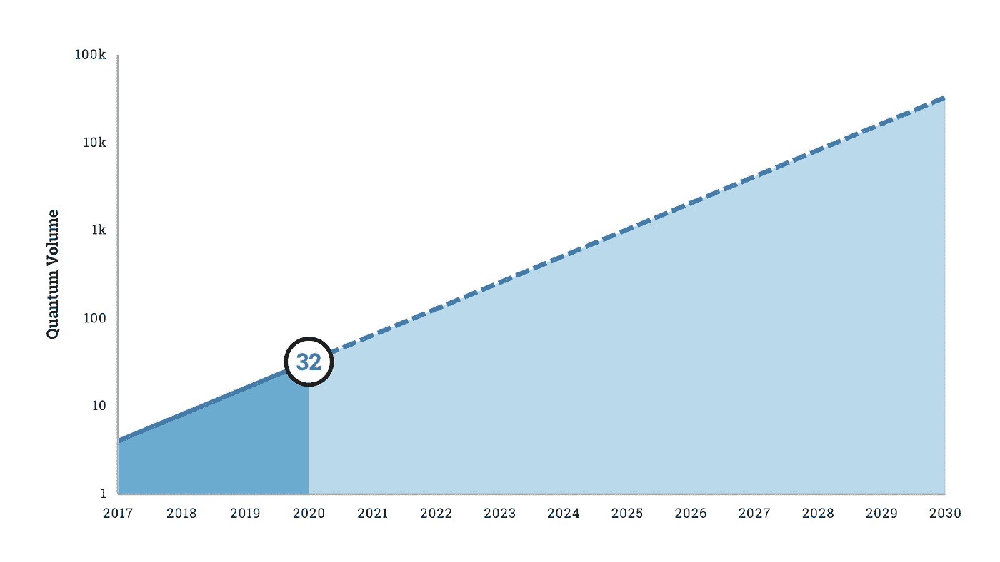

# 深度学习的局限

> 原文：<https://pub.towardsai.net/the-limits-of-deep-learning-96511b36087b?source=collection_archive---------1----------------------->

## [深度学习](https://towardsai.net/p/category/machine-learning/deep-learning)，[观点](https://towardsai.net/p/category/opinion)

## 大型计算需要有限性能，要求更高的效率。

由[卢卡·安布罗西](https://unsplash.com/@lucambro?utm_source=medium&utm_medium=referral)在 [Unsplash](https://unsplash.com?utm_source=medium&utm_medium=referral) 拍摄的照片

G PT-3 是深度学习领域的最新技术，在没有额外训练的情况下，在一系列语言任务中取得了令人难以置信的结果。这种型号和以前型号的主要区别在于尺寸。

GPT-3 接受了数千亿个词的训练——几乎是整个互联网——产生了一个计算量巨大的 1750 亿个参数模型。

OpenAI 的作者[注意到](https://arxiv.org/abs/2005.14165)我们不能永远缩放模型:

> “本文中描述的一般方法(放大任何类似 LM 的模型，无论是自回归模型还是双向模型)的一个更基本的限制是，它最终可能会遇到(或可能已经遇到)预训练目标的限制。”

这是收益递减规律在起作用。

# 收益递减

按作者。

如果你用小数据从零开始训练一个深度学习模型*(而不是从 ResNet 或 ImageNet 或其他一些迁移学习基础开始的[)，你将实现更低的性能。如果你用更多的数据进行训练，你会取得更好的成绩。GPT-3 表明，使用超级计算机在巨大的数据集上进行训练，可以获得最先进的结果。](https://towardsdatascience.com/does-deep-learning-really-require-big-data-no-13890b014ded)*

*每一个连续的 GPT 模型都在很大程度上通过缩放训练数据来改进上一个模型。*

**

*作者使用 [imgflip](https://imgflip.com/memegenerator/Expanding-Brain) 创建的模因。*

*然而，不确定的是，再次扩大规模——比方说，10 倍的数据和 10 倍的计算——会带来更多的准确性收益。论文“[深度学习中的计算限制](https://arxiv.org/pdf/2007.05558.pdf)”列出了这些问题——深度学习是不可持续的，就像现在这样:*

> *"目前的进展在经济、技术和环境方面正迅速变得不可持续."*

*这个[例子](https://arxiv.org/pdf/2007.05558.pdf)完美地说明了收益递减:*

> *“即使在更乐观的模型中，估计也需要额外的 10⁵×更多计算才能使 ImageNet 的错误率达到 5%。”*

*广受欢迎的 Keras 图书馆的作者 Franç ois Chollet 指出，我们已经接近了 DL 的极限:*

> *“对于深度学习已经实现了变革性更好解决方案的大多数问题(视觉、言语)，我们在 2016-2017 年进入了回报递减的领域。”*

* [## 深度学习:收益递减？-塞米维基

### 深度学习(DL)已经成为我们这个时代的神谕——我们用来寻找几乎任何问题答案的通用技术…

semiwiki.com](https://semiwiki.com/artificial-intelligence/7588-deep-learning-diminishing-returns/) 

事实上，虽然 GPT-3 比 GPT-2 大得多，但它仍然有严重的缺点，根据论文作者的说法:

> “尽管 GPT-3 在数量和质量上都有很大提高，特别是与它的直接前身 GPT-2 相比，它仍然有明显的弱点，”包括在敌对的 NLI 上“比机会好不了多少”的性能。

自然语言推理已经被证明是深度学习的一个主要挑战，以至于在一个难以置信的大语料库上训练都无法解决它。

## “黑盒”人工智能——可解释性差

深度学习的另一个局限是可解释性差。对于像 GPT 3 号这样的庞大模型——回想一下它有 1750 亿个参数——解释几乎是不可能的。我们只能猜测为什么模型会做出某个决定，但是并不清楚。

例如，如果 GPT-3 告诉我们，它[更喜欢《我的世界》](https://medium.com/dataseries/the-top-data-science-job-of-the-future-6dbdae7343d7)而不是堡垒之夜，我们可以凭直觉认为这是因为“《我的世界》”这个词在它的训练数据中出现得更多。

这个问题与深度学习的低效率是分开的，如果你在寻找可解释性，最好的解决方案是简单地使用更多可解释的模型。

例如，一些 AutoML 工具，如 [Apteo](http://apteo.co) 通过在包括决策树和随机森林在内的模型中进行选择，从你的数据中获得洞察力，这些模型比深度神经网络具有更强的解释能力。

[Apteo](http://apteo.co) 截图。由作者捕获。

最终，你需要权衡用例中可解释性的相对重要性。

# 实现更高的深度学习效率

过去几年里，由于计算和数据的大幅增加，人工智能领域出现了一个又一个突破，但我们正在最大限度地利用这些机会。

对话需要转向算法和硬件效率，这也将增加可持续性。

## 量子计算

在过去十年中，DL 的计算改进主要包括 GPU 和 TPU 实现，以及 FPGA 和其他 ASICs。量子计算也许是最好的选择，[作为](https://arxiv.org/pdf/2007.05558.pdf)“它提供了计算能力持续指数增长的潜力。”

按作者。

当前尖端的量子计算机，如 IBM 的*罗利*，拥有大约 [32](https://www.ibm.com/blogs/research/2020/01/quantum-volume-32/) 的量子体积，尽管霍尼韦尔声称最近已经制造了 [64 量子体积计算机](https://www.honeywell.com/en-us/newsroom/news/2020/06/the-worlds-highest-performing-quantum-computer-is-here)。IBM 希望其量子量每年翻一番。

## 降低计算复杂性

GPT-3 是一个非常复杂的模型，有 1750 亿个参数。人们可以通过压缩神经网络中的连接来降低计算复杂性，例如通过“修剪”掉权重、量化网络或使用低秩压缩。

迄今为止，这些方法的结果仍有许多不足之处，但这是一个潜在的探索领域。

## 高性能小型深度学习

最后，人们可以使用优化来找到更有效的网络架构，以及元学习和迁移学习。然而，像元学习这样的方法会对准确性产生负面影响。

# 结论

鉴于不断增长的数据和计算，深度学习近年来一直是令人难以置信的人工智能突破的来源，但摩尔定律不能永远持续下去。我们已经见证了规模模型的收益递减。潜在的解决方案包括更高的算法和硬件效率，特别是在量子计算方面。*