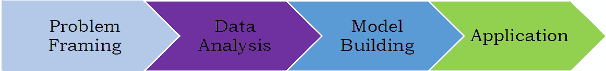

# 机器学习过程

> 原文：<https://pub.towardsai.net/the-machine-learning-process-3ac14c9a557c?source=collection_archive---------3----------------------->

## 潜入 ML 进程| [走向 AI](https://towardsai.net)

机器学习过程包括 4 个主要阶段:

**举例说明机器学习过程。**

## **1。问题框架**

***明确你的项目目标。你想知道什么？有数据可以分析吗？***

在这里，您可以决定您试图解决的问题类型，例如，将电子邮件分类为垃圾邮件或非垃圾邮件的模型，将肿瘤细胞分类为恶性或良性的模型，通过将呼叫路由到不同类别来改善客户体验的模型，以便呼叫可以由具有适当专业知识的人员接听的模型，预测贷款在贷款期限结束后是否会取消的模型，基于不同特征或预测因素预测房价的模型，等等。

## **2。数据分析**

***收集和提炼你的数据。准备一个存储库来存储您的数据***

这是您处理可用于构建模型的数据的地方。它包括特征的数据可视化、缺失数据的处理、分类数据的处理、分类标签的编码、特征的规范化和标准化、特征工程、降维、数据划分为训练集、验证集和测试集等。

## **3。模型构建**

***挑选与你的数据和想要的结果相匹配的机器学习工具。在自动化流程、图形编辑器或编码您自己的模型之间进行选择。用可用数据训练模型。***

在这里，您可以选择想要使用的模型，例如线性回归、逻辑回归、KNN、SVM、k 均值、蒙特卡洛模拟、时间序列分析等。数据集必须分为训练集、验证集和测试集。超参数调整用于微调模型，以防止过度拟合。执行交叉验证是为了确保模型在验证集上表现良好。在微调模型参数之后，将模型应用于测试数据集。该模型在测试数据集上的性能大约等于该模型用于对未知数据进行预测时的预期性能。

## **4。应用程序**

***给你的模型打分生成预测。使您的模型可用于生产。根据需要重新培训您的模型*** *。*

在这个阶段，最终的机器学习模型被投入生产，以开始改善客户体验或提高生产率，或者决定银行是否应该批准向借款人提供信贷，等等。该模型在生产环境中进行评估，以评估其性能。这可以通过使用诸如 A/B 测试的方法将机器学习解决方案的性能与基线或控制解决方案进行比较来完成。从实验模型转换到生产线上的实际性能时遇到的任何错误都必须进行分析。然后，这可以用于微调原始模型。

总之，我们已经讨论了机器学习过程的主要阶段。每个企业都可以利用机器学习的力量来优化生产或改善客户体验。

感谢阅读。