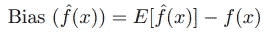
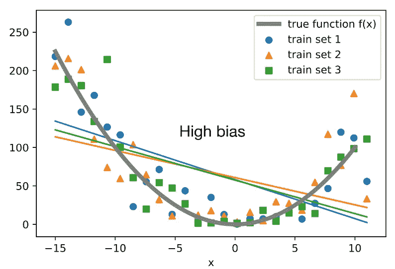
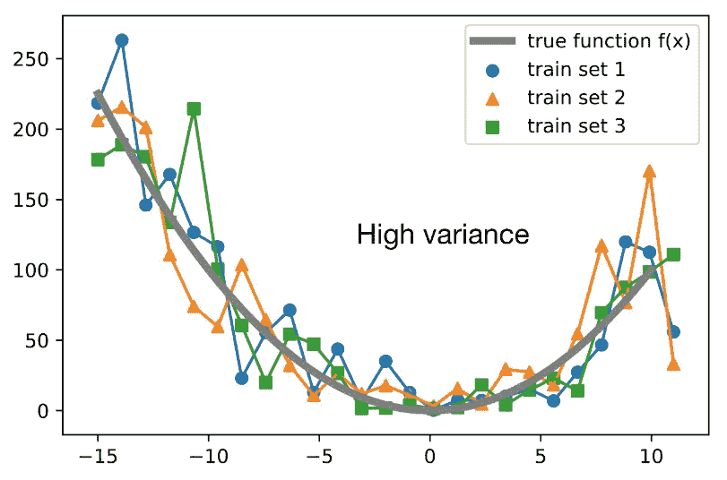
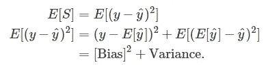
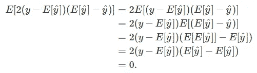
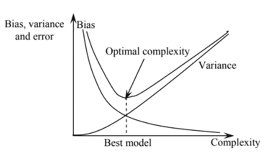
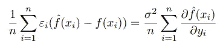
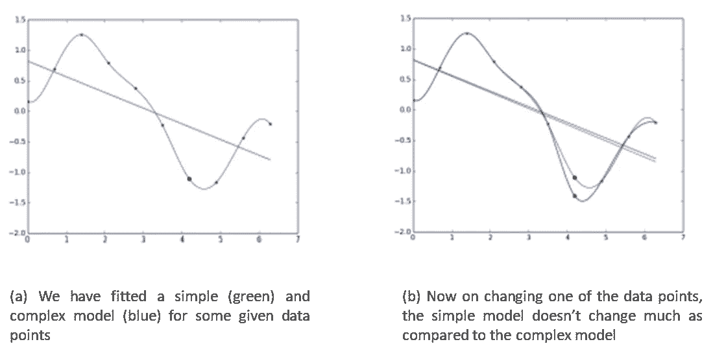
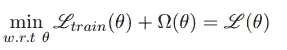

# 模型复杂性与偏差-方差困境的数学关系

> 原文：<https://pub.towardsai.net/the-mathematical-relationship-between-model-complexity-and-bias-variance-dilemma-c2c713dbe495?source=collection_archive---------4----------------------->

大多数数据科学爱好者都会同意这种说法，即“**偏差-方差困境遭受分析瘫痪”，**因为有大量关于偏差-方差的概念、其分解、推导及其与模型复杂性的关系的文献。也许，我们已经尽了最大努力，简单的模型表现出高偏差，而复杂的模型表现出低偏差。*我们有没有想过为什么？*

有些人可能会选择忽略这一点，宣称这只是另一个问题。但是，在模型复杂性和偏差-方差困境之间存在一种确定的数学关系。很好地理解这一点可以帮助数据科学从业者进行正确的错误分析，并精确地应用正则化技术。所以，让我们先简单地理解这个概念，然后推导出数学关系！

**偏差-方差-噪声分解**

简单来说，**偏差**是一个模型做出的*简化假设，使目标函数更容易学习。 ***低偏差*** 暗示关于目标函数形式的假设较少。 ***高偏差*** 暗示了关于目标函数形式的更多假设。*

**方差**是如果使用不同的训练数据，目标函数的估计将改变的*量。 ***低方差*** 表示随着训练数据集的改变，对目标函数的估计的小的改变。 ***高方差*** 表示目标函数的估计值随着训练数据集的变化而发生较大变化。*

但是让我们试着去理解这在数学上是如何运作的。

数学上，**偏差**可以表示为:

其中 ***f(x)*** 为真实模型，***【f^(x】)***为我们模型的估计值，***【e[f^(x】)***为模型的平均值(或预期值)。

这仅仅意味着偏差是估计量的期望值和参数之间的差值。在下图中，一个简单的模型(线性函数)绘制在 3 个训练集上，灰线定义了真实的函数。我们可以清楚地观察到高偏差，因为平均简单模型完全偏离了真实函数。

[http://rasbt . github . io/mlx tend/user _ guide/evaluate/bias _ variance _ decomp/](http://rasbt.github.io/mlxtend/user_guide/evaluate/bias_variance_decomp/)

并且，**方差**可由下式给出:

它被定义为估计量的平方的期望值减去估计量的平方的期望值之间的差。同样，下图描述了所有训练集都非常接近真实函数，当提供看不见的数据时，将无法应用其学习。因此，方差很大！

[http://rasbt . github . io/mlx tend/user _ guide/evaluate/bias _ variance _ decomp/](http://rasbt.github.io/mlxtend/user_guide/evaluate/bias_variance_decomp/)

**为什么首先需要偏差-方差权衡？**

实证研究表明，误差的**期望值是由偏差、方差和噪声组成的。将损失分解为偏差和方差有助于我们理解学习算法，因为这些概念与欠拟合和过拟合相关。因此，由于减少真实误差的内在需要，我们必须致力于优化其组成部分，即偏差和方差。让我们来看看偏差-方差-噪声的分解。**

这里，

*   真实或目标函数为 y=f(x)，
*   预测目标值为 y^=f^(x)=h(x)，
*   损失的平方为 S=(y−y^)

为了开始将平方误差损失分解为偏差和方差，让我们进行一些代数运算，即，加上和减去 y^的期望值，然后使用二次公式(a+b) =a +b +2ab)展开表达式:

接下来，我们只需使用两边的期望，我们已经完成了:

你可能想知道当我们使用期望时,“2ab”术语(2(y−E[y^])(E[y^]−y^)发生了什么。结果，它的值等于零，因此从等式中消失，如下所示:

因此，为了减少预期误差，我们必须在高偏差和高方差之间选择最佳点。这给了我们最好的模型。如图 3 所示，最佳模型具有最佳的复杂性，在偏差和方差之间取得平衡。

[https://www . research gate . net/publication/221434786 _ A _ Bias-Variance-Complexity _ Trade-Off _ Framework _ for _ Complex _ System _ Modeling](https://www.researchgate.net/publication/221434786_A_Bias-Variance-Complexity_Trade-Off_Framework_for_Complex_System_Modeling)

> **现在黄金问题！模型复杂性如何影响真实误差？**

让我们尝试用斯坦的引理来理解这一点。

其中，LHS 代表真实误差，RHS 解释了观测值(yi)的小变化会导致估计值(f)的大变化。

这表明当 **RHS 上的项较高时，观察值的微小变化将导致估计值的较大变化，从而增加损耗**。事实上，一个复杂的模型对观测值的变化更敏感，而一个简单的模型对观测值的变化不太敏感。

让我们来证实上述说法。我们为一些给定的数据拟合了一个简单和复杂的模型。现在，*在改变其中一个数据点*、**、*时，简单模型与复杂模型*、**相比变化不大(参考下图)。

作者图片

因此，我们可以说:

> **真实误差=经验训练误差+小常数+ω(模型复杂度)**

因此，在训练时，不是最小化训练误差 L *train* (θ),而是我们应该最小化

其中，ω(θ)对于复杂模型而言较高，对于简单模型而言较小，这成为所有正则化方法的基础。

在这篇文章中，我们已经讨论了普遍接受的偏差和方差的定义。此外，我们试图从数学上分解预期误差的偏差-方差-噪声分量。此外，我们试图使用 Stein 引理从数学上得出该方程，该引理解释了模型复杂性如何影响预期误差，即偏差+方差。

我希望这篇文章对读者有一些价值，感谢您耐心阅读这篇不朽的文章。请回复您的评论或问题，我将很乐意回复。此外，如果你热衷于在数据科学和分析方面进行互动，让我们在 [Linkedin](https://www.linkedin.com/in/harjot-kaur-99792118/) 上联系。

**参考文献:**

I)[https://www . research gate . net/publication/221434786 _ A _ Bias-Variance-Complexity _ Trade-Off _ Framework _ for _ Complex _ System _ Modeling](https://www.researchgate.net/publication/221434786_A_Bias-Variance-Complexity_Trade-Off_Framework_for_Complex_System_Modeling)

ii)Mitesh Khapra 的偏差-方差权衡

三)[http://rasbt . github . io/mlx tend/user _ guide/evaluate/bias _ variance _ decomp/](http://rasbt.github.io/mlxtend/user_guide/evaluate/bias_variance_decomp/)