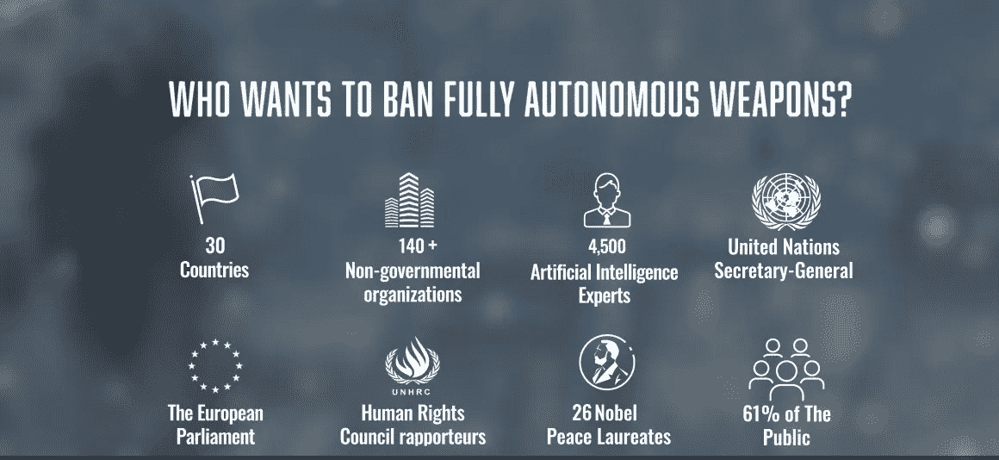
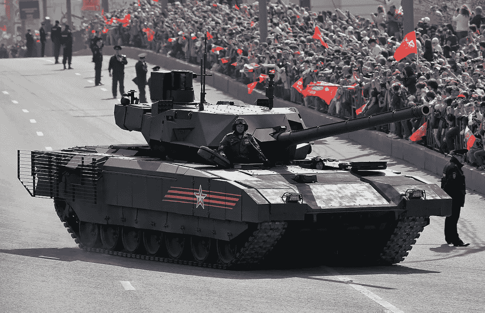

# AI 的军事化

> 原文：<https://pub.towardsai.net/the-militarization-of-ai-9547d605b36d?source=collection_archive---------5----------------------->

## [人工智能](https://towardsai.net/p/category/artificial-intelligence)，[观点](https://towardsai.net/p/category/opinion)

## 第三次世界大战会自主打吗？

图片由作者创作，背景许可由 [Envato](https://elements.envato.com/war-in-the-forest-P75HMJS) 持有

人工智能的军事化是一个相当可怕的话题，引用英国武装部队负责人的话。

> 到 21 世纪 30 年代，机器人士兵可能占到英国军队的四分之一——尼克·卡特将军

因此，不管我们喜欢与否，它都会以这样或那样的形式出现。民用工业的技术进步帮助机器更好地观察和处理感觉数据。这种进步也可以用来建造

# 致命自主武器系统[法律]

法律被描述为继火药和核武器之后的第三次战争革命，它是一种武器系统，可以在没有人类控制的情况下识别、选择和打击目标。

法律是一个模糊的术语，包括从记录情报片段的自动飞行无人机到杀手机器人这样的终结者。

想象一下，一群自杀式无人机，每个都有几个摄像头，一台计算机和几克爆炸材料，只够穿透人类的头骨。他们可以通过面部识别甚至种族特征来选择目标。一个令人难以置信的虚构视频可以在这里看到。

法律是如此可怕，以至于连教皇本人都向联合国保证不会大力发展和管理这样的系统

> 我们需要打破目前的不信任气氛。目前，我们正在目睹多边主义的侵蚀，鉴于新形式军事技术的发展，这种侵蚀更加严重，例如致命的自主武器系统(法律)，这些系统不可逆转地改变了战争的性质，使战争进一步脱离了人类的力量——[教皇方济各](https://reachingcriticalwill.org/images/documents/Disarmament-fora/unga/2020/25Sept_HolySee.pdf)

没有多少这样的系统为公众所知的原因是这些系统是在极度保密的情况下开发的。在许多国家，泄露这类“关键发展”的信息是一项受到严厉惩罚的罪行。

但是斯德哥尔摩国际和平研究所 2017 年的一份报告列出了 381 个自主军事系统，其中 175 个是武装的。当查看军事会议和演示时，似乎“自主”是新的流行词。

许多组织已经联合起来共同和个人地反对法律的发展。我希望他们会成功。然而，如果我们可以建造一架包裹运送无人机，运送炸弹只是一个技术问题。

截图来自 https://www.stopkillerrobots.org/

# 自动瞄准辅助

现在让我们来看看现有的一些武器系统以及它们目前的能力。自动瞄准助手，如由[smart shooter Precise technical Solutions](https://www.smart-shooter.com/)和以色列公司开发的系统，正如游戏多年前已经预测的那样，是任何武器的有用补充。

> [主要系统优势](https://www.smart-shooter.com/products/):
> 
> –增加致命性和生存力
> –对抗静态和动态目标
> –减少压力和体力的影响
> –减少附带伤害
> –大幅缩短命中时间
> –通过最少的训练确保精确命中
> –添加到传统武器，发射标准弹药

这项技术目前主要用于自动瞄准无人机，并以人类操作员无法提供的精度将其消灭。但正如他们的视频所示，这个系统的未来肯定也是直接针对人类的。

# T-14

在普京的俄罗斯研制的 T-14 坦克也有这样的自动瞄准助手。此外，它还具有自动防御系统，可以通过自动检测和消除即将到来的危险来检测反坦克导弹、手榴弹和任何可能划伤您昂贵的战争玩具的东西。

> 谢菲尔德大学人工智能和机器人学教授 Noel Sharkey 表示，T-14 目前是通过遥控操作的，但俄罗斯科学家正在“加速”使其完全自主。

这种很大程度上自主的舰队自己寻找和摧毁目标的场景确实是一个反乌托邦故事的良好开端，特别是当你想到黑客攻击或工程师后门内置的可能性时。尽管这些系统肯定已经过很好的测试，并且非常安全，但这仍然是一个可怕的想法。

T-14，图片来自[维基百科](https://en.wikipedia.org/wiki/T-14_Armata#/media/File:9may2015Moscow-01.jpg)

# 战场概览

美国国防高级研究计划局(DARPA) Squad X 提出了一种完全不同的方法。他们正在开发的系统旨在让地面部队更好地了解情况。大致想法是使用自主无人机和小型地面车辆扫描该集团的区域。

然后在附近的移动通信节点中使用机器学习来聚集该信息。士兵可以选择通过他们佩戴的一个小设备来粗略地引导机器人到感兴趣的区域。

> “我们真正想做的是帮助那些(战术)决策者……做出自信、明智的决定，”——[项目代表](https://www.janes.com/defence-news/news-detail/darpas-squad-x-programme-adds-bae-systems-for-ai-integration)

# 物流

虽然特斯拉正在研究未来的民用机器人出租车，但军事承包商也试图在自动驾驶汽车的开发上发挥作用。

奥什科什防务公司正在开发未来的战争出租车，它可以在任何地形上自主运送部队和物资。

> 奥什科什 UGV 公司将先进的机器学习技术应用于感知和运动规划，将人员从目标路线上的风险车辆中移除。奥什科什 UGV 保持了车辆的全机动性和有效载荷能力，增加了威胁距离，增强了在有争议的作战区域对乘员的保护— [奥什科什](https://oshkoshdefense.com/advanced-technologies/terramax-unmanned-ground-vehicle-technology/)

# 结论

虽然人工智能的发展可以改善全球许多人的生活，但它们也有可能摧毁他们。

我们现在对肯定会影响世界各地武装冲突的趋势有了很好的了解。虽然我觉得许多不应该被开发的武器将会被开发出来，但我也觉得未来的战争将会更加精确。这不是一个巨大的优势，但至少会将平民伤亡减少到最低限度。

如果你喜欢这篇文章，我会很高兴在 Twitter 或 LinkedIn 上联系你。

一定要看看我的 YouTube 频道，我每周都会在那里发布新视频。