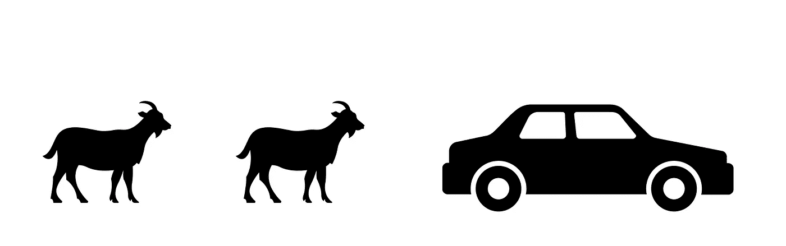
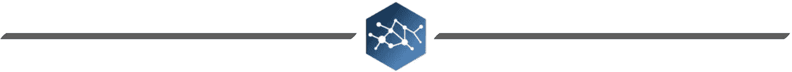
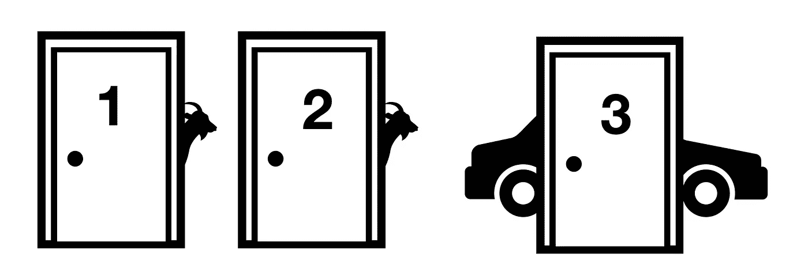
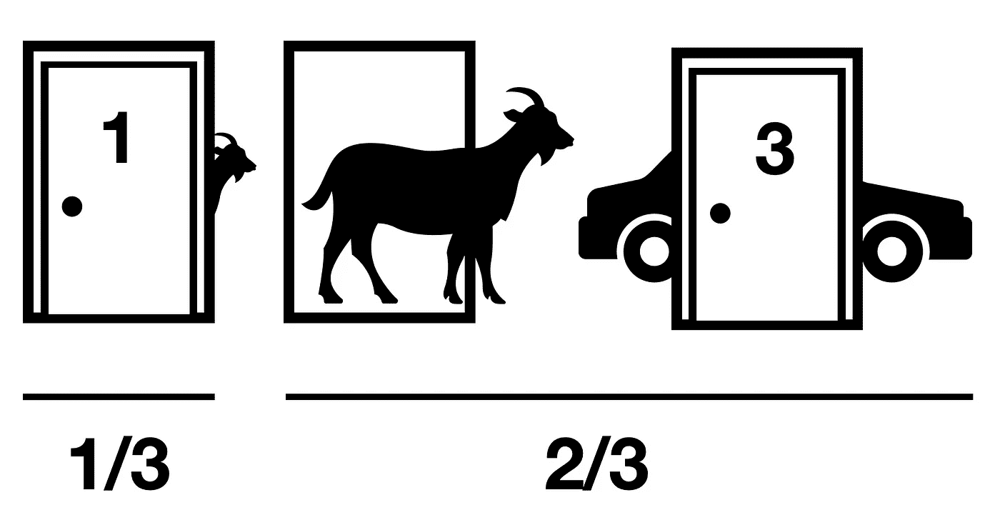
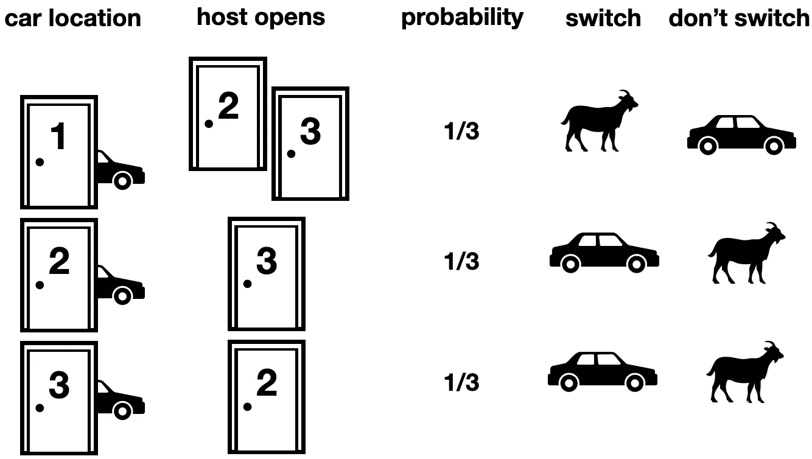
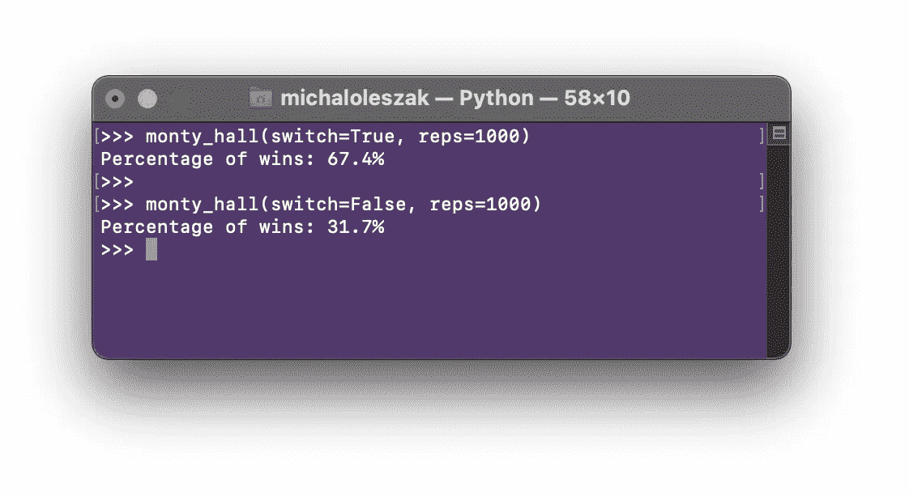

# 蒙蒂·霍尔问题

> 原文：<https://pub.towardsai.net/the-monty-hall-problem-a4b657889035?source=collection_archive---------0----------------------->

## [概率](https://towardsai.net/p/category/probability)

## 或者如何通过正确的概率让你赢得一辆车的机会翻倍

两只山羊，一辆车。图片由作者提供。

蒙蒂·霍尔问题是一个持续了几十年的脑筋急转弯，至今仍让人们困惑不解。它大致基于一个老的美国电视游戏节目，并以其主持人蒙蒂·霍尔的名字命名。在游戏的最后阶段，参赛者将面临一个选择，通过正确的选择，他们赢得一辆全新汽车的机会将增加一倍。但是你猜怎么着:大多数人都没有！你会更明智吗？请继续阅读，寻找答案！

## 让我们玩游戏

你面前有三扇紧闭的门。其中一辆后面，有一辆全新的车。在另外两个的后面，都有一只山羊。为了便于讨论，让我们假设你宁愿要汽车也不要山羊。你的工作是选择其中一扇门，你将赢得门后的一切。一旦你下了注，游戏主持人就会打开剩下的两扇门中的一扇门，露出一只山羊。然后，他们问你:你是坚持最初的门选择，还是想换到另一扇关闭的门。该不该换？

剧透:是的，你绝对应该。切换*加倍*你赢的机会！

## 直觉:获得正确的概率

如果你认为换不换无所谓，你并不孤单。根据[的一项研究](https://journals.sagepub.com/doi/10.1177/0146167295217006)，我们中 88%的人不会改变。流行的推理如下:你选择一扇可以隐藏汽车或山羊的门。然后，另一扇门打开了，山羊露了出来，所以你呆在关得太紧的门里:一扇门关着汽车，另一扇门关着第二只山羊。因此，机会是 50/50，所以你是否转换并不重要，对吗？不对！

顺便说一下，当面对他们认为是掷硬币的选择时，人们倾向于坚持他们最初的赌注。这是由于一个众所周知的心理效应，如果我们转换并失败了，我们会感觉更糟(我知道我是对的！)相比于我们留下来失去的时候。因此，我们大多数人会选择最初选择的门。

那么，如果我们不换车，赢车的概率有多大？这很简单，因为我们是随机选择三扇门中的一扇门，所以是 1/3 或 33%。

棘手的部分是要意识到，如果你真的转换了，赢的机会是两倍:2/3 或 66%！这是因为当主机打开一扇没有被选中的门时，新的信息就变得可用了。

图片由作者提供。

假设你选了 1 号门。它藏车的概率是 1/3。**关键在于，这相当于说汽车在 2 号门或 3 号门后的概率是 2/3。游戏主持人知道汽车在 3 号门后面，他别无选择，只能打开 2 号门:**

图片由作者提供。

现在，你知道有 2/3 的可能性汽车在 2 号或 3 号门后面，而不是在 2 号门后面。因此，1 号门的概率是 1/3，3 号门的概率是 2/3。

不管你选择哪个门，哪个藏车，上面的推理永远成立。

## 列出所有组合

还不服气？另一种看问题的方法是列出所有可能的情况，看看你赢的几率有多大。假设你选了 1 号门。

图片由作者提供。

如果汽车确实在门 1 后面，那么主机将打开门 2 或门 3 中的任何一个。如果你留下，你赢了车，如果你换了，你得到一只山羊。

如果汽车在 2 号门后面，主人将没有选择，只能打开 3 号门。在这种情况下，从 1 切换到 2 将会得到汽车。

同样，当汽车在 3 号门后面时，从 1 号门切换到 2 号门会让你得到它。

由于汽车可能以 1/3 的概率出现在任何一扇门后，你可以看到切换是一个更好的策略:它提供了 3 个同等可能性场景中的 2 个，即 2/3 的概率。

## 模拟

数学不会说谎，但事实是如此的不直观，以至于我很好奇想看看经验证据。在短暂地考虑实际玩这个游戏，比如说，一百次(分别用杯子、糖果和代表门、汽车和山羊的任何东西)之后，我写了一个 python 函数来替我做这件事。它玩游戏 1000 次，遵循两种策略之一:总是切换或从不切换，并打印出游戏获胜的百分比。

我们玩吧。

的确，换人胜算翻倍！

## 情节扭曲

考虑一下这个情节转折:有 1000 扇门，一扇门有一辆车，还有 999 只藏着的山羊。你选一个。主人打开剩下的 999 扇门中的 998 扇门，只露出山羊。你会切换到另一扇关着的门吗？如果你以类似于我们刚才所做的方式来思考这个问题，那么转换为你提供了 99.9%的机会赢得这辆车，而保持不变，你只有千分之一或 0.1%的机会获胜！

感谢阅读！

如果你喜欢这篇文章，为什么不在我的新文章上 [**订阅电子邮件更新**](https://michaloleszak.medium.com/subscribe) ？通过 [**成为媒介会员**](https://michaloleszak.medium.com/membership) ，你可以支持我的写作，并无限制地访问其他作者和我自己的所有故事。

需要咨询？你可以问我任何事情，也可以在这里 预定我 1:1 [**。**](http://hiretheauthor.com/michal)

也可以试试 [**我的其他文章**](https://michaloleszak.github.io/blog/) 中的一篇。不能选择？从这些中选择一个:

 [## 中心极限定理

### 关于数据科学家统计推断基石的相关性。

towardsdatascience.com](https://towardsdatascience.com/central-limit-theorem-70b12a0a68d8)  [## 处理缺失数据

### 一个统计学家关于如何(不)做它来保持你的机器学习工作流程的观点。

towardsdatascience.com](https://towardsdatascience.com/handling-missing-data-5be11eddbdd)  [## 数据测量级别

### 统计学家对变量类型、它们的意义以及对机器学习的影响的观点。

towardsdatascience.com](https://towardsdatascience.com/data-measurement-levels-dfa9a4564176)