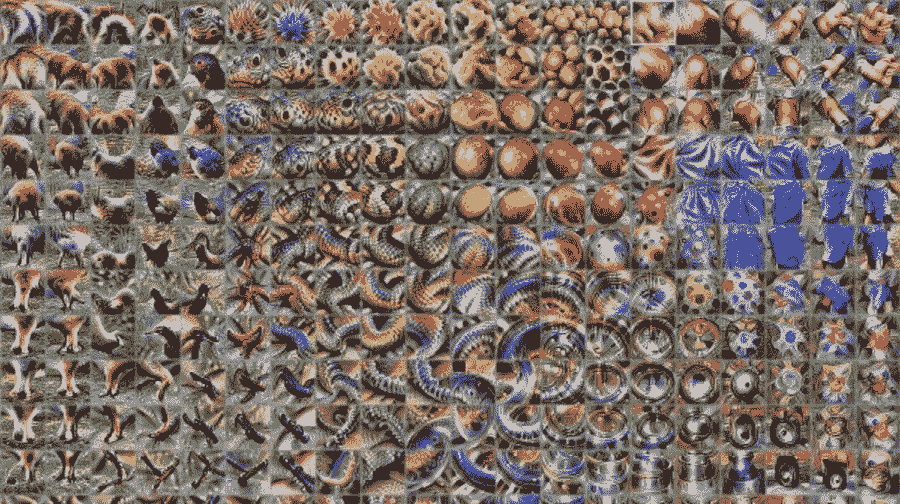
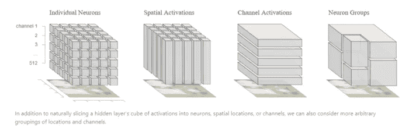
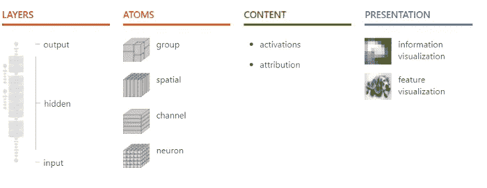

# ML 可解释性中最重要的论文

> 原文：<https://pub.towardsai.net/the-most-important-paper-in-ml-interpretability-9e2dc2f10672?source=collection_archive---------1----------------------->

## 出版四年后,《可解释性的构建模块》仍然是 ML 互操作性领域的开创性论文。

图片来源:Neurohive

> 我最近创办了一份专注于人工智能的教育时事通讯，已经有超过 125，000 名订户。《序列》是一份无废话(意思是没有炒作，没有新闻等)的 ML 导向时事通讯，需要 5 分钟阅读。目标是让你与机器学习项目、研究论文和概念保持同步。请通过订阅以下内容来尝试一下:

 [## 序列

### 与机器学习、人工智能和数据发展保持同步的最佳资源…

thesequence.substack.com](https://thesequence.substack.com/) 

ML 的未来是可解释的 ML！这个原则是大多数 ML 专家都同意的，尽管他们对如何达到这些可解释性水平有不同的看法。

任何深度学习解决方案的一个挑战性要素是理解深度神经网络所做的知识和决策。虽然解释神经网络做出的决定一直很困难，但随着深度学习的兴起和使用多维数据集操作的大规模神经网络的激增，这个问题已经成为一个噩梦。毫不奇怪，神经网络的解释已经成为深度学习生态系统中最活跃的研究领域之一。

试着想象一个大型神经网络，它有数亿个神经元，正在执行图像识别等深度学习任务。通常，您希望了解网络是如何做出具体决策的。目前的大多数研究都集中在检测网络中哪些神经元被激活。知道 neuron-12345 触发五次是相关的，但在整个网络的规模中不是非常有用。关于神经网络中决策理解的研究主要集中在三个方面:特征可视化、属性和降维。特别是谷歌，在特征可视化领域做了大量工作，发布了一些[卓越的研究和工具](https://distill.pub/2017/feature-visualization/)。2018 年，谷歌研究人员发表了一篇题为[“可解释性的构建模块”](https://distill.pub/2018/building-blocks/)的论文，成为机器学习可解释性领域的开创性论文。该论文提出了一些新的观点来理解深度神经网络如何做出决策。

谷歌研究的主要见解是，不要孤立地看待不同的可解释性技术，而是将其视为帮助理解神经网络行为的更大模型的可组合构件。例如，特征可视化是理解单个神经元处理的信息的非常有效的技术，但是不能将这种洞察力与神经网络做出的整体决策相关联。归因是一种更可靠的技术，可以解释不同神经元之间的关系，但在理解单个神经元所做的决定时就不那么重要了。结合这些构建模块，谷歌创建了一个可解释性模型，它不仅解释了神经网络检测到的内容，而且回答了 T2 网络如何组合这些个体片段以做出后来的决定，以及 T4 为什么做出这些决定。

谷歌新的可解释性模型具体是如何工作的？嗯，在我看来，主要的创新在于，它分析了神经网络不同组件在不同层次上做出的决定:单个神经元、相连的神经元组和完整的层。谷歌还使用一种称为矩阵分解的新研究技术来分析任意组神经元对最终决策的影响。

来源:[https://distill.pub/2018/building-blocks/](https://distill.pub/2018/building-blocks/)

考虑谷歌的可解释性块的一个好方法是作为一个模型，该模型在从基本计算图到最终决策的不同抽象级别上检测关于神经网络决策的见解。

来源:[https://distill.pub/2018/building-blocks/](https://distill.pub/2018/building-blocks/)

谷歌对深度神经网络可解释性的研究不仅仅是一次理论练习。该研究小组随论文发布了 [Lucid](https://github.com/tensorflow/lucid) ，这是一个神经网络可视化库，允许开发人员进行排序 Lucid 功能可视化，以说明神经网络各个部分所做的决策。谷歌也发布了 [colab 笔记本](https://github.com/tensorflow/lucid#notebooks)。这些笔记本使得使用 Lucid 在交互式环境中创建清晰的可视化变得极其容易