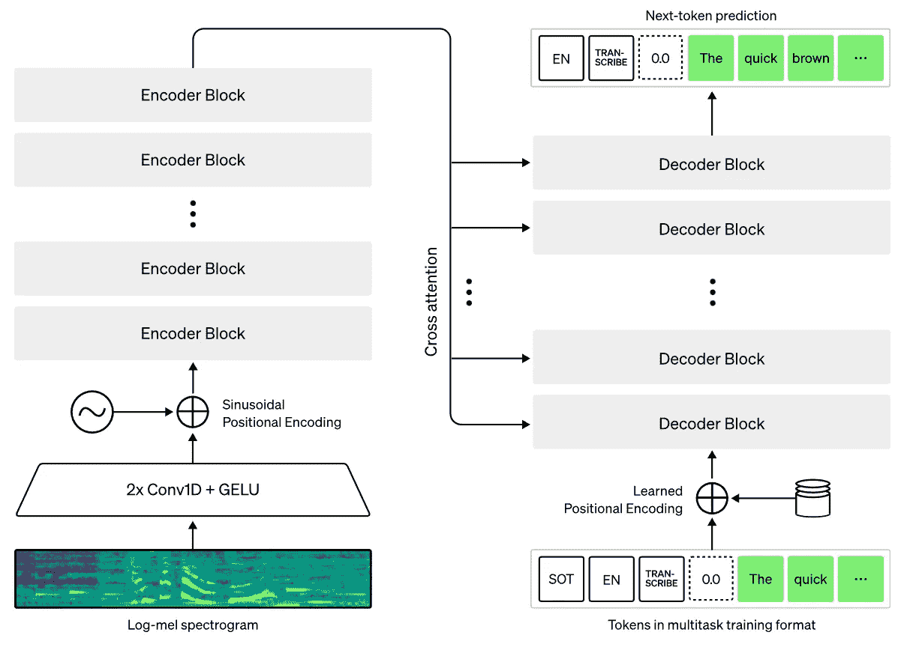

# 最新的 OpenAI 模型:Whisper

> 原文：<https://pub.towardsai.net/the-most-recent-openai-model-whisper-f518c29bda02?source=collection_archive---------1----------------------->

## 一个好的转录工具，可以准确地理解你说的话，并把它写下来

## 观看视频

你有没有梦想过一个好的转录工具，可以准确地理解你说的话并写下来？不像 YouTube 上的自动翻译工具…我的意思是，它们很好，但远非完美。只要尝试一下，打开我上面视频的功能，你就会明白我在说什么了。OpenAI 刚刚发布并开源了一个非常强大的人工智能模型:Whisper。它甚至能理解我甚至不能理解的东西，不是英语母语的人(听视频)！它也适用于语言翻译！

结果和精度令人难以置信，但更酷的是它的工作方式。让我们深入研究一下。

Whisper 编码器-解码器架构概述。图片来自报纸。

说到模型本身，Whisper 相当经典。它建立在转换器架构上，堆叠编码器模块和解码器模块，注意机制在两者之间传播信息。

它会把录音分割成 30 秒的片段，然后逐一处理。对于每 30 秒钟的录音，它将使用编码器部分对音频进行编码，并保存每个单词的位置，并利用这些编码信息来查找使用解码器说了什么。

解码器将从所有这些信息中预测我们所说的标记，这些信息基本上是正在说的每个单词。然后，它将使用所有相同的信息以及预测的前一个单词对下一个单词重复这一过程，帮助它猜测下一个更有意义的单词。

整体架构是一个经典的编码器-解码器，我在多篇文章中介绍过，类似于 GPT-3 和其他语言模型，我邀请您查看更多架构细节。

这是因为它接受了从网络上收集的超过 600，000 小时的多语言和多任务监督数据的训练。这意味着他们用与 GPT-3 相似的方式训练他们的音频模型，使用互联网上可用的数据，使其成为一个大而通用的音频模型。这也使得该模型比其他模型更加健壮。事实上，他们提到，Whisper 接近人类水平的鲁棒性，因为它是在如此多样化的一组数据上接受训练的，这些数据包括剪辑、TED 演讲、播客、采访等，它们都代表了类似真实世界的数据，其中一些数据是使用基于机器学习的模型而不是人类转录的。

使用这种不完美的数据肯定会降低可能的精度，但我认为，与具有完美转录的纯人类策划的音频数据集相比，稀疏使用有助于提高鲁棒性。

拥有这样一个通用模型本身并不是很强大，因为在大多数任务中，它会被适合手头任务的更小更具体的模型打败。但它还有其他好处。您可以使用这种预先训练好的模型，并根据您的任务对它们进行微调。这意味着你将利用这个强大的模型，用你自己的数据重新训练它的一部分，或者全部。这种技术已被证明比用你的数据从头开始训练能产生更好的模型。

更酷的是，OpenAI 开源了他们的代码和一切，而不是 API，所以你可以使用 Whisper 作为预先训练的基础架构，为自己建立和创建更强大的模型。

一些人已经在 huggingface 上发布了一些工具，比如 jeffistyping 的 youtube whisperer，它可以获取 youtube 链接，并生成转录。

他们还发布了一款 google colab 笔记本，马上就可以用它来玩了。

虽然有些人认为竞争是关键，但我很高兴 OpenAI 向公众发布了它的一些工作，因为我相信这种合作是我们领域进步的最佳方式。如果你想看到更多 OpenAI 的公开发布，或者你更喜欢他们像 DALLE 一样构建的最终产品，请让我知道你的想法。

和往常一样，你可以在下面链接的文章和代码中找到更多关于 Whisper 的信息。

我希望你喜欢这篇文章，下周我会带着另一篇精彩的论文来看你！

## 参考

、a .、Kim、J.W .、Xu、t .、Brockman、g .、McLeavey、c .和 Sutskever，I,“通过大规模弱监督实现鲁棒语音识别”。
项目链接:[https://openai.com/blog/whisper/](https://openai.com/blog/whisper/)
代码:[https://github.com/openai/whisper](https://github.com/openai/whisper)
谷歌 Colab 笔记本:[https://Colab . research . Google . com/github/open AI/whisper/blob/master/notebooks/librispeech . ipynb](https://colab.research.google.com/github/openai/whisper/blob/master/notebooks/LibriSpeech.ipynb)
YouTube whisper app:[https://hugging face . co/spaces/jeffistyping/YouTube-whisper](https://huggingface.co/spaces/jeffistyping/Youtube-Whisperer)
【我的简讯(A):[https://www.louisbouchard.ai/newsletter/](https://www.louisbouchard.ai/newsletter/)