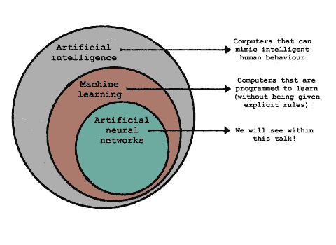
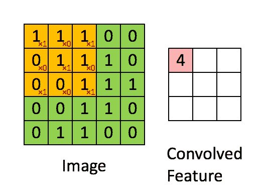
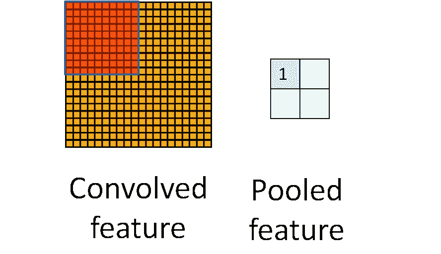

# 为什么要改用卷积神经网络？

> 原文：<https://pub.towardsai.net/the-motivation-to-switch-to-convolutional-neural-networks-487c76027826?source=collection_archive---------3----------------------->

## 深度学习

## 卷积神经系统也称为 CNN 或 ConvNet，是一种人工神经系统，迄今为止最著名的是用于分解计算机视觉事业的图片。

照片由[蓝屋滑雪板](https://unsplash.com/@bluehouseskis?utm_source=unsplash&utm_medium=referral&utm_content=creditCopyText)在 [Unsplash](https://unsplash.com/s/photos/change?utm_source=unsplash&utm_medium=referral&utm_content=creditCopyText) 上拍摄

> “无论你现在正在研究什么，如果你没有跟上深度学习、神经网络等的速度。，你输了。我们正在经历软件将软件自动化、自动化将自动化的过程。”
> 
> 马克·库班

# CNN 是什么？

卷积神经网络是一种前馈人工神经网络，其中其神经元之间的连接模式受到动物皮层组织的启发。

对神经网络的基本理解

> 与它的前身相比，CNN 的主要优势在于它可以在没有人工管理的情况下识别重要的亮点。

ConvNets 比 AI 计算更令人印象深刻，并且同样精通计算。

# 为什么不是完全连接的网络？

如果我们取一个 28×28×3 像素的图像，网络第一个隐层的权值数就是 2352。但是在现实生活中，图像并没有那么小。例如，如果图像的大小为 200x200x3 像素，则第一个隐藏层本身的权重数将为 120，000。
所以为了处理大量的参数，我们需要更多的神经元，这样最终会导致过度拟合。因此全连通不用于图像分类。

*让我们深入细节:*

在全连接层中，每个节点都与其他每个神经元相连。它们是标准前馈神经网络中使用的层。与全连接层不同，卷积层并不连接到每个神经元。

应当注意，图像不是用像素表示的，而是用代表像素值的数字表示的。就计算机所看到的而言，只是一个数字矩阵。对这些数字进行 ***卷积运算*** 。我们可以在一个模块中利用全连接层和
卷积层。滑动“窗口”在图像上移动，通常称为卷积或卷积运算。这个窗口的大小被称为内核或过滤器。

卷积如何发生的例子。

它们有助于识别数据中的模式。对于每个过滤器，有两个主要的属性需要考虑——填充和步幅。 ***步幅*** 代表卷积运算的步长；也就是窗口移动的像素数量。 ***填充*** 是添加空像素来增加图像的大小。这里的空像素是指值为 0 的像素。如果我们有一个 5x5 图像和一个带 3x3 滤波器的窗口，步长为 1，没有填充，卷积层的输出将是一个 3x3 图像。这种要素地图的构建被称为汇集。在这种情况下，将使用“*最大池*”。

***Max pooling*** 是一种通常被添加到各个卷积层之后的 CNN 的活动。当添加到模型中时，max-pooling 通过减少前一卷积层输出中的像素数量来降低图像的维数。

最大池如何发生的例子。

这里，最大值取自每个滑动窗口，并
放入输出矩阵。

另一个附加层可以是脱落层。

***Dropout****通过在训练阶段的每次更新时将隐藏单元(隐藏层中的神经元)的任意活动边缘选择为 0 来工作，以便模型不会过度拟合。*

*[*阅读更多*](https://scholar.google.co.in/scholar?q=convolutional+neural+network&hl=en&as_sdt=0&as_vis=1&oi=scholart)*

> *卷积神经网络的应用包括图像识别、自动驾驶汽车和机器人。CNN 通常用于视频，合成孔径雷达，2D 图像，光谱图。*

# *包扎*

*是的，我们需要切换到 CNN，因为与前馈神经网络相比，卷积在图像识别和分类中非常有效。这是因为卷积允许减少系统中的参数数量并利用空间区域。此外，卷积神经网络引入了池的概念，以通过下采样来减少参数的数量。*

# *参考*

*分析 vid hya:[https://www . analyticsvidhya . com/blog/2018/12/guide-convolutionary-neural-network-CNN/](https://www.analyticsvidhya.com/blog/2018/12/guide-convolutional-neural-network-cnn/)。*

*Edureka“卷积神经网络”博客:[https://goo.gl/4zxMfU](https://www.youtube.com/redirect?redir_token=3ZXze8mk-L7ftO4XAS7APSPk7aF8MTU4OTE4MTE2M0AxNTg5MDk0NzYz&v=umGJ30-15_A&q=https%3A%2F%2Fgoo.gl%2F4zxMfU&event=video_description)。*

*用 deeplearning.ai 进行深度学习:[https://www . deep Learning . ai](https://www.youtube.com/redirect?q=https%3A%2F%2Fwww.deeplearning.ai&redir_token=mlvLT53a4Je792rx9RUeBCqCZlJ8MTU4OTE4MTIzOUAxNTg5MDk0ODM5&v=ArPaAX_PhIs&event=video_description)。*

**感谢您的阅读，您可以联系我寻求建议和改进**

*由[向艾](https://towardsai.net/)发布*