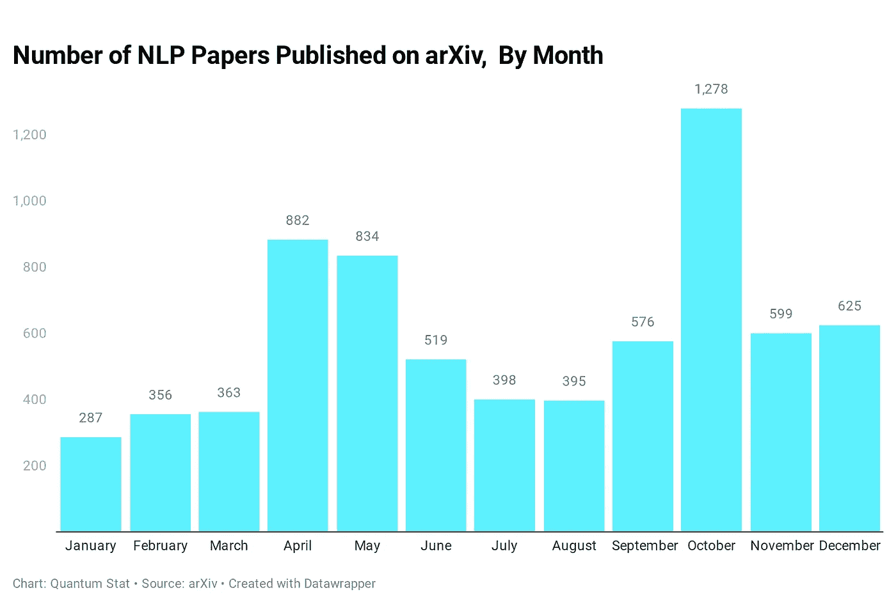
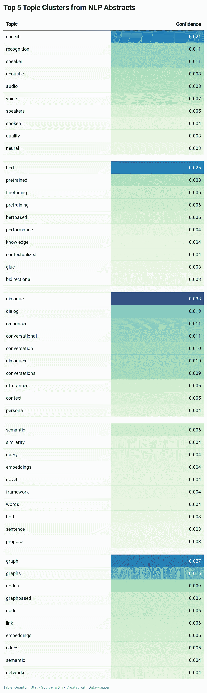
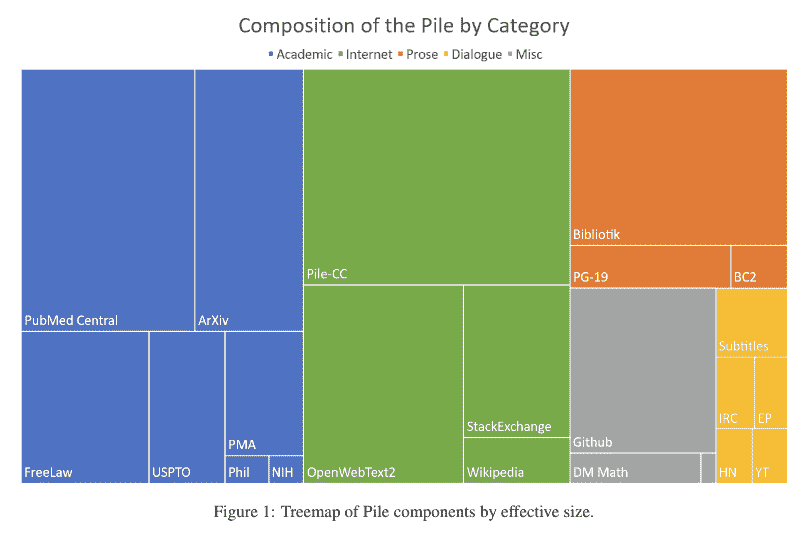
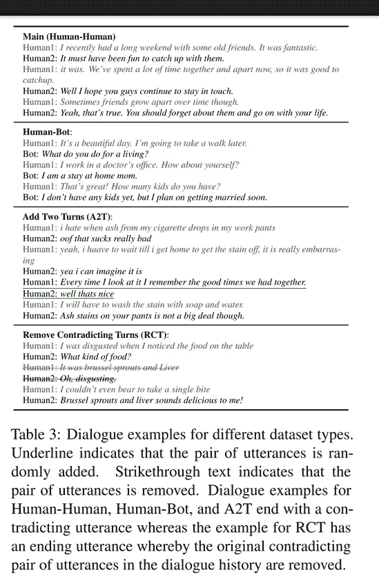

# NLP 密码| 01.03.21

> 原文：<https://pub.towardsai.net/the-nlp-cypher-01-03-21-23d7da4338e7?source=collection_archive---------0----------------------->

圣乌苏拉之梦|卡帕乔

## 自然语言处理每周时事通讯

## 新时代

欢迎回来，你成功了！现在，让我们从埃隆·马斯克即兴创作的《客户服务时刻》开始，踏上 2021 年的正确道路:

解密的

## 供参考

如果你还没有看过我们的[迷你年回顾](https://medium.com/towards-artificial-intelligence/mini-nlp-cypher-mini-year-review-7917e12fb2e5)，我们上周在大家都在度假的时候发布了它😬。通常，如果你喜欢阅读，请给我们的文章一个👏👏并分享给你的朋友和敌人！

现在，我们来玩个游戏。假设我们有 2020 年全年的 7129 篇 NLP 论文摘要。现在我们经营 BERTopic👇在这些摘要之上进行一些主题建模，以找到讨论最频繁的主题。

 [## 马尔滕格尔/贝尔托皮

### BERTopic 是一种主题建模技术，它利用了🤗变压器和 c-TF-IDF 创建密集的集群，允许…

github.com](https://github.com/MaartenGr/BERTopic) 

## 我们得到了什么？

1.  与言语相关的
2.  伯特相关的
3.  与对话相关的
4.  嵌入相关
5.  图形相关

有关主题的更多详细信息👇

# 一堆 825 英镑

Pile dataset，一个 800GB 的用于语言建模的巨型英语文本。👀

该堆由 22 个大而多样的数据集组成:

[论文](https://pile.eleuther.ai/paper.pdf)

数据集的多样性使其在保存跨领域知识方面独一无二且功能强大。

因此，为了在堆 BTB(每字节位数)基准测试中取得好成绩，模型应该

> …“能够理解许多不同的领域，包括书籍、github 库、网页、聊天记录以及医学、物理、数学、计算机科学和哲学论文。”

数据集在 z 标准压缩中被格式化为 jsonlines。您还可以在眼睛上查看更多数据集👁这里:

## 那堆东西

 [## 那堆东西

### Pile 是一个 825 GiB 多样化的开源语言建模数据集，由 22 个较小的、高质量的…

pile.eleuther.ai](https://pile.eleuther.ai/) 

## 这👁

 [## /public/AI/pile _ preliminary _ components/的索引

### Eye 是一个致力于归档和提供公开信息的网站。# opendirectory #归档…

the-eye.eu](https://the-eye.eu/public/AI/pile_preliminary_components/) 

# 对企业申请的域名转换情绪

企业正在适应监听文件和其他财务相关披露的 NLP 模型。根据一项新的研究，公司正在明智地选择他们的措辞，以愚弄机器，从而减少他们声明中的负面情绪。

**纸张**:

 [## 当机器在听时如何说话:人工智能时代的公司信息披露

### NBER 成立于 1920 年，是一个私人的、非营利的、无党派的组织，致力于进行经济研究

www.nber.org](https://www.nber.org/papers/w27950) 

# ML 书本掉落📚

本周，机器学习领域的一些知名作者出版了几本 ML 书籍。第一个是 Jurafsky 和 Martin 的《语音和语言处理》一书的新章节/更新:

**亮点**:

> -第 8 章的新版本(将 POS 和 NER 放在一章中)，
> 
> -第 9 章的新版本(带变压器)
> 
> ——第十一章(MT)
> 
> 神经跨度分析和 CCG 分析移至第 13 章(选区分析)，统计选区分析移至附录 C
> 
> 第 23 章的新版本(质量保证现代化)
> 
> 第 26 章(ASR + TTS)

 [## 语音和语言处理

### 第 8 章的新版本(将 POS 和 NER 放在一章中)，第 9 章的新版本(有变形金刚)…

web.stanford.edu](https://web.stanford.edu/~jurafsky/slp3/) 

墨菲的概率机器学习草案也在本周流传开来。而且还附带了代码！享受吧。

https://probml.github.io/pml-book/book1.html

**代号**:

 [## probml/pyprobml

### 我的新书《概率机器学习》系列的 Python 3 代码。这是正在进行中的工作，所以预计粗糙的边缘…

github.com](https://github.com/probml/pyprobml) 

# 打开图书馆浏览器

有一种新的方式来探索互联网档案中的精彩内容。

 [## 开放的图书馆资源管理器！一种浏览互联网档案的新方法

### 你想在这个假期改变一下生活节奏吗？读点书怎么样？现在我相信你们都在努力…

datahorde.org](https://datahorde.org/?p=1899) 

# 量子广告列表

有人建造了👇作为屏蔽广告的一种方式🤣。

> “制造了一个人工智能来跟踪和分析每个网站，有点像网络爬虫，以发现和识别广告。这是一个包含超过 1，300，000 个被广告、追踪器、矿工和恶意软件使用的域名的列表。”

 [## 量子阿尔法。/量子广告列表

### 超过 800000 个被屏蔽的域名被我伟大的人工智能放在一起的广告使用。人工智能就像一只忠诚的狗…

gitlab.com](https://gitlab.com/The_Quantum_Alpha/the-quantum-ad-list) 

# 回购密码👨‍💻

## 一组最近发布的回购文件引起了我们的关注👁

## LayoutLM V2

> 微软发布了他们的文档理解语言模型 LayoutLM 的第二版。如果你对 SOTA w/r/t 文档 AI 任务感兴趣。跟着这个回购！

 [## 微软/unilm

### 2020 年 12 月 29 日:LayoutLMv2 将与新的 SOTA 一起在广泛的文档人工智能任务中出现，包括 DocVQA…

github.com](https://github.com/microsoft/unilm/tree/master/layoutlm) 

## WikiTableT

> 一个大规模数据集 WikiTableT，它将维基百科的各个部分与其对应的表格数据和各种元数据配对。

 [## 明达晨/WikiTableT

### “从不同的数据源生成维基百科文章部分”一文的代码、数据和预训练模型

github.com](https://github.com/mingdachen/WikiTableT) 

## 卖空者

> Shortformer 模型显示，通过*缩短*输入，性能得以提高，同时速度和内存效率也得以提高。它使用了两种新技术:分阶段训练和注入位置的注意力/缓存。

 [## of impress/short former

### 这个存储库包含 Shortformer 模型的代码。这个文件解释了如何在…上运行我们的实验

github.com](https://github.com/ofirpress/shortformer) 

## ExtendedSumm

> 一种提取摘要技术，通过使用多任务学习方法观察长文档的层次结构。

 [## 乔治敦-IR-Lab/ExtendedSumm

### 此存储库包含在中使用的实施详细信息和数据集，用于生成长期…的扩展摘要

github.com](https://github.com/Georgetown-IR-Lab/ExtendedSumm) 

## NeurST

> NeurST 旨在建立和训练端到端的语音翻译。

来自字节跳动的抖音人:

 [## 字节跳动/纽斯特

### NeurST 旨在轻松建立和训练端到端的语音翻译，它有精心设计的…

github.com](https://github.com/bytedance/neurst) 

## 白板演示

> 跨域表格语义解析(X-TSP)中使用的模型。这是在给定一个自然语言问题的情况下，预测可执行的结构化查询语言的任务。

 [## sales force/tablarsemantipparsing

### 这是以下论文的官方代码发布:Victoria Lin，Richard Socher 和 Xiong。桥接…

github.com](https://github.com/salesforce/TabularSemanticParsing) 

## AraBERTv2 / AraGPT2 / AraELECTRA

> AraBERT 现在有 4 个新版本来取代旧的 v1 版本。

 [## 奥布-明德/阿拉伯特

### 这个存储库现在包含以下内容的代码和实现:AraBERT v0.1/v1:原始 AraBERT v0.2/v2:基本和大型…

github.com](https://github.com/aub-mind/araBERT) 

## 用变形金刚推理事实链

> 给定一个自然语言问题及其答案，模型以文本片段的形式检索相关的事实证据。

 [## rubencart/LIIR-TextGraphs-14

### 这个存储库包含我们提交给 TextGraphs-14 的多跳推理共享任务的实现…

github.com](https://github.com/rubencart/LIIR-TextGraphs-14) 

# 本周数据集:解码数据集

## 这是什么？

包含矛盾对话的会话数据集，用于研究 NLU 模型如何捕捉对话中的一致性。它包含来自脸书 ParlAI 框架的 4 个子集的 27，184 个实例。

## 样品

## 它在哪里？

 [## 矛盾

### 对话建模中的矛盾检测与非矛盾生成研究。论文可以在这里找到…

parl.ai](https://parl.ai/projects/contradiction/) 

> 每周日，我们都会对来自世界各地研究人员的 NLP 新闻和代码进行一次每周综述。
> 
> 如需完整报道，请关注我们的 Twitter: [@Quantum_Stat](http://twitter.com/Quantum_Stat)

[量子统计](https://quantumstat.com/)