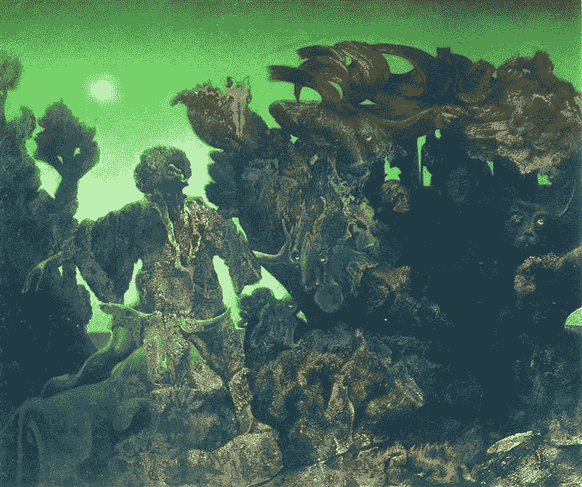
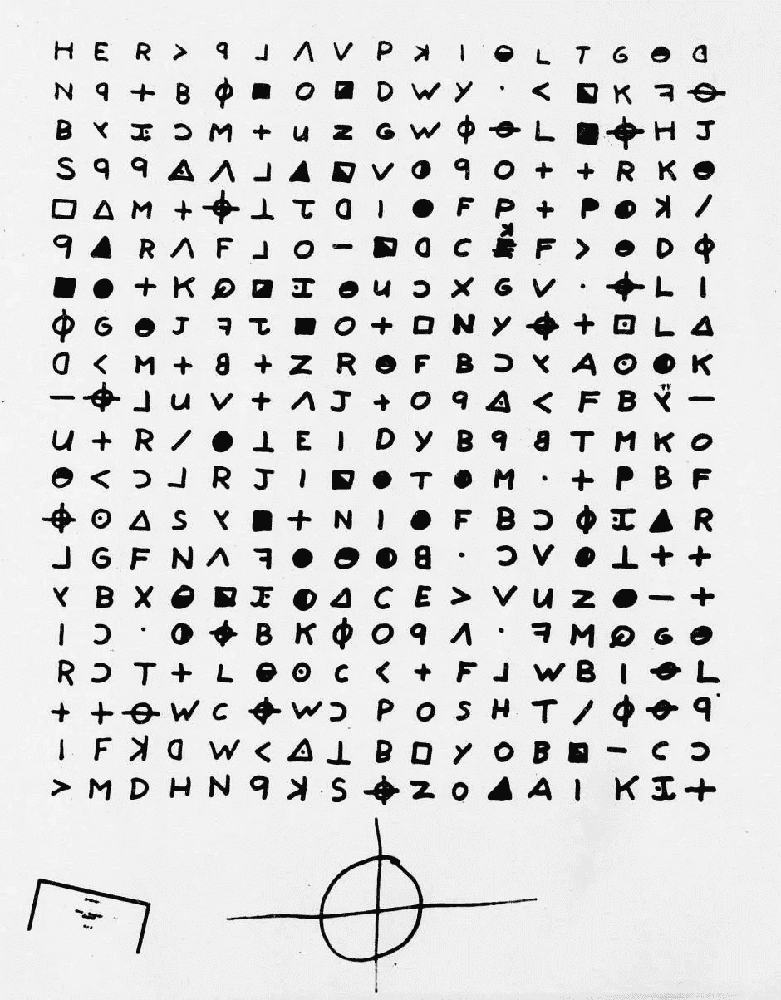

# NLP 密码| 01.10.21

> 原文：<https://pub.towardsai.net/the-nlp-cypher-01-10-21-227fb575f9c8?source=collection_archive---------1----------------------->



顿悟|恩斯特

## 自然语言处理每周时事通讯

## 熔化钟

偶尔你会在研究的渣滓中发现好东西。最近出现了一篇密码破解论文，题目是使用 seq2seq 模型破解 1:1 替代密码。🙉

> (1:1 替换是指密文代表目标明文中的固定字符。如果你喜欢危险的生活，在这里阅读更多。

现在使用的几种破译方法做了一个很大的假设。我们知道需要破解的密码的目标语言。但是，当潜入目标语言未知的加密历史文本时，当语言起源模糊不清时，你往往会感到非常头痛。

当一个人开始攻击加密文本时。密码的状态可以是各种条件:字母数字(数字/字母)或者它甚至可以是符号的或者它可以是两者的混合(像十二宫黑仔的密码👇).



然而，**如果**我们提前知道密码的明文语言是...说英语(而不是拉丁语，或任何其他语言)，那么，我们有一个良好的开端和健康的优势。为什么？因为我们可以利用其他语言中没有的英语的独特特征。也就是说，字母“e”是英语中最常见的字母，所以密文中最常见的字母可能是字母“e ”,通过使用这些启发法，一个字母接一个字母地，你会慢慢变成达芬奇密码中的汤姆·汉克斯。

[](https://www3.nd.edu/~busiforc/handouts/cryptography/letterfrequencies.html) [## 英语中的字母频率

### 第三列表示比例，取最不常用的字母(q)等于 1。字母 E 超过 56…

www3.nd.edu](https://www3.nd.edu/~busiforc/handouts/cryptography/letterfrequencies.html) 

这篇 [**论文**](https://arxiv.org/pdf/2012.15229.pdf) 真正有趣的地方在于，作者想要测试多语言 seq2seq 转换器是否能够在不知道明文语言来源的情况下破解密码。他们将解读公式化为一个序列到序列的翻译问题。该模型是在角色级别上训练的。

最酷的是，他们在历史密码(之前已被破解)上测试该模型，如[博格密码](https://digi.vatlib.it/view/MSS_Borg.lat.898)，它能够以非常低的错误破解前 256 个字符。根据作者的说法，这是序列对序列神经模型首次应用于破译！

**国安局就像…**

解密的

如果你喜欢这本书，请给它一个👏👏并分享给你的朋友！这真的帮了我们大忙！

## 不要担心有一个为密码爱好者准备的堆栈交换

[](https://crypto.stackexchange.com/) [## 密码堆栈交换

### 密码术栈交换是一个为软件开发者、数学家和其他感兴趣的人提供的问答网站…

crypto.stackexchange.com](https://crypto.stackexchange.com/) 

# OpenAI 掉落珠宝

你可能已经听说过 OpenAI 本周的模型下降，所以我就不赘述了。添加了他们的两个博客，以防你想了解他们的情况。本周，我在 LinkedIn 上添加了用于 CLIP 的 Colab 笔记本，它获得了良好的反响，如果您感兴趣，我也将把它添加到这里:

## 本周可乐杯|剪辑

[](https://colab.research.google.com/github/openai/clip/blob/master/Interacting_with_CLIP.ipynb) [## 谷歌联合实验室

### 编辑描述

colab.research.google.com](https://colab.research.google.com/github/openai/clip/blob/master/Interacting_with_CLIP.ipynb) 

**DALL-E 博客**

[](https://openai.com/blog/dall-e/) [## DALL E:从文本中创建图像

### DALL E 是 GPT-3 的一个 120 亿参数版本，经过训练，可以使用以下数据集从文本描述中生成图像

openai.com](https://openai.com/blog/dall-e/) 

**剪辑博客**

[](https://openai.com/blog/clip/) [## 剪辑:连接文本和图像

### 我们正在引入一个叫做 CLIP 的神经网络，它可以有效地从自然语言中学习视觉概念…

openai.com](https://openai.com/blog/clip/) 

## DALL-E 复制已经在 GitHub 上

惊喜！有人已经在 PyTorch 上复制了 DALL-E😁。🔥🔥

```
pip install dalle-pytorch
```

[](https://github.com/lucidrains/DALLE-pytorch) [## lucidrains/DALLE-pytorch

### 在 py torch-luci drains/DALLE-py torch 中实现/复制 DALL-E，OpenAI 的文本到图像转换器

github.com](https://github.com/lucidrains/DALLE-pytorch) 

# 对象存储搜索引擎

## 感谢你当地的黑客

嘿，你知道当你设置你的 S3 桶或其他对象存储时，你可以选择公共或私人设置。你有没有想过，如果有人可以收集所有的公共桶网址供你公开搜索，那会是什么样子:👇

[欢迎来到矩阵](https://buckets.grayhatwarfare.com/)

# 兔子洞里面

Ecco 库允许你可视化为什么语言模型以他们的方式运动。该库主要关注自回归模型(如 GPT-2/3 模型)。他们目前有两个笔记本来可视化神经元激活和输入显著性。

它建立在 PyTorch 和变形金刚之上。

[](https://www.eccox.io/) [## 查看语言模型内部

### Ecco 是一个 python 库，它创建交互式可视化，允许您探索您的 NLP 语言模型…

www.eccox.io](https://www.eccox.io/) [](https://jalammar.github.io/explaining-transformers/) [## 解释转换器语言模型的接口

### 通过查看输入显著性和神经元激活来探索 transformer 语言模型的界面。可探索的#1…

jalammar.github.io](https://jalammar.github.io/explaining-transformers/) 

# 带 Swag 的文本到语音转换

15.ai 于 2019 年推出了令人惊叹的文本到语音的演示，自那以来，它一直在完善其模型的功能。你可以输入文本并获得深度学习生成的语音，条件是从 2001:太空漫游的 HAL 9000 到神秘博士的各种字符。

 [## 15.ai:使用最少数据的自然 TTS

### 15.ai:以最少的数据实现自然的高质量、比实时更快的文本到语音合成

15.ai](https://15.ai/) 

# ML 元数据

谷歌推出了机器学习元数据(MLMD)。一个跟踪整个 ML 工作流程的库。允许您对您的模型和数据集进行版本化，以便您知道当它们出错时为什么会出错。

[](https://blog.tensorflow.org/2021/01/ml-metadata-version-control-for-ml.html) [## ML 元数据:ML 的版本控制

### 2021 年 1 月 8 日-由 Ben Mathes 和 Neoklis Polyzotis 发布，代表 TFX 团队当你写代码时，你需要…

blog.tensorflow.org](https://blog.tensorflow.org/2021/01/ml-metadata-version-control-for-ml.html) 

**El GitHub:**

[](https://github.com/google/ml-metadata) [## Google/ml-元数据

### ML 元数据(MLMD)是一个记录和检索与 ML 开发者和数据科学家相关的元数据的库

github.com](https://github.com/google/ml-metadata) 

**MLDM API 等级**:

[](https://www.tensorflow.org/tfx/ml_metadata/api_docs/python/mlmd/metadata_store/MetadataStore) [## mlmd .元数据 _ 存储。元数据存储| TFX |张量流

### 工件元数据的存储。mlmd .元数据 _ 存储。元数据存储(配置…

www.tensorflow.org](https://www.tensorflow.org/tfx/ml_metadata/api_docs/python/mlmd/metadata_store/MetadataStore) 

# 使用 Wolfram 语言的 iOS NNs

Wolfram 在左外野，他带了一部智能手机。在最近的一篇 Wolfram 博客文章中，他们展示了如何训练一个图像分类器，将其扔在 ONNX 上，然后将其转换为 Core ML，以便可以在 iOS 设备上使用。包含代码！

[](https://blog.wolfram.com/2021/01/07/deploy-a-neural-network-to-your-ios-device-using-the-wolfram-language/) [## 使用 Wolfram 语言在你的 iOS 设备上部署一个神经网络

### 2021 年 1 月 7 日-霍弗雷·埃斯皮古尔-庞斯，机器学习今天的手持设备足够强大，可以运行神经…

blog.wolfram.com](https://blog.wolfram.com/2021/01/07/deploy-a-neural-network-to-your-ios-device-using-the-wolfram-language/) 

# 带代码的机器学习索引

一个巨大的索引，每个索引有数百个关于机器学习的项目，包括计算机视觉和 NLP。你可以在上面找到超级骗子 NLP 回购😎。

[](https://github.com/ashishpatel26/500-AI-Machine-learning-Deep-learning-Computer-vision-NLP-Projects-with-code) [## ashishpatel 26/500-AI-机器学习-深度学习-计算机视觉-NLP-项目-带代码

### 500 AI 机器学习深度学习计算机视觉 NLP 项目带代码…

github.com](https://github.com/ashishpatel26/500-AI-Machine-learning-Deep-learning-Computer-vision-NLP-Projects-with-code) 

# 回购密码👨‍💻

## 一组最近发布的回购文件引起了我们的关注👁

## ask 2 变压器

> Ask2Transformers 自动注释文本数据..又名零距离射击。*🔥*

[](https://github.com/osainz59/Ask2Transformers) [## osain z59/ask 2 变压器

### 这个库包含了 Ask2Transformers -带预训练的零炮域标记的代码…

github.com](https://github.com/osainz59/Ask2Transformers) 

## 子变压器

> 一个参数有效的基于变压器的模型，结合了新提出的三明治式参数共享技术。

[](https://github.com/machelreid/subformer) [## 主变压器/子变压器

### 这个存储库包含子表单的代码。为了帮助克服这一点，我们提出了子形式，允许我们…

github.com](https://github.com/machelreid/subformer) 

## SF-QA

> 开放领域的 QA 评估库，它包括有效的读者比较，可重复的研究，以及应用程序的知识来源。

[](https://github.com/soco-ai/SF-QA) [## soco-ai/SF-QA

### 一个简单公平的开放领域问答评测库通常意味着几天的时间…

github.com](https://github.com/soco-ai/SF-QA) 

## 阿伯特-马伯特公司

> 阿拉伯语 BERT 连续第二周在 Cypher 上回归。这次是阿伯特和马伯特。它还包括基于 5 个不同任务的 41 个数据集的阿拉伯 NLU 基准 ArBench。

[](https://github.com/UBC-NLP/marbert) [## UBC-NLP/马伯特

### 这是我们的论文《ARBERT & MARBERT:阿拉伯语的深度双向转换器》附带的存储库。在…

github.com](https://github.com/UBC-NLP/marbert) 

## CRSLab

> CRSLab 是一个用于构建对话式推荐系统(CRS)的开源工具包。包括模型和数据集。

[](https://github.com/RUCAIBox/CRSLab) [## RUCAIBox/CRSLab

### CRSLab 是一个用于构建对话式推荐系统(CRS)的开源工具包。它是基于 Python 开发的…

github.com](https://github.com/RUCAIBox/CRSLab) 

# 本周数据集:StrategyQA

## 这是什么？

“StrategyQA 是一个问答基准测试，专注于开放领域的问题，其中所需的推理步骤隐含在问题中，应该使用策略进行推理。StrategyQA 包括 2，780 个示例，每个示例由一个策略问题、其分解和证据段落组成。

## 样品

**例 1**

> "种植无籽黄瓜对有昆虫恐惧症的园丁有好处吗？"

答案:是的
解释:无籽黄瓜果实不需要授粉。黄瓜植物需要昆虫来授粉。昆虫恐惧症是对昆虫的恐惧。

**例二**

> “龙猫是冷血动物吗？”

答案:没有
解释:龙猫是啮齿动物，是哺乳动物。所有的哺乳动物都是温血动物。

**例 3**

> "珍妮·杰克逊会避免吃火腿菜吗？"

答案:是
解释:珍妮·杰克逊遵循一种伊斯兰惯例。伊斯兰文化避免吃猪肉。火腿是由猪肉制成的。

## 它在哪里？

[](https://allenai.org/data/strategyqa) [## StrategyQA 数据集-艾伦人工智能研究所

### StrategyQA 数据集是通过众包渠道创建的，用于引出创造性和多样化的是/否问题…

allenai.org](https://allenai.org/data/strategyqa) 

> 每周日，我们都会对来自世界各地研究人员的 NLP 新闻和代码进行一次每周综述。
> 
> 如需完整报道，请关注我们的 Twitter: [@Quantum_Stat](http://twitter.com/Quantum_Stat)


[量子统计](https://quantumstat.com/)