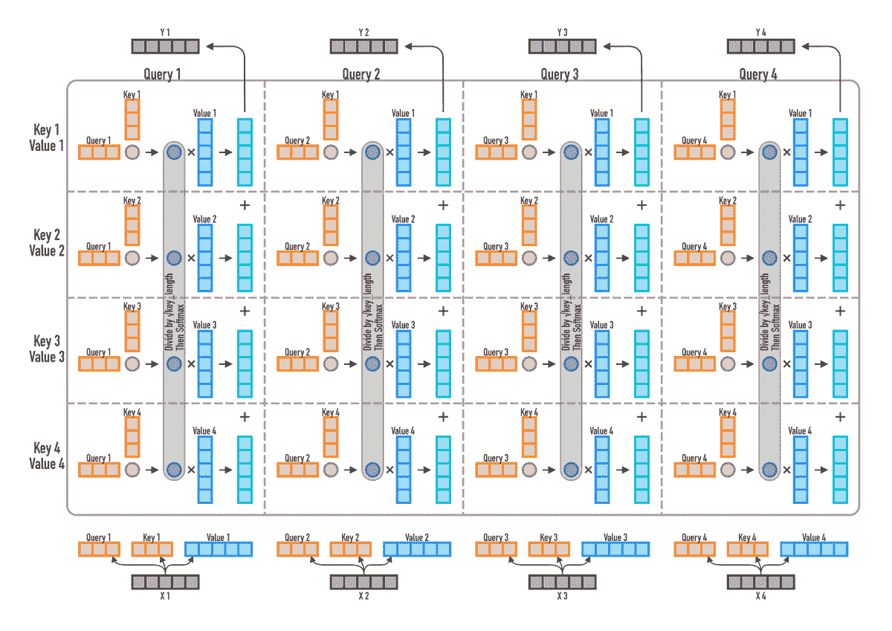
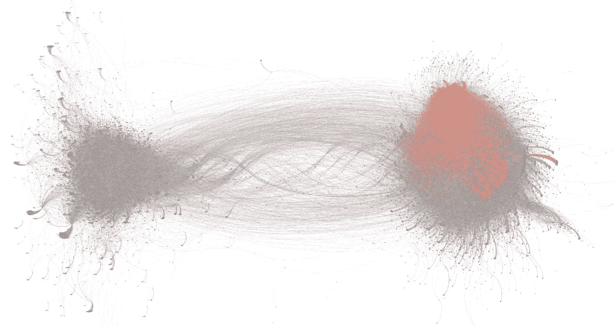

# NLP 密码| 01.24.21

> 原文：<https://pub.towardsai.net/the-nlp-cypher-01-24-21-ed93d4351fd4?source=collection_archive---------2----------------------->

收获|马丁

## 自然语言处理每周时事通讯

## 杰罗尼莫

嘿欢迎回来！又一周过去了，NLP 领域继续超越逃逸速度…但是不要担心，有一个关于变形金刚如何工作的令人敬畏的直觉泵:

解密的

如果你继续喜欢这篇文章，请与你的朋友分享，别忘了给它一个👏👏 ….😎

# 史诗推特数据集

康奈尔理工大学发布了一个庞大的 Twitter 数据集，该数据集基于 260 万用户在 10 月 23 日至 12 月 16 日期间讨论选民欺诈的 760 万条推文/2560 万条转发。分析深入到谁促进或否认了“选民欺诈”，网络的可视化，以及 Twitter 禁止了谁(个人推文内容不会直接共享以保护隐私)。结果令人着迷，数据集也是可用的。

选民欺诈的“提倡者”和“反对者”网络。橙色突出显示暂停的推特账户。

**GitHub** :

 [## sTechLab/VoterFraud2020

### VoterFraud2020 是一个多模态 Twitter 数据集，有 760 万条推文和 2560 万条转发，来自 260 万名与选民相关的用户…

github.com](https://github.com/sTechLab/VoterFraud2020) 

# 每日双重|危险数据

你想教你的编码器解码器模型如何从答案中产生问题吗？？？看看粉丝们创建的 Jeopardy 档案吧。有线索和答案以及其他元数据。伟大的数据资源，如果它只能在某处获得…

 [## j！档案馆

### 粉丝创建的危险档案！游戏和玩家-409，579 条线索，还在统计中！[所有] [1] [2] [3] [4] [5] [6] [7]…

j-archive.com](http://j-archive.com/) 

在这里！✌✌

 [## jvani/jar chive-线索

### 来自 j-archive.com 的危险线索。用 Scrapy 收集线索，保存到 sqlite，并通过 GitHub 每天更新…

github.com](https://github.com/jvani/jarchive-clues) 

# 2020 NLP/ML 汇总

塞巴斯蒂安·路德的《2020 年回顾》是一篇不容错过的博文。他讨论了过去一年中引起他注意的 NLP/机器学习的十大趋势(包括论文链接):

1.  [放大和缩小](https://ruder.io/research-highlights-2020/index.html#1-scaling-up-and-down)
2.  [检索增强](https://ruder.io/research-highlights-2020/index.html#2-retrieval-augmentation)
3.  [少投学习](https://ruder.io/research-highlights-2020/index.html#3-few-shot-learning)
4.  [对比学习](https://ruder.io/research-highlights-2020/index.html#4-contrastive-learning)
5.  [评估超出准确度](https://ruder.io/research-highlights-2020/index.html#5-evaluation-beyond-accuracy)
6.  [大型 LMs 的实际问题](https://ruder.io/research-highlights-2020/index.html#6-practical-concerns-of-large-lms)
7.  [多语言](https://ruder.io/research-highlights-2020/index.html#7-multilinguality)
8.  [影像变形金刚](https://ruder.io/research-highlights-2020/index.html#8-image-transformers)
9.  [理科硕士](https://ruder.io/research-highlights-2020/index.html#9-ml-for-science)
10.  [强化学习](https://ruder.io/research-highlights-2020/index.html#10-reinforcement-learning)

**完整博文**

 [## 2020 年的 ML 和 NLP 研究亮点

### 区域和方法的选择很大程度上受我自身兴趣的影响；选题偏向于…

ruder.io](https://ruder.io/research-highlights-2020/index.html#1-scaling-up-and-down) 

# GNN 应用

一个令人耳目一新的回顾，讨论图形神经网络应用在 2021 年的方向。讨论推荐系统、组合优化、计算机视觉和物理/生命科学应用。

 [## 图形神经网络的主要应用 2021

### gnn 在学术界取得了长足的进步。但是我们在工业上有很好的应用吗？

medium.com](https://medium.com/criteo-engineering/top-applications-of-graph-neural-networks-2021-c06ec82bfc18) 

# 从零到英雄|内存优化器

还记得零冗余优化器(Zero)吗？微软针对超大参数模型的优化器带来了一篇引人入胜的拥抱脸博文。仅供参考，(拥抱脸的教练类给予支持 DeepSpeed 的和 FairScale 的零功能，截至 4.2 版本。)使用 DeepSpeed 库，他们能够获得一个 24GB 的 RTX-3090 卡来训练 30 亿个参数 T5，批量大小为 20。👀👀

**博客**:

 [## 通过 DeepSpeed 和 FairScale，零消耗，增加体能，提高训练速度

### 最近机器学习模型发展得越来越快，拥抱脸研究员斯塔斯·贝克曼的客座博文…

huggingface.co](https://huggingface.co/blog/zero-deepspeed-fairscale) 

# 计算机科学视频

如果你喜欢视频和计算机科学教育视频👇

 [## 开发者-Y/cs-视频-课程

### 简介请查看注释以了解关于此列表的一般信息。投稿请参考 CONTRIBUTING.md

github.com](https://github.com/Developer-Y/cs-video-courses#math-for-computer-scientist) 

# FOIA YouTube

黑金库真的很享受它的 FOIA(信息自由法案)的请求，以至于它决定请求 YouTube 上所有被列为私人或在几个联邦机构中未列出的视频！！😁

 [## 美国政府机构的私人/未上市 YouTube 视频-黑金库

### 背景许多美国政府机构和军事部门都有公共 YouTube 页面。这不是秘密。然而…

www.theblackvault.com](https://www.theblackvault.com/documentarchive/private-unlisted-youtube-videos-of-u-s-government-agencies/) 

# 2021 年企业和机器学习调查

> “对于购买第三方解决方案的组织来说，部署模型所需的时间减少了 31%。”
> 
> “拥有更多模型的组织将其数据科学家的更多时间花在部署上，而不是更少”
> 
> “部署模型所需的时间逐年增加”

在此下载免费副本:

 [## 2021 年机器学习的企业趋势

### 基于去年的报告，Algorithmia 发布了 2021 年机器学习企业趋势报告。看看有什么…

info.algorithmia.com](https://info.algorithmia.com/email-state-of-ml-2021) 

# 回购密码👨‍💻

## 一组最近发布的回购文件引起了我们的关注👁

## Trankit

> 一个用于基本 NLP 任务的可训练流水线，有超过 [100 种语言](https://trankit.readthedocs.io/en/latest/pkgnames.html#trainable-languages)和 90 种[可下载](https://trankit.readthedocs.io/en/latest/pkgnames.html#pretrained-languages-their-code-names)用于 [56 种语言](https://trankit.readthedocs.io/en/latest/pkgnames.html#pretrained-languages-their-code-names)的预训练流水线。

(作者表示，在句子分割和依存句法分析(英语)等特定任务上，Trankit 优于 Stanford ' s stanza。)🥶🥶

 [## nlp-uoregon/trankit

### Trankit 是一个轻量级的基于 Transformer 的 Python 工具包，用于多语言自然语言处理(NLP)。它…

github.com](https://github.com/nlp-uoregon/trankit) 

## 范围

> Spectrum 是一个使用深度学习生成说唱歌词的模型。包括演示和 Colab！

 [## YigitGunduc/光谱

### Spectrum 是一种利用深度学习生成说唱歌词的 AI。查看演示报告错误请求功能打开于…

github.com](https://github.com/YigitGunduc/Spectrum) 

## 神经标点符号

> 用 BERT 模型自动恢复英语和匈牙利语的标点符号。

 [## 语言神经 234/神经标点符号

### 免费代码为我们的论文自动标点符号恢复与伯特模型提交给第十七届。会议…

github.com](https://github.com/attilanagy234/neural-punctuator) 

## 用于语义解析的文本到文本转换器

> 在语义解析任务上微调 T5 模型，从自然语言描述中生成 Python 代码。

 [## ypapanik/t5-用于代码生成

### 这个库用于微调语义解析任务中的 T5 模型，也就是从…中生成(Python)代码

github.com](https://github.com/ypapanik/t5-for-code-generation) 

## 伯特文本分类 Jupyter 笔记本

> 用于微调 BERT、SciBERT 和 BioBERT 的笔记本；在 BERT 模型的最后一层中可视化自我关注，并在 BERT 模型的最后一层中获得高于平均水平的最受关注单词的列表。

 [## 专家实验室/自我关注特征选择法

### 科学文献的注释和分类是使科学知识易于理解和掌握的一项重要任务

github.com](https://github.com/expertailab/Is-BERT-self-attention-a-feature-selection-method#Jupyter-notebooks) 

## 爬行动物

> 使用元学习的少镜头对话状态跟踪。完整的代码库将最终发布。如果您对构建能够转移到新领域的对话模型感兴趣，可以看看这个空间。

 [## saketdingliwal/少炮 DST

### 我们在 EACL 2021 上的“D-爬行动物”论文的源代码:Saket Dingliwal，Bill Gao，Sanchit Agarwal，Tagyoung Chung，和…

github.com](https://github.com/saketdingliwal/Few-Shot-DST) 

# 本周数据集:开放视频

## 这是什么？

对话轮和视觉语境是从电影和电视连续剧中提取的，其中每个对话轮都与它发生的相应视觉语境配对。它包含总共 110 万个对话回合，因此 110 万个视觉上下文存储在图像中。

## 它在哪里？

 [## ShannonAI/OpenViDial

### 本报告包含《开放视频:一个大规模、开放领域…》中的开放视频数据集的下载说明

github.com](https://github.com/ShannonAI/OpenViDial) 

> 每周日，我们都会对来自世界各地研究人员的 NLP 新闻和代码进行一次每周综述。
> 
> 如需完整报道，请关注我们的 Twitter: [@Quantum_Stat](http://twitter.com/Quantum_Stat)

[量子统计](https://quantumstat.com/)