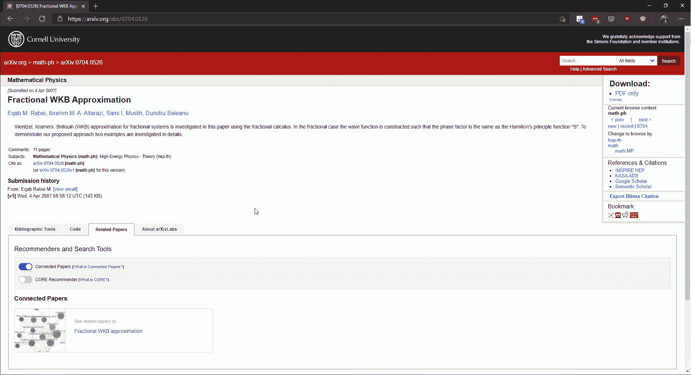
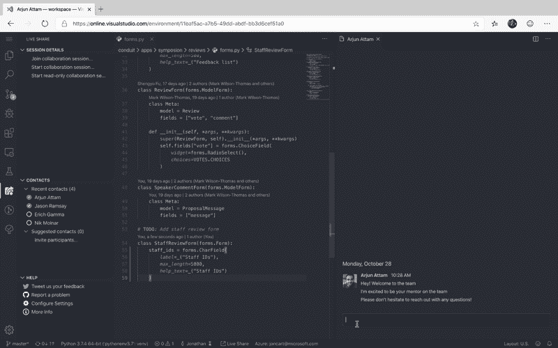
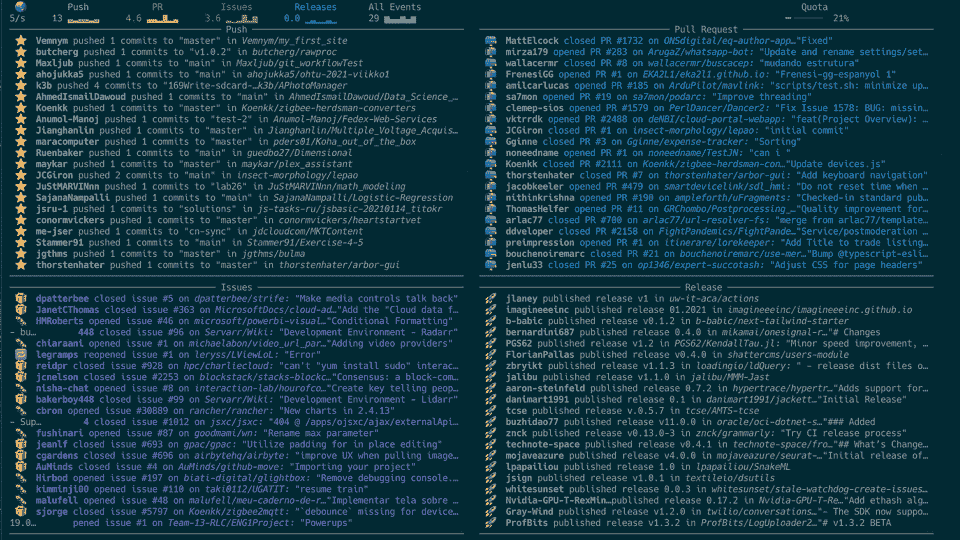
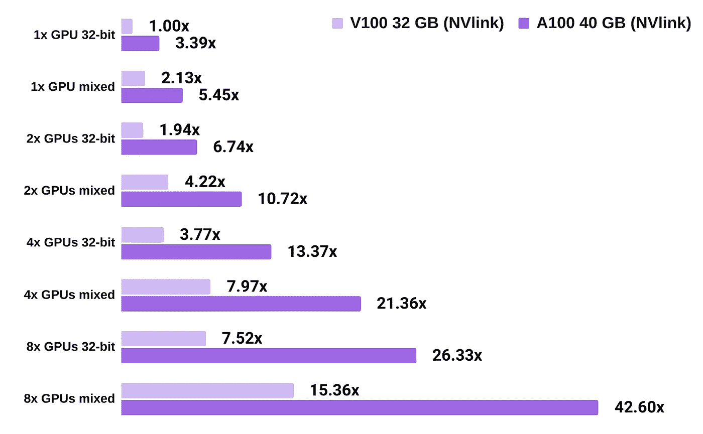

# NLP 密码| 02.07.21

> 原文：<https://pub.towardsai.net/the-nlp-cypher-02-07-21-cc644ee851da?source=collection_archive---------1----------------------->

他愤怒的大日子|马丁

## 自然语言处理每周时事通讯

## 短暂的挤压

平民战胜市场…

华尔街——以其偏爱富裕的、避暑度假的中产阶级的历史诀窍——被 Reddit 日内交易的千禧一代电脑虫网络所击败。结果是:数十亿对冲基金的资金化为乌有。

当 COVID 传奇开始时，那些希望在网上赚点外快的人依靠 Robinhood 等免佣金的在线交易平台来实现收支平衡。随着一个新的散户投资者在华尔街神圣的土地上赌博，没有人，甚至是机构投资者预见到了过去几周的事件。

发生了什么事？

埃隆·普宁卖空者

Reddit 交易员开始购买被行业投资者大量做空的股票。(‘做空’意味着押注股票会下跌)。当股票价格由于他们的股票购买而开始攀升时，对冲基金开始在他们的做空中损失大量的钱，结果，对冲基金开始购买他们做空的相同的股票以弥补他们的损失。最终结果是股价的恶性上涨，也就是空头挤压。

仅供参考，你可以使用 PRAW 图书馆在 Reddit 上观看直播，这样你就可以享受实时观看华尔街现象的乐趣。😁

 [## PRAW:Python Reddit API 包装器- PRAW 7.1.5.dev0 文档

### 编辑描述

praw.readthedocs.io](https://praw.readthedocs.io/en/latest/index.html) 

# ArXiv 重访|图表|视频

ArXiv 发布了一项新功能，允许人们使用“关联论文”来生成来自开源平台的相关研究论文的图表。仅供参考，我本周黑了，所以我会每周在回购密码中添加“关联文件”。😁

说到 arXiv，有一个由 Amit Chaudhary 创建的名为“带视频的报纸”的新功能。这是一个网络浏览器扩展，提供了一个与 arXiv 论文相关的视频链接。目前覆盖 3.7K ML 的论文。🔥🔥

解密的

# NMT

从句子变形金刚的制造者那里，他们引入了一个新的机器翻译库。(也带有语言检测)

**缺陷:**

*   易于安装和使用:使用最先进的机器翻译，只有 3 行代码
*   自动下载预先训练好的机器翻译模型
*   150 多种语言之间的翻译
*   170 多种语言的自动语言检测
*   句子和文档翻译
*   多 GPU 和多进程翻译

 [## UKPLab/EasyNMT

### 这个软件包为 100 多种语言提供了易于使用的最先进的机器翻译。…的亮点

github.com](https://github.com/UKPLab/EasyNMT) 

# 预算 ML

如果你想在 Google Cloud 上部署你的模型，并在 FastAPI 和 GCP 的可抢占实例上运行一个好的 API 端点，这是一个很好的库。因为可抢占的机器可以在任何时候被关闭，所以它们有一个机制来自动启动它们以避免停机时间。✌

 [## 预算管理

### 给我们一颗 GitHub 星来表达你的爱吧！BudgetML 非常适合那些希望快速部署他们的…

github.com](https://github.com/ebhy/budgetml) 

# GPT 新协议项目/创业公司列表

GPT 三号目前编织的网。这里有一个不错的表格，列出了当前的项目和创业公司，它们都在 GPT-3 的肥缺之列。OpenAI 的推理 API 已经带动了整个行业😵。

# 快速风格测定法

与写作风格相关的文体学库。使用布伦斯的德尔塔算法。

> “Burrows' delta 是一个统计数字，它表示两位作者写作风格之间的距离。像 3 这样的高数字意味着两个作者非常不同，而像 0.2 这样的低数字意味着两本书很可能是同一作者写的。”

作者提到大多数风格学库主要包括图形，但是对于他的库，他也想包括概率。此外，faststylometry 还包括用于测试目的的“未知”书籍。相当酷。

联邦调查局使用这种技术，通过关联写作风格来获得逮捕令，从而在黑暗网络上抓住罪犯。(随机事实)他们也使用时间相关性，但那是另一个故事了…

**博客**:

 [## 快速笔法教程-自由数据科学家|托马斯·伍德

### 我正在介绍一个我写的 Python 库，叫做 faststylometry，它允许你通过…

freelancedatascientist.net](https://freelancedatascientist.net/fast-stylometry-tutorial/) 

**GitHub:**

 [## 快速数据科学/快速风格测量

### 由托马斯伍德，快速数据科学源代码在 https://github.com/woodthom2/faststylometry 教程在…

github.com](https://github.com/fastdatascience/faststylometry) 

# 使用剪辑进行不连续搜索

有人把 OpenAI 的 CLIP 模型扔在 Unsplash 上面，用于通过自然语言搜索图片。包括一个可乐杯。😎

 [## 哈尔塔科夫/自然语言图像搜索

### 使用自然语言描述在 Unsplash 上搜索照片。搜索是由 OpenAI 的剪辑模型和…

github.com](https://github.com/haltakov/natural-language-image-search) 

# VS 代码聊天

“在 VS 代码中与你的懈怠和不和谐团队聊天”

浏览器上少了一个打开的标签。赢了！

 [## vsls-贡献/聊天

### 0.34.0:在此版本中，与 VS Live Share 的集成现已转移到核心 VS Live Share 扩展中…

github.com](https://github.com/vsls-contrib/chat?ref=producthunt) 

# GitHub 实时跟踪器

"`ghtop`提供来自整个 GitHub 平台所有用户的所有当前公共活动的多个视图"

又一个终端窗口打开了。赢了！

(本周头像🏆)

 [## nat/ghtop

### 实时查看 GitHub 上发生的事情(如果你需要尽快用完你的 API 配额，这也很有帮助)…

github.com](https://github.com/nat/ghtop) 

# 本周可乐

使用带重量和偏差的变压器:

 [## 谷歌联合实验室

### 编辑描述

colab.research.google.com](https://colab.research.google.com/github/wandb/examples/blob/master/colabs/huggingface/Optimize_Hugging_Face_models_with_Weights_%26_Biases.ipynb#scrollTo=4r3JPRKI3xcY) 

# A100 与 V100 GPU 性能指标评测

想知道语言模型的 A100 和 V100 GPUs 之间的 PyTorch 训练速度差异吗👇？仅供参考，Lambda 现在搭载的是大男孩 A100。博客中的更多内容:

解密的

 [## A100 与 V100 深度学习基准测试| Lambda

### Lambda 现在推出了 100 台服务器。在这篇文章中，我们测试了特斯拉 A100 和 V100 的 PyTorch 训练速度…

lambdalabs.com](https://lambdalabs.com/blog/nvidia-a100-vs-v100-benchmarks/) 

# JSON 中的星际旅行对话脚本

如果你需要你的 GPT 3 号用克林贡语说话🤣。

【JSON 示例:

" line ":"在 43997 年的星日，联邦星舰企业号的让·卢克·皮卡德船长被一只叫做博格的入侵部队绑架了六天。手术改变后，他被迫在沃尔夫 359 号指挥对星际舰队的攻击。”

 [## 金斯曼/星际迷航-剧本-程序学

### 转储到 JSON 的 Star Trek 脚本集合。我的工作有点混乱，但最好有数据…

github.com](https://github.com/jkingsman/Star-Trek-Script-Programmatics) 

# RackSpace AI/ML 调查

受访者总数=1，870 |全球 IT 专业人员

TL；速度三角形定位法(dead reckoning)

> “106 万美元:普通公司每年在人工智能和机器学习项目上的支出。”
> 
> “人工智能”的主要用途是作为“数据分析的组成部分…”
> 
> 关于当前的计划:46%的人说他们“希望提高现有流程的速度和效率…”
> 
> 最大的挑战是 27%的受访者“缺乏熟练的人工智能/人工智能人才”

**在此获取您的副本👇**

 [## 人工智能和机器学习研究报告| Rackspace Technology

### 为了了解更多关于 IT 领导者如何采用和使用人工智能和机器学习的信息，我们调查了 1500 多名 IT 领导者…

www.rackspace.com](https://www.rackspace.com/solve/succeeding-ai-ml) 

# 回购密码👨‍💻

**📈 📈添加了新的 ConnectedPapers 功能📈 📈**

## 棘爪| PDF 注释

> 允许用户收集与 PDF 文档相关的注释的软件。

[**视频教程**](https://www.youtube.com/watch?v=TB4kzh2H9og)

 [## 所有/棘爪

### 带有标签和结构的 PDF 注释是一个软件，可以很容易地收集一系列相关的注释…

github.com](https://github.com/allenai/pawls) 

[**连接论文**](https://www.connectedpapers.com/main/d4f95365a0c1aec74333f50a996c62bfad4a8478/arxiv) **📈**

## 多文档驱动的对话(MD3)

> 新的对话任务，代理可以通过引导对话猜测用户感兴趣的目标文档
> 。

 [## 梯子 132/MD3

### 这是 AAAI2021 的代码，面向多文档驱动的对话。我们建立一个…

github.com](https://github.com/laddie132/MD3) 

[**连接论文**](https://www.connectedpapers.com/main/76cb4a8e7d5340213297945793367a543d6e55b5/arxiv) **📈**

## 斯基尔纳

> 一个从文本中提取软技能的命名实体识别系统。

 [## 尼古拉·梅卢索/斯基尔纳

### 从文本中提取软技能的命名实体识别系统无法加载最新提交…

github.com](https://github.com/nicolamelluso/SkillNER) 

[**连接论文**](https://www.connectedpapers.com/main/39f0e6a9753e718f17cce78ce4e4803f58304bdd/arxiv) **📈**

## 韦内特

> 用于自动语音识别(ASR)的语音识别工具包。

 [## 出门问问/韦内特

### 我们一起分享神经网络。WeNet 的主要动机是缩小研究和生产之间的差距…

github.com](https://github.com/mobvoi/wenet) 

[**连接论文**](https://www.connectedpapers.com/main/c22aeee6ee449078225cdeebc7c8ff08018d5bcc/arxiv) **📈**

## 基于表格场景的问题回答

> Repo for tabular scenario 问题回答，其中模型的任务是根据段落和相关表格回答多项选择问题。

 [## 南京大学网络软件学院/TSQA

### “TSQA:基于表格场景的问答”的源代码，实现基于 K-BERT。我们感谢…的作者

github.com](https://github.com/nju-websoft/TSQA) 

[**连接论文**](https://www.connectedpapers.com/main/084c5afc5b16b0c50c53390f550a13f4ed4c7d3c/arxiv) 📈

## 开放信息抽取数据集

> 在 PyTorch 上运行一个大型数据集，用于开放信息提取，以及使用 AI2 的库为您自己的模型训练脚本。

 [## jacobsolawetz/大规模-oie

### 在这个知识库中，您将找到发表在论文《扩大监督信息提取》中的数据，以及…

github.com](https://github.com/Jacobsolawetz/large-scale-oie) 

[**连接论文**](https://www.connectedpapers.com/main/e01777cd20cd97a94519a2e4c00349d3427ba5fa/arxiv) 📈

# 本周数据集:城市字典(UD)数据集

数据集包含来自城市词典的 250 万个短语，包括它们的定义和投票。

## 内容

CSV 行数:2580925

第 1 列:word_id —用于城市字典 api

第 2 列:单词—正在定义的文本

第 3 列:up_votes —截至 2016 年 5 月的拇指向上计数

第 4 列:down_votes —截至 2016 年 5 月的拇指向下计数

第 5 列:作者—提交者用户名的散列

第 6 列:定义—可能包含 utf8 字符的文本，双分号表示换行符

## 它在哪里？

这是用于生成俚语的奖金回购中的数据集🔥。

 [## 卫哲太阳报/斯朗根

### 这是 TACL 论文“俚语生成的计算框架”的 github 知识库。数据集是一个…

github.com](https://github.com/zhewei-sun/slanggen) 

> 每周日，我们都会对来自世界各地研究人员的 NLP 新闻和代码进行一次每周综述。
> 
> 如需完整报道，请关注我们的 Twitter: [@Quantum_Stat](http://twitter.com/Quantum_Stat)

[量子统计](https://quantumstat.com/)