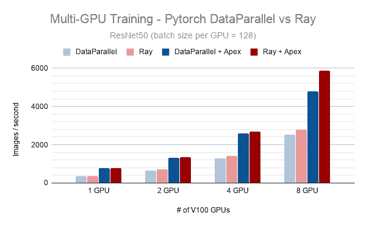
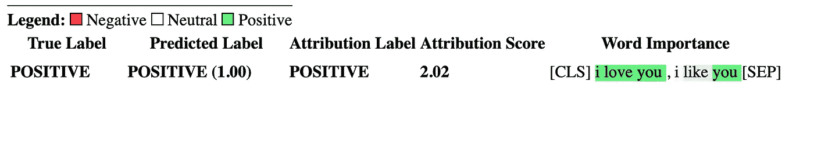

# NLP 密码| 02.21.21

> 原文：<https://pub.towardsai.net/the-nlp-cypher-02-21-21-405f68543e69?source=collection_archive---------4----------------------->


## 自然语言处理每周时事通讯

## 🎉否则就抓我的人🎉

有一群军情六处的黑客试图独自重建 GPT 3 号。

今年早些时候，EleutherAI 发布了他们的 pile 数据集( *825 GB 英语文本语料库，旨在训练大规模语言模型* ) [论文](https://pile.eleuther.ai/paper.pdf)，这让数据爱好者们议论纷纷。这一突破解决了数据问题，现在他们只需要计算:👇

他们正在使用 Tensorflow 的网格库来构建它。我们祝他们好运。或者就像他们的回购协议上写的那样:要么我死，要么我亡。

[](https://github.com/EleutherAI/gpt-neo) [## EleutherAI/gpt-neo

### 模型和数据并行 GPT2 和 GPT3 类模型的实施，能够扩展到完整的 GPT3 大小…

github.com](https://github.com/EleutherAI/gpt-neo) 

他们的不和谐服务器:

[](https://discord.com/invite/BK2v3EJ) [## 加入伊莱瑟雷不和谐服务器！

### 在 Discord 上查看 EleutherAI 社区——与 3，168 名其他成员一起闲逛，享受免费的语音和文本聊天。

discord.com](https://discord.com/invite/BK2v3EJ) 

哦，你好，火星！👽


解密的

**如果你喜欢这本书，请帮帮我们👏👏并与朋友分享🙈。**

# PyTorch |射线和分布式训练

如果您想了解 PyTorch 和 Ray 的最新分布式培训，这是一个有益的介绍:

[](https://medium.com/pytorch/getting-started-with-distributed-machine-learning-with-pytorch-and-ray-fd83c98fdead) [## PyTorch 和 Ray 的分布式机器学习入门

### Ray 是一个流行的分布式 Python 框架，可以与 PyTorch 配合使用，快速扩展机器学习…

medium.com](https://medium.com/pytorch/getting-started-with-distributed-machine-learning-with-pytorch-and-ray-fd83c98fdead) 

# 变形金刚解读

> “Transformers interpret 允许用两行代码解释任何变形金刚模型。它甚至支持笔记本和可保存的 html 文件中的可视化。”

例如，如果你对下面的句子进行情感分析:

***“我爱你，我喜欢你”***

这个输出👇会告诉你哪些词对推理影响最大。

[('BOS_TOKEN '，0.0)，
(' **I** '，0.46820529249283205)，
(' **love** '，0.46061853275727177)，
(' **you** '，0.566412765400519)，
('。

然后用一行代码将其可视化:

```
cls_explainer.visualize("distilbert_viz.html")
```

 [## cdpierse/transformers-解释

### Transformers Interpret 是一个模型解释工具，专门用于🤗变形金刚。符合…

github.com](https://github.com/cdpierse/transformers-interpret) 

# ConvLab-2

> “ConvLab-2 是一个开源工具包，使研究人员能够使用最先进的模型构建面向任务的对话系统，执行端到端评估，并诊断系统的弱点。”

 [## ConvLab-2

### ConvLab-2 是一个开源工具包，它使研究人员能够使用…

convlab.github.io](https://convlab.github.io/) 

# Udemy 上的问题生成教程

QuestGen 图书馆的创建者，Ramsri Golla，在 Udemy 上有一门新课程！

我有一张优惠券，你可以用在他的项目上。如果您感兴趣，以下是对您将学到的内容的描述:

*   使用最先进的自然语言处理技术从任何内容中生成评估，如 mcq、是非题等。
*   应用最新进展，如 BERT、OpenAI GPT-2 和 T5 变压器，解决 edtech 中的实际问题。
*   使用 NLP 库，如 Spacy，NLTK，AllenNLP，HuggingFace transformers 等。
*   使用 Google Colab 环境运行所有这些算法。
*   4 小时点播视频🤖

**优惠券七五折:**

[](https://www.udemy.com/course/question-generation-using-natural-language-processing/?couponCode=RAMSRI_SOCIAL_MEDIA) [## 使用自然语言处理的问题生成

### 本课程的重点是使用最先进的自然语言处理技术来解决问题…

www.udemy.com](https://www.udemy.com/course/question-generation-using-natural-language-processing/?couponCode=RAMSRI_SOCIAL_MEDIA) 

# 麻省理工学院计算机科学课程

麻省理工学院的电子工程和计算机科学课程。

[](https://ocw.mit.edu/courses/electrical-engineering-and-computer-science/) [## 电气工程和计算机科学

### 麻省理工学院的电子工程和计算机科学系的毕业生工作在不同的行业和进行…

ocw.mit.edu](https://ocw.mit.edu/courses/electrical-engineering-and-computer-science/) 

# 维基的 API

描述维基百科 API 起源的文章，维基媒体基金会(WMF)最初没有一个整体 API 策略的问题，以及他们对这个问题的解决方案。API 于 2020 年 12 月完成。

[](https://evanprodromou.wordpress.com/2021/02/18/the-new-api-for-wikipedia/) [## 维基百科的新 API

### 我最近辞去了在维基媒体基金会(WMF)的工作，去领导 MTTR 的工程部门。我为我的努力工作感到骄傲…

evanprodromou.wordpress.com](https://evanprodromou.wordpress.com/2021/02/18/the-new-api-for-wikipedia/) 

**源代码:**

[](https://github.com/wikimedia/apiclient-wiki) [## 维基媒体/API client-维基

### Wikimedia API 平台的示例客户端。创建一个帐户，为 wikimedia/apiclient-wiki 开发做贡献…

github.com](https://github.com/wikimedia/apiclient-wiki) 

# Docker 群实现

包括代码…希望你喜欢 YML 文件。😁

[](https://juliensalinas.com/en/container-orchestration-docker-swarm-nlpcloud/) [## Docker Swarm 的容器编排

### NLP Cloud 是我最近贡献的一个服务。它使用了几项有趣的技术，所以我…

juliensalinas.com](https://juliensalinas.com/en/container-orchestration-docker-swarm-nlpcloud/) 

# 没有代码的文件😬

不可复制的文件开始生活的地方…

 [## 没有代码的文件——不可复制文件的生存之地

### 不可复制的文件开始生活的地方

不可复制的文件来到 livewww.paperswithoutcode.com](https://www.paperswithoutcode.com/) 

# 回购密码👨‍💻

## 一组最近发布的回购引起了我们的关注👁

## 6500 万个问题和新的寻回犬模型

> 一个新的问答配对检索器模型，RePAQ，补充了可能问的问题(PAQ)，一个 6500 万自动生成的问答配对的资源。

[](https://github.com/facebookresearch/PAQ) [## facebookresearch/PAQ

### 这个库包含代码和模型来支持研究论文 PAQ:6500 万个可能被问到的问题和…

github.com](https://github.com/facebookresearch/PAQ) 

[**连接论文**](https://www.connectedpapers.com/main/02d8cfa5bc5f086acc57bb4ac8e4e94515fed7f9/arxiv) 📈

## 事实检查总结

> 使用两种方法进行抽象概括:
> 
> 1.JAENS:联合实体和摘要生成
> 
> 2.有摘要价值的实体分类和摘要(多任务学习)

这种方法感兴趣的是处理抽象摘要中实体的事实一致性，这是一个正在进行的研究问题。

*在公平序列上运行*

[](https://github.com/amazon-research/fact-check-summarization) [## 亚马逊-研究/事实核查-总结

### 我们为冯楠的论文“抽象文本摘要的实体级事实一致性”提供代码…

github.com](https://github.com/amazon-research/fact-check-summarization) 

[**连接论文**](https://www.connectedpapers.com/main/06f6869f8eb90a35148f1dde9a4baff03460d699/arxiv) 📈

## 表情符号转移

> 用表情数据训练情感分析的变形金刚。

[](https://github.com/uds-lsv/emoji-transfer) [## uds-lsv/表情符号-传输

### 这是情绪任务中基于表情符号的迁移学习的存储库。https://arxiv.org/abs/2102.06423 数据集…

github.com](https://github.com/uds-lsv/emoji-transfer) 

[**连接论文**](https://www.connectedpapers.com/main/db22ce8f53aa95f8bb00e0319b1d8b66e6895c96/arxiv) 📈

## 泛图上的关系抽取

> 知识图和文本数据的远程监督关系抽取。

[](https://github.com/baodaiqin/UGDSRE) [## 宝带琴/UGDSRE

### 代码和数据集为我们的论文“两个训练策略，以改善关系提取的普遍图”我们…

github.com](https://github.com/baodaiqin/UGDSRE) 

[**连接论文**](https://www.connectedpapers.com/main/332eeaca25afe8f07c348fb739674a56eff59416/arxiv) 📈

## Apache 日志生成器

> 通过将 Apache 日志的解析任务公式化为机器翻译(MT)任务来实现解析任务的自动化。

[](https://github.com/WulffHunter/log_generator) [## 伍尔夫亨特/日志生成器

### 这个存储库包含用于生成合成 Apache 日志的工具和解析引用所需的工具…

github.com](https://github.com/WulffHunter/log_generator) 

[**连接论文**](https://www.connectedpapers.com/main/ee36c86c41f266cb45ef17f5d54715352bc43eab/arxiv) 📈

## 噪声 q

> 新的问答评测基准。考虑 QA 模型的部署如何影响性能。例如，语音、文本或翻译等 QA 界面会引发大多数评估基准不考虑的独特推理错误。

[](https://noiseqa.github.io/) [## 噪声 q

### 纸张的所有材料

noiseqa.github.io](https://noiseqa.github.io/) 

[**连接论文**](https://www.connectedpapers.com/main/ab1e5a3c5521b6204dc7c6f1fa72b88000bc30ee/arxiv) 📈

## 变压器 CPU 的优化推理

> 基于变压器的模型在 CPU 上推理的可扩展性和性能的实证分析。

 [## 优化变压器在 CPU 上的推理性能

### Transformer 架构彻底改变了自然语言处理(NLP)领域。基于变压器的模型…

arxiv.org](https://arxiv.org/abs/2102.06621) 

[**连接论文**](https://www.connectedpapers.com/main/2837f1f11c25fc785829fc7e5f6b47bb07f3c244/arxiv) 📈

## 探索 NLG 的变形金刚

> 简明介绍 GPT，伯特和 NLG XLNET 的变形金刚。

[**连接论文**](https://www.connectedpapers.com/main/ba900412ab47fd890e69bfa7e909d34ae476b870/arxiv) 📈

# 本周数据集:阿尔特弥斯

一个将人类情感与艺术作品联系起来的数据集，包含了用自然语言对每种被触发的情感背后的基本原理的解释。

## 样品

[http://13.59.56.153:8501](http://13.59.56.153:8501/)

## 它在哪里？

[](https://www.artemisdataset.org/#dataset) [## 阿耳特弥斯

### 阿耳忒弥斯:艺术的情感语言斯坦福大学 1 LIX 理工学院 2 阿卜杜拉国王大学…

www.artemisdataset.org](https://www.artemisdataset.org/#dataset) 

> 每周日，我们都会对来自世界各地研究人员的 NLP 新闻和代码进行一次每周综述。
> 
> 如需完整报道，请关注我们的 Twitter: [@Quantum_Stat](http://twitter.com/Quantum_Stat)


[量子统计](https://quantumstat.com/)