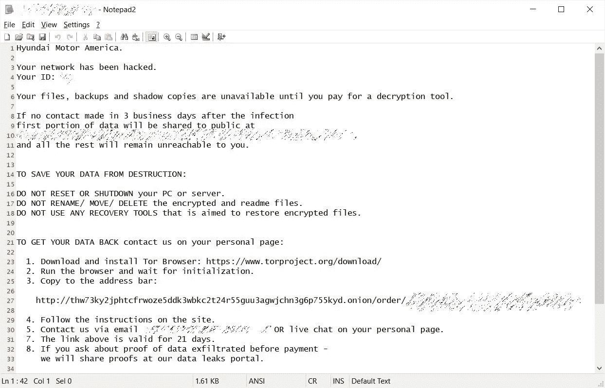
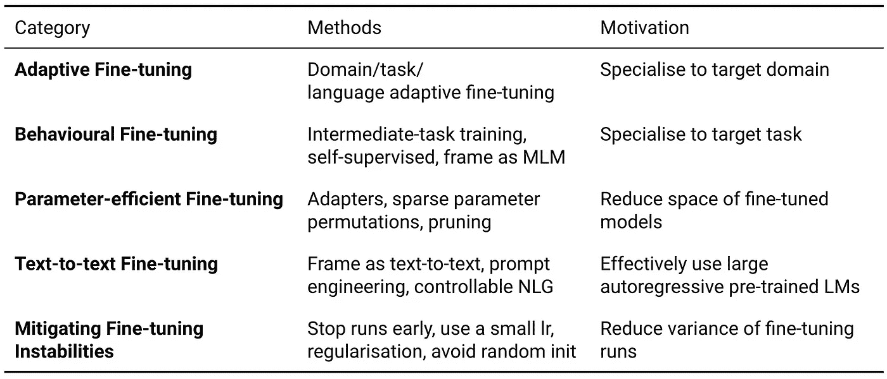
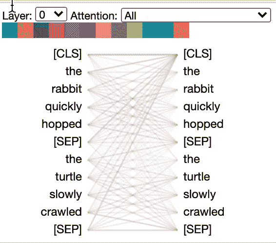
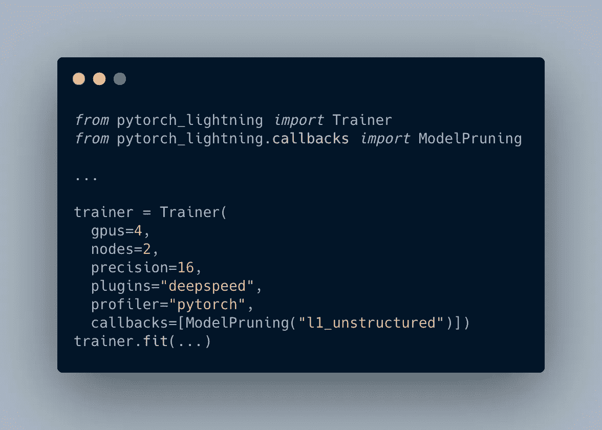

# NLP 密码| 02.28.21

> 原文：<https://pub.towardsai.net/the-nlp-cypher-02-28-21-59fc297a1b62?source=collection_archive---------2----------------------->

人类状况|马格里特

## 自然语言处理每周时事通讯

## 零距离射击

嘿欢迎回来！这周有很多要谈的。但首先要做一些简单的家务。我们将在接下来的一周更新超级骗子 NLP 回购…终于😁。如果你有一个很棒的 NLP 笔记本要添加，请在我们的[联系页面](https://quantumstat.com/contact/)给我们留言，我们会在我们的更新推特上给你一个大喊。… 🚀

好的，如果你有一辆起亚汽车，请阅读这个…👇

起亚显然在本月早些时候被勒索软件黑了，演员们希望得到全额报酬。他们在 BTC 要价整整 2100 万美元。起亚否认了它曾被黑客攻击的指控，尽管他们最近遭遇了网络中断。

在这里阅读更多。

## 黑客攻击的后果👀

> “起亚的关键联网服务仍然处于离线状态，这意味着客户无法使用起亚的基础设施支付汽车贷款、远程启动车辆或其他功能。”——驾驶博客

# 一个伪 DALL-E 从灰烬中出现

OpenAI 在本周以先发制人的方式发布了 DALL-E 项目，发布了该模型的“部分”。他们发布了图像重建*部分* d-VAE。实际的编码器语言模型仍然不在口袋里，没有它，我们实际上无法实现他们在论文中演示的内容。

 [## openai/DALL-E

### 用于 DALL E-open ai/DALL-E 的分立 PyTorch 包

github.com](https://github.com/openai/DALL-E) 

# OpenAI 的剪辑实现:

如果你仍然对 OpenAI 的剪辑感兴趣，我们在 Reddit 上找到了一个 YUUUGE 列表，突出显示了一吨运行该模型的 Colab/Jupyter 笔记本！！🔥🔥

**⚠ *警告列表的长度可能会影响您的判断，我们建议您在阅读时避免驾驶或操作重型机械。* ⚠**

1.  [The bigganxclip . ipynb—advad noun 的合作研究](https://colab.research.google.com/drive/1NCceX2mbiKOSlAd_o7IU7nA9UskKN5WR?usp=sharing)。使用 BigGAN 生成图像。据我所知，这是第一个发布的剪辑控制的 BigGAN 应用程序。[说明和示例](https://www.reddit.com/r/MachineLearning/comments/kzr4mg/p_the_big_sleep_texttoimage_generation_using/)。[levindabhi 的笔记本文案](https://colab.research.google.com/github/levindabhi/CLIP-Notebooks/blob/main/The_Big_Sleep_BigGANxCLIP.ipynb)。
2.  (2021 年 2 月 15 日添加)[驱动集成大睡眠:bigganxclip . ipynb—advad noun 合作实验室](https://colab.research.google.com/drive/1yFzzffr1wo_DAQ3pmjmN_hmN2ympM2E-?usp=sharing)。使用 BigGAN 生成图像。
3.  [大睡眠 lucidrains 的合作实验室](https://colab.research.google.com/drive/1MEWKbm-driRNF8PrU7ogS5o3se-ePyPb?usp=sharing)。使用 BigGAN 生成图像。GitHub repo 有一个本地机器版本。 [GitHub](https://github.com/lucidrains/big-sleep) 。
4.  [大睡眠定制 NMKD public . ipynb—NMKD 合作实验室](https://colab.research.google.com/drive/1Q2DIeMqYm_Sc5mlurnnurMMVqlgXpZNO?usp=sharing)。使用 BigGAN 生成图像。允许在一次运行中生成多个样本。
5.  [文本 2 图像 tg _ bomze 的合作实验室](https://colab.research.google.com/github/tg-bomze/collection-of-notebooks/blob/master/Text2Image.ipynb)。使用 BigGAN 生成图像。 [GitHub](https://github.com/tg-bomze/collection-of-notebooks) 。
6.  [text 2 image _ v2—TG _ BOM ze 的合作实验室](https://colab.research.google.com/github/tg-bomze/collection-of-notebooks/blob/master/Text2Image_v2.ipynb)。使用 BigGAN 生成图像。 [GitHub](https://github.com/tg-bomze/collection-of-notebooks) 。
7.  [text 2 image _ v3—TG _ BOM ze 的合作实验室](https://colab.research.google.com/github/tg-bomze/collection-of-notebooks/blob/master/Text2Image_v3.ipynb)。使用 BigGAN(默认)或 Sigmoid 生成图像。 [GitHub](https://github.com/tg-bomze/collection-of-notebooks) 。
8.  (添加于 2021 年 2 月 26 日)[图像引导大睡眠 public . ipynb——JD ude _ 合作实验室](https://colab.research.google.com/drive/1vOjrWwOh8E-EZXhOLpVm7Aw0m1i-fj8C?usp=sharing)。使用 BigGAN 生成图像。 [Reddit 帖子](https://www.reddit.com/r/deepdream/comments/lsylr1/image_guided_bigsleep_notebook/)。
9.  [clipbiggan . ipynb—eyaler 的合作实验室](https://colab.research.google.com/github/eyaler/clip_biggan/blob/main/ClipBigGAN.ipynb)。使用 BigGAN 生成图像/视频。 [GitHub](https://github.com/eyaler/clip_biggan) 。[笔记簿副本](https://colab.research.google.com/github/levindabhi/CLIP-Notebooks/blob/main/ClipBigGAN.ipynb)由 levindabhi 制作。
10.  [wander clip . ipynb—eyaler 的合作实验室](https://colab.research.google.com/github/eyaler/clip_biggan/blob/main/WanderCLIP.ipynb)。使用 BigGAN(默认)或 Sigmoid 生成图像/视频。 [GitHub](https://github.com/eyaler/clip_biggan) 。
11.  [story 2 dipship . ipynb—邦克菲尔德合作](https://colab.research.google.com/drive/1yNkvkrHApFR6alyFC1EzhPGHs86yjH1P?usp=sharing)。使用 BigGAN 生成图像/视频。 [GitHub](https://github.com/lots-of-things/Story2Hallucination) 。
12.  (2021 年 2 月 7 日左右添加)[story 2 幻觉 _GIF.ipynb —邦克菲尔德合作](https://colab.research.google.com/github/lots-of-things/Story2Hallucination/blob/main/Story2Hallucination_GIF.ipynb)。使用 BigGAN 生成图像。 [GitHub](https://github.com/lots-of-things/Story2Hallucination) 。
13.  (2021 年 2 月 24 日增加)[cola b-bigganxclip . ipynb—styler 00 dollar 的合作实验室](https://colab.research.google.com/github/styler00dollar/Colab-BigGANxCLIP/blob/main/Colab-BigGANxCLIP.ipynb)。使用 BigGAN 生成图像。“只是那个[advad noun]笔记本的一个更压缩/更小的版本”。GitHub 。
14.  [CLIP-glass . ipynb—gala tolo 的合作实验室](https://colab.research.google.com/drive/1fWka_U56NhCegbbrQPt4PWpHPtNRdU49?usp=sharing)。使用 BigGAN(默认)或 StyleGAN 生成图像。GPT2 配置用于图像到文本，而不是文本到图像。 [GitHub](https://github.com/galatolofederico/clip-glass) 。
15.  (2021 年 2 月 15 日补充) [dank.xyz](https://dank.xyz/) 。使用 BigGAN 或 StyleGAN 生成图像。一个易于使用的网站，用于访问大睡眠和剪辑玻璃。据我所知，这个网站并不隶属于大睡眠或剪辑玻璃的开发商。 [Reddit 参考](https://www.reddit.com/r/MediaSynthesis/comments/l8xlr8/big_sleep_a_lightsaber_in_the_jungle/glh5nxl/)。
16.  (2021 年 2 月 25 日补充)[Aleph-Image:CLIPxDAll-e . ipynb—advad noun 的合作实验室](https://colab.research.google.com/drive/1Q-TbYvASMPRMXCOQjkxxf72CXYjR_8Vp?usp=sharing)。使用 DALL-E 的离散 VAE(变分自动编码器)组件生成图像。[推特参考](https://twitter.com/advadnoun/status/1364822183751471109)。 [Reddit 帖子](https://www.reddit.com/r/MachineLearning/comments/ls0e0f/p_texttoimage_google_colab_notebook_alephimage/)。
17.  (2021 年 2 月 26 日补充)[aleph 2 image(delta):CLIP+DALL-E decoder . ipynb—advad noun 的 Colaboratory](https://colab.research.google.com/drive/1oA1fZP7N1uPBxwbGIvOEXbTsq2ORa9vb?usp=sharing) 。使用 DALL-E 的离散 VAE(变分自动编码器)组件生成图像。[推特参考](https://twitter.com/advadnoun/status/1365439793602064391)。 [Reddit 帖子](https://www.reddit.com/r/deepdream/comments/ltcqdh/new_google_colab_notebook_texttoimage_for_text_a/)。
18.  (2021 年 2 月 27 日增加)[advad noun 的 gamma aleph 2 img . ipynb-合作实验室](https://colab.research.google.com/drive/1VAO22MNQekkrVq8ey2pCRznz4A0_jY29?usp=sharing)的工作 wow good 副本。使用 DALL-E 的离散 VAE(变分自动编码器)组件生成图像。[推特参考](https://twitter.com/advadnoun/status/1365786025277018115)。
19.  (添加于 2021 年 2 月 27 日) [Aleph-Image: CLIPxDAll-E(带有白色斑点修复# 2)——托马斯的合作实验室](https://colab.research.google.com/drive/1Fb7qTCumPvzSLp_2GMww4OV5BZdE-vKJ?usp=sharing)。使用 DALL-E 的离散 VAE(变分自动编码器)组件生成图像。在 advadnoun 的“Aleph-Image: CLIPxDAll-E”笔记本上应用这里提到的[的白色斑点修复](https://twitter.com/NJetchev/status/1365435397506007043)。
20.  (2021 年 2 月 14 日增加) [GA StyleGAN2 WikiArt CLIP 实验-py torch-clean-pbay lies 合作实验室](https://colab.research.google.com/drive/1ZSIVnriA5xf1umAegtbhtM0qzL3AT1rR?usp=sharing)。使用 StyleGAN 生成图像。[更多信息](https://twitter.com/pbaylies/status/1360792281498943490)。
21.  (2021 年 2 月 15 日增加)[样式夹 orpatashnik 合作](https://colab.research.google.com/github/orpatashnik/StyleCLIP/blob/main/playground.ipynb)。使用 StyleGAN 生成图像。 [GitHub](https://github.com/orpatashnik/StyleCLIP) 。[推特参考](https://twitter.com/OPatashnik/status/1361220550027325443)。 [Reddit 帖子](https://www.reddit.com/r/MediaSynthesis/comments/ll5ann/edit_a_human_face_image_with_texttoimage_using/)。
22.  (2021 年 2 月 15 日添加)[viper mu 的 StyleCLIP](https://github.com/vipermu/StyleCLIP) 。使用 StyleGAN 生成图像。
23.  (2021 年 2 月 24 日添加)[CLIP _ style gan . ipynb—levindabhi 的合作实验室](https://colab.research.google.com/github/levindabhi/CLIP-Notebooks/blob/main/CLIP_StyleGAN.ipynb)。使用 StyleGAN 生成图像。
24.  (2021 年 2 月 23 日增加)[tedi gan—Wei haox 合作实验室](https://colab.research.google.com/github/weihaox/TediGAN/blob/main/playground.ipynb)。使用 StyleGAN 生成图像。 [GitHub](https://github.com/weihaox/TediGAN) 。我得到错误“没有为感知模型找到预先训练的权重！”当我使用 Colab 笔记本时，它在我做出这里提到的的改变时被修复。更改之后，我仍然在显示图像的单元格中得到一个错误，但是结果是在远程文件系统中。使用左侧的“文件”图标浏览远程文件系统。
25.  [TADNE 和 CLIP——nago Linc 的合作实验室](https://colab.research.google.com/github/nagolinc/notebooks/blob/main/TADNE_and_CLIP.ipynb)。使用 TADNE(“此动漫不存在”)生成图像。 [GitHub](https://github.com/nagolinc/notebooks) 。
26.  [CLIP+TADNE(py torch)v2——nago Linc 合作实验室](https://colab.research.google.com/github/nagolinc/notebooks/blob/main/CLIP_%2B_TADNE_(pytorch)_v2.ipynb)。使用 TADNE(“此动漫不存在”)生成图像。[说明和例子](https://www.reddit.com/r/MediaSynthesis/comments/l9lbfy/instructions_for_using_free_animecentric_google/)。 [GitHub](https://github.com/nagolinc/notebooks) 。levindabhi 的笔记本副本
27.  (2021 年 2 月 24 日增加)[cloneofsimo 的 CLIP-CLIP-to-GAN](https://github.com/cloneofsimo/clipping-CLIP-to-GAN)。使用 FastGAN 生成图像。
28.  [剪辑&文本到图像的渐变上升(深度发呆？).ipynb—advad noun 的合作实验室](https://colab.research.google.com/drive/1FoHdqoqKntliaQKnMoNs3yn5EALqWtvP?usp=sharing)。使用警报器生成图像。据我所知，这是第一个使用 CLIP 创建图像的应用程序。[说明和示例](https://www.reddit.com/r/MachineLearning/comments/ky8fq8/p_a_colab_notebook_from_ryan_murdock_that_creates/)。[levindabhi 的笔记本文案](https://colab.research.google.com/github/levindabhi/CLIP-Notebooks/blob/main/CLIP_%26_gradient_ascent_for_text_to_image_(Deep_Daze%20).ipynb)。
29.  [Deep Daze—luci drains 的合作实验室](https://colab.research.google.com/drive/1_YOHdORb0Fg1Q7vWZ_KlrtFe9Ur3pmVj?usp=sharing)。使用警报器生成图像。GitHub repo 有一个本地机器版本。 [GitHub](https://github.com/lucidrains/deep-daze) 。levindabhi 的笔记本副本。
30.  [CLIP-SIREN-with sample dl . ipynb-norod 78 的合作实验室](https://colab.research.google.com/drive/1K1vfpTEvAmxW2rnhAaALRVyis8EiLOnD?usp=sharing)。使用警报器生成图像。
31.  (添加于 2021 年 2 月 17 日) [Text2Image Siren+。ipynb—EPS 696 的合作实验室](https://colab.research.google.com/drive/1L14q4To5rMK8q2E6whOibQBnPnVbRJ_7)。使用警报器生成图像。[推特参考](https://twitter.com/eps696/status/1360973092722528256)。[例#1](https://www.reddit.com/r/deepdream/comments/lm9evo/colab_notebook_text2image_siren_seems_to_be/) 。[例#2](https://www.reddit.com/r/deepdream/comments/lm3cg3/texttoimage_editing_of_an_existing_image_with/) 。[例 3](https://www.reddit.com/r/deepdream/comments/lm3t7z/texttoimage_generation_for_text_a_firebreathing/) 。
32.  (2021 年 2 月 24 日增加)[cola b-deep-daze—styler 00 dollar 合作实验室](https://colab.research.google.com/github/styler00dollar/Colab-deep-daze/blob/main/Colab-Deep-Daze.ipynb)。使用警报器生成图像。我没有得到这个笔记本工作，但你的结果可能会有所不同。 [GitHub](https://github.com/styler00dollar/Colab-deep-daze) 。
33.  (2021 年 2 月 18 日添加)[text 2 image FFT . ipynb—EPS 696 合作实验室](https://colab.research.google.com/drive/1rJMSyF_dmpL1kmse7Rm9TurjihJ_cA5t)。使用 Lucent/Lucid 的 FFT(快速傅立叶变换)生成图像。[推特参考](https://twitter.com/eps696/status/1362262010763821056)。[例#1](https://www.reddit.com/r/deepdream/comments/lmoa8y/new_texttoimagevideo_notebook_text2image_fft_from/) 。例 2 。

# 语言模型微调的最新进展

Sebastian Ruder 是 NLP 迁移学习的先驱之一，他在博客上发布了一篇关于微调最新进展的精彩文章。下面讨论五个类别。如果你接近 NLP 领域，这是必读书。

解密的

 [## 语言模型微调的最新进展

### 微调预先训练的语言模型(LM)已经成为在自然语言环境中进行迁移学习的事实标准

ruder.io](https://ruder.io/recent-advances-lm-fine-tuning/) 

# 在图形中可视化社区结构

> Communities 是一个 Python 库，用于检测图形中的社区结构。它实现了以下算法:

> 卢万法
> 
> 格文-纽曼算法
> 
> 分层聚类
> 
> 谱聚类
> 
> 布朗-克尔博施算法

 [## 肖布鲁克/社区

### communities 是一个 Python 库，用于检测图形中的社区结构。它实现了以下算法…

github.com](https://github.com/shobrook/communities) 

# 溢出| Python 统计数据

Stack Overflow 博客上的有用帖子讨论了 Python 库，如 numpy、pandas、matplotlib 和 seaborn。页面上有一个 YouTube 视频，他们在其中探索了纽约市的住房数据集。这是入门水平。

 [## 升级:用 Python 掌握统计-第 2 部分-堆栈溢出博客

### 欢迎回来！这是我们升级系列的第二堂课。如果你只是在收听，你可以了解我们…

stackoverflow.blog](https://stackoverflow.blog/2021/02/23/level-up-mastering-statistics-with-python-part-2/) 

# 贝特维兹

> BertViz 是一个在变形金刚模型中可视化注意力的工具，支持变形金刚库中的所有模型(伯特、GPT-2、XLNet、罗伯塔、XLM、CTRL 等。)

包括了****😎****

****** [## 杰塞维格/贝特维兹

### BertViz 是一个在变形金刚模型中可视化注意力的工具，支持变形金刚的所有模型…

github.com](https://github.com/jessevig/bertviz) 

# 情境化主题模型

如果您对主题建模感兴趣，请查看这个非常棒的库。它们包括一个 zeroshot 跨语言变体和一个针对各种用例的单词包方法。

 [## MilaNLProc/语境化主题模型

### 语境化主题模型(CTM)是一个主题模型家族，使用预先训练好的语言表示(例如…

github.com](https://github.com/MilaNLProc/contextualized-topic-models) 

# 软件更新| PyTorch 闪电

新功能:

*   [PyTorch 亲笔签名侧写器](https://pytorch-lightning.readthedocs.io/en/stable/advanced/profiler.html)
*   [深度速度](https://pytorch-lightning.readthedocs.io/en/stable/advanced/multi_gpu.html?highlight=deepspeed#deepspeed)模型并行度
*   [修剪](https://pytorch-lightning.readthedocs.io/en/stable/advanced/pruning_quantization.html)
*   [量化](https://pytorch-lightning.readthedocs.io/en/stable/advanced/pruning_quantization.html)
*   [随机](https://pytorch-lightning.readthedocs.io/en/1.2.0/advanced/training_tricks.html#stochastic-weight-averaging) [权重](https://pytorch-lightning.readthedocs.io/en/1.2.0/advanced/training_tricks.html#stochastic-weight-averaging) [平均](https://pytorch-lightning.readthedocs.io/en/1.2.0/advanced/training_tricks.html#stochastic-weight-averaging)

 [## py torch Lightning 1 . 2 . 0 版

### 包括与 DeepSpeed、PyTorch profiler、修剪、量化、SWA、PyTorch Geometric 等的新集成。

pytorch-lightning.medium.com](https://pytorch-lightning.medium.com/pytorch-lightning-v1-2-0-43a032ade82b) 

# 软件更新|拥抱脸

HF 的一个新库，用于修剪模型，在保持准确性的同时减少参数。他们的稀疏笔记本可以在[超级骗子 NLP Repo](https://notebooks.quantumstat.com/) 上找到。

 [## huggingface/nn_pruning

### 这里有这个网站的互动版本。实践证明，这是一种非常有效的网络剪枝方法

github.com](https://github.com/huggingface/nn_pruning) 

# 回购密码👨‍💻

## 一组最近发布的回购引起了我们的注意👁

## 少量学习

> 一个代码库，使用类似于 GPT 三号论文的语言模型来执行少量的“上下文”学习。

 [## tonyzhaozh/少投学习

### 这是一个代码库，使用类似于 GPT-3 论文的语言模型来执行少量的“上下文”学习。在…

github.com](https://github.com/tonyzhaozh/few-shot-learning) 

[**连接论文**](https://www.connectedpapers.com/main/1423a89c03de83ca8e27ed64916552f6a2969a7d/arxiv) **📈**

## 图表和电子健康记录

> 在基于公共数据和真实世界临床数据的各种电子健康记录预测任务中，模型优于现有的基于图形和非图形的方法。

 [## EHR GNN 的纽约

### 这个库包含了这篇论文的代码:“可变正则化的基于图的表示学习”。

github.com](https://github.com/NYUMedML/GNN_for_EHR) 

## 用 GPT-2 生成代码

> 在 CodeSearchNet 上为代码生成微调 GPT-2

 [## kand Luis/代码-gen

### from/cs 230/GPT-2-csn:$ pip install-r path/to/requirements . txt $ python download _ model . py 117m 注意…

github.com](https://github.com/kandluis/code-gen) 

[**连接论文**](https://www.connectedpapers.com/main/4891cc27e296e0ead23407a835bcd3bbb802ce67/arxiv) **📈**

## REMOD:用于网络话语建模的关系抽取

> sdfsd

 [## mjsumpter/remod

### 以下是严格再现论文中引用的结果的说明。必要的软件包可以是…

github.com](https://github.com/mjsumpter/remod) 

[**连接论文**](https://www.connectedpapers.com/main/20f26ee9801af2645c56836f45a9a545f3ce5a1f/arxiv) **📈**

## 论元结构预测

> 此代码可用于训练一组神经网络，以在选择参数挖掘语料库上联合执行链接预测、关系分类和组件分类。

 [## AGalassi/结构预测 18

### 使用剩余深度网络、集成学习和注意力进行论元结构预测。这个代码可以是…

github.com](https://github.com/AGalassi/StructurePrediction18) 

[**连接论文**](https://www.connectedpapers.com/main/c1cb5e412f10013e2fdf085f3153a8af824ccf0d/arxiv) **📈**

# 本周数据集:EmotionGIF 2020 挑战

## 这是什么？

数据集包含 40，000 条推文及其 GIF 回复，标有动画 GIF 的类别。挑战:给定未标记的推文，预测 GIF 回复的类别。gif 被存储为 MP4 文件。

## 样品

【idx】:32，

" text ":"正好落在我的陷阱下面"，

“回复”:“哎哟！”,

"类别":['awww '，' yes '，' oops']，

" MP4 ":" Fe 6 EC 1 CD 04 CD 009 F3 a 5975 e 2d 288 ff 82 . MP4 "

## 它在哪里？

 [## emotion if 2020-数据集

### 激动人心的 IF 2020 挑战已经结束。这两轮比赛的大赢家是团队……共有 30 支参赛队伍

sites.google.com](https://sites.google.com/view/emotiongif-2020/shared-task/dataset?authuser=0) 

> 每周日，我们都会对来自世界各地研究人员的 NLP 新闻和代码进行一次每周综述。
> 
> 如需完整报道，请关注我们的 Twitter: [@Quantum_Stat](http://twitter.com/Quantum_Stat)

[量子统计](https://quantumstat.com/)**