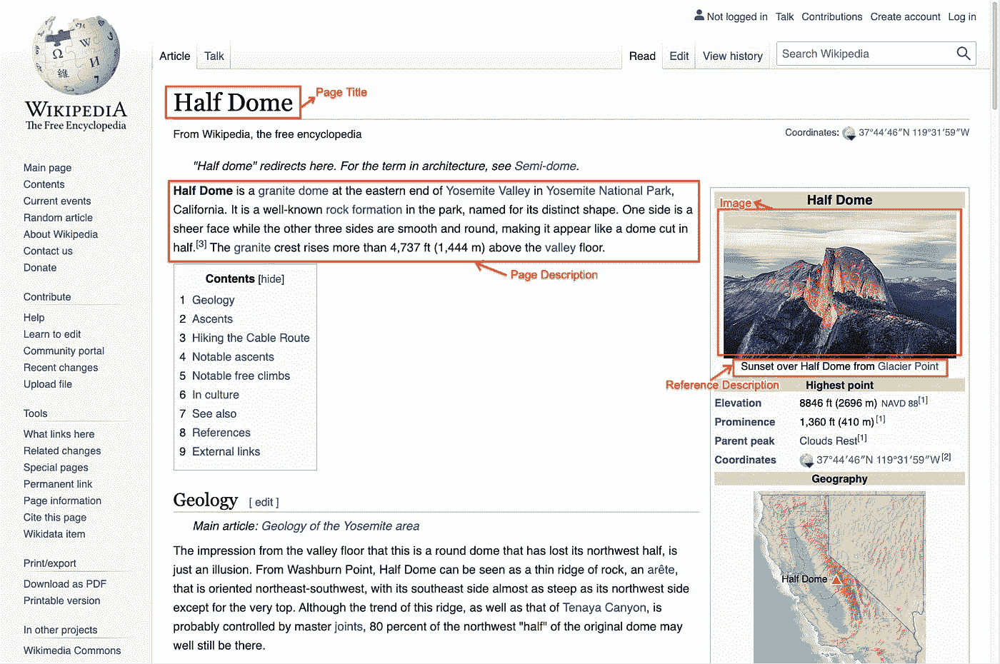

# NLP 密码| 03.07.21

> 原文：<https://pub.towardsai.net/the-nlp-cypher-03-07-21-889224b28fe1?source=collection_archive---------4----------------------->

《了望者》——《一切都好》|荷马

## 自然语言处理每周时事通讯

## 乌鸦的巢

嘿欢迎回来！经历了一个漫长忙碌的周末，所以这周的 NL 会比平时少一些罗嗦，但是下周我们会恢复正常。

哦，顺便说一下，

也许…宇宙只是一个巨大的神经网络…🤷‍♂️

至少这是麻省理工学院的新理论。仅供参考，这听起来和史蒂夫·沃尔夫勒姆的物理学图表方法非常相似。

我唯一的问题是，谁在运行计算机？🤷‍♂️

 [## 研究发现，宇宙可能是一个巨大的神经网络

### 一位科学家说宇宙是一个巨大的神经网络。野生概念使用神经网络理论统一量子和…

www.popularmechanics.com](https://www.popularmechanics.com/science/a35744336/universe-might-be-one-giant-neural-network/) 

仅供参考，我们在 [Super Duper NLP Repo](https://notebooks.quantumstat.com/) 中添加了 25 款新笔记本电脑！！👇

# OpenChat

OpenChat 是一个很棒的回购协议，在这里你只需要一行代码就可以与顶级对话模型进行交互。目前，它支持:

*   微软的对话:小型，中型，大型。
*   脸书的[搅拌机机器人](https://arxiv.org/abs/2004.13637):小、中、大、超大。

 [## hyunwoongko/openchat

### OpenChat 是用于生成模型的开源聊天框架。只用一行代码就能和 AI 对话…

github.com](https://github.com/hyunwoongko/openchat) 

# 人工智能指数 2021

关于人工智能的年度综合报告已经出炉。报告的范围更侧重于全球和战略层面。对于 NLP 重点内容，从第 62 页开始。这份报告长达 200 多页🙈。

 [## 人工智能指数 2021

### 《2021 年 AI 指数报告》是迄今为止关于人工智能最全面的报告之一。这个最新的…

hai.stanford.edu](https://hai.stanford.edu/research/ai-index-2021) 

# OpenAI 对其最新多模态模型的思考

他们深入研究了 CLIP 的神经元及其表现形式。他们还分析哪里可能出错。

 [## 人工神经网络中的多模态神经元

### 我们发现 CLIP 中的神经元对相同的概念做出反应，无论是字面上的、象征性的还是…

openai.com](https://openai.com/blog/multimodal-neurons/) 

# 掌握 Python |溢出

上周我看了这个系列的第二部分，现在是第三和第四部分。

 [## 升级:用 Python 掌握统计-第 3 部分-堆栈溢出博客

### 欢迎回来！这是我们关于 Python 统计的高级系列的第三个类。如果你只是在收听，你…

stackoverflow.blog](https://stackoverflow.blog/2021/03/01/level-up-mastering-python-with-statistics-part-3/)  [## 提升级别:使用 Python 掌握统计数据—第 4 部分—堆栈溢出博客

### 谋生代码 2021 年 3 月 2 日尽管许多统计学入门课程教授 CLT，但很少有人真正尝试…

stackoverflow.blog](https://stackoverflow.blog/2021/03/02/level-up-mastering-statistics-with-python-part-4/) 

# YAMNet |音频传输学习

> [YAMNet](https://tfhub.dev/google/yamnet/1) (“又一个音频移动网络”)是一个预训练的模型，它基于[音频集语料库](https://research.google.com/audioset/)预测 521 个音频事件。

 [## 用 YAMNet 进行音频数据的迁移学习

### 2021 年 3 月 2 日-开发人员 Luiz GUStavo Martins 发布，倡导迁移学习是一种流行的机器学习…

blog.tensorflow.org](https://blog.tensorflow.org/2021/03/transfer-learning-for-audio-data-with-yamnet.html) 

# 神经网络更新的几种方法

下面是讨论的方法:

> 仅根据新数据更新模型
> 
> 根据新旧数据更新模型
> 
> 仅基于新数据的模型的集合模型
> 
> 新旧数据模型集成模型

 [## 如何用更多的数据更新神经网络模型-机器学习掌握

### 用于预测建模的深度学习神经网络模型可能需要更新。

machinelearningmastery.com](https://machinelearningmastery.com/update-neural-network-models-with-more-data/) 

# 顶级数据标签软件

深入分析机器学习数据集的 10 种数据标注工具。

 [## 数据标注软件:2021 年数据标注的最佳工具- neptune.ai

### 在机器学习和 AI 开发中，数据标注方面是必不可少的。你需要一套结构化的…

海王星. ai](https://neptune.ai/blog/data-labeling-software) 

# 回购密码👨‍💻

## 一组最近发布的回购引起了我们的注意👁

## 渐进微调

> 如果你只是对你的模型进行一次微调，你可能会错失良机。[论文](https://arxiv.org/pdf/2103.02205.pdf)

 [## fe1 ixu/渐进微调

### 在一个多步骤的过程中逐渐微调可以产生更大的增益，并且可以在不修改…

github.com](https://github.com/fe1ixxu/Gradual-Finetune) 

[**连接论文**](https://www.connectedpapers.com/main/8cd5179ee37454b8f4bd7ce9651f0b0d149791e2/arxiv) **📈**

## Forte | NLP 管道工具包

> 用于搜索文档、信息提取和语言生成的多功能平台。

 [## asyml/forte

### Forte 是一个构建自然语言处理管道的工具包，具有跨任务交互，适应性强…

github.com](https://github.com/asyml/forte) 

[**连接论文**](https://www.connectedpapers.com/main/be33826c5503593e71856214450df929187018ab/arxiv) **📈**

## 机器翻译的元课程学习

> 改进低资源语言机器翻译的元学习(教师模型)

 [## NLP2CT/元课程

### 神经机器翻译领域适应的元课程学习(AAAI 2021)请引用为…

github.com](https://github.com/NLP2CT/Meta-Curriculum) 

[**连接论文**](https://www.connectedpapers.com/main/b794bafd6e15609fd52bdb5753d9b1b6287a0b8f/arxiv) **📈**

## ANEA

> 自动注释命名实体

 [## uds-lsv/anea

### ANEA 是一个工具，自动标注命名实体的无标签文本的基础上的实体列表，作为远程使用…

github.com](https://github.com/uds-lsv/anea) 

[**连接论文**](https://www.connectedpapers.com/main/b0eca81ebd4bb899c2960a908c157a368eeb5430/arxiv) **📈**

## 鲁森泰瓦尔

> 俄语句子嵌入评估工具包。

 [## vmkhlv/rusenteval

### RuSentEval 是一个俄语句子嵌入评估工具包。在这个回购中，您可以找到数据和脚本…

github.com](https://github.com/vmkhlv/rusenteval) 

[**连接论文**](https://www.connectedpapers.com/main/16077776529aef23786ea8df109a546dfcb18d90/arxiv) **📈**

## 蒙着眼睛学象棋

> 国际象棋符号的训练语言模型。*🔥🔥*

 [## shtoshni 92/学习-象棋-蒙住眼睛

### 国际象棋作为评估世界状态跟踪语言模型的试验台。通过 Huggingface 发布的预训练模型…

github.com](https://github.com/shtoshni92/learning-chess-blindfolded) 

[**连接论文**](https://www.connectedpapers.com/main/288cb169619bde78604450adc8cb5df536ef20f1/arxiv) **📈**

## 拉格

> 将图形注意力用于实体对齐任务。

 [## 朱尔布/拉加

### 面向全局实体对齐的关系感知图注意网络

github.com](https://github.com/zhurboo/RAGA) 

[**连接论文**](https://www.connectedpapers.com/main/910795f54f970d327cbcd9eb943961e00800b08c/arxiv) **📈**

# 本周数据集:基于维基百科的图像文本(WIT)数据集

## 这是什么？

多模态多语言数据集。WIT 由 3760 万个实体丰富的图像-文本示例组成，其中包含 1150 万个跨 108 种维基百科语言的独特图像。

## 例子

## 它在哪里？

 [## 谷歌-研究-数据集/wit

### 基于维基百科的图像文本(WIT)数据集是一个大型的多模态多语言数据集。智慧是由精心策划的集合组成的…

github.com](https://github.com/google-research-datasets/wit) 

> 每周日，我们都会对来自世界各地研究人员的 NLP 新闻和代码进行一次每周综述。
> 
> 如需完整报道，请关注我们的推特: [@Quantum_Stat](http://twitter.com/Quantum_Stat)

[量子统计](https://quantumstat.com/)