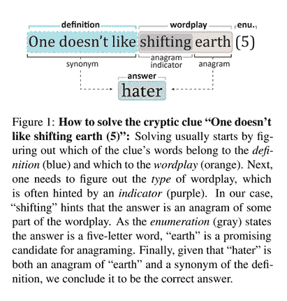
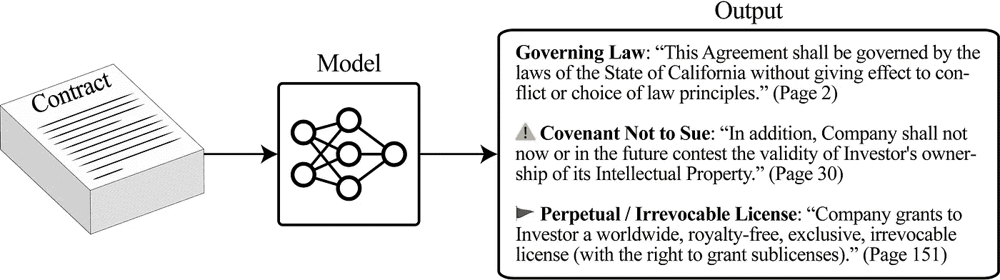

# NLP 密码| 03.14.21

> 原文：<https://pub.towardsai.net/the-nlp-cypher-03-14-21-df01c38a7407?source=collection_archive---------2----------------------->

圣杰罗姆在他的书房|丢勒

## 自然语言处理每周时事通讯

## 设定太阳♥的控制

书呆子超载

圆周率日快乐！

先来说说《隐石:我是如何不再烦恼，学会(？)对爱情的暧昧”

> Cryptonite 是一个*神秘的线索*，一个具有误导性表面阅读的短语或句子，其解决需要消除语义、句法和语音文字游戏的歧义，以及世界知识。

**举例**:

幸运的是，它也是一个数据集…

考虑到语言的模糊性，这是一个重要的数据集。为了让模型达到托马斯·潘恩所说的“常识”,解决歧义问题将是关键，无论它是严格地仅来自自然语言处理，还是来自多模态模型的组合，还是来自图形。为什么？因为它要求模型具有 n 阶逻辑。你可以把 n 阶逻辑想象成逻辑的俄罗斯玩偶，也就是逻辑嵌套在逻辑里面。这也是我们在与《纽约时报》的填字游戏进行斗争时所使用的，这需要对文字游戏、世界知识和其他语言人工制品的不同使用。

对于电流互感器来说，这是一个很难解决的问题。事实上，该论文的作者表示，在隐岩数据集上训练的 T5-Large 仅实现了 7.6%的准确性👀，这与基于规则的准确性不相上下🙈。

***翻译*** *:* 变形金刚吸精这个任务。

这种类型的“推理”是人脑的最高抽象层次。直觉告诉我，n 阶逻辑将需要超图，但未来是未写的…

[**论文**](http://arxiv.org/pdf/2103.01242.pdf)

 [## 鸟类/隐沸石

### 以歧义为目标的当前 NLP 数据集可以由母语者相对容易地解决。我们介绍隐沸石，一种…

github.com](https://github.com/aviaefrat/cryptonite) 

# 枢纽数据集

来自 Activeloop 的数据存储应用程序 Hub。人工智能坐在数据集的肥缺上。他们的框架将数据集作为 numpy 数组存储在云中，因此您可以跨多个框架无缝地访问它。以下是其特点:

*   使用版本控制存储和检索大型数据集
*   像在 Google Docs 中一样协作:多位数据科学家不间断地同步处理同一数据
*   从多台机器同时访问
*   部署在任何地方——本地、谷歌云、S3、Azure 以及 Activeloop
*   与您的 ML 工具集成，如 Numpy、Dask、Ray、 [PyTorch](https://docs.activeloop.ai/en/latest/integrations/pytorch.html) 或 [TensorFlow](https://docs.activeloop.ai/en/latest/integrations/tensorflow.html)
*   创建任意大的数组。您可以存储 100k 乘 100k 大小的图像！
*   保持每个样品的形状动态。通过这种方式，您可以将大小数组存储为一个数组。
*   [在几秒钟内可视化](http://app.activeloop.ai/?utm_source=github&utm_medium=repo&utm_campaign=readme)任何数据切片，无需多余的操作

 [## activeloopai/Hub

### 注意:本文档的翻译可能不是最新的。有关最新版本，请查看…

github.com](https://github.com/activeloopai/Hub) 

# PyTorch 闪电更新🔥

一个新的更新出来了！

PyTorch 在分布式训练和模型压缩方面采用了多种方法，以下是 BETA 版中的一些特性:

> 深度速度
> 
> 修剪
> 
> 量化

他们也在整合 PyTorch 几何！GNNs！！！(炒作)

 [## PyTorch Lightning V1.2.0-深度速度，修剪，量化，SWA

### 包括与 DeepSpeed、PyTorch profiler、修剪、量化、SWA、PyTorch Geometric 等的新集成。

medium.com](https://medium.com/pytorch/pytorch-lightning-v1-2-0-43a032ade82b) 

## 谈论 PyTorch…基础教程

PyTorch 的精彩介绍展示了从加载数据到保存训练模型的端到端 ML 管道，包括一个 Colab 笔记本:

 [## 了解基础知识- PyTorch 教程 1.8.0 文档

### 了解基础知识||快速入门||张量||数据集和数据加载器||转换||构建模型||自动签名||…

pytorch.org](https://pytorch.org/tutorials/beginner/basics/intro.html) 

## 好吧好吧，最后提一下 PyTorch…我保证

这里有一个使用 PyTorch Lightning、Hydra 和 Tensorboard 的方便的深度学习项目模板。好了，我做完了。😎

 [## lkhphuc/闪电-hydra-template

### 使用这个模板快速启动一个 DL 项目:在 Pytorch Lightning 的 LightningModule 中编写代码，然后…

github.com](https://github.com/lkhphuc/lightning-hydra-template) 

# 作为通用计算引擎的变压器

如果您对预训练语言模型如何用于将其知识转移到 NLP 之外的其他领域(如视觉、计算数字等)感兴趣，请阅读这篇重要的论文。).作者认为，这些保持自我关注/前馈层冻结(没有微调)的模型实际上可以匹配在下游任务中训练的完全训练的模型的性能。

**代号**:

 [## kzl/通用计算

### 作为通用计算引擎的预训练变压器的官方代码库。包含演示笔记本和脚本，用于…

github.com](https://github.com/kzl/universal-computation) 

**论文**:

 [## 作为通用计算引擎的预训练变压器

### 我们研究了在自然语言上预处理的转换器的能力，以推广到其他模态

arxiv.org](https://arxiv.org/abs/2103.05247) 

# LineFlow:数据集加载器

LineFlow 是 NLP 的一个**框架不可知的**数据集加载器。

它支持的任务:

*   [常识推理](https://github.com/tofunlp/lineflow#commonsense-reasoning)
*   [语言建模](https://github.com/tofunlp/lineflow#language-modeling)
*   [机器翻译](https://github.com/tofunlp/lineflow#machine-translation)
*   [转述](https://github.com/tofunlp/lineflow#paraphrase)
*   [问答](https://github.com/tofunlp/lineflow#question-answering)
*   [情感分析](https://github.com/tofunlp/lineflow#sentiment-analysis)
*   [序列标签](https://github.com/tofunlp/lineflow#sequence-tagging)
*   [文本摘要](https://github.com/tofunlp/lineflow#text-summarization)

 [## tofunlp/lineflow

### LineFlow 是一个用于 NLP 深度学习任务的简单文本数据集加载器。LineFlow 旨在用于所有深度学习…

github.com](https://github.com/tofunlp/lineflow) 

# 回购密码👨‍💻

## 一组最近发布的回购引起了我们的关注👁

## 信息提取(在 Julia 中)

> 结合深度学习和上下文无关文法的信息抽取

 [## deepcpcfg/datasets

### 这个库包含 DeepCPCFG 的补充材料:深度学习和端到端的上下文无关语法…

github.com](https://github.com/deepcpcfg/datasets) 

[**连接论文**](https://www.connectedpapers.com/main/84bef2d6102933c1c4201a5cdcd0fc90ec9f916b/arxiv) **📈**

## 类型转换(在 R 中)

一个帮助可视化人们如何在键盘上输入语言的用户界面。例如，速度是快还是慢，不同语言之间的差异等等。

 [## angoodkind/TypeShift

### “可视化语言生产”的任务既广泛又难以最终执行。常见…

github.com](https://github.com/angoodkind/TypeShift) 

[**连接论文**](https://www.connectedpapers.com/main/9aecb51724763ece010b5c6369260fd8a03fe2ca/arxiv) **📈**

## 数学数据集

> 包含 12，500 个挑战性数学应用题的新数据集。仅供参考，与 DeepMind 的数学数据集不一样。

 [## 亨德里克斯/数学

### 这是丹·亨德里克斯、科林·伯恩斯用数学数据集测量数学问题解决的知识库…

github.com](https://github.com/hendrycks/math) 

[**连接论文**](https://www.connectedpapers.com/main/52f9e408a89826dd502d33dbb52d16e362df09da/arxiv) **📈**

## byte 2 语音

> 框架采用了 Yang & He (2020)的多语言多说话人转换 TTS 框架，并将其扩展到字节输入。

 [## mutian/byte 2 语音

### 这是论文的一个实现，基于开源的 Transformer-TTS。本文的音频样本是…

github.com](https://github.com/mutiann/byte2speech) 

[**连接论文**](https://www.connectedpapers.com/main/090200b348ab42e0ef2188fbec46096583da3b54/arxiv) **📈**

## Rissanen 数据分析

> Rissanen 数据分析(RDA)是一种确定哪些功能有助于求解数据集的方法。

 [## ethanjperez/rda

### Rissanen 数据分析(RDA)是一种确定哪些功能有助于求解数据集的方法，如所述…

github.com](https://github.com/ethanjperez/rda) 

[**Colab**](https://colab.research.google.com/github/ethanjperez/rda/blob/master/rda.ipynb)

[**连接论文**](https://www.connectedpapers.com/main/8a7df164c4687e3c402b1cbf0ab404de49cfb75e/arxiv) **📈**

## 中位数和数据集

> 带有抽象摘要的访谈记录数据集

 [## zcgzcgzcg1/MediaSum

### 这个大规模的媒体采访数据集包含 463.6K 份摘要文字记录，收集自…

github.com](https://github.com/zcgzcgzcg1/MediaSum) 

[**连接论文**](https://www.connectedpapers.com/main/20ef45c830147f267b44411e658e6822cef204b8/arxiv) **📈**

# 本周数据集:合同理解 Atticus 数据集(CUAD)

## 这是什么？

510 份商业法律合同中的 13，000 多个标签，在经验丰富的律师的监督下进行人工标记，以确定 41 种法律条款，这些条款在与公司交易(包括合并和收购)相关的合同审查中被认为是重要的。

## 样品

## 它在哪里？

 [## theaticusproject/cuad

### 此存储库包含合同理解 Atticus 数据集(CUAD)的代码，这是一个法律合同数据集…

github.com](https://github.com/TheAtticusProject/cuad) 

> 每周日，我们都会对来自世界各地研究人员的 NLP 新闻和代码进行一次每周综述。
> 
> 如需完整报道，请关注我们的 Twitter: [@Quantum_Stat](http://twitter.com/Quantum_Stat)

[量子统计](https://quantumstat.com/)