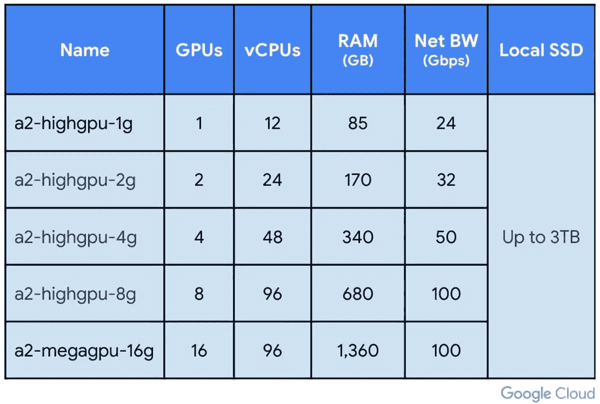
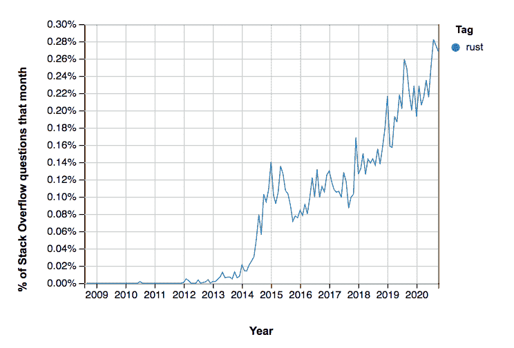
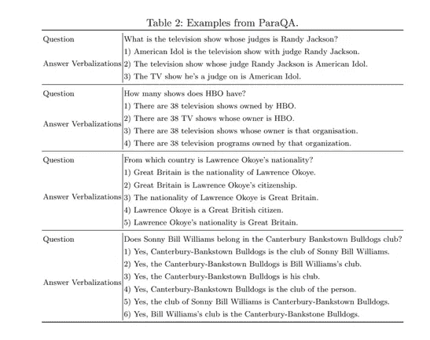

# NLP 密码| 03.21.21

> 原文：<https://pub.towardsai.net/the-nlp-cypher-03-21-21-aa290a32f446?source=collection_archive---------2----------------------->


索格森

## 自然语言处理每周时事通讯

## 芦苇场

嘿，欢迎回来！让我们从一个非常狡猾的甘的清晰的声波梦开始时事通讯😵🍄。但是等等，那到底是什么？想要直接体验，请观看下面的视频。TL；DR:一个聪明的 dev 训练了一个 GAN 来产生与音乐同步转换的迷幻艺术。这不是 NLP 相关的，但嘿，仍然很酷！这是库，它运行在 TF-v1 上，现在去取一个 wav 文件，放一些平克·弗洛伊德的音乐:

🍄

[](https://github.com/mikaelalafriz/lucid-sonic-dreams) [## mikaelafriz/清醒声波梦

### 清醒的声波梦同步甘产生的视觉音乐。默认情况下，它使用 NVLabs StyleGAN2，带有预训练的模型…

github.com](https://github.com/mikaelalafriz/lucid-sonic-dreams) 

惊喜 Colab:

[](https://colab.research.google.com/drive/1Y5i50xSFIuN3V4Md8TB30_GOAtts7RQD?usp=sharing) [## 谷歌联合实验室

### 编辑描述

colab.research.google.com](https://colab.research.google.com/drive/1Y5i50xSFIuN3V4Md8TB30_GOAtts7RQD?usp=sharing) 

如果你喜欢这篇文章，请给它一个👏👏并与朋友分享…😎

# TensorFlow 变压器库👀

```
pip install tf-transformers
```

就在你以为已经看完了的时候，一个库出现了，它增强了 TensorFlow v2 在 NLP 方面的能力。作者做出了令人印象深刻的声明，以下是其中的亮点(来自他们的回购):

*   使用张量流 2 的快速自回归解码。大部分实验比 PyTorch 快(V100 GPU)。比现有的基于 TF 的库快 80%(相对差异)参考[基准代码](https://github.com/legacyai/tf-transformers/blob/main/tests/notebooks/benchmarks)。
*   完整的 TFlite 支持 BERT、RoBERTA、T5、Albert 和 mt5，支持除文本生成之外的所有下游任务。
*   更快的句子片段对齐(不再有 LCS 开销)。
*   GPT2 等仅支持编码器的型号的可变批量文本生成。
*   不再有为 TFRecords 编写长代码的麻烦。简约而简单。
*   对自动批处理 tf.data.dataset 或 tf.ragged 张量的现成支持。
*   使用 model.compile2 将字典输出直接传递给`tf.keras.Model.fit`内部的损失函数。参考[例句](https://github.com/legacyai/tf-transformers/blob/main/src/tf_transformers/notebooks/tutorials)或[博客](https://legacyai-org.medium.com/tf-transformers-f7722536ba61)。
*   多个掩码模式，如因果、用户定义、通过改变一个参数的前缀。参考[示例](https://github.com/legacyai/tf-transformers/blob/main/src/tf_transformers/notebooks/tutorials)或[博客](https://legacyai-org.medium.com/tf-transformers-f7722536ba61)。

**型号支持**:阿尔伯特、伯特、罗伯塔、GPT-2、MT5、伊莱克特拉、T5。

他们甚至包括代码从拥抱脸切换到他们的图书馆:真人快打🥶…

 [## 传统/TF-变压器

### Tensorflow 2.0 中更快的自然语言处理技术。-legacy ai/TF-变压器

github.com](https://github.com/legacyai/tf-transformers/tree/main/src/tf_transformers/notebooks/conversion_scripts) 

**GitHub**

[](https://github.com/legacyai/tf-transformers) [## 传统/TF-变压器

### TF-transformers:tensor flow 2.0 中更快、更简单的最先进的 NLP TF-transformers 旨在利用…

github.com](https://github.com/legacyai/tf-transformers) 

# C4: 800GB 的英文文本被释放到野外

谷歌的 C4 数据集已经被完全隔离。他们从未提供下载选项，我们只能复制它。然而 AllenNLP 来了，他们带来了收据。

它们有 3 种变体:

*   `en`:TFDS 格式 800GB，JSON 格式 300GB
*   `en.noclean`:TFDS 格式 6.3TB，JSON 格式 2.3TB
*   `realnewslike`:TFDS 格式 38GB，JSON 格式 15GB

[](https://github.com/allenai/allennlp/discussions/5056) [## 下载 C4 数据集！讨论#5056 allenai/allennlp

### 此时您不能执行该操作。您已使用另一个标签页或窗口登录。您已在另一个选项卡中注销，或者…

github.com](https://github.com/allenai/allennlp/discussions/5056) 

# 多语言夹子

多语种剪辑怎么样？

101 源语言使用多语言 BERT(精华或基础)怎么样？

这个库提供了这一点，并包括一个直观的 Colab 来测试推理。🔥🔥

如果您想添加一种目前不支持的语言，请随时联系作者。这是伟大的工作。

[](https://github.com/FreddeFrallan/Multilingual-CLIP) [## FreddeFrallan/多语言剪辑

### Colab 笔记本预训练模型报告 Bug OpenAI 最近发布了学习可转移视觉模型的论文…

github.com](https://github.com/FreddeFrallan/Multilingual-CLIP) 

# Almond V.2 斯坦福的开源语音助手

想帮忙开发一个开源的语音助手？杏仁在这里:

**特色**:

*   音乐
*   家庭助理(物联网)
*   天气
*   笑话
*   当地餐馆
*   关于助手本身的常见问题

[](https://community.almond.stanford.edu/t/call-for-testing-almond-2-0-alpha/412) [## 呼吁测试:杏仁 2.0 阿尔法

### 大家好！我非常高兴地宣布，杏仁的新阿尔法版本立即可用。这是…

community.almond.stanford.edu](https://community.almond.stanford.edu/t/call-for-testing-almond-2-0-alpha/412) 

# A100s 富矿

谷歌云平台更新，如果你想疯狂使用分布式计算，你现在可以在一个 A2 实例上得到 16 个 A100s。这是严重的马力，如果你想知道 GCP 的计算上限是什么样的，这就是它。

[](https://cloud.google.com/blog/products/compute/a2-vms-with-nvidia-a100-gpus-are-ga) [## 采用 NVIDIA A100 GPUs 的 A2 虚拟机正式发布|谷歌云博客

### 采用 NVIDIA A100 GPUs 的 A2 虚拟机现已普遍适用于要求最苛刻的工作负载，包括机器学习…

cloud.google.com](https://cloud.google.com/blog/products/compute/a2-vms-with-nvidia-a100-gpus-are-ga) 

# 开始使用 Rust

它像 Python，但速度很快😁。如果你想知道 Rust 的当前状态，可以看看 Stack Overflow 博客👇。它强调了小而专注的 Rust 社区如何继续显示出它的力量，并提供了教程链接。

[](https://stackoverflow.blog/2021/03/15/getting-started-with-rust/) [## 开始使用...Rust - Stack 溢出博客

### 在这一系列中，我们根据栈溢出开发者调查、传播和…

stackoverflow.blog](https://stackoverflow.blog/2021/03/15/getting-started-with-rust/) 

# 张量流和量子:一年后的窥镜

此处提供了 Quantum TF 库的概述:

[](https://github.com/tensorflow/quantum) [## 张量流/量子

### TensorFlow Quantum (TFQ)是一个用于混合量子经典机器学习的 Python 框架，主要专注于…

github.com](https://github.com/tensorflow/quantum) 

**博客**

[](https://blog.tensorflow.org/2021/03/tensorflow-quantum-turns-one-year-old.html) [## TensorFlow 量子一岁了

### 2021 年 3 月 18 日—去年，我们发布了 TensorFlow Quantum (TFQ)…

blog.tensorflow.org](https://blog.tensorflow.org/2021/03/tensorflow-quantum-turns-one-year-old.html) 

# 软件更新💻

## 句子变形金刚更新

解密的

# 变压器 4.4.2

[](https://github.com/huggingface/transformers/releases) [## 释放拥抱脸/变形金刚

### 作为 S2T 实现的一部分，发布了两个新模型:Speech2TextModel 和…

github.com](https://github.com/huggingface/transformers/releases) 

# AresDB——GPU 驱动的实时存储和查询引擎(GoLang)

来自优步工程小组，这是 AresDB 的源代码。您可以连接 GPU 进行超低延迟的数据库查询。

[](https://github.com/uber/aresdb) [## 优步/aresdb

### AresDB 是一个基于 GPU 的实时分析存储和查询引擎。它的特点是低查询延迟，高数据…

github.com](https://github.com/uber/aresdb) 

原始发布博客:

[](https://eng.uber.com/aresdb/) [## 介绍 AresDB:优步的 GPU 驱动的开源实时分析引擎

### 在优步，实时分析使我们能够获得业务洞察力和运营效率，使我们能够…

eng.uber.com](https://eng.uber.com/aresdb/) 

# 言语大脑

一个很棒的新语音库，在 HF repo 上有几个预训练的模型。它支持的任务:说话人识别，语音识别和语音二进制化。它在 PyTorch 上运行。

[](https://speechbrain.github.io/) [## Speech brain:py torch 语音工具包

### SpeechBrain 是一个开源的一体化语音工具包。它设计简单、极其灵活，并且…

speechbrain.github.io](https://speechbrain.github.io/) 

# 用于存储和检索 ML 模型的 MongoDB

带代码的教程:

[](https://pythonsimplified.com/how-to-use-mongodb-to-store-and-retrieve-ml-models/) [## 如何使用 MongoDB 存储和检索 ML 模型— Python 简化版

### 如果你正在寻找一个数据库来存储你的机器学习模型，那么这篇文章就是为你准备的。你…怎么…

pythonsimplified.com](https://pythonsimplified.com/how-to-use-mongodb-to-store-and-retrieve-ml-models/) 

# 巨大的(难以置信的)PyTorch 回购

> “这是一个由教程、项目、图书馆、视频、论文、书籍和任何与不可思议的 [PyTorch](http://pytorch.org/) 相关的东西组成的精选列表。”

这是一个巨大的指数。

[](https://github.com/ritchieng/the-incredible-pytorch) [## ritchieng/不可思议的 pytorch

### 这是一个由教程、项目、图书馆、视频、论文、书籍和任何与不可思议的事物相关的精选列表…

github.com](https://github.com/ritchieng/the-incredible-pytorch) 

# 回购密码👨‍💻

## 一组最近发布的回购引起了我们的注意👁

## 纸盒变压器

aka:具有堆叠指针网络的上下文转换器，用于知识图上的对话式问题回答…

> 执行多任务语义解析，用于处理大规模知识图上的对话式问题回答。

[](https://github.com/endrikacupaj/CARTON) [## endrikapuaj/纸箱

### 神经语义分析方法已经广泛应用于知识图问答系统

github.com](https://github.com/endrikacupaj/CARTON) 

[**连接论文**](https://www.connectedpapers.com/main/576da54c43086aeb7320d5bdc81e94f8dc0d6723/arxiv) **📈**

## 用于零触发跨语言意图预测和空位填充的多语言代码转换

> 用英语训练联合意图预测和槽填充模型，并推广到其他语言。

[](https://github.com/jitinkrishnan/Multilingual-ZeroShot-SlotFilling) [## jitinkrishnan/多语言-zero shot-槽填充

### 目标:使用英语训练联合意图预测和槽填充模型，并推广到其他语言…

github.com](https://github.com/jitinkrishnan/Multilingual-ZeroShot-SlotFilling) 

[**连接论文**](https://www.connectedpapers.com/main/db50a600db4a18aba1ab5d66766c17b6433125ce/arxiv) **📈**

## BERT rl:BERT 的归纳关系预测

> 使用 BERT 完成知识库的完善。

[](https://github.com/zhw12/BERTRL) [## zhw12/BERTRL

### 代码和数据的论文[归纳关系预测的伯特]，本文提出了一种算法，使知识库…

github.com](https://github.com/zhw12/BERTRL) 

[**连接论文**](https://www.connectedpapers.com/main/df878d403bb974d30744384b5a52597d03e6fec0/arxiv) **📈**

## 用于情感识别的多模态端到端稀疏模型

[](https://github.com/wenliangdai/Multimodal-End2end-Sparse) [## 文两代/多模态-end 2 end-稀疏

### 在 NAACL 2021 上接受的论文:用于情感识别的多模态端到端稀疏模型，由戴* …

github.com](https://github.com/wenliangdai/Multimodal-End2end-Sparse) 

[**连接论文**](https://www.connectedpapers.com/main/3e90244d0594e36a7c8895eba84cbeba942f3186/arxiv) **📈**

## 维生素 c

> 使用变压器微调用于事实验证的维生素 c 数据集。

[](https://github.com/TalSchuster/VitaminC) [## tal schuster/维生素 c

### 该存储库包含 NAACL 2021 论文的数据集和模型:获取维生素 C！强大的事实验证…

github.com](https://github.com/TalSchuster/VitaminC) 

[**连接论文**](https://www.connectedpapers.com/main/eebc1811c55c2e5e8b3b78d0b0382ad50f22e32a/arxiv) **📈**

## Enconter

> 实体约束的插入转换器，一种帮助改进内容生成的精细控制的语言模型，即一种处理实体约束的方法。

[](https://github.com/LARC-CMU-SMU/Enconter) [## LARC-CMU-SMU/恩孔特

### 实施 2021 EACL 造纸编码中心。通过在…上创建帐户，为 LARC-CMU-SMU/encenter 的发展做出贡献

github.com](https://github.com/LARC-CMU-SMU/Enconter) 

[**连接论文**](https://www.connectedpapers.com/main/74fcb7f7fbc54b6211c99a0c2c2d74f8ec34cb12/arxiv) **📈**

# 本周数据集:帕拉卡

## 这是什么？

针对单回合对话的带有复述响应的问答数据集。

数据集包含 5，000 个问答对，每个问题最少两个，最多八个不同的转述回答。

## 样品



## 它在哪里？

[](https://github.com/barshana-banerjee/ParaQA) [## 巴尔沙纳-班纳吉/帕拉卡

### 该数据集是使用半自动框架创建的，该框架使用…

github.com](https://github.com/barshana-banerjee/ParaQA) 

> 每周日，我们都会对来自世界各地研究人员的 NLP 新闻和代码进行一次每周综述。
> 
> 如需完整报道，请关注我们的 Twitter: [@Quantum_Stat](http://twitter.com/Quantum_Stat)


[量子统计](https://quantumstat.com/)