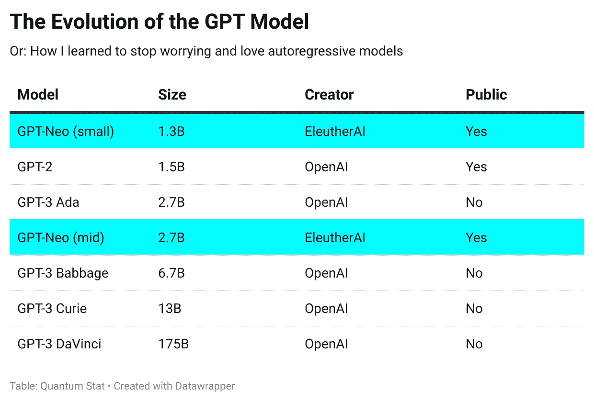
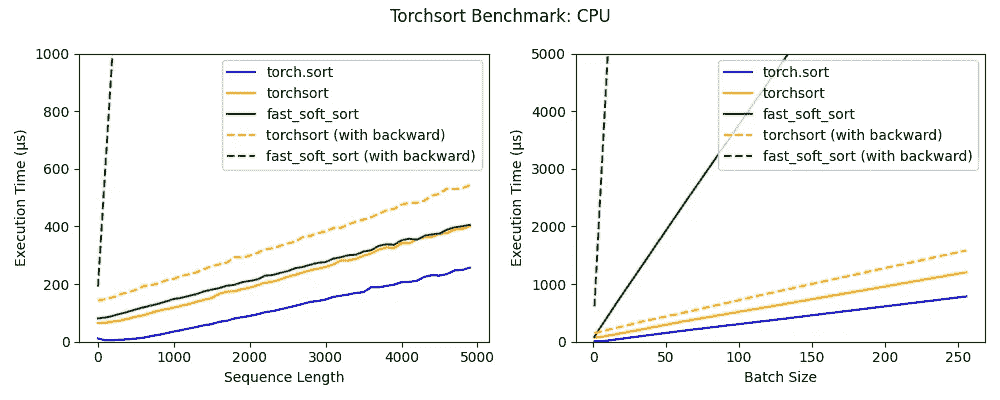

# NLP 密码| 03.28.21

> 原文：<https://pub.towardsai.net/the-nlp-cypher-03-28-21-233fb17040f7?source=collection_archive---------1----------------------->

情侣凝视月亮|弗里德里希

## 自然语言处理每周时事通讯

## 开源 GPT 向前迈进了一步-3

在 2011 年 2 月 21 日的新闻简报中，我们强调了 EleutherAI 构建超级大型 GPT-3 175B param 模型开源版本的雄心。本周，他们发布了 1.3B 和 2.7B 尺寸的两个版本，作为通往天堂的踏脚石。以下是当前 GPT 模型的情况。👇

> “该版本包括:
> 
> 完整的建模代码，用 Mesh TensorFlow 编写，设计为在 TPUs 上运行。
> 
> 训练模型权重。
> 
> 优化器状态，允许您从 EleutherAI 停止的地方继续训练模型。
> 
> 这是一个 Google Colab 笔记本，向您展示了如何使用代码库来训练、微调和从模型中取样。"

他们的笔记本需要一个 Google 存储桶来访问他们的数据，因为不能从本地文件系统读取 TPU。你可以很容易地设置免费试用，他们在笔记本中提供了一个链接。

**科拉布**:

 [## 谷歌联合实验室

### 编辑描述

colab.research.google.com](https://colab.research.google.com/github/EleutherAI/GPTNeo/blob/master/GPTNeo_example_notebook.ipynb) 

**代号**:

 [## EleutherAI/gpt-neo

### 模型和数据并行 GPT2 和 GPT3 类模型的实施，能够扩展到完整的 GPT3 大小…

github.com](https://github.com/EleutherAI/gpt-neo) 

**黑客方注**:

今年早些时候，EleutherAI 显然遭受了 DDOS 攻击。联合创始人康纳·莱希(Connor Leahy)在推特上发布了一个可视化的异常流量，在 pile 数据集上接收了一堆 HTTP 403s。如果你想为他们的事业(以及安全托管)捐款，请点击这里: [SITE](https://the-eye.eu/donate/) 。

[异常交通可视化](https://the-eye.eu/eleuther_staging/ailog.mp4)

# 188 种语言的数百万翻译句子

哇，翻译的语料库真多。赫尔辛基-NLP 收集是威胁性的单语数据收集，包括:

> Wikipedia、WikiSource、WikiBooks、WikiNews 和 WikiQuote 的翻译(如果我们翻译的源语言可用)

 [## 赫尔辛基-NLP/Tatoeba-挑战赛

### 可用于数据扩充翻译的自动翻译数据集已在模型中完成…

github.com](https://github.com/Helsinki-NLP/Tatoeba-Challenge/blob/master/Backtranslations.md) 

# Backprop AI |微调和部署 ML 模型

库可以用 1 行代码微调模型。

**特点**:

*   英语会话问答
*   100 多种语言的文本分类
*   图像分类
*   50 多种语言的文本矢量化
*   图像矢量化
*   英语摘要
*   英语中的情感检测
*   文本生成

 [## 反向投影-ai/反向投影

### Backprop 使使用、微调和部署最先进的 ML 模型变得简单。用…解决各种任务

github.com](https://github.com/backprop-ai/backprop) 

# 火炬接力

Koker 先生黑进了一个用于排序和排名的谷歌图书馆，并把它转换成 PyTorch(比原来的更快)🙉。使用排名的领域:Spearman 的排名相关系数、top-k 准确性和标准化贴现累积收益(NDCG)。

**基准**:

 [## teddykoker/torchsort

### PyTorch 中快速、可区分的排序和排名。纯 PyTorch 实现的快速可微排序和…

github.com](https://github.com/teddykoker/torchsort) 

# 深入研究图形(DIG) |一个新的图形库

这个新图书馆有助于四个研究领域:

*   [图形生成](https://github.com/divelab/DIG/tree/main/dig/ggraph)
*   [图上的自我监督学习](https://github.com/divelab/DIG/tree/main/dig/sslgraph)
*   [图形神经网络的可解释性](https://github.com/divelab/DIG/tree/main/dig/xgraph)
*   [3D 图形上的深度学习](https://github.com/divelab/DIG/tree/main/dig/3dgraph)

 [## 潜水实验室/挖掘

### DIG: Dive into Graphs 是一个用于图形深度学习研究的交钥匙库。DIG:一个全包式的图书馆，供您深入了解…

github.com](https://github.com/divelab/DIG) 

# 牛逼报纸|一个可能的数据来源？

涵盖 79 种语言和 7，102 个来源的在线报纸精选列表。数据没有被搜集，只是对来源进行了索引。

 [## divkakwani/awesome-报纸

### 涵盖 79 种语言和 7102 个来源的在线报纸精选列表。目的本列表提供报纸…

github.com](https://github.com/divkakwani/awesome-newspapers) 

# 搜索状态 DeepSet 连接

DeepSet 带你走进开放领域问答/搜索的记忆通道。从 2 级检索器阅读器开始(哈！还记得看过[陈等人 2017 年的论文](https://github.com/facebookresearch/DrQA)吗？)，然后是 RAG 或生成响应(与 extractive 相对)，最后是总结(使用 Pegasus)，以及他们最新的“管道”计划。他们还讨论了使用查询分类器对软件应该使用的检索类型进行分类的未来计划(密集与浅层)。这真的很酷，因为这显示了他们对在人工智能决策中使用层次结构的兴趣，通过使用…人工智能。👀

 [## 干草堆:2021 年的搜索状态

### 如何构建语义引擎以获得更好的搜索体验

medium.com](https://medium.com/deepset-ai/haystack-the-state-of-search-in-2021-7388ecb15dfb) 

# 斯坦福对情报界人士采用人工智能的赞美

斯坦福大学的一份有趣的🧐白皮书向美国情报界提供了关于采用人工智能和与快速发展的领域保持同步以保持竞争力的建议和警告。他们还推荐一个开源情报机构。🧐

> “……斯坦福大学的一项研究报告称，机器学习算法可以在数百张卫星图像上计算从中国到朝鲜的卡车数量，速度比有经验的人类图像分析师快 225 倍，但准确度相同。”

 [## HAI _ 商务智能 _FINAL.pdf

### 编辑描述

drive.google.com](https://drive.google.com/file/d/1Ip5ovXedt6xh9ddWqsfEKRJXbo1V5Wol/view?sf140654168=1) 

# 矩阵乘法—达到 N

仅用 *n* 2 步将一对*n*-乘- *n* 矩阵相乘需要什么？？

仅供参考，矩阵乘法是所有深度神经网络的引擎。最新的改进“将以前最好成绩的指数减少了十万分之一。”抓住那个伊隆！

 [## 矩阵乘法离神话目标又近了一步

### 对于计算机科学家和数学家来说，关于“指数二”的观点可以归结为世界应该如何…

www.quantamagazine.org](https://www.quantamagazine.org/mathematicians-inch-closer-to-matrix-multiplication-goal-20210323/) 

# 回购密码👨‍💻

## 一组最近发布的回购引起了我们的注意👁

## 流派(生成实体检索)

> 基于微调的 BART 架构，GENRE 使用序列到序列的方法进行实体检索(例如，链接)。包括 Fairseq 和拥抱面部支撑。

 [## Facebook 研究/流派

### 在 pytorch 中实现的自回归实体检索中介绍的 GENRE (Generarive 实体检索)系统…

github.com](https://github.com/facebookresearch/GENRE) 

[**连接论文**](https://www.connectedpapers.com/main/f4c491f2a54e9b1c2b18500d0787cc7a72522bff/arxiv) **📈**

## 影子 GNN

> 图形表示学习库。它目前支持六种不同的架构:GCN、GraphSAGE、GAT、GIN、JK-Net 和 SGC。

 [## 脸书研究/影子 _GNN

### 曾汉青，，夏应龙，阿吉特什·斯里瓦斯塔瓦，安德烈·马列维奇，拉杰戈帕尔·坎南，维克多·普拉桑纳，龙…

github.com](https://github.com/facebookresearch/shaDow_GNN) 

[**连接论文**](https://www.connectedpapers.com/main/b59b7670d6873a8d4ccf99c4d0d21b6a2a281100/arxiv) **📈**

## 彩虹上的独角兽|常识推理基准

> [*彩虹*](https://leaderboard.allenai.org/rainbow) 汇集了六个预存的常识推理基准:[安丽](https://leaderboard.allenai.org/anli)[宇宙 QA](https://leaderboard.allenai.org/cosmosqa)[hellas wag](https://leaderboard.allenai.org/hellaswag)[物理 IQa](https://leaderboard.allenai.org/physicaliqa)[社会 IQa](https://leaderboard.allenai.org/socialiqa)[威诺格兰德](https://leaderboard.allenai.org/winogrande)。这些常识推理基准跨越了社会和物理常识。

 [## allenai/彩虹

### 常识的神经模型。这个知识库是为论文准备的:彩虹上的独角兽:一个普遍的常识推理…

github.com](https://github.com/allenai/rainbow) 

[**连接论文**](https://www.connectedpapers.com/main/21ec9c0f869bdb33b06c7dbc8880169db0397d08/arxiv) **📈**

## TAPAS[扩展功能]

> 这篇最近的[论文](https://arxiv.org/pdf/2103.12011.pdf)描述了 Google 的 TAPAS 表解析功能到开放域 QA 的扩展！！

 [## 谷歌研究/tapas

### 用于训练基于转换器的表格 QA 模型的代码和检查点

github.com](https://github.com/google-research/tapas) 

[**连接论文**](https://www.connectedpapers.com/main/6f75cf92ef5f4293b76e2411d8278176b2d38eb5/arxiv) **📈**

## MMT-Retrieval:使用多模态转换器的图像检索和更多功能

> 库用于使用预先训练的多模态变压器，如[奥斯卡](https://github.com/microsoft/Oscar)、[统一者/别墅](https://github.com/zhegan27/VILLA)或 [M3P(多语言！)](https://github.com/microsoft/M3P)进行图片搜索等。

 [## uk plab/MMT-检索

### 这个项目提供了一个简单的方法来使用最近预训练的多模态变压器，如奥斯卡，UNITER/别墅或…

github.com](https://github.com/UKPLab/MMT-Retrieval) 

[**连接论文**](https://www.connectedpapers.com/main/90137e9e3dd578380aac2450f475cdd0c2c8df9a/arxiv) **📈**

## AdaptSum:面向抽象摘要的低资源域自适应

> 第一个基准测试模拟抽象摘要系统的低资源域适应设置，结合跨六个不同域的现有数据集:对话、电子邮件、电影评论、辩论、社交媒体和科学，并针对每个域，将训练样本的数量减少到少量，以便创建低资源场景。

 [## TysonYu/AdaptSum

### 在 NAACL-HLT 2021 上接受的论文:AdaptSum:面向低资源领域的抽象概括适应…

github.com](https://github.com/TysonYu/AdaptSum) 

[**连接论文**](https://www.connectedpapers.com/main/e66000253fcffa621a0e57aadba9c3812ce82903/arxiv) **📈**

## 可可粉

> CoCoA 是一个对话框架，通过基于文本的聊天界面和 PyTorch 中的模型开发(主要基于 OpenNMT)提供数据收集工具。

 [## 斯坦福大学/可可

### CoCoA 是用 Python 编写的对话框架，通过基于文本的聊天提供数据收集工具…

github.com](https://github.com/stanfordnlp/cocoa) 

[**相连论文**](https://www.connectedpapers.com/main/35b0e3dd3245bfcfad37270a543768811c339193/arxiv) 📈

# 本周数据集:马萨坎纳

## 这是什么？

精选非洲语言的 10 个 NER 数据集:阿姆哈拉语、豪萨语、伊博语、基尼亚卢旺达语、卢甘达语、奈贾皮钦语、斯瓦希里语、沃洛夫语和约鲁巴语。repo 还包含模型训练脚本。

## 它在哪里？

 [## 马萨坎伊奥/马萨坎内

### 这个库包含用于训练 NER 模型的代码，用于分析 NER 模型预测和 NER 的脚本…

github.com](https://github.com/masakhane-io/masakhane-ner) 

> 每周日，我们都会对来自世界各地研究人员的 NLP 新闻和代码进行一次每周综述。
> 
> 如需完整报道，请关注我们的 Twitter: [@Quantum_Stat](http://twitter.com/Quantum_Stat)

[量子统计](https://quantumstat.com/)