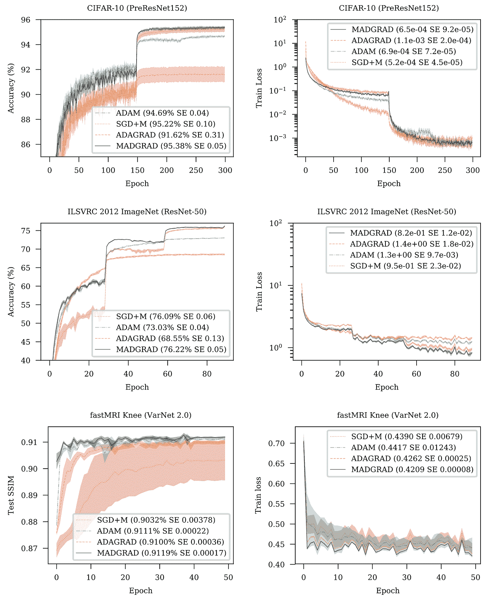
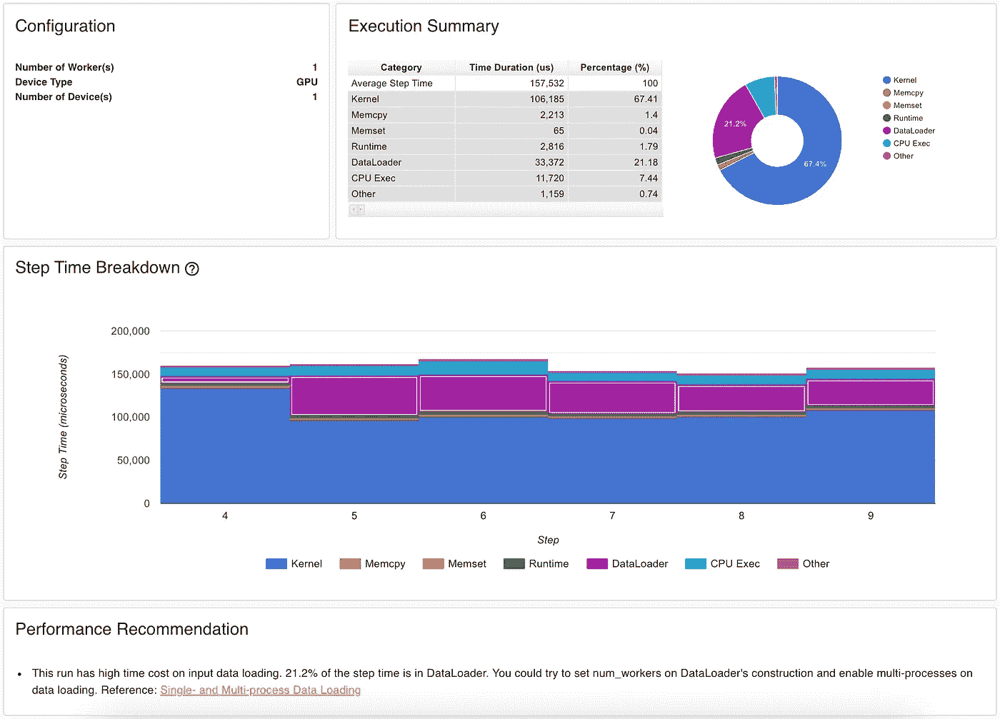
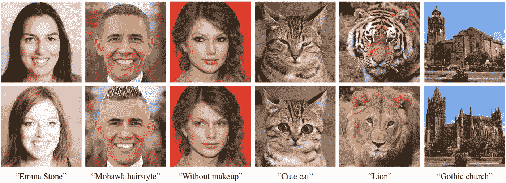
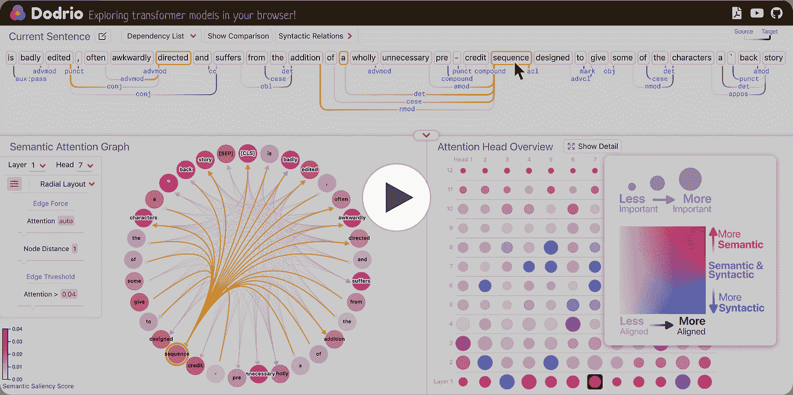

# NLP 密码| 04.04.21

> 原文：<https://pub.towardsai.net/the-nlp-cypher-04-04-21-9964ab34df17?source=collection_archive---------0----------------------->


佛罗里达|因尼斯，月初升起

## 自然语言处理每周时事通讯

## 脸书泄密编年史

嘿欢迎回来。在过去的 24 小时里发生了很多事情！首先，Alon Gal，一个网络安全的家伙，我们几个月前在 Cypher 上第一次提到他，关于他的推文提到黑客试图在黑暗网络上破解一个巨大的比特币钱包，他回来了。这一次，他的推文火了。脸书上的一个漏洞(2019 年修补)暴露了全球 5.33 亿脸书用户(32，126，812 人位于美国)。电话号码、电子邮件、姓名和其他信息等元数据被暴露。最初，这些数据是在暗网上交易的，但几天前，这些数据被泄露给了公众。😬

我实际上接触到了泄露的美国部分。好消息(至少对美国用户来说)是这个子集中包含了很少的电子邮件和 DOB。

# GPT-3 近地天体回调

截至本周，由 EleutherAI 发布的 GPT-3 近地天体模型在拥抱脸模型中心直播，你可以下载它们进行推断:

```
from transformers import pipeline
generator = pipeline('text-generation', model='EleutherAI/gpt-neo-2.7B')
generator("EleutherAI has", do_sample=True, min_length=50)[{'generated_text': 'EleutherAI has made a commitment to create new software packages for each of its major clients and has'}]
```

对于 2.7B param 模型的微调，可以使用这个家伙的回购。👇

[](https://github.com/Xirider/finetune-gpt2xl) [## Xirider/finetune-gpt2xl

### 微调像 GPT2-xl 这样的大型语言模型通常很困难，因为这些模型太大，不适合单个 GPU…

github.com](https://github.com/Xirider/finetune-gpt2xl) 

根据作者的说法，他在一台 78 GB RAM 的计算机上测试了 V100 GPU (16 GB VRAM ),并使其工作。✌✌

以下是微调后的推断代码片段:

```
from transformers import GPTNeoForCausalLM, AutoTokenizermodel = GPTNeoForCausalLM.from_pretrained("finetuned").to("cuda")
tokenizer = AutoTokenizer.from_pretrained("finetuned")text = "From off a hill whose concave"
ids = tokenizer(text, return_tensors="pt").input_ids.to("cuda")max_length = 400 + ids.shape[1] # add the length of the prompt tokens to match with the mesh-tf generationgen_tokens = model.generate(
  ids,
  do_sample=True,
  min_length=max_length,
  max_length=max_length,
  temperature=0.9,
  use_cache=True
)
gen_text = tokenizer.batch_decode(gen_tokens)[0]
print(gen_text)
```

如果你想知道在攀登 GPT 近地天体方面，伊柳瑟雷下一步会走向何方👇

解密的

# 亚当优化器去拜拜？

欢迎 MADGRAD，一个新的最先进的优化器。据 FB 研究，可以超过亚当的速度。作者说，你可能需要调整你的学习速度和降低体重衰减(超参数)，以适应 MADGRAD。



# 后退:ML 资源页面

一个新的资源页面，目前专注于深度学习主题、GANs 和 Transformers。

[](https://www.backprop.org/home) [## 主页

### Backprop 作为一种资源，通过在各种机器上寻找和聚集最佳资源来加速学习

www.backprop.org](https://www.backprop.org/home) 

# Hawking:一种自然语言日期解析器(Java)

真的很酷，它接受自然语言作为输入(有些输入提到了一个日期),并可以以官方日期格式返回该日期。

```
String inputText = "Good morning, Have a nice day. Shall we meet on December 20 ?"; #outputText : on December 20
Start : 2021-12-20T00:00:00.000+05:30
End : 2021-12-20T23:59:59.000+05:30
```

[](https://github.com/zoho/hawking) [## 佐霍/霍金

### 给定一个句子中的任何日期表达式，霍金将应用标准语言识别和解析技术…

github.com](https://github.com/zoho/hawking) 

# PyTorch 剖面仪

现已推出 1.8 PyTorch 版本。

> 这种新的探查器收集 GPU 硬件和 PyTorch 相关信息，将它们关联起来，自动检测模型中的瓶颈，并生成有关如何解决这些瓶颈的建议

[](https://pytorch.org/blog/introducing-pytorch-profiler-the-new-and-improved-performance-tool/) [## PyTorch

### 微软首席项目经理华微软首席工程经理吉塔

pytorch.org](https://pytorch.org/blog/introducing-pytorch-profiler-the-new-and-improved-performance-tool/) 

# 知识图嵌入教程

这是一个很棒的教程，包含幻灯片、Colab 笔记本和其他材料，可以了解所有知识图表。

[](https://kge-tutorial-ecai2020.github.io/) [## 知识图嵌入教程:从理论到实践

### 幻灯片[PDF] Jupyter 笔记本/Colab 动手练习查看其他 KGE 教程材料知识图表…

kge-教程-ecai2020.github.io](https://kge-tutorial-ecai2020.github.io/) 

# 谈论知识图表…

> “ASER(活动、状态、事件及其关系)，一个从超过 110 亿个令牌的非结构化文本数据中提取的大规模不确定性知识图。ASER 包含 15 种关系类型，属于五个类别(时间、偶然性、比较、扩展和共现)，1.94 亿个唯一的可能性，以及其中的 6400 万个唯一的边。

[](https://github.com/HKUST-KnowComp/ASER) [## HKUST 知识公司/激光

### ASER(活动、状态、事件和它们的关系)是一个大规模的不确定性知识图，它从更多的…

github.com](https://github.com/HKUST-KnowComp/ASER) 

# 实验室错误:数据集

创建了一个网站，揭露 vision 和 NLP 中使用的非常流行的数据集中的错误(上面有 20 个新闻组和 IMDB)。🥶🥶

[](https://labelerrors.com/) [## 基准 ML 数据集中的标签错误

### 我们在 10 个基准 ML 测试集中识别标签错误，并研究这些标签错误影响…

labelerrors.com](https://labelerrors.com/) 

# 回购密码👨‍💻

## 一组最近发布的回购引起了我们的关注👁

## StyleCLIP:文本驱动的 StyleGAN 图像操作

> 使用剪辑模型来开发基于文本的界面，用于不需要这种手动工作的 StyleGAN 图像操作。

这很有趣。🤪

[](https://github.com/orpatashnik/StyleCLIP) [## orpatashnik/StyleCLIP

### 演示视频:优化笔记本:全局方向笔记本:样式剪辑:样式的文本驱动操作图像…

github.com](https://github.com/orpatashnik/StyleCLIP) 

[**连接论文**](https://www.connectedpapers.com/main/aaa99de83292370a964fcaa51e6e866a96726bb2/arxiv) **📈**

## 方面-情感-观点三元组抽取(ASOTE)

> ASOTE 从句子中提取体项、情感和观点项三元组。

[](https://github.com/l294265421/ASOTE) [## l294265421/ASOTE

### 方面-情感-观点三元组抽取(ASOTE)从…中抽取方面术语、情感和观点术语三元组

github.com](https://github.com/l294265421/ASOTE) 

[**连接论文**](https://www.connectedpapers.com/main/41d4f19c2ffce4fc34681f53bdd6ce70e5920cd3/arxiv) **📈**

## 为局部可控语言生成改变变形金刚的思维

> 使用语言模型控制文本生成主题的框架。它显示多个候选主题，用户可以从中选择一个子集来指导生成。

[](https://github.com/iesl/interactive_LM) [## iesl/interactive_LM

### 我们将首先介绍如何通过下载我们的预训练模型来运行 IPython 笔记本演示。然后，我们将…

github.com](https://github.com/iesl/interactive_LM) 

[**连接论文**](https://www.connectedpapers.com/main/71cdf94d13cc6c497dcc2dcb20893fe64cfaf62e/arxiv) **📈**

## 变形金刚可视化工具包

> 一个交互式可视化系统，旨在帮助 NLP 研究人员和实践者分析和比较基于 transformer 的模型中的注意力权重和语言知识。

[](https://github.com/poloclub/dodrio) [## 波洛克洛布/多德里奥

### 一个交互式可视化系统，旨在帮助自然语言处理研究人员和从业人员分析和比较注意…

github.com](https://github.com/poloclub/dodrio) 

[**连接论文**](https://www.connectedpapers.com/main/c85e1f10eb9b1bf3c057614cb5bb832ef6e90af7/arxiv) **📈**

## 用于内容调节的自我监督委婉语检测和识别

> 用于委婉语检测和识别任务的模型(BERT)和数据。

[](https://github.com/WanzhengZhu/Euphemism) [## 完美主义/委婉语

### 这个 repo 是内容的自我监督委婉检测和识别的 Python 3 实现…

github.com](https://github.com/WanzhengZhu/Euphemism) 

[**连接论文**](https://www.connectedpapers.com/main/f3d835294acb37874c6cb5b347bbcefe712ecd85/arxiv) **📈**

# 本周数据集:赌场

## 这是什么？

由 1，030 个谈判对话组成的谈判数据集。两名参与者扮演营地邻居的角色，根据他们个人的偏好和要求，就*食物*、*水*和*柴火*包进行谈判。

## 样品

参与者信息

*   人口统计(年龄、性别、种族、教育)
*   个性特征(SVO 和 Big-5)
*   偏好顺序
*   需要或不需要特定项目的论据

谈判对话

*   两个参与者之间的交替对话
*   平均 11.6 次发言
*   包括四种表情符号的使用:快乐、悲伤、愤怒、惊讶

谈判结果

*   得分
*   满意度(您对谈判结果的满意度如何？)
*   对手相似度(你有多喜欢你的对手？)

## 它在哪里？

[](https://github.com/kushalchawla/CaSiNo) [## kushalchawla/赌场

### 这个存储库包含数据集和 PyTorch 代码，用于“赌场:营地谈判对话语料库…

github.com](https://github.com/kushalchawla/CaSiNo) 

> 每周日，我们都会对来自世界各地研究人员的 NLP 新闻和代码进行一次每周综述。
> 
> 如需完整报道，请关注我们的 Twitter: [@Quantum_Stat](http://twitter.com/Quantum_Stat)


[量子统计](https://quantumstat.com/)