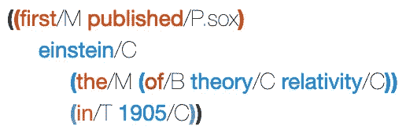
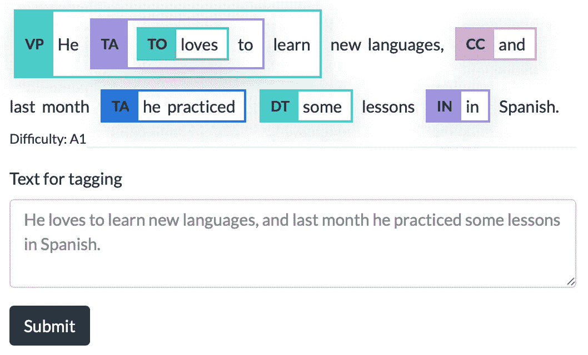
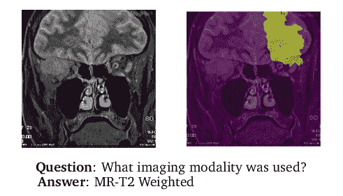

# NLP 密码| 04.11.21

> 原文：<https://pub.towardsai.net/the-nlp-cypher-04-11-21-a3ec35c8aa8e?source=collection_archive---------1----------------------->

博物学家的研究|罗伊

## 自然语言处理每周时事通讯

## 天很黑，NLP 很热

人的一小步…

猴子用意念玩乒乓的一大飞跃…

解密的

欢迎回来。本周我们为你准备了一个好节目。但首先……埃隆·马斯克的大脑芯片公司 Neuralink 在一只猴子的头骨中植入了芯片，这样它就可以无线玩 pong 了。赢了！如果你是那种创造下一级星际迷航技术的人，他们有空缺职位。🙉

 [## 首款全植入式 1000+通道脑机接口

### 在 2019 年的白皮书中，我们概述了我们新型电极的设计和我们独特的手术方法，以及…

neuralink.com](https://neuralink.com/blog/) 

# 语义超图

兴奋地宣布 Graphbrain 库在过去的一周有了重大更新。它现在包括一个更广泛的文档，带有教程和笔记本，用于快速实验。

重述…

Graphbrain 是一个用于从文本构建语义超图的库。超图只是一个普通的图，除了一条边不仅限于两个顶点。它可以有 3 个或更多😎。这一特性使 it 能够灵活地以分层的方式提取知识实体。它建立在 spaCy 和 Hugging Face 的 NeuralCoref 库之上，用于帮助完成共指解析任务。

如果您是这个库的新手，由于它的符号，一开始可能会有点吓人。仅供参考，这是符号的样子…👇

我知道…对于未经训练的人来说，这有点奇怪，但绝对值得更深入地探索，因为它可以帮助你从新的架构而不是纯粹的深度学习方法来看待 NLP 任务。要熟悉所有的任务，请查看下面的文章。

仅供参考，这是他们的手册，让你熟悉模型给出的符号:

 [## 语义超图符号- Graphbrain 0.4.0 文档

### SH 符号基于两个简单的原则:每个超边属于八种基本类型之一。第一个要素…

graphbrain.net](https://graphbrain.net/manual/notation.html) 

**文档:**

 [## Graphbrain -语言、知识、认知- Graphbrain 0.4.0 文档

### Graphbrain 是一个人工智能开源软件库和科研工具。其目的是…

graphbrain.net](https://graphbrain.net/index.html) 

**代号**:

 [## 图形大脑/图形大脑

### Graphbrain 是一个人工智能开源软件库和科研工具。其目的是…

github.com](https://github.com/graphbrain/graphbrain) 

[**语义超图论文**](https://arxiv.org/pdf/1908.10784.pdf)

# 这是 Reddit 上的狂野西部😬

# Chirpy:斯坦福的开源聊天机器人

斯坦福开源的 Chirpy，他们的聊天机器人赢得了 Alexa 奖的第二名。这是一个聊天机器人，具有广泛的响应生成器。它们可以是完全基于规则的，也可以是完全基于神经的。

**发电机类型:**

> 音乐响应发生器
> 
> 个人聊天响应生成器
> 
> 维基响应生成器

 [## 内部 Chirpy 枢机主教:斯坦福大学的开源社交聊天机器人，赢得了 Alexa 奖第二名

### 去年，斯坦福大学在社交聊天机器人的 Alexa Prize social bot Grand Challenge 3 中获得第二名。在本帖中，我们…

ai.stanford.edu](http://ai.stanford.edu/blog/chirpy-cardinal/) 

# 在苹果的 M1 芯片上运行 PyTorch？👇

 [## 苹果 M1 芯片的 GPU 加速？问题编号 47702 pytorch/pytorch

### 🚀你好，我想知道我们是否可以评估 PyTorch 在苹果新 M1 芯片上的性能。我也在想…

github.com](https://github.com/pytorch/pytorch/issues/47702#issuecomment-739442975) 

# Kgextension:从知识图谱到熊猫

> “kgextension 包允许访问和使用链接的开放数据来扩充现有数据集。它使人们能够在[熊猫中整合知识图谱信息。数据帧](https://pandas.pydata.org/pandas-docs/stable/reference/api/pandas.DataFrame.html)

链接开放数据的类型: [DBpedia](https://wiki.dbpedia.org/) 、 [WikiData](https://www.wikidata.org/wiki/Wikidata:Main_Page) 或[欧盟开放数据门户](https://data.europa.eu/euodp/en/home)

 [## om-HB/kg 扩展

### kgextension 包允许访问和使用链接的开放数据来扩充现有数据集。它能够…

github.com](https://github.com/om-hb/kgextension) 

## 本周可乐

 [## 谷歌联合实验室

### 编辑描述

colab.research.google.com](https://colab.research.google.com/github/om-hb/kgextension/blob/master/examples/book_genre_prediction.ipynb) 

# 想象伯特

注意力是你所需要的……去看一个变形金刚的一个动作。

> “BertViz 是一个在变形金刚模型中可视化注意力的工具，支持来自[变形金刚](https://github.com/huggingface/transformers)库的所有模型(BERT、GPT-2、XLNet、罗伯塔、XLM、CTRL 等。)"

 [## 杰塞维格/贝特维兹

### BertViz 是一个在变形金刚模型中可视化注意力的工具，支持变形金刚的所有模型…

github.com](https://github.com/jessevig/bertviz) 

# GECToR —语法错误纠正

除了一堆 YouTube 广告，Grammarly 还有一堆变形金刚模型😬。他们的语法纠错模型根据合成数据进行预训练，然后分两个阶段进行微调:

> 第一个是错误填充的语料库，第二个是错误填充和无错误平行语料库的组合。

 [## 语法/几何

### 这个库提供了用于训练和测试最先进的语法错误纠正模型的代码…

github.com](https://github.com/grammarly/gector) 

# PyTorch 几何时态

一个用于 [PyTorch 几何](https://github.com/rusty1s/pytorch_geometric/)的时态图神经网络扩展库。如果你正在研究[流行病学预测](https://pytorch-geometric-temporal.readthedocs.io/en/latest/notes/introduction.html#epidemiological-forecasting)或[网络流量预测](https://pytorch-geometric-temporal.readthedocs.io/en/latest/notes/introduction.html#web-traffic-prediction)，看看吧:

 [## benedekrozemberczki/py torch _ geometric _ temporal

### PyTorch 几何时态是 PyTorch 几何的一个时态(动态)扩展库。图书馆包括…

github.com](https://github.com/benedekrozemberczki/pytorch_geometric_temporal) 

# NLP 用例

在这些幻灯片中，ML 工程师 Andrei Lopatenko 描述了他在过去 15 年中经历的商业领域中的一些顶级 NLP 用例。

# 蝗虫|负载测试

需要在开源软件上对您的网站或 API 端点进行负载测试吗？看看蝗虫…🐜

 [## locust——现代负载测试框架

### 编辑描述

locust.io](https://locust.io/) 

# Python 包有人吗？

如何在 2021 年做出一个牛逼的 Python 包…

 [## 如何在 2021 年做出一个牛逼的 Python 包

### 如果你像我一样，每隔一段时间就写一个有用的 python 实用程序，想和同事们分享一下…

antonz.org](https://antonz.org/python-packaging/) 

# 烦人图书馆

非常快速的最近邻搜索。Spotify 用它来推荐音乐。

**特色(在他们的回购上找到的)**:

*   [欧几里德距离](https://en.wikipedia.org/wiki/Euclidean_distance)，[曼哈顿距离](https://en.wikipedia.org/wiki/Taxicab_geometry)，[余弦距离](https://en.wikipedia.org/wiki/Cosine_similarity)，[汉明距离](https://en.wikipedia.org/wiki/Hamming_distance)，或者[点(内)积距离](https://en.wikipedia.org/wiki/Dot_product)
*   余弦距离相当于归一化向量的欧几里德距离= sqrt(2–2 * cos(u，v))
*   如果你没有太多的维度，效果会更好(比如雷内·霍兰德)
*   Spotify/骚扰
*   是一个带有 Python 绑定的 C++库，用来搜索空间中的点…
*   github.com
*   多文档摘要
*   Aylien 为摘要创建了维基百科时事门户数据集。在他们的博客中，他们讨论了为什么他们的方法不同于最近的 SOTA 模型，如 PEGASUS 和 BART，因为它们不能访问多文档。🥶🥶

## [“它基于](https://github.com/spotify/annoy)[维基百科时事门户](https://en.wikipedia.org/wiki/Portal:Current_events) (WCEP)，维基百科编辑在这里撰写重要时事的简明摘要，通常用一两句话，并提供新闻文章的链接作为每个摘要的来源。”

### **博客:**

多文档汇总的冒险:维基百科时事门户数据集

# 01 Apr 2021 德米安 Gholipour 13 分钟阅读在这篇文章中，我们给出了一个多文档摘要(MDS)的简要概述…

aylien.com

> 谷歌联合实验室

编辑描述

 [## colab.research.google.com

### 回购密码👨‍💻

一组最近发布的回购引起了我们的关注👁](https://aylien.com/blog/multi-document-summarisation-and-the-wcep-dataset)  [## 代码转换

### 最先进的源代码预训练模型。CodeTrans 在几个英伟达 RTX 8000 图形处理器和几个谷歌图形处理器上使用各种最先进的变压器模型进行了培训。

地理学家/代码翻译](https://colab.research.google.com/github/complementizer/wcep-mds-dataset/blob/master/wcep_getting_started.ipynb) 

# CodeTrans 为源代码提供最先进的预训练模型。CodeTrans 是在几个 Nvidia RTX 上训练的…

## github.com

## [**接论文**](https://www.connectedpapers.com/main/de3e29b546e179e537bb007753b20c1c4ccc9da4/arxiv) **📈**

> 布局分析器

 [## OCR *😱😱😱😱😱和文件图像分析*

### 布局解析器/布局解析器

布局解析器是一个基于深度学习的工具，用于文档图像布局分析任务。使用 pip 或 conda 安装…](https://github.com/agemagician/CodeTrans) 

github.com

## [**连接论文**](https://www.connectedpapers.com/main/a4e4ec7484e1f1ced1da21e31151b753dc49d0ca/arxiv) **📈**

> 基于变换器和图注意网络的知识图对话式问答

 [## 一种扩展了图注意网络的多任务神经语义分析转换器结构。

### endrikapuaj/千层面

本文研究基于知识图的(复杂)对话式问题回答任务。对于这项任务，我们…](https://github.com/Layout-Parser/layout-parser) 

github.com

## [**连接论文**](https://www.connectedpapers.com/main/43a36f7767044e61d2e1a68ea719ca1be8a9d4b4/arxiv) **📈**

> EXPATS:可解释的自动文本评分工具包

 [## 一个用于自动文本评分(ATS)任务的框架，例如自动文章评分和可读性评估。该工具包还提供了与语言可解释性工具(LIT)的无缝集成，以便人们可以解释和可视化模型及其预测。

### 辛诺夫/外籍人士

EXPATS 是一个用于自动文本评分(ATS)任务的开源框架，例如自动论文评分和…](https://github.com/endrikacupaj/LASAGNE) 

github.com

## [**连接论文**](https://www.connectedpapers.com/main/be5569465daeb5f8e0ccd2e6a102fa50e83cd842/arxiv) **📈**

> Grammar tagger——一个用于语言学习的神经多语言语法分析器

 [## 给定输入文本，识别对语言教育有用的语法特征。

### 辛醇/克玛塔格

一个用于语言学习的神经多语言语法分析器](https://github.com/octanove/expats) 

github.com

## [**连接论文**](https://www.connectedpapers.com/main/e2f96265010abeb7f3e028ce29549e75f8844d33/arxiv) **📈**

> MMBERT:用于改善医学 VQA 的多模态 BERT 预训练

 [## 一种用于医学领域中的视觉问答任务的多模态转换器。它在用于放射学图像的两个 VQA 数据集上实现了新的一流性能——VQA-Med 2019 和 VQARAD。

### VirajBagal/MMBERT

Yash Khare*、Viraj Bagal*、Minesh Mathew、Adithi Devi、U Deva Priyakumar、CV Jawahar 摘要:医学图像…](https://github.com/octanove/grammartagger) 

github.com

## [**连接论文**](https://www.connectedpapers.com/main/17c2bb358169541f2d0a769f80779f46d1cd3d37/arxiv) **📈**

> 本周数据集:HumAID

 [## 这是什么？

### 一个由 77K 条人类标记的推文组成的数据集，从 2016 年至 2019 年期间发生的 19 起灾难事件的 2400 万条推文中采样。灾难事件包括地震/飓风、洪水、飓风和野火。

它在哪里？](https://github.com/VirajBagal/MMBERT) 

[论文](https://arxiv.org/pdf/2104.03090.pdf)

# 危机

## 数据集描述 HumAID Twitter 数据集由数千条人工注释的推文组成，这些推文…

crisisnlp.qcri.org

## 撕成有史以来最真实的…

每周日，我们都会对来自世界各地研究人员的 NLP 新闻和代码进行一次每周综述。

## [如需完整报道，请关注我们的推特:](https://crisisnlp.qcri.org/humaid_dataset.html) [@Quantum_Stat](http://twitter.com/Quantum_Stat)

### [量子统计](https://quantumstat.com/)

crisisnlp.qcri.org

RIP to one of the realest to ever do it…

> Every Sunday we do a weekly round-up of NLP news and code drops from researchers around the world.
> 
> For complete coverage, follow our Twitter: [@Quantum_Stat](http://twitter.com/Quantum_Stat)

[Quantum Stat](https://quantumstat.com/)