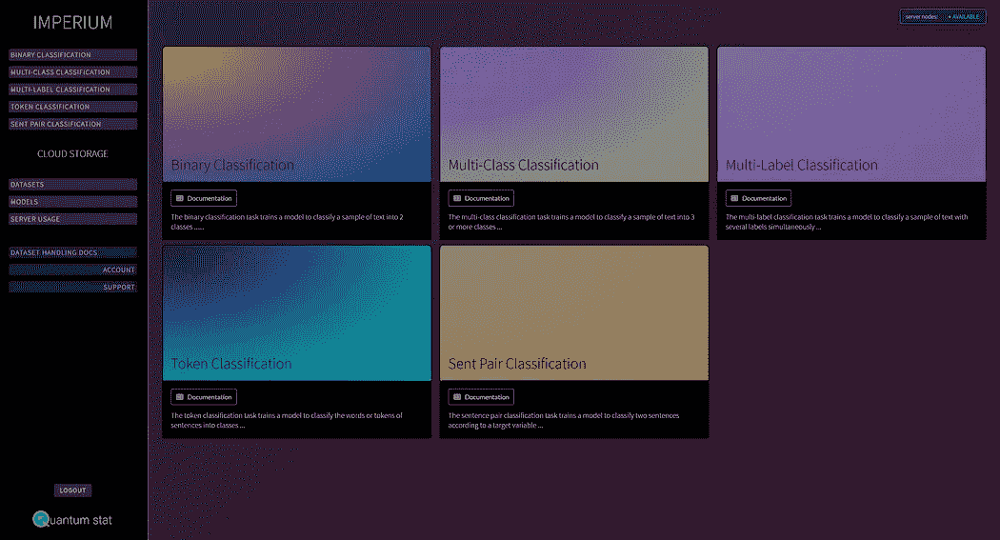
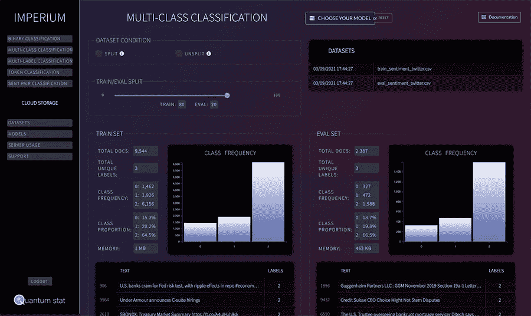
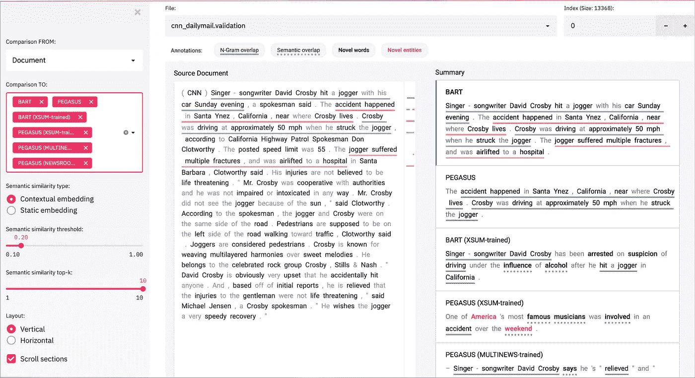

# NLP 密码| 04.18.21

> 原文：<https://pub.towardsai.net/the-nlp-cypher-04-18-21-9a4cca0168bf?source=collection_archive---------1----------------------->


提示:“霓虹色的蓝天和白鸽”| AI🤖

## 自然语言处理每周时事通讯

## 统治权

嘿欢迎回来！我们为每个人准备了一个惊喜。在 Quantum Stat，我们建立了一个名为 Imperium 的 NLP 模型微调平台！在我们投入了这么多辛勤工作之后，我们真的很兴奋能够发布它。



解密的

帝国是一个无代码平台，支持迄今为止所有主要的变形金刚模型。目前，它支持自然语言理解任务，如二进制，多类，多标签，句子对和令牌分类。它使用起来相当简单，只需上传带有数据集的 csv 文件，平台就会处理剩下的事情(超参数调整在后端自动完成)。用户也可以选择他们自己的模型，我们相信这在实验中提供了更多的灵活性，而不是我们为你选择模型。

鉴于它运行在 V100 和 A100 GPUs 上，具有高达 40GB 的 VRAM，它对于较大的模型/数据集有很大的马力(例如，如果您想训练 DeBERTa X-Large)。事实上，与标准 Colab 笔记本中的 K80 | T4 | P100 等其他 GPU 相比，硬件可以让人们更快地训练模型。其他很酷的功能包括将数据集和模型 URL 端点设置为私有或公共，训练开始和结束时的电子邮件通知，以及服务器使用监控。

定价计划，或者我喜欢称之为“时间卡”，是人们可以购买的 GPU 时间捆绑包。查看[定价页面](https://imperium.quantumstat.com/pricing)了解更多详情；包括数据集和模型存储。🚀

我们还包括数据集处理和模型选择的详细文档，因为我们希望任何人都可以独立于你的人工智能背景来使用这个平台。一个人真正需要的只是一个用例，平台会处理剩下的事情。如果您有任何问题或潜在的 NLP 使用案例，请发送电子邮件至**info[at]quantumstat[dot]com**，我将亲自回复您，讨论 Imperium 如何帮助您满足业务需求。

除了《变形金刚》之外，我们目前还在开发关于推理和其他 NLP 技术的其他功能，我们对此感到非常兴奋，我们将在即将发布的版本中展示它们。😎

**和往常一样，如果你喜欢这本书，请帮帮我们👏👏和朋友分享！**

# 英伟达 Grace AI 超级计算机

在 NVIDIA GTC 会议上，GPU 制造商宣布了一个新的平台，允许用户训练超大模型，这个平台被称为 Grace。

根据最近的新闻发布，NVIDIA 打算在 CPU 和 GPU 之间建立一座桥梁，其“互连链路的带宽为 900 千兆字节/秒，比今天的带宽高出 14 倍。它将允许万亿个连接模型得到训练，并在实时的基础上进行推理。”👀

英伟达也对量子计算感兴趣。

看看这个回购，这是我在数字跟踪 NVIDIA 时随机发现的🙉：

[](https://github.com/CQCL/qnlp_lorenz_etal_2021_resources) [## CQCL/qnlp _ 洛伦茨 _ 等 _ 2021 _ 资源

### 这个知识库保存了论文的代码和数据集:Lorenz，Pearson，Meichanetzidis，Kartsaklis，Coecke…

github.com](https://github.com/CQCL/qnlp_lorenz_etal_2021_resources) 

作者表示，这篇“论文展示了在嘈杂的中尺度量子(NISQ)上进行的第一次 NLP 实验的结果”

这个软件是新的，所以不要期待量子科技和 NLP 的奇迹。

另外:

这是 NVIDIA 本周发布的关于分布式培训的论文，如果你有 100 个 GPU，这真的很有见地😎：

**论文**:【https://arxiv.org/pdf/2104.04473.pdf】T2

仅供参考，Grace 超级计算机预计将于 2023 年发布。

# 手电筒

FAIR 用 C++写的一个新的机器学习库。

> 手电筒为跨多个领域的研究提供了[应用](https://github.com/flashlight/flashlight/tree/master/flashlight/app):
> 
> [自动语音识别](https://github.com/flashlight/flashlight/tree/master/flashlight/app/asr)(即[wav2 字母](https://github.com/flashlight/wav2letter/)项目)——[文档](https://github.com/flashlight/flashlight/blob/master/flashlight/app/asr) | [教程](https://github.com/flashlight/flashlight/blob/master/flashlight/app/asr/tutorial)
> 
> [图像分类](https://github.com/flashlight/flashlight/blob/master/flashlight/app/imgclass)
> 
> [物体检测](https://github.com/flashlight/flashlight/blob/master/flashlight/app/objdet)
> 
> [语言建模](https://github.com/flashlight/flashlight/blob/master/flashlight/app/lm)

[](https://github.com/flashlight/flashlight?fbclid=IwAR0cMe81Fs71uRgHgTs_TEed1BN0Bcl_m8PS__meBtX-7p7zKQXWXnDr9P8) [## 手电筒/手电筒

### 手电筒是一个快速，灵活的机器学习库，完全用 C++编写，来自脸书人工智能研究演讲…

github.com](https://github.com/flashlight/flashlight?fbclid=IwAR0cMe81Fs71uRgHgTs_TEed1BN0Bcl_m8PS__meBtX-7p7zKQXWXnDr9P8) 

# 中级任务选择论文📰

一篇强调中级培训重要性的伟大论文。传统上，transformer 模型需要预先训练，然后通常在一些下游任务上进行微调。该论文的作者讨论了在最终微调之前在特定任务上增加中间预训练技术，但是选择哪个数据集用于该中间任务是困难的，因为有如此多的数据集可供选择，选择错误的任务实际上会降低模型性能。这一中级训练步骤在适配器上进行了测试，该步骤之前在普通模型上显示了成功。

结果是:

> 他们的“大规模研究显示，我们的 11 项目标任务中，平均只有 5 项受益于中间迁移”

论文的第二部分回顾了有助于识别产生积极结果的适当中间任务的方法。

他们的发现和代码将被添加到适配器中心。🤟

[](https://adapterhub.ml/) [## 适配器 Hub - 214 适配器，适用于 30 种文本任务和 32 种语言

### 加载适配器以进行推理🏄从我们的存储库中加载现有的适配器就像添加一个额外的…

adapterhub.ml](https://adapterhub.ml/) 

# Summvis 可视化库

对于抽象概括领域的人来说:

> SummVis 是一个交互式可视化工具，用于分析抽象的摘要模型输出和数据集。

[](https://github.com/robustness-gym/summvis) [## 鲁棒性-健身房/summvis

### SummVis 是一个交互式可视化工具，用于分析抽象的摘要模型输出和数据集…

github.com](https://github.com/robustness-gym/summvis) 

# 使用 Haystack 查询知识图

为掉下珠宝向迪普塞特的伟大人们大声呼喊。💎

他们用干草堆做了一个漂亮的可乐杯…

> 允许在预训练模型的帮助下存储和查询知识图，该模型将文本查询转换为 SPARQL 查询。本教程演示了如何将一个现有的知识图加载到 haystack 中，加载一个预先训练好的检索器，并在知识图上执行文本查询。目前不支持将文本查询转换为 SPARQL 查询的模型训练。

## 本周可乐🏆

[](https://colab.research.google.com/github/deepset-ai/haystack/blob/master/tutorials/Tutorial10_Knowledge_Graph.ipynb) [## 谷歌联合实验室

### 编辑描述

colab.research.google.com](https://colab.research.google.com/github/deepset-ai/haystack/blob/master/tutorials/Tutorial10_Knowledge_Graph.ipynb) 

另外，如果你想了解最新的 Haystack 版本，它包括一些很酷的功能，比如支持网络爬虫，增加置信度得分，当然，还有知识图 QA [类](https://github.com/deepset-ai/haystack/blob/master/haystack/knowledge_graph/graphdb.py)。

# WordFreq 库

> " wordfreq 提供了对一个词在 36 种语言中使用频率的估计."

[](https://github.com/LuminosoInsight/wordfreq/) [## LuminosoInsight/wordfreq

### wordfreq 是一个 Python 库，用于在许多语言中查找单词的频率，基于许多数据源…

github.com](https://github.com/LuminosoInsight/wordfreq/) 

因此，如果你想知道“cafe”这个词在英语中出现的频率，你可以运行:

```
from wordfreq import word_frequencyword_frequency('cafe', 'en')# output -> 1.23e-05
```

# 极端:传奇仍在继续

# 2021 年斯坦福大学论文和演讲

[](http://ai.stanford.edu/blog/aistats-2021/) [## 斯坦福人工智能实验室论文和 AISTATS 2021 讲座

### 人工智能和统计国际会议(AISTATS) 2021 将在……

ai.stanford.edu](http://ai.stanford.edu/blog/aistats-2021/) 

# 回购密码👨‍💻

## 一组最近发布的回购引起了我们的关注👁

## 基于 GPU 集群的高效大规模语言模型训练

> 这是之前在新闻简报顶部提到的论文，也是 NVIDIA 的预训练库。他们的回购不是新的，但自从我上次看到它以来，有更新的内容。

**论文**:【https://arxiv.org/pdf/2104.04473.pdf】T2

[](https://github.com/NVIDIA/Megatron-LM) [## 英伟达/威震天-LM

### 威震天(1 和 2)是由 NVIDIA 的应用深度学习研究团队开发的大型、强大的变形金刚…

github.com](https://github.com/NVIDIA/Megatron-LM) 

[**连接论文**](https://www.connectedpapers.com/main/fe5d6f124627ea3acc97319277cb1d8bd35539ac/arxiv) 📈

## 零炮关系提取

> ZS-伯特模型允许人们直接预测看不见的关系，而不需要手工属性标记和多个成对分类。

 [## 迪诺比/ZS-伯特

### 该库包含 NAACL 2021 论文“使用…实现零触发关系提取”的实现

github.com](https://github.com/dinobby/ZS-BERT) 

[**连接论文**](https://www.connectedpapers.com/main/93df9dc530b1cf0af6d5eef90d017741a2aab5d8/arxiv) **📈**

## 愚弄我两次

> 通过有趣的多人游戏收集的具有挑战性的蕴涵对的大型数据集。

[](https://github.com/google-research/fool-me-twice) [## 谷歌搜索/愚弄我两次

### 论文中介绍的游戏代码、实验和数据愚弄了我两次:来自维基百科游戏化的推论…

github.com](https://github.com/google-research/fool-me-twice) 

[**连接论文**](https://www.connectedpapers.com/main/ccf94d6e2ac64b4079e0eef07b915cc73e024cdc/arxiv) **📈**

## 面向开放领域问答的最小检索和读取系统设计

> 在 [NeurIPS 2020 EfficientQA 竞赛](https://efficientqa.github.io/)中“500Mb 磁道下系统”的人工(人工)评测中排名第一，自动评测中排名第二的最小检索和读取 QA 系统的代码。

 [## clovaai/minimal-rnr-qa

### 在开放领域问答系统中，检索和阅读机制具有可解释性和可扩展性的内在优势

github.com](https://github.com/clovaai/minimal-rnr-qa) 

[**连接论文**](https://www.connectedpapers.com/main/6dfd5763ced8d47518d94436ff7f5555629167ea/arxiv) **📈**

## NLI 数据健全性检查:评估数据损坏对模型性能的影响

> 一个新的诊断测试套件，允许评估数据集是否构成一个良好的测试床，用于评估自然语言推理(NLI)模型的意义理解能力。

 [## 赫尔辛基-NLP/nli-数据-健全性检查

### 用于诊断测试套件的数据和脚本，该套件允许评估 NLU 数据集是否构成良好的测试平台…

github.com](https://github.com/Helsinki-NLP/nli-data-sanity-check) 

[**连接论文**](https://www.connectedpapers.com/main/7f000a0183e890d8a10b50628b312478260d8495/arxiv) **📈**

## 整合外部知识以增强表格推理

> 将 BERT 架构(RoBERTa)模型用于 NLI 表任务的数据集和模型。

[](https://github.com/utahnlp/knowledge_infotabs) [## utahnlp/knowledge_infotabs

### 半结构化推理知识整合的实现

github.com](https://github.com/utahnlp/knowledge_infotabs) 

[**连接论文**](https://www.connectedpapers.com/main/99be5048b4d7c6b018dd36c6c5940b98487e074e/arxiv) **📈**

## 文本上的数字推理

> 一个独特的(在另外 3 个数据集上训练的)预训练 T5 模型在下落数据集上进行微调，用于数字推理。它将 DROP 的调整后 F1 表现(一个注重计算的分数)从 45.90 提高到 70.83，仅低于 DROP 的 GenBERT 分数，但参数更少。

[](https://github.com/lesterpjy/numeric-t5) [## lesterpjy/numeric-t5

### Tim (Ying Ting) Chen，Lester (Peng-Jian) Yang，Sonya Chen，Daniel Cer 对文本的数值推理(NRoT)介绍…

github.com](https://github.com/lesterpjy/numeric-t5) 

[**连接论文**](https://www.connectedpapers.com/main/95d62ae6d6c4dda5128aa57be973082a082c5d0e/arxiv) **📈**

## 来自说明的数据集(恐龙🦕)

> 来自指令的数据集使预训练的语言模型能够从头开始生成整个数据集。

 [## 蒂莫希克/迪诺

### 这个存储库包含使用预训练语言模型生成数据集的代码。本文介绍了一种新的测量方法

github.com](https://github.com/timoschick/dino) 

[**连接论文**](https://www.connectedpapers.com/main/d02f13ec594563bbd3bd4033ce4e57d3c70c80ba/arxiv) **📈**

# 本周数据集:萨马南塔

## 这是什么？

印度语平行语料库的收集。该集合包含英语和 11 种印度语之间总共 4690 万个句子对。

## 它在哪里？

**数据**

 [## 萨马南塔

### Samanantar 是最大的公开的印度语平行语料库集:阿萨姆语，孟加拉语…

indicnlp.ai4bharat.org](https://indicnlp.ai4bharat.org/samanantar/) 

**型号**

[](https://github.com/AI4Bharat/IndicTrans_evaluation) [## ai4b harat/起诉人 _ 评估

### 评估起诉模型的脚本。通过创建帐户，为 ai 4 bharat/submit rans _ evaluation 开发做出贡献…

github.com](https://github.com/AI4Bharat/IndicTrans_evaluation) 

> 每周日，我们都会对来自世界各地研究人员的 NLP 新闻和代码进行一次每周综述。
> 
> 如需完整报道，请关注我们的 Twitter: [@Quantum_Stat](http://twitter.com/Quantum_Stat)


[量子统计](https://quantumstat.com/)