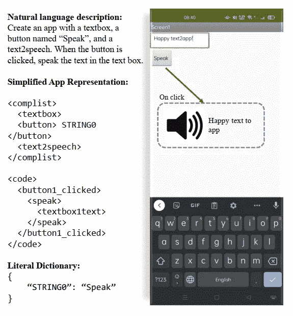

# NLP 密码| 04.25.21

> 原文：<https://pub.towardsai.net/the-nlp-cypher-04-25-21-eec02a889e5e?source=collection_archive---------2----------------------->


圣米迦勒压倒恶魔|拉斐尔

## 自然语言处理每周时事通讯

## 不要让步

在以前的 NLP 密码版本中，我已经表明了我对神秘线索和谜题的渴望，作为 NLP 模型的推理挑战。其基本原理是，如果 NLP 模型可以在需要 n 阶逻辑来解决的任务上接近人类的表现，那么就可以开辟一条新的表现途径，而不仅仅是句法的模式识别(这是 SOTA 语言模型的当前缺陷)。

本周的一篇新论文提供了一个新的数据集，其中充满了神秘的纵横字谜(不要与传统的纵横字谜混淆)线索和使用 T5 模型的基准测试结果。虽然这项研究不会很快对企业中的应用深度学习产生直接影响，但任何使 NLP 模型在这些类型的任务中更接近人类水平的表现的结果都将是人工智能的重要一步。

[论文](https://arxiv.org/pdf/2104.08620.pdf)

[](https://github.com/jsrozner/decrypt) [## jsrozner/decrypt

### 用于解密加密纵横字谜的文件库

github.com](https://github.com/jsrozner/decrypt) 

# 即时调优| NLP 训练的下一个前沿？

如果你训练模型，这是一篇重要的文章。展示了微调的天数是如何计算的，因为快速调优可能是调优大型语言模型的一种更有效的方法。提示调优允许用户使用冻结的模型，并且只调优文本提示(与改变整个模型的模型调优((又名微调))相反)。

这意味着我们不必为每个新的 NLP 任务训练一个新的模型副本！本文展示了如何克服先前涉及快速转向的障碍，使其与传统微调不相上下或具有竞争力。此外，即时调优的简单性有助于防止畴变。🧐

这篇文章让我想起了多任务学习是怎么回事，其中适配器在使用冻结模型时有一种“类似”的方法，并且只有适配器针对每个任务进行了微调(这不是即时调优，但在使用冻结模型以提高效率/灵活性的意义上是类似的)。之后，您可以为各种任务堆叠适配器，并使用冻结模型进行嵌入。在之前的 NLP 密码中，我采访了[适配器中枢](https://adapterhub.ml/)的主要作者 Jonas Pfeiffer。

[链接](https://arxiv.org/pdf/2104.08691.pdf)

# 闪电变压器

PyTorch Lightning 合并了变形金刚库和九头蛇框架。🥶:使用起来相当简单。

以下是电梯间推介:

*   使用 [HuggingFace Transformers](https://github.com/huggingface/transformers) 模型和数据集进行训练，带有 Lightning 自定义回调、记录器、加速器和高性能扩展。
*   无缝内存和速度优化，如 [DeepSpeed ZeRO](https://pytorch-lightning.readthedocs.io/en/latest/multi_gpu.html#deepspeed) 或[fair scale shared Training](https://pytorch-lightning.readthedocs.io/en/latest/multi_gpu.html#sharded-training)，无需更改代码。
*   由 [Hydra](https://hydra.cc/) 支持的强大配置组合——无需接触代码即可轻松更换模型、优化器、调度器和更多配置。
*   用于快速研究和实验的 Transformer 任务抽象——该库从头开始构建，与任务无关，支持几乎没有摩擦地跨所有模态创建 transformer 任务。

**代码**

[](https://github.com/PyTorchLightning/lightning-transformers) [## 手电筒/闪电变压器

### 选项 1:从 PyPI pip 安装 lightning-transformers #而不是:` python train.py...`，和…一起跑

github.com](https://github.com/PyTorchLightning/lightning-transformers) 

**文档**

 [## 雷电变压器.雷电变压器文件

### 闪电变压器提供了一个灵活的界面，培训和微调 SOTA 变压器模型使用…

闪电变压器. readthedocs.io](https://lightning-transformers.readthedocs.io/en/latest/) 

**博客**

[](https://pytorch-lightning.medium.com/training-transformers-at-scale-with-pytorch-lightning-e1cb25f6db29) [## 用 PyTorch Lightning 大规模训练变压器

### 介绍闪电变压器，一个新的图书馆，无缝集成 PyTorch 闪电，拥抱脸…

pytorch-lightning.medium.com](https://pytorch-lightning.medium.com/training-transformers-at-scale-with-pytorch-lightning-e1cb25f6db29) 

# NLP 食谱

关于变压器最新技术的教育论文，比较不同变体的性能和使用案例。

[https://arxiv.org/ftp/arxiv/papers/2104/2104.10640.pdf](https://arxiv.org/ftp/arxiv/papers/2104/2104.10640.pdf)

# 金融中的 NLP


这篇路孚特实验室的博客在路透社的新闻档案中强调了他们对定制预训练版本的 BERT 的思考。

[](https://perspectives.refinitiv.com/ai-digitalization/using-nlp-to-unlock-value-in-financial-services-terminology/) [## NLP:释放金融服务术语的价值|路孚特观点

### 路孚特实验室已经用金融和商业新闻预先训练了一个自然语言处理(NLP)模型，以便它…

perspectives.refinitiv.com](https://perspectives.refinitiv.com/ai-digitalization/using-nlp-to-unlock-value-in-financial-services-terminology/) 

# 人们多久复制粘贴一次堆栈溢出？

他们向我们承诺会飞的汽车，但我们得到的是*“每四个访问堆栈溢出问题的用户中，就有一个在访问页面的五分钟内复制了一些东西。”*

如果你想知道我们在编码方面有多糟糕，看看这个博客吧。

😭😭😭😭

[](https://stackoverflow.blog/2021/04/19/how-often-do-people-actually-copy-and-paste-from-stack-overflow-now-we-know/) [## 人们从堆栈溢出中复制粘贴的频率有多高？现在我们知道了。-堆栈溢出博客

### 他们说每个笑话背后都有一个真理的内核。就我们最近的愚人节玩笑而言，它可能更像是…

stackoverflow.blog](https://stackoverflow.blog/2021/04/19/how-often-do-people-actually-copy-and-paste-from-stack-overflow-now-we-know/) 

# 信息提取库

一个信息检索库，在内部使用基于 Java 的 Terrier IR 平台来支持索引和检索操作。以下是神经排序/密集检索的一些特征:

> BERT(通过 OpenNIR)、T5、ColBERT、ANCE、DeepCT 和 doc2query。

-OpenNIR: [ [Github](https://github.com/Georgetown-IR-Lab/OpenNIR) ] [ [文档](https://opennir.net/)

-py terrier _ ANCE:[[Github](https://github.com/terrierteam/pyterrier_ance)]—密集检索

-py terrier _ ColBERT:[[Github](https://github.com/terrierteam/pyterrier_colbert)]—密集检索和/或神经重新排序

-py terrier _ T5:[[Github](https://github.com/terrierteam/pyterrier_t5)]—神经重排序

-py terrier _ doc 2 query:[[Github](https://github.com/terrierteam/pyterrier_doc2query)]—神经增强索引

-py terrier _ DeepCT:[[Github](https://github.com/terrierteam/pyterrier_deepct)]—神经增强索引

[](https://github.com/terrier-org/pyterrier) [## terrier-org/pyterrier

### PyTerrier 的 Python API 开始使用 py Terrier 最简单的方法是使用我们的 Colab 笔记本——寻找…

github.com](https://github.com/terrier-org/pyterrier) 

# 深度稀疏推理

来自 Neural Magic 的 Mark Kurtz 介绍了 NM 针对稀疏模型的深度稀疏推理机。该引擎希望模型以 ONNX 格式接收，然后通过其引擎在 CPU 上以惊人的速度运行它们。希望 NLP 将很快到来…🤞。(我刚才描述的是视频的结尾，开头是 Nir Shavit 对稀疏性和为什么它很棒的一个很酷的介绍)。

# 人工智能在企业中的采用 2021

奥赖利的调查出来了，有货:

> 我们收到的回复几乎是去年的三倍，推广力度也差不多。更多的人在用 AI 工作。
> 
> 在过去，公司文化一直是人工智能采用的最大障碍。虽然它仍然是一个问题，文化已经下降到第四位。
> 
> 今年，人工智能采用的最大障碍是缺乏技术人员和招聘困难。这种短缺已经预测了好几年了；我们终于看到了。
> 
> 第二大障碍是高质量数据的可用性。这种认识是这个领域正在成长的标志。
> 
> 报告“成熟”实践的应答者的百分比在过去几年中大致相同。鉴于受访者数量的增加，这并不奇怪:我们怀疑许多组织刚刚开始他们的人工智能项目。
> 
> 零售业领域的成熟实践比例最高；教育程度最低。但教育也是“考虑”人工智能的受访者比例最高的领域。
> 
> 相对较少的回答者对数据和模型使用版本控制。对数据和模型进行版本控制的工具仍然不成熟，但它们对于使人工智能结果可重复和可靠来说是至关重要的。

[](https://www.oreilly.com/radar/ai-adoption-in-the-enterprise-2021/) [## 人工智能在企业中的采用 2021

### 在二月的前几周，我们要求我们的数据和人工智能简讯的接收者参与一项关于人工智能的调查…

www.oreilly.com](https://www.oreilly.com/radar/ai-adoption-in-the-enterprise-2021/) 

# 回购密码👨‍💻

## 一组最近发布的回购引起了我们的注意👁

## BEIR |信息检索任务的零射击基准

> 基准测试包括 17 个数据集，9 个不同领域的任务。在零发射设置中评估的 9 个 SOTA 反演模型。

[](https://github.com/UKPLab/beir) [## UKPLab/beir

### BEIR 是一个包含不同 IR 任务的异构基准。它还为…提供了一个通用而简单的框架

github.com](https://github.com/UKPLab/beir) 

[**连接论文**](https://www.connectedpapers.com/main/8faeb5d1b0580e7aa4fbda02ae594252dba88893/arxiv) **📈**

## 电动的

> 适用于生物医学领域的预先训练的特定领域语言模型。它在 BC5CDR 语料库上为命名实体识别设置了最先进的结果，并在第 7 届 BioASQ-factoid 挑战的 5 次运行中的 2 次运行中提供了最佳结果。

 [## GMP Li/electra med

### 生物医学自然语言处理动机的一种新的预训练语言表示模型

github.com](https://github.com/gmpoli/electramed) 

[**连接论文**](https://www.connectedpapers.com/main/1991ea2ec85113cadf38faea840f4b5cf73ae0c7/arxiv) **📈**

## 检索写插槽填充

> 使用 RAG 来改进槽填充任务(即，以[实体，槽，？]，任务要求生成丢失的槽)。这允许自动化知识图的创建。

[](https://github.com/IBM/retrieve-write-slot-filling) [## IBM/检索-写入-槽填充

### 这是我们提交给 T-REx 和 zsRE 任务的 KILT 排行榜代码。它包括训练 DPR 的代码…

github.com](https://github.com/IBM/retrieve-write-slot-filling) 

[**连接论文**](https://www.connectedpapers.com/main/a0517a71d3a29f6a05bdffa1bbe53ac621f77f17/arxiv) **📈**

## 电容器

> 基于 Transformer LMs 的通用预训练架构，用于提高密集优化就绪性。目前支持的架构包括所有采用 BERT 或 RoBERTa 架构的型号。

 [## luyug/冷凝器

### 用于将预训练的变压器编码器 LM 转换为 Condenser 的代码，Condenser 是一种专用于…

github.com](https://github.com/luyug/Condenser) 

[**连接论文**](https://www.connectedpapers.com/main/9bbdcc03d872987eef9165f4a63c3878a5b05189/arxiv) **📈**

## Text2App

> 一个允许用户根据自然语言规范创建功能性 Android 应用程序的框架。*🙈*

[](https://github.com/Masum06/Text2App) [## Masum06/Text2App

### 此时您不能执行该操作。您已使用另一个标签页或窗口登录。您已在另一个选项卡中注销，或者…

github.com](https://github.com/Masum06/Text2App) 

[**连接论文**](https://www.connectedpapers.com/main/b669aac8df4fb450ca0784fbf597d7ce58ff4787/arxiv) **📈**

## 先知网络-X

> ProphetNet 为中文、英文对话、中文对话、多语言和代码生成提供了预训练模型。

[](https://github.com/microsoft/ProphetNet) [## 微软/预言网

### 这个报告提供了在 ProphetNet 上复制实验的代码。本文提出了一种新的预训练算法

github.com](https://github.com/microsoft/ProphetNet) 

[**连接论文**](https://www.connectedpapers.com/main/26e3d58181724f9ef77973ff0f65bac06e499fec/arxiv) **📈**

## LAMPRET:用于文档理解的布局感知多模式预处理

> 一种通用的预训练方法，利用文档的结构和内容，并考虑多媒体内容，如图像，以学习全面的多模态文档表示。

**论文**:[https://arxiv.org/pdf/2104.08405.pdf](https://arxiv.org/pdf/2104.08405.pdf)

[**连接论文**](https://www.connectedpapers.com/main/1a3f12fa1da8f2a871390ffb0c7d95360909d13d/arxiv) **📈**

# 本周数据集:GooAQ🥑:谷歌回答谷歌问题！

## 这是什么？

一个问答数据集，包含从谷歌收集的超过 500 万个问题和 300 万个答案。GOOAQ 问题是使用自动完成功能从 Google 搜索引擎半自动收集的。

## 样品

```
{
  "id": 5009708,
  "question": "carbon dioxide comprises approximately what percentage of tropospheric gases?",
  "short_answer": "04%",
  "answer": "Carbon dioxide comprise approximately . 04% of tropospheric gases.",
  "answer_type": "feat_snip"
}
```

## 它在哪里？

 [## allenai/gooaq

### 这个存储库包含我们最近在长格式问题回答方面的工作所附带的代码/数据。请注意这个数据集…

github.com](https://github.com/allenai/gooaq) 

> 每周日，我们都会对来自世界各地的研究人员的 NLP 新闻和代码进行每周综述。
> 
> *完整报道，关注我们的推特:*[*@ Quantum _ Stat*](http://twitter.com/Quantum_Stat)


[量子统计](https://quantumstat.com/)