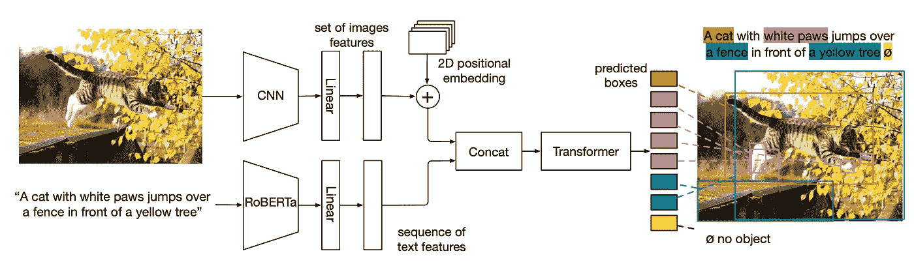

# NLP 密码| 05.02.21

> 原文：<https://pub.towardsai.net/the-nlp-cypher-05-02-21-ebfd55dc8e8a?source=collection_archive---------2----------------------->

当心美丽的女巫|欧玛利

## 自然语言处理每周时事通讯

## NLP 指数

作为一名应用机器学习工程师(又名黑客👨‍💻又名飞行忍者🐱‍👤)，我一直在寻找更好更快的方法来保持在深度学习和软件开发电路的顶端。在比较了研究、代码和应用的各种来源之后。我发现大量出色的 NLP 代码不在 arXiv 上，也不是所有的 NLP 研究都在 GitHub 上。为了获得更广泛的当前 NLP 研究和代码，我创建了 NLP 索引！一个包含超过 3，000 个 NLP 存储库的搜索引擎(每周更新)🔥。该索引包含研究论文、相关论文图表的 ConnectedPapers 链接及其 GitHub repo。

 [## NLP 指数

### 顶级 NLP 代码库- Quantum Stat

index.quantumstat.com](https://index.quantumstat.com/) 

这个平台的目的是让研究人员和黑客快速、全面地获取关于 NLP 的所有信息。不仅仅是来自研究论文，而是来自基于这项研究开发的令人敬畏的应用程序。

由于主题领域之间的相互依赖性，我们已经包括了开放搜索的选项(而不是只提供预定义的类别)。这意味着，有时一篇论文/报告可能同时与“知识图表”和“数据集”有关，很难将主题离散化。我们更喜欢给用户开放的选择，同时搜索所有领域/部门的数据库。为了方便起见，我们还通过侧栏在 NLP 中包含了几十个主题的预定义查询。

索引有几个属性，例如:键入时搜索、允许输入错误和同义词检测。

**同义词检测**

例如，如果您搜索“数据集”，数据库还将同时搜索“语料库”和“语料库”文本，以确保搜索到所有资产。🤟

**错别字容忍度**

如果你搜索“gpt2”，它也会包括“gpt-2”

**一边输入一边搜索**

它会在你输入时实时输出每个字符的结果，只需要几毫秒。(谢谢内存映射🙈)

还想提一下[大坏 NLP 数据库](https://datasets.quantumstat.com/)已经和 NLP 索引合并了！对于 NLP 数据集的最新概要，您可以转到侧边栏的“数据”部分，然后单击数据集或公开搜索特定的数据集/任务。最终，我将关闭 BBND 的 URL，并最终将其重定向到索引。

我要感谢在直播 NLP 指数后的过去一周中我得到的所有支持。感谢 Philip Vollet 与数百个 NLP repos 分享他的数据集。你可以在“未知领域”找到他的帖子。

更多功能即将推出。敬请关注。🙉

# 伯特，解释一下！

发现为什么伯特使用 [SHAP](https://shap.readthedocs.io/en/latest/index.html) (沙普利附加解释)做出推论；一种博弈论方法来解释任何机器学习模型的输出。它利用了变形金刚管道。

 [## ml6 团队/快速提示

### 自从变形金刚模型登上 NLP 的宝座已经有两年多了🏅，但直到最近他们还不知道…

github.com](https://github.com/ml6team/quick-tips/tree/main/nlp/2021_04_22_shap_for_huggingface_transformers?utm_campaign=NLPTip&utm_content=164566347&utm_medium=social&utm_source=twitter&hss_channel=tw-895765746583732225) 

## 本周可乐

 [## 谷歌联合实验室

### 编辑描述

colab.research.google.com](https://colab.research.google.com/github/ml6team/quick-tips/blob/main/nlp/2021_04_22_shap_for_huggingface_transformers/explainable_transformers_using_shap.ipynb) 

# 可解释的人工智能备忘单

包括图片，YouTube 视频，和一些讨论可解释人工智能的论文/书籍的链接。

 [## 可解释的人工智能指南

### 简要概述了可解释的人工智能备忘单和例子。

例如，钉住 io](https://ex.pegg.io/) 

# StyleCLIP 太好玩了！

来自 Max Woolf 关于使用 StyleCLIP(通过 Colab 笔记本)通过文本提示操作头像照片的精彩介绍。你甚至可以添加自己的图片，质量相当不错。例如，看看文本提示后的生成:“使用 NLP 索引后的人脸”👇 😭😭

 [## 使用 StyleCLIP 轻松将人物肖像转换为人工智能像差| Max Woolf 的博客

### 生成性对抗网络 GANs 如今风靡一时，用于创建基于人工智能的图像。你可能已经看过…

minimaxir.com](https://minimaxir.com/2021/04/styleclip/) 

# 软件更新

## 适配器 Hub

新版本包括巴特和 GPT-2 模型🚨

 [## NLP 中用于创成式和 Seq2Seq 模型的适配器

### 适配器在 NLP 的机器学习中变得越来越重要。例如，它们使我们能够高效地…

adapterhub.ml](https://adapterhub.ml/blog/2021/04/adapters-for-generative-and-seq2seq-models-in-nlp/) 

## 贝尔托皮奇

利用 UMAP 的监督选项进行(半)监督主题建模

*   `model.fit(docs, y=target_classes)`

后端:

*   添加了空间、Gensim、使用(TFHub)
*   对文档嵌入和单词嵌入使用不同的后端
*   使用`bertopic.backend.BaseEmbedder`创建您自己的后端
*   点击[此处](https://maartengr.github.io/BERTopic/tutorial/embeddings/embeddings.html)查看所有新后端的概述

计算并可视化每节课的主题

*   算:`topics_per_class = topic_model.topics_per_class(docs, topics, classes)`

视觉化:`topic_model.visualize_topics_per_class(topics_per_class)`

 [## 发布主版本 v0.7 MaartenGr/BERTopic

### 两个主要特性是(半)监督主题建模和几个后端来代替 Flair 和…

github.com](https://github.com/MaartenGr/BERTopic/releases/tag/v0.7.0) 

# 回购密码👨‍💻

## 一组最近发布的回购引起了我们的关注👁

## 针对文本转换器的基于梯度的对抗性攻击

> 一个通用框架，GBDA(基于梯度的分布式攻击)，用于基于梯度的对抗性攻击，并将其应用于文本数据上的变压器模型。

 [## Facebook 研究/文本-敌对-攻击

### 安装 hugging face dependencies conda install-c hugging face transformers pip 安装数据集(可选)攻击…

github.com](https://github.com/facebookresearch/text-adversarial-attack) 

[**连接论文**](https://www.connectedpapers.com/main/59c2b4ef91d4ce23cd4f270c8750a00de9054ec2/arxiv) **📈**

## 简单高效的变压器

> Pytorch 推理插件，用于模型尺寸大、序列长的变形金刚。目前支持 GPT-2 和伯特模型。

 [## 网易-伏羲/EET

### EET(简单有效的变压器)是一个有效的 Pytorch 推理插件，专注于基于变压器的模型，具有…

github.com](https://github.com/NetEase-FuXi/EET) 

[**连接论文**](https://www.connectedpapers.com/main/72d4e7e02070f1f0b88d99bc799a94e56576b79a/arxiv) **📈**

## MDETR:用于端到端多模态理解的调制检测

> MDETR(调制 DETR)的预训练模型的代码和链接，用于对具有对齐文本和带有方框注释的图像的数据进行预训练，以及对需要精细理解图像和文本的任务进行微调。

 [## ashkamath/mdetr

### 该存储库包含 MDETR(调制 DETR)预训练模型的代码和链接，用于数据预训练…

github.com](https://github.com/ashkamath/mdetr) 

[**连接论文**](https://www.connectedpapers.com/main/6a674fc4935441cbb1817f8c0804be29fe8efd72/arxiv) **📈**

## XLM-T——Twitter 的多语言语言模型工具包

> 继续以 XLM-罗伯塔模型为基础，在多种语言的 Twitter 大型语料库上进行预训练。包括 4 台 colab 笔记本电脑。

 [## cardiffnlp/xlm-t

### 这是 XLM-T 知识库，包括 Twitter 的数据、代码和预先训练的多语言模型。作为…

github.com](https://github.com/cardiffnlp/xlm-t) 

[**连接论文**](https://www.connectedpapers.com/main/72d4e7e02070f1f0b88d99bc799a94e56576b79a/arxiv) **📈**

## 弗兰克:真实性评估基准

> 用于摘要系统中真实性的细粒度分析的事实错误的类型。

 [## 阿蒂多罗/弗兰克

### 该存储库包含用于真实性评估指标的弗兰克基准的数据(参见我们的 NAACL 2021 论文…

github.com](https://github.com/artidoro/frank) 

[**连接论文**](https://www.connectedpapers.com/main/7fa846dbfec30f8c92793344b8bf907ee1008c3e/arxiv) **📈**

## 法律文件相似性

> 用于检索语义相关的美国案例法任务的一组最先进的文档表示方法。探索了基于文本(如 fastText、Transformers)、基于引用(如 DeepWalk、Poincaré)和
> 的混合方法。

 [## malteos/法律文档相似性

### 实现，训练模型和结果数据的论文评估文件表示的内容为基础的…

github.com](https://github.com/malteos/legal-document-similarity) 

[**连接论文**](https://www.connectedpapers.com/main/4a219fb004ed1bffdb377040a953bbdf347aac06/arxiv) **📈**

# 本周数据集:Shellcode_IA32👩‍💻

## 这是什么？

Shellcode_IA32 是一个数据集，包含 20 年来各种来源的外壳代码，是迄今为止汇编中最大的外壳代码集合。该数据集由 3，200 个汇编语言指令示例组成，这些指令用于公开发布的安全漏洞中的*IA-32*(x86 英特尔架构的 32 位版本)。数据集用于自动生成 shell 代码(代码生成任务)。收集了用于从 [exploit-db](https://www.exploit-db.com/shellcodes?platform=linux_x86) 和 [shell-storm](http://shell-storm.org/shellcode/) 生成外壳代码的汇编程序。

[**论文**](https://arxiv.org/pdf/2104.13100.pdf)

## 它在哪里？

 [## dessertlab/Shellcode_IA32

### Shellcode_IA32 是一个数据集，由具有挑战性但常见的汇编指令组成，收集自真实的 shellcode…

github.com](https://github.com/dessertlab/Shellcode_IA32) 

> 每周日，我们都会对来自世界各地研究人员的 NLP 新闻和代码进行一次每周综述。
> 
> 如需完整报道，请关注我们的 Twitter: [@Quantum_Stat](http://twitter.com/Quantum_Stat)

[量子统计](https://quantumstat.com/)