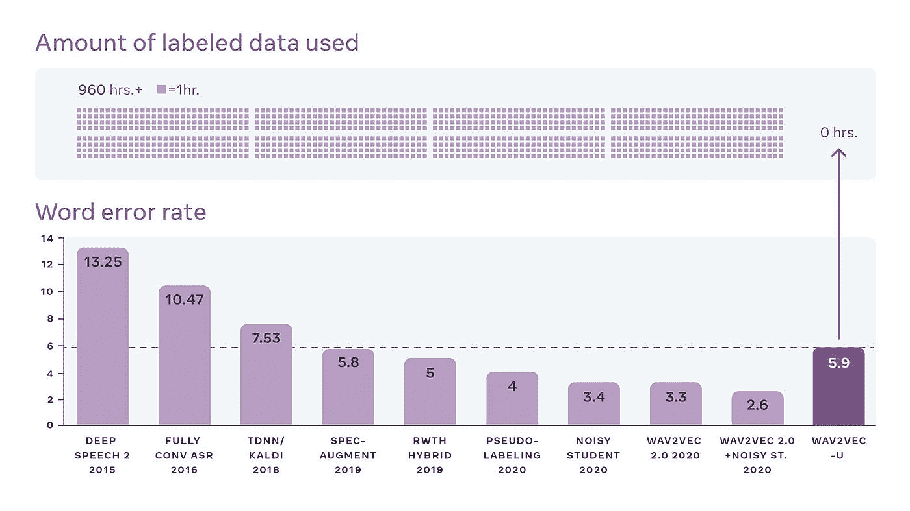

# NLP 密码| 05.23.21

> 原文：<https://pub.towardsai.net/the-nlp-cypher-05-23-21-bd394b0e522b?source=collection_archive---------1----------------------->

蒂莫西·埃伯利在 [Unsplash](https://unsplash.com?utm_source=medium&utm_medium=referral) 上的照片

## 自然语言处理每周时事通讯

## 加时赛

嘿，欢迎回来，又一周过去了，这么多的代码/研究已经发布到野外。

哦，顺便说一句，[NLP 指数](http://index.quantumstat.com)开始了🔥🔥🔥，我要感谢所有的贡献者！

这里有一个令人敬畏的贡献的快速浏览:由萨尔瓦多利马在巴塞罗那为您带来的西班牙医学 NLP 数据集的集合。🙌🙌将在明天之前用这些和其他资产更新 NLP 索引。

**Cantemist** (肿瘤学临床癌症病例文本挖掘):[https://zenodo.org/record/3978041](https://zenodo.org/record/3978041)

**药理学家**(西班牙临床病例报告中的药理物质、化合物和蛋白质)[https://zenodo.org/record/4270158](https://zenodo.org/record/4270158)

**code esp**(编码为 ICD10 的紫丁香和 Ibecs 的摘要)[https://zenodo.org/record/3606662](https://zenodo.org/record/3606662)

**MEDDOCAN** (医疗文件匿名化):[https://zenodo.org/record/4279323](https://zenodo.org/record/4279323)

**MESINESP2** (医学语义标引)[https://zenodo.org/record/4722925](https://zenodo.org/record/4722925)

# Wav2vec-U:无监督语音识别😍

这种新的公平模式不需要抄写来学习讲话。它只需要无人监管的语音记录和文本。他们使用 GAN 来帮助区分音素(语言的声音)。虽然 Wav2vec-U 在 Librispeech 基准测试中没有达到 SOTA，但鉴于它不需要 960 小时的转录语音数据，它仍然获得了很好的分数。👀

**博客**:

 [## wav2vec 无监督:无监督的语音识别

### 为了使语音识别技术适用于全球更多的语言，脸书人工智能发布了…

ai.facebook.com](https://ai.facebook.com/blog/wav2vec-unsupervised-speech-recognition-without-supervision) 

**代码**:

 [## pytorch/fairseq

### Wav2vec Unsupervised (wav2vec-U)是一个用于构建语音识别系统的框架，无需任何标记训练…

github.com](https://github.com/pytorch/fairseq/tree/master/examples/wav2vec/unsupervised?fbclid=IwAR2CHbiyPD9eSyBnqdUivnpWYwUoMJzDlVtJ6wGHrDIiNBitySk4cblbHc4) 

# 极坐标数据帧😁

如果你经常使用数据框，你应该检查一下 Polars。这是一个用 Rust 编写的非常棒的 dataframe 库(包括 Python 绑定)。附带箭头支持及其所有的荣耀，包括拼花文件和 AWS S3 IO 支持。

 [## pola-rs/polars

### Polars 是一个使用 Apache Arrow 作为内存模型在 Rust 中实现的速度惊人的数据帧库。懒惰|渴望…

github.com](https://github.com/pola-rs/polars) 

**文档**:

 [## Polars -用户指南

### 这本书是对 Polars 数据框架库的介绍。它的目标是通过…解释极化器的内部工作原理

pola-rs.github.io](https://pola-rs.github.io/polars-book/user-guide/index.html) 

# 阿姆斯特丹大学|笔记本和教程

阿姆斯特丹大学收集了很多 colab 笔记本，涵盖了 gnn、变形金刚和计算机视觉等多个领域。

**这是他们的 TOC:**

教程 PyTorch 简介

教程 3:激活函数

教程 4:优化和初始化

教程 5:盗梦空间、ResNet 和 DenseNet

教程 6:变形金刚和多头注意力

教程 7:图形神经网络

教程 8:深层能源模型

教程 9:自动编码器

教程 10:对抗性攻击

教程 11:规范化流程

教程 12:自回归图像建模

 [## 欢迎来到弗吉尼亚大学深度学习教程！— UvA DL 笔记本 1.0 版文档

### 对于今年的课程版本，我们制作了一系列 Jupyter 笔记本，旨在帮助您了解…

UVA DLC-notebooks . readthedocs . io](https://uvadlc-notebooks.readthedocs.io/en/latest/index.html) 

# KELM |将维基数据转换成自然语言

谷歌引入了 KELM 数据集，这对于仿真呆子来说是一个巨大的胜利。该数据集是一个转换为自然语言的维基数据知识图，其思想是使用语料库来提高预训练模型中的事实知识！T5 用于该转换。该语料库由大约 1800 万个句子组成，跨越大约 4500 万个三元组和大约 1500 个关系。

 [## KELM:集成知识图和语言模型预训练语料库

### 大型预训练自然语言处理(NLP)模型，如 BERT、RoBERTa、GPT-3、T5 和 REALM，利用…

ai.googleblog.com](https://ai.googleblog.com/2021/05/kelm-integrating-knowledge-graphs-with.html) 

## 谈论知识图表…

 [## 知识图导论

### 知识图(KGs)已经成为组织世界结构化知识的引人注目的抽象概念，并且作为…

ai.stanford.edu](http://ai.stanford.edu/blog/introduction-to-knowledge-graphs/) 

# 禁止垃圾搜索！

 [## 没有垃圾搜索

### 编辑描述

notrashsearch.github.io](https://notrashsearch.github.io/) 

# LabML。人工智能注释 PyTorch 论文

从注释有相应代码的学术论文中学习。如果你想解读研究，这很酷。

 [## labml.ai 注释 PyTorch 论文实现

### 这是神经网络和相关算法的简单 PyTorch 实现的集合。这些实现…

nn.labml.ai](https://nn.labml.ai/index.html) 

# 完全正常的任务

 [## applicai/kleister 慈善机构

### 这个任务的目标是检索慈善地址(但不是其他地址)，慈善号码，慈善名称及其…

github.com](https://github.com/applicaai/kleister-charity) 

# 回购密码👨‍💻

## 一组最近发布的回购引起了我们的注意👁

## 用应用程序衡量编码挑战能力

> 代码生成的基准。

看看 GPT-近地天体的结果与 GPT-2/3 的结果相比，非常有趣。

[论文](https://arxiv.org/pdf/2105.09938.pdf)

 [## 亨德里克斯/应用公司

### 这是由 Dan Hendrycks*、Steven Basart*、Saurav 开发的用于测量编码挑战能力的存储库…

github.com](https://github.com/hendrycks/apps) 

[**连接论文**](https://www.connectedpapers.com/main/252223c48fbdf59f67a7b51ca11fecc3255df1dc/arxiv) **📈**

## 维基百科——自动化数据集创建和联合学习

> 一个 repo，用于从[维基百科传记页面](https://en.wikipedia.org/wiki/Category:Living_people)自动创建数据集，并利用数据集进行基于 BERT 的命名实体识别器的联邦学习。

 [## rat MCU/维基百科

### 这个报告代表了从维基百科传记页面自动创建数据集，并利用数据集…

github.com](https://github.com/ratmcu/wikipiifed) 

[**连接论文**](https://www.connectedpapers.com/main/ec408373db723333046e3f1fa287fcae9108fe33/arxiv) **📈**

## OpenMEVA 基准测试

> OpenMEVA 是评估开放式故事生成的基准。

 [## thu-coai/OpenMEVA

### 供稿:关建，张。感谢嘉信文的调试。OpenMEVA 是评估……

github.com](https://github.com/thu-coai/OpenMEVA) 

[**连接论文**](https://www.connectedpapers.com/main/7ffc1b425026e916cd6db37c79df3e08e8f47ee6/arxiv) **📈**

## 韩国语言理解评估

> KLUE 基准测试由 8 个任务组成:

*   主题分类
*   句子文本相似度
*   自然语言推理(NLI)
*   命名实体识别(NER)
*   关系抽取
*   (词性)+依存句法分析(DP)
*   机器阅读理解
*   对话状态跟踪(DST)

 [## 基准测试/基准测试

### KLUE 的引入是为了提高韩语自然语言处理的水平。韩国预训练语言模型(PLMs)似乎可以解决…

github.com](https://github.com/KLUE-benchmark/KLUE) 

[**连接论文**](https://www.connectedpapers.com/main/7ffc1b425026e916cd6db37c79df3e08e8f47ee6/arxiv) **📈**

## 上下文机器翻译

> 文档级机器翻译的上下文感知模型。还包括 SCAT，一个英语-法语数据集，包含支持 14K 翻译的上下文单词，专业翻译人员发现这对代词消歧很有用。

大多数机器翻译模型都是在句子层次上，所以对于那些希望进入文档层次的人来说，这是一个有趣的回购协议。

 [## neulab/contextual-mt

### 文档级翻译任务的上下文感知模型的实现，用于测量和增加上下文…

github.com](https://github.com/neulab/contextual-mt) 

[**连接论文**](https://www.connectedpapers.com/main/c297172648682c6f977082eb4ce42f6eb83debfa/arxiv) **📈**

# 本周数据集:少数书呆子

## 这是什么？

> little-NERD 是一个大规模、细粒度的人工标注命名实体识别数据集，包含 8 个粗粒度类型、66 个细粒度类型、188200 个句子、491711 个实体和 4601223 个标记。构建了三个基准任务，一个是受监督的:少数书呆子(SUP)，另外两个是少数镜头的:少数书呆子(INTRA)和少数书呆子(INTER)。

## 样本(典型的 NER 格式)

O
1789 O
O
1793 O
O
O
O
a
O
O
O
O
行政杂项法
宪法杂项法
杂项法
加利西亚杂项法
O
小 O
效果 O
。O

## 它在哪里？

 [## thunlp/少呆子

### 这是 ACL-IJCNLP 2021 论文的源代码:少数-呆子:少数拍摄命名实体识别数据集。查看…

github.com](https://github.com/thunlp/Few-NERD) 

> 每周日，我们都会对来自世界各地研究人员的 NLP 新闻和代码进行一次每周综述。
> 
> 如需完整报道，请关注我们的 Twitter: [@Quantum_Stat](http://twitter.com/Quantum_Stat)

[量子统计](https://quantumstat.com/)