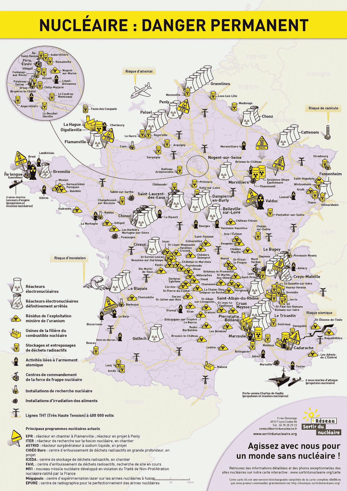
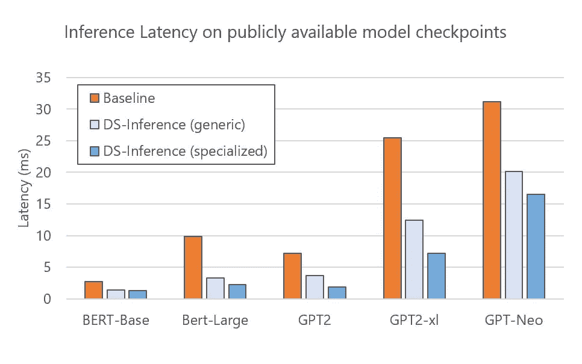
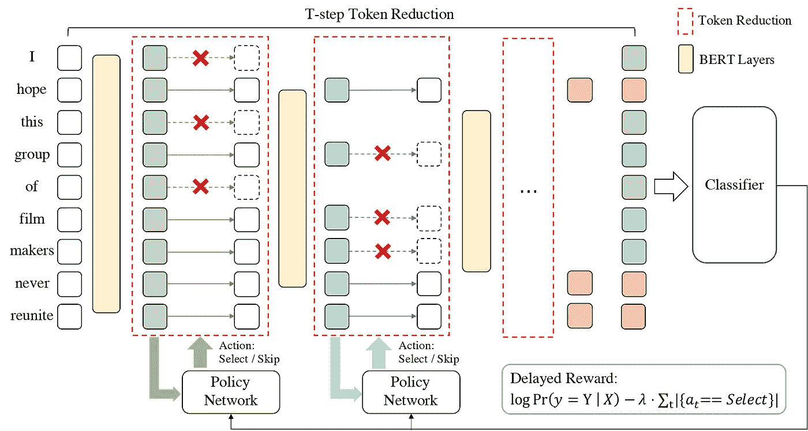

# NLP 密码| 05.30.21

> 原文：<https://pub.towardsai.net/the-nlp-cypher-05-30-21-98118d39f825?source=collection_archive---------1----------------------->

探索火星

## 自然语言处理每周时事通讯

## 真相就在那里

如果你花点时间去搜索，ArXiv 有非常棒的研究。一篇可以追溯到 2015 年的有趣论文探索了法国领土上的 UAP(又名🛸's)活动。是的，没错！根据作者的说法，外星人对原子分裂非常感兴趣。UFO 对核设施的兴趣一直是 UFO 爱好者的信念，他们继续分成两个阵营:阵营 A)外星人想把我们从核毁灭中拯救出来。B)外星人想用我们自己的核武器摧毁我们。希望 ET 能在核辐射之前对 COVID 完全免疫。😁

结论:

> “核活动和 UAP Ds 之间的联系，长期以来一直被怀疑和考虑，现在第一次被测量，并出现惊人的高(p 值:0.00013)。”*-作者*

【https://arxiv.org/pdf/1509.00571.pdf 号

## 什么是适当的 OpSec？🤣

解密的

**如果你喜欢这本书，请帮帮我们👏👏和朋友分享。😎**

# 深度速度和分布式推理

微软的 DeepSpeed 继续为非常非常大的语言模型设计方法。现在他们正在渗透推理领域。随着模型包含数十亿个参数，并且现在推进到万亿个参数范围，分布式推理是一种要求。

> “与现有工作相比，DeepSpeed 推断显示 1.9 到 4.4 倍的延迟加速和 3.4 到 6.2 倍的吞吐量增益和成本降低。”

**博客:**

 [## DeepSpeed:通过系统优化加速大规模模型推理和训练…

### 上个月，DeepSpeed 团队宣布了 ZeRO-Infinity，这是在拥有数十万亿个…

www.microsoft.com](https://www.microsoft.com/en-us/research/blog/deepspeed-accelerating-large-scale-model-inference-and-training-via-system-optimizations-and-compression/) 

这里有一个从变形金刚库加载 GPT-NEO 2.7B 参数模型检查点的教程:

 [## 微软/DeepSpeed

### DeepSpeed-Inference 引入了几个特性来有效地服务于基于 transformer 的 PyTorch 模型。It 支持模型…

github.com](https://github.com/microsoft/DeepSpeed/blob/master/docs/_tutorials/inference-tutorial.md) 

# 朝鲜 GPT-3

GPT 3 号的未来是全球性的。猫已经从袋子里出来了。不要回头。

# 英伟达深度学习示例

这是一个非常棒的 repo，包含了多种方式来训练和部署跨各种形态的模型。示例按深度学习框架、A100 兼容性、Triton 推理服务器支持等进行分解。

 [## 英伟达/深度学习示例

### 这个存储库提供了最先进的深度学习示例，易于培训和部署，实现最佳的学习效果

github.com](https://github.com/NVIDIA/DeepLearningExamples) 

# 文本生成综述

最近的一篇论文评估了整个文本生成的前景，强调了各种任务、架构、输入数据类型、微调策略、输出控制等等。

[论文](https://arxiv.org/pdf/2105.10311.pdf)

# DINO 应用示例💖

我们之前在 Cypher 上讨论过 DINO 项目。DINO 上有一个优雅的博客，用来将 GPT3 等大型语言模型的零知识提炼为更小的模型。本质上，您使用 DINO 来生成数据集，以便由较小的模型进行训练。很棒的教程。

> “在由 GPT2-XL 和 DINO 生成的数据集上训练的所有模型(distilt-RoBERTa base、RoBERTa base 和 RoBERTa large)都优于 zero-shot GPT2-XL(虽然小得多),并且结合提示，甚至表现类似于 GPT3”

 [## 🦕使用大语言模型从零开始生成整个数据集

### 这篇文章讨论了 DINO(来自指令的数据集)如何被用来提取大…

timoschick.com](http://timoschick.com/research/2021/05/19/dino.html) 

# 谷歌及其对搜索的展望

现在 NLP 是如此受欢迎，以至于谷歌需要反思它的搜索方法，看看使用语言模型是否是下一个正确的步骤，特别是在描述搜索结果方面。

[https://arxiv.org/pdf/2105.02274.pdf](https://arxiv.org/pdf/2105.02274.pdf)

# 文本处理库

## TF 文本

 [## 文本|张量流

### TensorFlow 为您提供了丰富的操作和库集合，帮助您处理文本形式的输入，例如…

www.tensorflow.org](https://www.tensorflow.org/text) 

本周最佳实验室**🔥**

 [## 谷歌联合实验室

### 编辑描述

colab.research.google.com](https://colab.research.google.com/github/tensorflow/text/blob/master/docs/guide/bert_preprocessing_guide.ipynb) 

## 文本英雄

 [## Texthero 文本预处理，从零到英雄的表示和可视化。

### 从零到英雄的文本预处理、表示和可视化。

从零到 hero.texthero.org 的文本预处理、表示和可视化](https://texthero.org/) 

## n 借口

 [## 艺术工厂/借口

### 从事一个 NLP 项目，厌倦了总是在网上寻找同样愚蠢的预处理功能？😫需要…

github.com](https://github.com/artefactory/NLPretext/tree/master) 

# NocoDB:开源的 Airtable 替代方案😜

 [## nocodb/nocodb

### 将任何 MySQL、PostgreSQL、SQL Server、SQLite 和 MariaDB 转换成智能电子表格。码头运行-p 8080:8080…

github.com](https://github.com/nocodb/nocodb) 

# 伯克利实验室超级计算机

“超级计算机利用 6159 个英伟达 A100 图形处理器”🥶🥶

 [## 伯克利实验室首次推出世界上最快的人工智能超级计算机 Perlmutter

### 由蒂芙尼交易员剪彩仪式举行虚拟伯克利实验室的国家能源研究科学…

www.hpcwire.com](https://www.hpcwire.com/2021/05/27/nersc-debuts-perlmutter-worlds-fastest-ai-supercomputer/) 

# 回购密码👨‍💻

## 一组最近发布的回购引起了我们的关注👁

## [通过语义一致性改进视觉故事的生成和评估](https://arxiv.org/pdf/2105.10026.pdf)

> 一个探索故事可视化任务的报告，其中一个人获取文本并从文本中创建图像。

从他们的论文中摘录的稿件:

1.  “对于故事可视化任务，我们通过视频重新描述引入双重学习，提高了生成的图像与输入故事的语义一致性。”
2.  "我们通过在 GAN 框架中引入复制转换机制，实现了顺序一致的故事可视化."
3.  “我们通过添加内存增强递归变压器来增强故事可视化中的现有建模技术，允许模型学习图像帧之间更复杂的交互。”
4.  “我们提出了一组不同的自动评估指标，这些指标捕捉了任务的重要方面，并将为该领域的未来工作提供见解。我们还将这些指标与人工评估进行相关性实验。”

 [## adymaharana/StoryViz

### NAACL 2021 论文“通过语义一致性改进视觉故事的生成和评估”的 PyTorch 代码…

github.com](https://github.com/adymaharana/StoryViz) 

[**连接论文**](https://www.connectedpapers.com/main/87a0279c1d640b486dc5c9f1e0d3705ed87754cf/arxiv) **📈**

## [TR-BERT](https://arxiv.org/pdf/2105.11618.pdf)

> 一种通过在标记级粒度上修剪 BERT 来加速 BERT 推理的方法。在 11 个 NLP 任务上的实验证明了 TR-BERT 的有效性，因为它将 BERT 推理的速度提高了 2-5 倍。

 [## thunlp/TR-BERT

### “TR-BERT:用于加速 BERT 推理的动态记号简化”的源代码和数据集。该代码基于…

github.com](https://github.com/thunlp/TR-BERT) 

[**连接论文**](https://www.connectedpapers.com/main/6da4b231148bf26677233d1f778d08a5d26f4313/arxiv) **📈**

## [使用语言模型进行真正的少量学习](https://arxiv.org/pdf/2105.11447.pdf)

 [## ethanjperez/true _ 少数 _ 拍摄

### 该代码库支持使用语言模型(LMs)进行真正的少量学习:学习使用语言模型执行任务

github.com](https://github.com/ethanjperez/true_few_shot) 

[**连接论文**](https://www.connectedpapers.com/main/b58d8579ece27a60432e667bfbdb750590fa65d9/arxiv) **📈**

# 基于异构图神经网络的跨语言文本分类

> 使用图卷积网络的跨语言文本分类(GCN)

 [## 腾讯游戏伴侣/gnn _ cross _ language

### 我们的 ACL-2021 论文的源代码:使用异构图神经网络的跨语言文本分类。我们使用…

github.com](https://github.com/TencentGameMate/gnn_cross_lingual) 

[**连接论文**](https://www.connectedpapers.com/main/413c6974ee908c4f54ed1970ce554db133c4a63d/arxiv) **📈**

# 交易事件

> 利用全球和本地信息识别公司事件的双层事件检测模型。此外，还发布了一个 EDT 数据集。

 [## Zhihan1996/TradeTheEvent

### 本知识库正式实现了以下论文:周，马立前，。“交易……

github.com](https://github.com/Zhihan1996/TradeTheEvent) 

[**连接论文**](https://www.connectedpapers.com/main/413c6974ee908c4f54ed1970ce554db133c4a63d/arxiv) **📈**

## [DaN+ (DaNplus):丹麦语嵌套命名实体和词法规范化](https://arxiv.org/pdf/2105.11301.pdf)

> DaN+包含嵌套的命名实体，在丹麦语中有 4 个主要实体类型(ORG、PER、LOC、MISC)和 2 个子类型(-part 和-deriv)的 2 级注释。

 [## bplank/DaNplus

### 这个库包含由…编写的论文嵌套 NER 和丹麦语词汇规范化(DaN+)的代码和数据

github.com](https://github.com/bplank/DaNplus) 

[**连接论文**](https://www.connectedpapers.com/main/41fd7165dfe05bdd89e33a8c4fd588d9d9bd5648/arxiv) **📈**

# 本周数据集:香草:大规模自然语言的动词化答案

## 这是什么？

数据集由 100k+个简单问题组成，改编自 CSQA 和 SimpleQuestionsWikidata 数据集。这是在知识图上的问题回答，其中通过使用问题的上下文来产生动词化的回答句子，以鼓励类似人类的回答。

## 样品

question_id:数据集实例的唯一标识号，
question: question，
answer: retrieved answer，
answer_sentence:自然语言的动词化答案

示例:

{

“答案”:“克罗地亚环球小姐”，

"法国联盟是克罗地亚的一个社会团体。",

"问题":"哪个社会团体的总部设在克罗地亚？",

"问题 _ 实体 _ 标签":"克罗地亚"，

"问题 _id":62937，"问题 _ 关系":" P159 "

}

## 它在哪里？

 [## AskNowQA/香草

### 在过去的几年里，基于知识图的问答领域有了很大的发展…

github.com](https://github.com/AskNowQA/VANiLLa) 

> 每周日，我们都会对来自世界各地研究人员的 NLP 新闻和代码进行一次每周综述。
> 
> 如需完整报道，请关注我们的 Twitter: [@Quantum_Stat](http://twitter.com/Quantum_Stat)

[量子统计](https://quantumstat.com/)