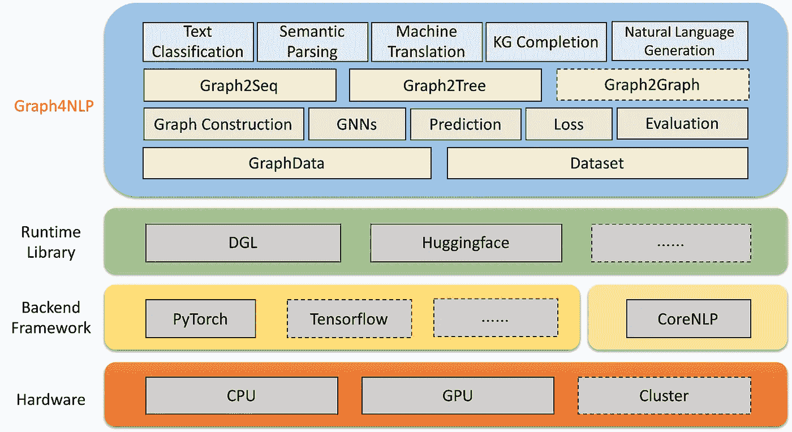
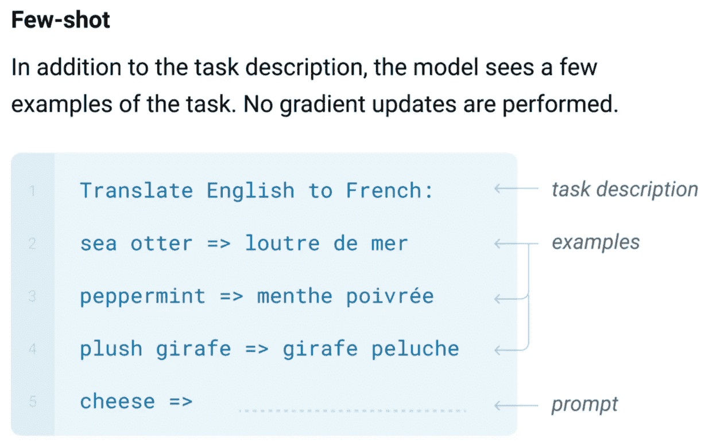
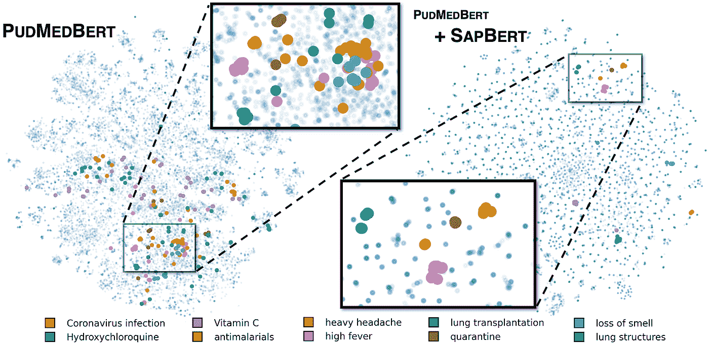
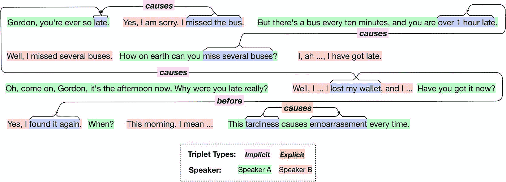
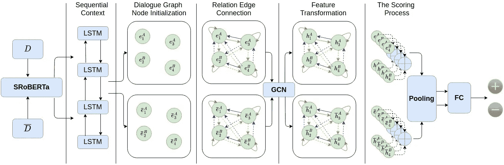
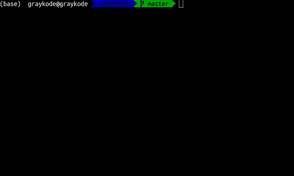
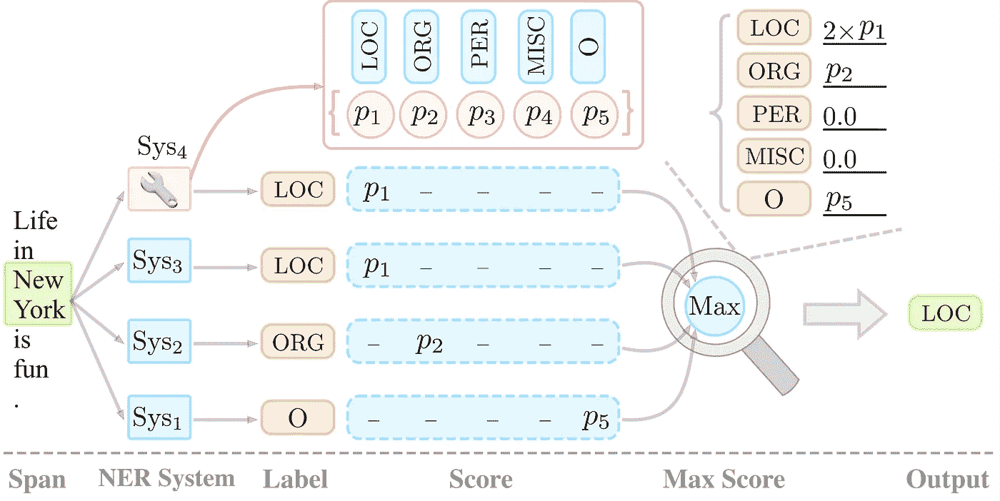
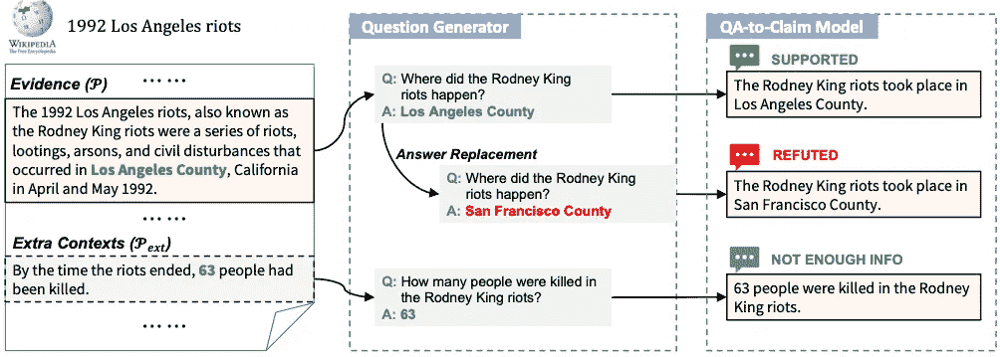
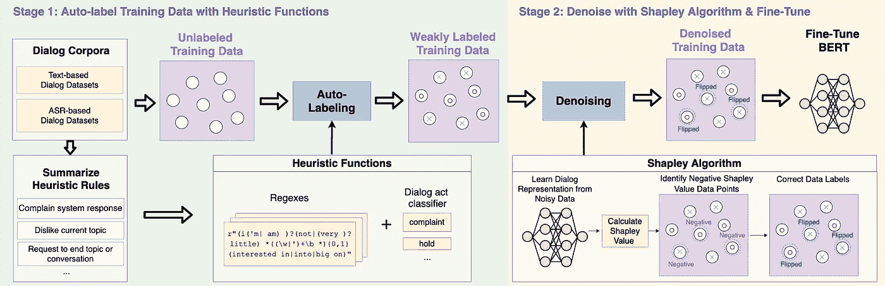
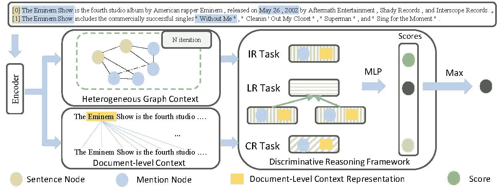

# NLP 密码| 06.06.21

> 原文：<https://pub.towardsai.net/the-nlp-cypher-06-06-21-27b7b0de02f4?source=collection_archive---------3----------------------->

基督的洗礼(又名天空中有一个巨大的不明飞行物)|盖尔德(1710)

## 自然语言处理每周时事通讯

## 三位一体

欢迎回到模拟✌。因此，ACL 2021 数据转储发生了，现在我们有一个庞大的回购列表要在本周的回购密码中通过。😁

此外，我们将很快更新 NLP 索引，增加 100 多个新的回购(这里提到了其中的许多)，以及 30 多个像这样的新 NLP 笔记本👇。如果您想获得未来新闻简报和资产更新的电子邮件提醒，您可以在此 **注册 [**。**](https://index.quantumstat.com/)**

谢谢尼尔斯·罗格

所以让我们从即将到来的精彩开始。听说过 Graph4NLP 库吗？？？如果你想在你的 NLP 任务中利用图形神经网络(GNNs ),你可能想看看它们(它们还在测试阶段)。它运行在 DeepGraphLibrary 之上。此外，他们有一个了不起的论文集，内容涉及一切深度学习+图形+ NLP👇。

[https://github.com/graph4ai/graph4nlp_literature](https://github.com/graph4ai/graph4nlp_literature)

解密的

 [## graph4ai/graph4nlp

### Graph4NLP 是一个易于使用的库，面向 R&D，位于图形和自然语言深度学习的交叉点…

github.com](https://github.com/graph4ai/graph4nlp) 

## 但是等等，我们需要一个模拟内脏检查

哦…仅供参考。根据五角大楼的消息来源，不能排除外星人是美国所有空中现象(约 120 起事件)的原因。《纽约时报》获得了 DNI(国家情报总监)即将发布的不明飞行物报告的内幕消息。底线是，没有人知道发生了什么，可能是外星人。你可以在这里阅读全文:

> [美国在飞行物中没有发现外星技术的证据，但也不能排除这种可能性](https://www.nytimes.com/2021/06/03/us/politics/ufos-sighting-alien-spacecraft-pentagon.html)

如果你想做自己的调查工作，联邦航空局有一个无人驾驶飞机目击的数据库。有些涉及军事遭遇战。🤷‍♂️

 [## 联邦航空局的数据显示，在敏感的…

### 除了沿海事件之外，在…的一个集中区域报告了一系列完全独立的事件

www.thedrive.com](https://www.thedrive.com/the-war-zone/40904/faa-data-shows-strange-pattern-of-military-encounters-with-unidentified-aircraft-in-sensitive-airspace) 

**数据**:

 [## UAS 目击报告

### 来自飞行员、市民和执法部门的无人驾驶飞机(UAS)目击报告急剧增加…

www.faa.gov](https://www.faa.gov/uas/resources/public_records/uas_sightings_report/) 

所以…

结束介绍:我想欢迎大家来到辉煌的 2021 年的中间点💖💖。埃隆运行 crypto 的一年，外星人是真实存在的，每个人都戴着面具。👍

现在…我们赞助商的一句话:

😂😂😂

**重要注意事项**:埃隆·马斯克的加密帖子太火了，以至于引起了黑客组织“匿名”的注意。我猜他们对埃隆撼动加密市场的推文不太感兴趣。结果，他们决定一见到他就检查他。🥶🥶

# Tokenizers 去拜拜:ByT5 模型

不需要介绍:谷歌已经在回购中给出了一个:

> “ByT5 是 [mT5 模型](https://arxiv.org/abs/2010.11934)的无**标记器**扩展。我们的 ByT5 模型不像大多数其他预训练语言模型(伯特、XLM-R、T5、GPT-3)那样使用子词词汇表，而是直接在 UTF-8 字节上操作，消除了任何文本预处理的需要。除了系统复杂性的降低，我们发现参数匹配的 ByT5 模型在一系列任务上与 mT5 具有竞争力，并且在涉及噪声文本或对拼写和发音敏感的任务上优于 mT5。这份报告可用于重现 [ByT5 论文](https://arxiv.org/abs/2105.13626)中的实验。

 [## 谷歌研究/字节 5

### ByT5 是 mT5 模型的无标记扩展。不像大多数其他预训练的那样使用子词词汇表…

github.com](https://github.com/google-research/byt5) 

…已经合并到《变形金刚》中:

# 二进制段落检索器

推出卢克模型的人在推特上扔了 ACL 炸弹。他们减小了密集通道检索器(DPR)模型的 mem 尺寸，而没有损失 QA 准确性。✌

*“与 DPR 相比，BPR 将内存成本从 65GB 大幅降低到 2GB，同时在两个标准开放领域问答基准上没有损失准确性:Natural Questions 和 TriviaQA。”*🔥🔥

 [## studio-ousia/bpr

### 二进制段落检索器(BPR)是一种用于开放领域问答的有效的神经检索模型。业务流程重组…

github.com](https://github.com/studio-ousia/bpr) 

# 好的，坏的和神秘的:GPT 3

在一个多尺度的范例中，一个尺度上数量的变化就是另一个尺度上质量的变化。

史丹福决定调查 GPT 三号的少数学习突现现象。警告幂律即将到来…

 [## 用 GPT-3 的语境学习外推非自然语言处理:好的，坏的…

### 2020 年年中，OpenAI 发布了他们最新一代大规模语言 GPT-31 的论文和商业 API

ai.stanford.edu](https://ai.stanford.edu/blog/in-context-learning/) 

# 点:双变压器模型

Google 有一个使用转换器解析表格数据的新架构。

> DoT 是一个双转换器模型，它将问题分解为两个子任务:一个选择前 K 个令牌的浅层修剪转换器，后面是一个将这 K 个令牌作为输入的特定于任务的深层转换器

[论文](https://arxiv.org/pdf/2106.00479.pdf)

# 回购密码👨‍💻

## 一组最近发布的回购引起了我们的注意👁

## [SemEval2021 抽象意义的阅读理解](https://arxiv.org/pdf/2105.14879.pdf)

> 任务被设计来帮助评估机器在表示和理解抽象概念方面的能力。多项选择数据集。

 [## 阅读-抽象意义的理解

### 这是 SemEval 2021 任务 4:抽象意义的阅读理解的知识库。它包括以下代码…

github.com](https://github.com/boyuanzheng010/SemEval2021-Reading-Comprehension-of-Abstract-Meaning) 

[**连接论文**](https://www.connectedpapers.com/main/0fa6fa53d0725442a271b8e8b28c15e006bc9308/arxiv) **📈**

## [新闻文本中的定向情感分析](https://arxiv.org/pdf/2106.01033.pdf)

> 用于提取新闻文本中政治实体之间情感关系的数据集和代码。

 [## 关键词/定向 _ 情感 _ 分析

### 这个知识库为提取新闻中政治实体之间的情感关系提供了一个数据集和代码…

github.com](https://github.com/bywords/directed_sentiment_analysis) 

[**连接论文**](https://www.connectedpapers.com/main/2e127866f09a3ad6abedbe7e44b5aa622b5a9590/arxiv) **📈**

## [萨伯特:用于伯特的自对准预训练](https://arxiv.org/pdf/2105.14398.pdf)

> 介绍了一种新的跨语言生物医学实体任务(XL-BEL)，为生物医学领域中 10 种语言的跨语言实体表示建立了广泛覆盖和可靠的评估基准。

 [## 剑桥/萨伯特

### 该报告包含代码、数据和预训练权重，用于(1)我们在 NAACL 2021 论文中提出的萨伯特模型…

github.com](https://github.com/cambridgeltl/sapbert) 

[**连接论文**](https://www.connectedpapers.com/main/0e2dd43d4487f9707eba1482a593293a5934a59e/arxiv) **📈**

## [苹果酒:用于对话解释和推理的常识推理](https://arxiv.org/pdf/2106.00510.pdf)

> CIDER 一个手动管理的数据集，包含使用上下文常识推理推断的隐式和显式知识三元组形式的二元对话解释。

 [## 申报-实验室/苹果酒

### 这个存储库包含来自论文《苹果酒:常识》的模型的数据集和 pytorch 实现

github.com](https://github.com/declare-lab/CIDER) 

[**连接论文**](https://www.connectedpapers.com/main/6f9e3c6d472a3e3b596238ebbdff8d9751f6b9cb/arxiv) **📈**

## [基于变压器的文本分类器:简单但可识别](https://arxiv.org/pdf/2106.01269.pdf)

> 用于观察注意力权重的可识别性的源代码。

 [## 申报-实验室/可识别-变压器

### 这个库有助于:有人正在寻找一个快速的基于转换器的低计算预算分类器…

github.com](https://github.com/declare-lab/identifiable-transformers) 

[**连接论文**](https://www.connectedpapers.com/main/e67369b9aaeebee93c48d244e31aab436b9fb066/arxiv) **📈**

## [DynaEval](https://arxiv.org/pdf/2106.01112.pdf)

> DynaEval 为开放领域对话中的话轮和对话级别评估提供了一个统一的框架。

 [## e0397123/DynaEval

### conda env create-f environment . yml conda activate gcn 处理过的数据集可在以下位置找到…

github.com](https://github.com/e0397123/DynaEval) 

[**连接论文**](https://www.connectedpapers.com/main/2bb4236a5dd8d6121dd6cde9f5168a299917bea7/arxiv) **📈**

## [NeuralLog:具有联合神经和逻辑推理的自然语言推理](https://arxiv.org/pdf/2105.14167.pdf)

> 一个符号和神经推理系统，可以提高 NLI 任务的准确性，并可以在 SICK 和 MED 数据集上实现最先进的准确性。

 [## eric11eca/NeuralLog

### 基于深度学习(DL)的语言模型在自然语言推理的各种基准上取得了高性能…

github.com](https://github.com/eric11eca/NeuralLog) 

[**连接论文**](https://www.connectedpapers.com/main/3def5b60d6cd9efe8ede335b9b2d3fe05971f7e0/arxiv) **📈**

## [用于多语言语音翻译的轻型适配器调谐](https://arxiv.org/pdf/2106.01463.pdf)

 [## formiel/fairseq

### 这是论文《用于多语言语音翻译的轻量级适配器调优》( ACL-IJCNLP 2021)的代码库…

github.com](https://github.com/formiel/fairseq/blob/master/examples/speech_to_text/docs/adapters.md) 

[**连接论文**](https://www.connectedpapers.com/main/7a0c715fcc8d8fc4d6c1a08c3170b04e8ff1505d/arxiv) **📈**

## [提交自动建议](https://arxiv.org/pdf/2105.14242.pdf)

> 使用 CodeBERT，新的`[patch_type_embeddings](https://github.com/graykode/commit-autosuggestions/blob/master/commit/model/diff_roberta.py#L40)`被引入，可以区分添加和删除的代码。

 [## 自我暗示

### 你是否曾经犹豫过要不要写一条提交消息？现在从人工智能获得提交消息！科德伯特:一个……

github.com](https://github.com/graykode/commit-autosuggestions) 

[**连接论文**](https://www.connectedpapers.com/main/0eb11495a21c0635c84cb8ce3764624ffa5d8214/arxiv) **📈**

## MPC-BERT:一个预先训练好的用于多方对话理解的语言模型

> MPC-BERT，一个用于多方对话(MPC)理解的预训练模型，它考虑在一个统一的模型中学习谁对谁说什么，该模型具有几个精心设计的自我监督任务。

 [## 杰森·福尔乔伊/伯特

### 这个库包含 ACL 2021 论文 MPC-BERT 的源代码:一个预先训练的多方语言模型…

github.com](https://github.com/JasonForJoy/MPC-BERT) 

[**连接论文**](https://www.connectedpapers.com/main/51b9f8aef39de4b6db820b5c4b5bca14fc32aa4d/arxiv) **📈**

## 🦦 [水獭:开放领域对话的一轮话题转换](https://arxiv.org/pdf/2105.13710.pdf)

> 人类一轮话题转换的新数据集。

 [## 卡琳塞韦/水獭

### 数据分析脚本即将推出！你可以下载已经分成域内和域外两部分的数据…

github.com](https://github.com/karinseve/OTTers) 

[**连接论文**](https://www.connectedpapers.com/main/61be0c4cf65855fc5d79ea0e3996108464bf1aec/arxiv) **📈**

## 🌳[在野外对微调过的语言模型进行指纹识别](https://arxiv.org/pdf/2106.01703.pdf)

> 为证明语言模型中现有指纹方法的局限性而进行的实验。

 [## LCS2-IIITD/ACL-FFLM

### 这是我们在野外的 ACL 2021(调查结果)论文指纹微调语言模型的代码和数据集…

github.com](https://github.com/LCS2-IIITD/ACL-FFLM) 

[**连接论文**](https://www.connectedpapers.com/main/a66ab2feae147f4ec59203019d51525ab5f0a92b/arxiv) **📈**

## [扳手:命名实体重新/识别为跨度预测](https://arxiv.org/pdf/2106.00641.pdf)

 [## 神经实验室/扳手

### 跨度预测模型的两个作用(蓝色方框):作为一个基本 NER 系统，作为一个系统组合器。此存储库…

github.com](https://github.com/neulab/spanner) 

[**连接论文**](https://www.connectedpapers.com/main/b0fe761fc16a37232e77e45877dbab18494e4ade/arxiv) **📈**

## [COM2SENSE:带有互补语句的常识推理基准](https://arxiv.org/pdf/2106.00969.pdf)

> 一个新的常识推理基准数据集，包含自然语言真/假语句，每个样本都与其互补的对应物配对，从而产生 4k 个句子对。

 [## PlusLabNLP/Com2Sense

### 常识数据集构建项目的模型请从 Google-drive 下载模型权重，并放置…

github.com](https://github.com/PlusLabNLP/Com2Sense) 

## [千分表](https://arxiv.org/pdf/2106.00920.pdf)

> 将可解释的策略图网络纳入谈判对话。

 [## rishabhjoshi/dialogram _ iclr 21

### 代码、数据、演示即将推出！！如果您在工作中使用此代码，请引用以下论文。@inproceedings{…

github.com](https://github.com/rishabhjoshi/DialoGraph_ICLR21) 

## [带草图监督的可控抽象对话摘要](https://arxiv.org/pdf/2105.14064.pdf)

 [## salesforce/ConvSumm

### 钱*、刘林青*、刘文豪、庞都斯·斯滕托普、熊如果使用代码或…

github.com](https://github.com/salesforce/ConvSumm/tree/master/CODS) 

[**连接论文**](https://www.connectedpapers.com/main/95085501ff72c296b2df3f12969e0f8a57c224fd/arxiv) **📈**

## [通过索赔生成验证零枪击事实](https://arxiv.org/pdf/2105.14682.pdf)

 [## 教师彼得潘/零炮事实验证

### 如果您在研究过程中使用该数据集，请以下列格式引用论文。

github.com](https://github.com/teacherpeterpan/Zero-shot-Fact-Verification) 

[**连接论文**](https://www.connectedpapers.com/main/25c9dbcad66fedec76a8941db46bda2e9bd8f698/arxiv) **📈**

## [TransQuest:使用跨语言转换器进行翻译质量评估](https://arxiv.org/pdf/2106.00143.pdf)

 [## TharinduDR/TransQuest

### 质量评估(QE)的目标是在没有参考文献的情况下评估翻译质量

github.com](https://github.com/tharindudr/transQuest) 

[**连接论文**](https://www.connectedpapers.com/main/d6218ce8a829c705678884d77ad791753755175e/arxiv) **📈**

## 举例来说

> 这项工作通过利用文档上下文的补充来源:引用和被引用论文之间的引用链接的引用图来增强文本表示。这用于科学论文中的信息提取。

 [## viswavi/CitationIE

### 这个存储库有两个目的:提供将 SciREX 数据集与 S2ORC 引用图连接起来的工具。

github.com](https://github.com/viswavi/CitationIE) 

[**连接论文**](https://www.connectedpapers.com/main/21c9c624bc328686cef4bb1f80a786a5027d8886/arxiv) **📈**

## HERALD:一种在对话中训练用户参与预测器的有效标注方法

> HERALD 是一个高效的注释框架，它将训练数据注释过程重新定义为一个去噪问题。

 [## 梁伟新/先驱报

### 本报告提供了我们论文的 PyTorch 源代码:HERALD:一种训练用户的有效注释方法…

github.com](https://github.com/Weixin-Liang/HERALD) 

[**连接论文**](https://www.connectedpapers.com/main/e6a7f3344685cde0acfc2a6be13242c0c441eb05/arxiv) **📈**

## [文档级关系提取的判别推理](https://arxiv.org/pdf/2106.01562.pdf)

> 这种新方法在大规模 DocRE 数据集上的性能优于以前的最先进的性能。

 [## xwjim/DRN

### ACL 2021 研究论文的 PyTorch 实现:文档级关系提取的判别推理…

github.com](https://github.com/xwjim/DRN) 

[**连接论文**](https://www.connectedpapers.com/main/b91157bd86212b565fa74229c9035db95560ae1a/arxiv) **📈**

## [对话摘要:对话摘要基准](https://arxiv.org/pdf/2106.00829.pdf)

> 总共四个数据集，用于评估模型在各种对话数据上的性能。这是为了总结。

 [## 耶鲁百合/康索姆大学

### ACL 2021 论文会议摘要的数据、代码和模型检查点:对话摘要基准和改进…

github.com](https://github.com/Yale-LILY/ConvoSumm) 

[**连接论文**](https://www.connectedpapers.com/main/fa51076458b7bcf9a60f476d525755e47199a6d8/arxiv) **📈**

## [OntoGUM:在另外 12 种体裁上评估语境化的 SOTA 共指消解](https://arxiv.org/pdf/2106.00933.pdf)

> 一个与 OntoNotes 一致的数据集，有 168 个文档(∼150K 个标记，19，378 个提及，4，471 个 coref 链)，12 个体裁，包括对话体裁。

 [## 依轮珠/本体胶

### 这个存储库包含构建 OntoGUM 数据集的代码，来自:Python >= 3.6 从…下载 GUM

github.com](https://github.com/yilunzhu/ontogum) 

[**连接论文**](https://www.connectedpapers.com/main/037adc1f49e42b681a482c181df46bab054944ff/arxiv) **📈**

## [基于注意力的上下文语言建模适应](https://arxiv.org/pdf/2106.01451.pdf)

 [## 亚马逊-研究/上下文-注意力-自然语言模型

### 这个项目提供了源，以复制论文“基于注意力的上下文语言模型…

github.com](https://github.com/amazon-research/contextual-attention-nlm) 

[**连接论文**](https://www.connectedpapers.com/main/7597deda4ff66e8aa068b7f4da993fd6c2e8b4c6/arxiv) **📈**

## [MedNLI 不免疫:临床领域的自然语言推理工件](https://arxiv.org/pdf/2106.01491.pdf)

 [## crherlihy/clinical _ nli _ artifacts

### 这个存储库包含了重现“MedNLI 不是……”一文中的分析所需的源代码

github.com](https://github.com/crherlihy/clinical_nli_artifacts) 

[**连接论文**](https://www.connectedpapers.com/main/b9c0d572402d38976d4bf99c78f4cc65e6d8f1e4/arxiv) **📈**

# 本周数据集:CoDesc

## 这是什么？

由 420 万 Java 源代码和并行数据组成的数据集，这些并行数据来自代码搜索和代码摘要研究。

## 它在哪里？

 [## csebuetnlp/codec

### 这是我们题为“CoDesc:大型代码描述并行数据集”的论文的代码和数据的公开发布…

github.com](https://github.com/csebuetnlp/CoDesc) 

> 每周日，我们都会对来自世界各地研究人员的 NLP 新闻和代码进行一次每周综述。
> 
> 如需完整报道，请关注我们的 Twitter: [@Quantum_Stat](http://twitter.com/Quantum_Stat)

[量子统计](https://quantumstat.com/)