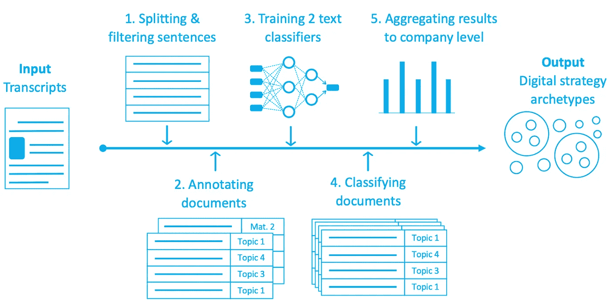

# NLP 密码| 11.01.20

> 原文：<https://pub.towardsai.net/the-nlp-cypher-11-01-20-d1cd877b46c7?source=collection_archive---------2----------------------->

## 自然语言处理每周时事通讯

## 最后的圣战

在过去的一周，GitHub 上广受欢迎的 [youtube-dl repo](https://github.com/ytdl-org/youtube-dl/) 被来自美国唱片工业协会(RIAA)的 DMCA 通知(又名“拿下这个，否则我们将起诉你”)取消，引起了一场大规模的大规模解体。如果你不在圈内，这个回购包含了一个巨大的下载 YouTube 视频(和其他东西)的宝库，开源社区的许多开发人员都很喜欢。

**辐射尘:**

 [## github/dmca

### 存储库，包含收到的 DMCA 撤下通知的文本。GitHub 不认可或采用任何包含在…

github.com](https://github.com/github/dmca/blob/master/2020/10/2020-10-23-RIAA.md) 

自从发布撤下通知后，黑客们疯狂地在网上镜像了无数的“youtube.dl”转发(史翠珊效应)。他们甚至使用隐写术在图片源代码中嵌入视频😭😭😭。(安全工程师兰斯·维克在[推特](https://twitter.com/lrvick)上发飙，他的帖子堪称传奇。)

他还提到，有人在总结 GitHub 所有 DMCA 下架通知的官方回购协议上附加了 youtube-dl 源代码。😭😭

*与此同时，回到牧场…* 😎

很高兴宣布对[大坏 NLP 数据库](https://datasets.quantumstat.com/)的重大更新。我们添加了脸书研究公司几天前刚刚发布的 CommonCrawl 100 (2.5TB 的干净数据，用于预训练分成单语数据集的语言模型)。

> 仅供参考，CC-100 是他们用来训练他们的 XLM-R 模型。

我们认为这是一个极好的机会，因为它有各种不同的语言，所以我们决定增加整个系列，总共 116 种！😎

哦，和往常一样，如果你喜欢这篇文章，请在媒体上关注我们，或者在我们的主页上注册电子邮件版本。👏👏

# 回购密码

一组最近发布的回购引起了我们的注意(👨‍💻)

**TPLinker:通过令牌对链接单级联合提取实体和关系**

> TPLinker 是一个处理关系重叠和嵌套实体问题的联合提取模型，不受暴露偏差的影响，并在 NYT 和 WebNLG 数据集上实现了 SOTA 性能！

 [## 131250208/TPlinker-joint-extraction

### TPLinker 是一个处理关系重叠和嵌套实体问题的联合抽取模型，不受

github.com](https://github.com/131250208/TPlinker-joint-extraction) 

**TweetEval:推文分类的统一基准和对比评估**

> 多类推文分类的主要步骤。一个包含七个任务的基准！以下是任务及其类别标签:

*   情感识别: [SemEval 2018(情感识别)](https://www.aclweb.org/anthology/S18-1001/) — 4 个标签:`anger`、`joy`、`sadness`、`optimism`
*   表情符号预测， [SemEval 2018(表情符号预测)](https://www.aclweb.org/anthology/S18-1003.pdf) — 20 标签:❤️、😍,😂`...`🌲,📷,😜
*   反语检测， [SemEval 2018(反语检测)](https://www.aclweb.org/anthology/S18-1005.pdf) — 2 个标签:`irony`，`not irony`
*   仇恨言论检测，[seme val 2019(hat eval)](https://www.aclweb.org/anthology/S19-2007.pdf)—2 个标签:`hateful`，`not hateful`
*   攻击性语言识别，[seme val 2019(offen seval)](https://www.aclweb.org/anthology/S19-2010/)—2 个标签:`offensive`，`not offensive`
*   情感分析，[seme val 2017(Twitter 中的情感分析)](https://www.aclweb.org/anthology/S17-2088/) — 3 个标签:`positive`、`neutral`、`negative`
*   姿态检测*， [SemEval 2016(检测推文中的姿态)](https://www.aclweb.org/anthology/S16-1003/) — 3 个标签:`favour`，`neutral`，`against`

 [## cardiffnlp/tweeteval

### 这是 TweetEval 基准的存储库(EMNLP 2020 的发现)。TweetEval 由七个异质的…

github.com](https://github.com/cardiffnlp/tweeteval) 

**XClass:监督极弱的文本分类**

 [## ZihanWangKi/XClass

### XClass:监督极弱的文本分类我们的论文在这里。我们提出的任务是:文本…

github.com](https://github.com/ZihanWangKi/XClass) 

**TopicModel4J:一个用于主题模型的 Java 包**

> Java 和主题建模:亮了！它实际上有一个很好的 LDA 模型范围。

 [## soberqian/TopicModel4J

### TopicModel4J:一个用于主题模型的 Java 包(包含 LDA，LDA 的折叠变分贝叶斯推理…

github.com](https://github.com/soberqian/TopicModel4J) 

**FastFormers:用于自然语言理解的高效转换器模型**

> 微软声称他们的 FastFormers 库在 CPU 推理上可以实现 233.87 倍的加速。该库建立在来自 HuggingFace 的[变形金刚](https://github.com/huggingface/transformers)、来自王敬实的 [onnxruntime](https://github.com/Microsoft/onnxruntime) 、[变形金刚](https://github.com/W4ngatang/transformers/tree/superglue)、 [FBGEMM](https://github.com/pytorch/FBGEMM) 、 [TinyBERT](https://github.com/huawei-noah/Pretrained-Language-Model/tree/master/TinyBERT) 等之上。
> 
> 当你在训练模型时，他们在报告中强调了一些快速推断的技巧:
> 
> *提示 1。*这个库是基于变形金刚的，所以你可以使用 huggingface 预先训练好的模型。((例如，为- model_name_or_path 设置`distilroberta-base`以使用[distilloberta-base](https://huggingface.co/distilroberta-base)))(也就是说，您可以访问模型的精华版本和大量选项)。
> 
> *提示二。*在微调模型之前，可以将激活函数改为 ReLU，以获得更好的推理速度。为此，您可以下载您的模型的配置文件，并手动将其更改为`relu`(对于 BERT 和 ReBERTa 模型为`hidden_act`)。然后，您可以通过添加参数(- config_name)来指定配置文件。
> 
> *提示 3。*根据任务和使用的模型，如果更准确，您可以添加 do _ lower _ case。

repo 很好地突出了最近和趋势的压缩/优化方法，以实现更快的推断，如剪枝、蒸馏和 onnx 图。

 [## 微软/fastformers

### FastFormers 提供了一套配方和方法来实现变压器模型的高效推理。

github.com](https://github.com/microsoft/fastformers) 

**深度学习框架，通过财报电话会议衡量公司的数字战略**

> 如题所示，他们使用文本分类器，根据财报电话会议记录来衡量公司的数字战略。他们是这样做的:
> 
> 1.将大约 5000 份收益电话会议记录从 pdf 格式转换为单一数据框架。
> 
> 2.构建了两个文本分类器来对数字策略及其成熟度进行分类(基于方面的成熟度分析)。
> 
> 3.对分类结果进行聚类，以确定《财富》全球 500 强公司的数字战略模式。
> 
> 4.可视化数字策略模式。

 [## alali 3030/income _ calls _ NLP

### Al-Ali，A. G .，Sull，d .和 Phaal，R. (2020)用于衡量公司数字战略的深度学习框架…

github.com](https://github.com/alali3030/earnings_calls_NLP) 

**可解释的自动化医疗编码**

 [## acad tags/可解释的自动化医疗编码

### 这个项目提出了一个可解释的自动医疗编码方法的基础上，分层标签式的注意…

github.com](https://github.com/acadTags/Explainable-Automated-Medical-Coding) 

# 熊猫数据阅读器

如果你喜欢金融数据，可以看看一个老掉牙的好东西，熊猫 DataReader。它从各种来源提取数据，并将其放入数据框架中。目前支持以下来源(一些是免费的，而另一些需要相应来源的帐户):

*   [廷戈](https://pandas-datareader.readthedocs.io/en/latest/remote_data.html#remote-data-tiingo)
*   [IEX](https://pandas-datareader.readthedocs.io/en/latest/remote_data.html#remote-data-iex)
*   [阿尔法优势](https://pandas-datareader.readthedocs.io/en/latest/remote_data.html#remote-data-alphavantage)
*   [谜](https://pandas-datareader.readthedocs.io/en/latest/remote_data.html#remote-data-enigma)
*   [Quandl](https://pandas-datareader.readthedocs.io/en/latest/remote_data.html#remote-data-quandl)
*   [圣路易斯联储(弗雷德)](https://pandas-datareader.readthedocs.io/en/latest/remote_data.html#remote-data-fred)
*   肯尼斯·弗伦奇的数据库
*   [世界银行](https://pandas-datareader.readthedocs.io/en/latest/remote_data.html#remote-data-wb)
*   [经合组织](https://pandas-datareader.readthedocs.io/en/latest/remote_data.html#remote-data-oecd)
*   [欧盟统计局](https://pandas-datareader.readthedocs.io/en/latest/remote_data.html#remote-data-eurostat)
*   [节俭储蓄计划](https://pandas-datareader.readthedocs.io/en/latest/remote_data.html#remote-data-tsp)
*   [纳斯达克交易商符号定义](https://pandas-datareader.readthedocs.io/en/latest/remote_data.html#remote-data-nasdaq-symbols)
*   stook
*   [MOEX](https://pandas-datareader.readthedocs.io/en/latest/remote_data.html#remote-data-moex)
*   [Naver 金融](https://pandas-datareader.readthedocs.io/en/latest/remote_data.html#remote-data-naver)

 [## 远程数据访问-pandas-datareader 0 . 9 . 0 rc1+2 . g 427 f 658 文档

### 函数，并将来自各种互联网来源的数据提取到 pandas DataFrame 中。目前…

熊猫-datareader.readthedocs.io](https://pandas-datareader.readthedocs.io/en/latest/remote_data.html) 

# 基准变压器

泰坦 RTX 与 RTX 3090 之间的 GPU 生死战正在进行。这个报告分解了两个 GPU 如何处理变压器的 Glue 基准数据。它对不同的批量和浮点进行了基准测试。

 [## eugeneware/基准测试-变形金刚

### 使用在提交 c3466da 时编译的 pytorch 源代码来获得 Ampere 支持。

github.com](https://github.com/eugeneware/benchmark-transformers) 

# 金融硕士

路孚特发布了他们最近关于金融领域机器学习的报告的主要结果，该报告名为**“数据科学家的崛起”。**最令人惊讶的发现之一是，受访者称“数据质量差”和“数据可用性”是采用 ML 的主要障碍。与 2018 年的调查结果相比，这种情绪在 2020 年有所增加。这令人惊讶，因为我们认为数据壁垒正在减少，而不是相反。此外，TensorFlow 在 quants 中比 PyTorch 更受欢迎，挖掘非结构化数据变得越来越普遍。完整亮点如下:

 [## 机器学习在金融领域日渐成熟——新研究|路孚特

### 随着公司努力提高竞争力，人工智能(AI)和机器学习的规模越来越大…

perspectives.refinitiv.com](https://perspectives.refinitiv.com/ai-digitalization/machine-learning-new-research-reveals-is-maturing-in-finance/) 

# Primer 和五角大楼👁

我们都知道，In-Q-Tel，一个中央情报局支持的风险基金，是将私营企业人才引进五角大楼的关键推动者。最近，他们投资的一家初创公司 Primer 一直在帮助五角大楼进行 NLP 相关的工作，通过公共新闻来源分析错误信息。最近，他们参与协助美国特种作战司令部，分析他们所称的亚美尼亚对阿塞拜疆战争爆发前的错误信息运动。

公平地说，NLP 中所有令人敬畏的(和最近的)进步是为什么全世界的军队/政府现在比以往任何时候都更多地使用该技术的关键。

 [## 帮助五角大楼评估反信息作战的人工智能公司

### 九月，阿塞拜疆和亚美尼亚因纳戈尔诺-卡拉巴赫——高加索地区的一块有争议的领土——重新开战

www.wired.com](https://www.wired.com/story/ai-helping-pentagon-assess-disinfo-campaigns/) 

# 软件更新

**PyTorch1.7**

用于分布式培训的分布式数据并行(DDP)和远程过程调用(RPC)是亮点:

 [## 发布 PyTorch 1.7 发布 w/ CUDA 11，FFT 的新 API，Windows 对分布式的支持…

### 重点介绍向后不兼容的变化新功能改进性能文档 PyTorch 1.7 版本…

github.com](https://github.com/pytorch/pytorch/releases/tag/v1.7.0) 

**AI2**

 [## allenai/allennlp 版本 1.2.0

### 围绕可选[T]类型的使用实施了更严格的类型要求。改变了懒惰类型的行为…

github.com](https://github.com/allenai/allennlp/releases/tag/v1.2.0) 

# 本周数据集:多学科

# 这是什么？

“从科学文章中创建的大规模多文档摘要数据集。Multi-XScience 引入了一项具有挑战性的多文档摘要任务:根据论文的
摘要及其引用的文章撰写论文的相关工作部分

# 它在哪里？

 [## 姚橹/多学科

### EMNLP 2020 论文的数据集，Multi-XScience:一个用于极端多文档摘要的大规模数据集…

github.com](https://github.com/yaolu/Multi-XScience) 

神话；传奇

> *每周日，我们都会对来自世界各地研究人员的 NLP 新闻和代码进行一次每周综述。*
> 
> *如需完整报道，请关注我们的 Twitter:*[*@ Quantum _ Stat*](http://twitter.com/Quantum_Stat)

[www.quantumstat.com](http://www.quantumstat.com/)